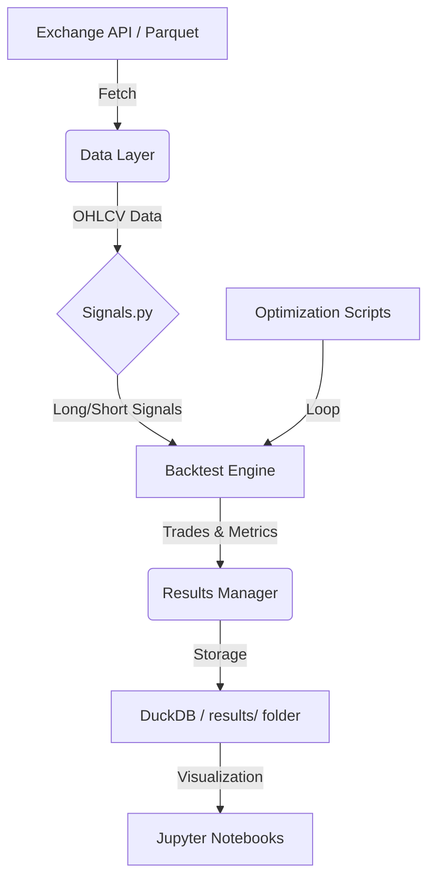

# ggTrader Architecture

This document provides a detailed technical overview of the components and data flow within the `ggTrader` project.

## 🏗️ Core Components

The project is structured into several modular layers, ensuring that logic for data handling, signal generation, and trade execution remains decoupled.

### 1. Data Layer (`src/ggTrader/data/`)

- **Adapters**: Scripts for fetching data from exchanges like Kraken (`data/kraken/`).
- **Storage**: Primarily uses **DuckDB** (`ggtrader.db`, `daily_movers.db`) for high-speed local processing. Historical data is often stored in Parquet format for interoperability.
- **Access**: Normalized data access patterns for OHLCV, ensuring consistency across backtests and live execution.

### 2. Signal Generation (`src/ggTrader/indicators/`)

- This layer encapsulates the "brain" of the trading strategy.
- **Signals.py**: Centralized logic for calculating indicators (using `pandas-ta`, `ta`, etc.) and generating entry/exit signals.
- **Modular Indicators**: Easily adjustable parameters for RSI, Moving Averages, and proprietary signals.

### 3. Execution Engine (`src/ggTrader/core/`)

- **Backtest Hub**: `fast_backtest.py` leverages **VectorBT** for vectorized simulation, drastically reducing computation time.
- **Portfolio Management**: `portfolio.py` and `position.py` handle state tracking, risk management, and order sizing.
- **Trading Engine**: `trading.py` manages the actual interaction with exchange APIs.

### 4. Optimization Engine (`scripts/`)

- **Walk-Forward Optimization (WFO)**: `run_walk_forward_optimization.py` splits data into training/validation sets to prevent overfitting.
- **Sensitivity Analysis**: `run_sensitivity_analysis.py` tests how small changes in parameters affect the overall outcome, identifying "islands" of stability.
- **Optuna Integration**: Uses Bayesian optimization to find optimal parameter sets efficiently.

## 🔄 Data Flow

## 📊 Result Management

Every run (backtest or WFO) outputs results to a timestamped folder in the `results/` directory. This includes:

- **Trades**: Detailed log of every entry and exit.
- **Metrics**: Sharp ratio, Max Drawdown, Profit Factor, etc.
- **Config**: A snapshot of the parameters used for that specific run.

---
*Back to [README.md](readme.md)*
