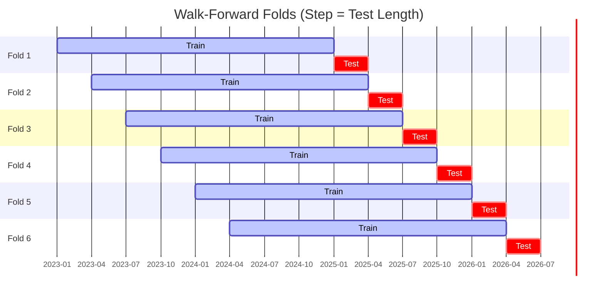

# ggTrader Unified CLI Guide (`ggt`)

This document describes the unified `ggt` command-line interface, which orchestrates the entire trading lifecycle—from live universe research to production execution.

## 🚀 The `ggt` Command

The unified entry point `ggt.py` replaces legacy standalone scripts with a structured workflow.

### 1. Research (`ggt research`)

Fetches the top assets by volume and runs a **Grand Walk-Forward Optimization (WFO)**.

- **Parallel Execution**: Splits the universe into concurrent workers (Default: **5 workers**), reducing a 50-coin 3-year WFO from ~1 hour to ~15 minutes.
- **Filtering**: Automatically excludes stablecoins, fiat, and gold-backed assets (`PAXG`, `XAUT`).
- **Asset Selection**: Selects the most liquid assets based on exchange volume (Default: **Top 50**).
- **Volume Window**: Aggregates volume over a specific lookback period to ensure sustained liquidity (Default: **30d**; Options: `24h`, `7d`, `30d`).
- **WFO Duration**: Runs the optimization over a dynamic sliding window relative to today (Default: **1095 days / 3 years**).
- **Command (Using Defaults)**:

```bash
python ggt.py research
```

*Note: The command above is equivalent to: `python ggt.py research --top 50 --window 30d --days 1095 --workers 5`*

### 2. Backtest (`ggt backtest`)

Simulates a portfolio backtest using specific parameters or files.

- **Discovery**: Automatically finds the latest research results if no file is specified.
- **Command**:

```bash
python ggt.py backtest --symbols BTC,ETH --params signals_config.json
```

### 3. Production (`ggt production`)

Performs the monthly recalibration. It runs the full portfolio analysis and generates the final allocation weights for live trading.

- **Output**: Generates `portfolio_weights.json` used by the live bot.
- **Command**:

```bash
python ggt.py production
```

### 4. Trade (`ggt trade`)

Starts the live `ExecutionEngine` heartbeat.

- **Loop**: Polls Kraken every 4 hours (aligned with candle closes).
- **Execution**: Uses optimized parameters to generate signals and `portfolio_weights.json` for position sizing.
- **Command**:
```bash
python ggt.py trade
```

### 5. Database (`ggt db`)

Unified administration for TimescaleDB maintenance and exports.

- **`diag`**: Check storage usage and row counts.
- **`clean`**: Purge malformed or old asset data.
- **`compression`**: Manage TimescaleDB native data compression.
- **`export`**: Backup the database using industrial-grade `pg_dump`.

### 6. Ingest (`ggt ingest`)

Synchronizes historical candle data from CCXT (Kraken) to the local database.

- **Command**:
```bash
python ggt.py ingest --days 180
```

### 7. Cleanup (`ggt cleanup`)

Maintains a lean project directory by removing old research logs and temporary files.

- **Function**: Keeps only the last 10 research runs and clears out root log files.
- **Command**:
```bash
python ggt.py cleanup --confirm
```

The system splits the historical window into a **6-fold sliding window** where each fold moves forward by the exact length of the test period (**Step = Test Length**):



Once Phase 1 finishes, the system aggregates the winners into `run_results.json`.

## 🏗️ The 4-Phase Lifecycle

The system is designed to run autonomously, typically within a Docker environment.

### Phase 1: Selection (Dynamic)

The universe is generated in real-time by `ggt research` based on live Kraken volume, ensuring the bot always trades the most liquid assets.

### Phase 2: Re-Optimization

The Grand WFO searches for the best strategy (RSI, EMA, PSAR, etc.) and parameters for each coin independently using a sliding 3-year window.

### Phase 3: Portfolio Analysis

The system simulates the signals against multiple allocation models (Equal Weight, Kelly, Risk Parity) and selects the one with the highest Sharpe Ratio.

### Phase 4: Live Execution

The `ExecutionEngine` manages orders on Kraken, utilizing **Native Trailing Stops** for server-side risk protection.

## 🐳 Docker Orchestration

Manage the entire lifecycle via `docker-compose.yaml`.

### Services

- **`ggtrader_db`**: TimescaleDB for high-speed OHLCV and results storage.
- **`ggtrader_live`**: The bot service running the live execution loop.

### Commands

- **View Heartbeat**: `docker compose logs -f ggtrader_live`
- **Manual Research**: `docker compose exec ggtrader_live python ggt.py research`

---

## Performance Tuning

### Worker count

The default of **5 workers** is the empirical sweet spot for a 50-coin universe on a 16-core machine.

- Fewer workers (2–3): useful when memory is tight or when running a `--dry-run`.
- More workers (8+): rarely faster due to Python GIL contention during Numba JIT compilation; can increase peak RAM to 20 GB+.

```bash
ggt research --top 50 --workers 5   # default, ~12-15 min
ggt research --top 20 --workers 3   # lighter, ~5 min
```

### Parameter grid size

The `DETAILED_ENTRY_PARAM_GRIDS` in `src/ggTrader/pipeline/param_grids.py` drives WFO search space. Based on 261 real-run selections:

- **psar_adx**: collapsed `sar_acceleration`→`[0.02]`, `sar_maximum`→`[0.1]` (100% selected), saving ~97% of combos.
- **donchian_breakout**: collapsed `donchian_length`→`[100]` (100% selected).
- **fixed_sl_tp / trailing_stop exits**: collapsed to single constants (`stop_pct=1.5`, `take_profit_pct=3.0`, `trailing_stop_pct=3.0`).

Current total: ~25,000 combos vs 311,000 before pruning — roughly **12× faster** per worker.

### Universe cache

`ggt research` caches the CCXT universe fetch to `results/research/universe_cache_YYYYMMDD_topN_Wwindow.json`.
On the second run of the same day the startup delay (~90 s for `load_markets` + `fetch_tickers`) is eliminated entirely.

### SPY benchmark cache

`benchmarking.py` caches `yfinance` SPY data to `results/spy_cache_YYYYMMDD.parquet` (TTL = 1 day).
Repeated research runs on the same day skip the network download.

### Disk cache warmup

The first WFO fold on a fresh process compiles Numba JIT functions (~20 s). Subsequent folds reuse the compiled cache (~2 s each). This is why multi-worker runs are faster than sequential single-worker runs proportionally.

---

## Troubleshooting

### Workers show "starting..." indefinitely

A worker process crashed during initialisation (usually an import error or DB connection failure). Check the worker log:

```bash
# Look for the traceback in the status file
Get-Content results/pipeline_<timestamp>/status.txt -Tail 60
```

The main process waits for all workers to check in; if one never does, it stalls. Fix the root cause and re-run.

### All per-coin stats show `n/a`

Symptom: Phase 1 finishes but every coin shows `robustness=n/a`, `trades=0`.

Cause: Multi-worker merge failure — the result `pickle` file was written by one worker but not yet flushed when the coordinator read it.

Fix: Reduce `--workers` to 1 to confirm results are valid, then increase back up. If it recurs, check disk space on the `results/` volume.

### YTD backtest starts trading much later than the window start

Symptom: `ggt pipeline --phase 3` starts at e.g. March 2025 but first trades don't appear until December 2025.

Cause: The EMA(200) warmup period requires 200 bars before regime signals become valid. At 4h bars, 200 bars ≈ 33 days. If the regime filter is enabled (`BTC_REGIME_FILTER=True`), all signals are blocked during warmup.

Fix: Either extend the YTD window start backwards by at least 200 bars, or disable regime filtering for short validation windows (`BTC_REGIME_FILTER=False`).

### YTD plot missing from report

The `combined_portfolio_ytd_dashboard.html` is generated by Phase 3. If it's missing, regenerate:

```bash
ggt report --results-dir results/pipeline_<timestamp>
```

### `ValueError: cannot join with no overlapping index names`

This was a pandas MultiIndex alignment bug when applying regime masks to vbt portfolio DataFrames. It was fixed in a prior commit by using `.values` for numpy bitwise AND instead of DataFrame-level operators. If it reappears, the cause is likely a new code path constructing a boolean mask as a plain DataFrame and `&`-ing it directly against a MultiIndex vbt column set.

---
*For technical details on components, see the [Architecture Guide](architecture.md).*
