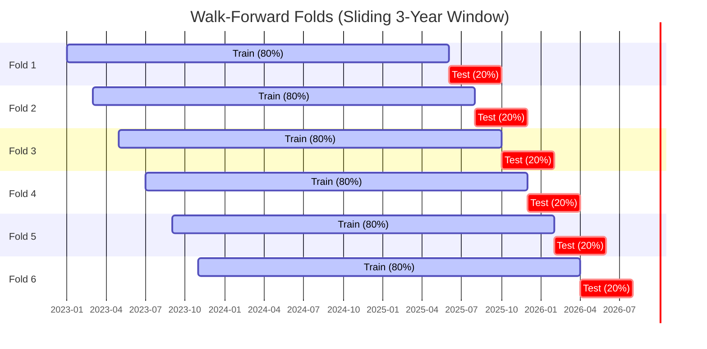

# ggTrader Unified CLI Guide (`ggt`)

This document describes the unified `ggt` command-line interface, which orchestrates the entire trading lifecycle—from live universe research to production execution.

## 🚀 The `ggt` Command

The unified entry point `ggt.py` replaces legacy standalone scripts with a structured workflow.

### 1. Research (`ggt research`)

Fetches the top assets by volume and runs a **Grand Walk-Forward Optimization (WFO)**.

- **Parallel Execution**: Splits the universe into concurrent workers (Default: **5 workers**), reducing a 50-coin 3-year WFO from ~1 hour to ~15 minutes.
- **Filtering**: Automatically excludes stablecoins, fiat, and gold-backed assets (`PAXG`, `XAUT`).
- **Asset Selection**: Selects the most liquid assets based on exchange volume (Default: **Top 50**).
- **Volume Window**: Aggregates volume over a specific lookback period to ensure sustained liquidity (Default: **30d**; Options: `24h`, `7d`, `30d`).
- **WFO Duration**: Runs the optimization over a dynamic sliding window relative to today (Default: **1095 days / 3 years**).
- **Command (Using Defaults)**:

```bash
python ggt.py research
```

*Note: The command above is equivalent to: `python ggt.py research --top 50 --window 30d --days 1095 --workers 5`*

### 2. Backtest (`ggt backtest`)

Simulates a portfolio backtest using specific parameters or files.

- **Discovery**: Automatically finds the latest research results if no file is specified.
- **Command**:

```bash
python ggt.py backtest --symbols BTC,ETH --params signals_config.json
```

### 3. Production (`ggt production`)

Performs the monthly recalibration. It runs the full portfolio analysis and generates the final allocation weights for live trading.

- **Output**: Generates `portfolio_weights.json` used by the live bot.
- **Command**:

```bash
python ggt.py production
```

### 4. Trade (`ggt trade`)

Starts the live `ExecutionEngine` heartbeat.

- **Loop**: Polls Kraken every 4 hours (aligned with candle closes).
- **Execution**: Uses optimized parameters to generate signals and `portfolio_weights.json` for position sizing.
- **Command**:
```bash
python ggt.py trade
```

### 5. Database (`ggt db`)

Unified administration for TimescaleDB maintenance and exports.

- **`diag`**: Check storage usage and row counts.
- **`clean`**: Purge malformed or old asset data.
- **`compression`**: Manage TimescaleDB native data compression.
- **`export`**: Backup the database using industrial-grade `pg_dump`.

### 6. Ingest (`ggt ingest`)

Synchronizes historical candle data from CCXT (Kraken) to the local database.

- **Command**:
```bash
python ggt.py ingest --days 180
```

### 7. Cleanup (`ggt cleanup`)

Maintains a lean project directory by removing old research logs and temporary files.

- **Function**: Keeps only the last 10 research runs and clears out root log files.
- **Command**:
```bash
python ggt.py cleanup --confirm
```

The system splits the historical window into a **6-fold sliding window** to ensure parameter robustness:



Once Phase 1 finishes, the system aggregates the winners into `run_results.json`.

## 🏗️ The 4-Phase Lifecycle

The system is designed to run autonomously, typically within a Docker environment.

### Phase 1: Selection (Dynamic)

The universe is generated in real-time by `ggt research` based on live Kraken volume, ensuring the bot always trades the most liquid assets.

### Phase 2: Re-Optimization

The Grand WFO searches for the best strategy (RSI, EMA, PSAR, etc.) and parameters for each coin independently using a sliding 3-year window.

### Phase 3: Portfolio Analysis

The system simulates the signals against multiple allocation models (Equal Weight, Kelly, Risk Parity) and selects the one with the highest Sharpe Ratio.

### Phase 4: Live Execution

The `ExecutionEngine` manages orders on Kraken, utilizing **Native Trailing Stops** for server-side risk protection.

## 🐳 Docker Orchestration

Manage the entire lifecycle via `docker-compose.yaml`.

### Services

- **`ggtrader_db`**: TimescaleDB for high-speed OHLCV and results storage.
- **`ggtrader_live`**: The bot service running the live execution loop.

### Commands

- **View Heartbeat**: `docker compose logs -f ggtrader_live`
- **Manual Research**: `docker compose exec ggtrader_live python ggt.py research`

---
*For technical details on components, see the [Architecture Guide](architecture.md).*
