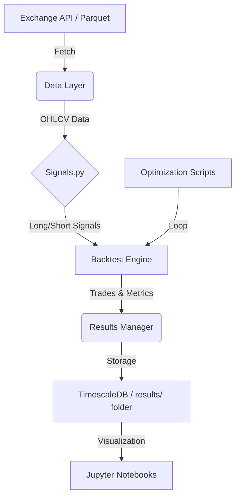

# ggTrader Architecture

This document provides a detailed technical overview of the components and data flow within the `ggTrader` project.

## 🏗️ Core Components

The project is structured into several modular layers, ensuring that logic for data handling, signal generation, and trade execution remains decoupled.

## Data Layer

- **Storage**: PostgreSQL (TimescaleDB) for OHLCV data. optimized for time-series.
- **Ingestion**: `KrakenPostgresIngestor` processes raw CSVs into Hypertable.
- **Access**: `KrakenHistoricalData` facade delegates to `KrakenPostgresReader`.
- **Caching**: `ResultDBManager` (PostgreSQL) stores backtest results, study caches, and optimization metadata.

## Core Engine

- **Backtesting**: `FastBacktest` uses `vectorbt` Portfolio API.
- **Broadcasting**: `SignalFactory` (vectorbt IndicatorFactory) enables running thousands of parameter combinations in a single vectorized operation.
- **Signals**: `signals.py` implements "Golden Source" logic (PSAR, ADX, ATR Trailing Stop) using Numba and VectorBT.

## Workflows

1. **Sensitivity Analysis**: `run_sensitivity_analysis.py` performs grid search using `FastBacktest` broadcasting.
2. **Walk-Forward Optimization**: `run_walk_forward_optimization.py` uses rolling splitting on vectorized results.

### 3. Execution Engine (`src/ggTrader/core/`)

- **Backtest Hub**: `fast_backtest.py` leverages **VectorBT** for vectorized simulation, drastically reducing computation time.
- **Portfolio Management**: `portfolio.py` and `position.py` handle state tracking, risk management, and order sizing.
- **Trading Engine**: `trading.py` manages the actual interaction with exchange APIs.

### 4. Optimization Engine (`scripts/`)

- **Walk-Forward Optimization (WFO)**: `run_walk_forward_optimization.py` splits data into training/validation sets to prevent overfitting.
- **Sensitivity Analysis**: `run_sensitivity_analysis.py` tests how small changes in parameters affect the overall outcome, identifying "islands" of stability.
- **Optuna Integration**: Uses Bayesian optimization to find optimal parameter sets efficiently.

## 🔄 Data Flow

## 📊 Result Management

Every run (backtest or WFO) outputs results to a timestamped folder in the `results/` directory. This includes:

- **Trades**: Detailed log of every entry and exit.
- **Metrics**: Sharp ratio, Max Drawdown, Profit Factor, etc.
- **Config**: A snapshot of the parameters used for that specific run.

---
*Back to [README.md](../readme.md)*
