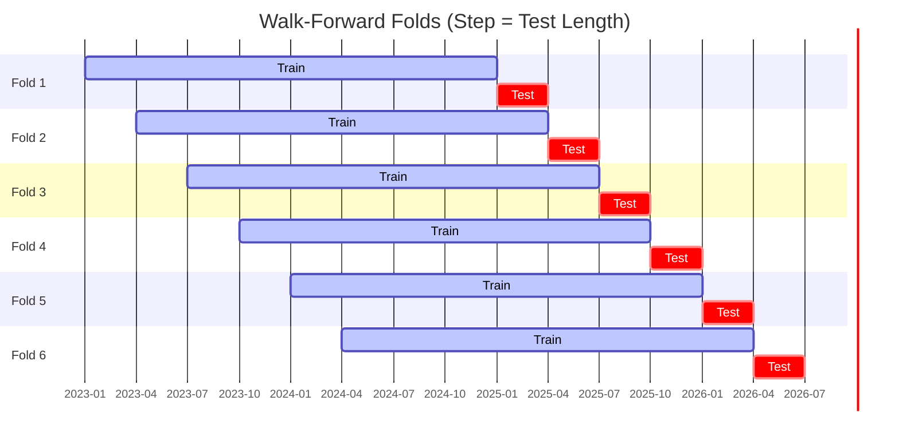
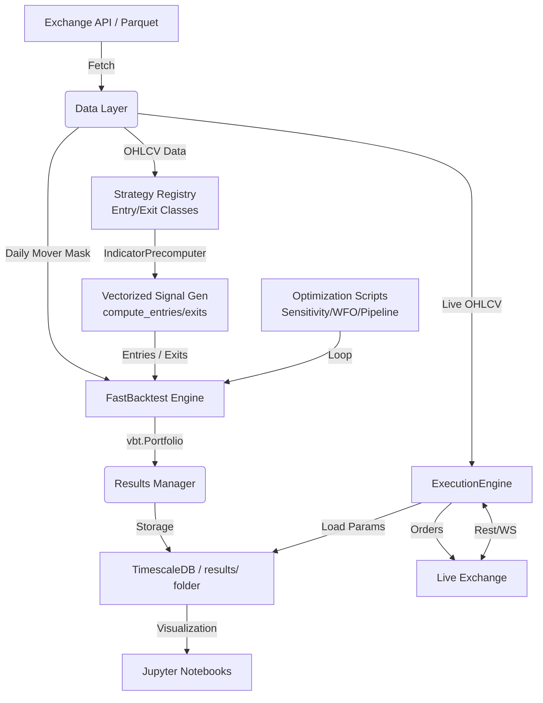

# ggTrader Architecture

This document provides a detailed technical overview of the components and data flow within the `ggTrader` project.

## 🏗️ Core Components

The project is structured into several modular layers, ensuring that logic for data handling, signal generation, and trade execution remains decoupled.

## Data Layer

- **Storage**: PostgreSQL (TimescaleDB) for OHLCV data, optimized for time-series.
- **Ingestion**: `KrakenPostgresIngestor` processes raw CSVs into Hypertable.
- **Access**: `KrakenHistoricalData` facade delegates to `KrakenPostgresReader`.
- **Caching**: `ResultDBManager` (PostgreSQL) stores backtest results, study caches, and optimization metadata.
- **Mover Mask**: `KrakenPostgresReader.get_daily_mover_mask()` builds a boolean DataFrame of daily top-N movers by notional volume in one SQL query.

## Core Engine

The `ggTrader.core` package is split into seven focused modules:

| Module | Responsibility |
| ------ | -------------- |
| `fast_backtest.py` | `FastBacktest` engine — wraps `vbt.Portfolio.from_signals()` with position sizing, shared cash, and mover masking |
| `orchestrator.py` | Public API (`run_backtest_orchestrator`, `run_frozen_params_combined_backtest`, `run_multi_strategy_per_coin_wfo`) + regime/allocation helpers |
| `orchestrator_utils.py` | Pure utility helpers (param coercion, ETA strings, logging) shared across orchestration layers |
| `sensitivity.py` | Grid search orchestration — vectorized and chunked paths |
| `wfo.py` | Walk-forward optimization loop (`run_wfo_orchestrator`, fold calculations, robustness scoring) |
| `metrics.py` | Train-metric extraction (Sharpe/Sortino/Calmar), trade-count gates, sensitivity result filtering |
| `regime_filtering.py` | Three-tier BTC-correlation regime filter (BTC regime, altcoin index, exempt) |
| `benchmarking.py` | Buy-and-hold benchmarks (BTC, S&P 500), CAGR helpers, SPY parquet cache |

- **Backtesting**: `FastBacktest` accepts a `config` dict (CONSTANTS) for portfolio-level settings and a separate `params` dict for signal parameters. Signal parameters support list values for broadcasting parameter grids.
- **Broadcasting**: `SignalFactory` (vectorbt IndicatorFactory) enables running thousands of parameter combinations in a single vectorized operation.
- **Signals**: `signals.py` implements "Golden Source" logic (PSAR, ADX, ATR Trailing Stop) using Numba and VectorBT.

## Strategy Architecture

The project uses a **pluggable strategy framework** for flexible signal generation across multiple entry and exit strategies.

### Strategy Registry

- **Entry Strategies**: `ENTRY_REGISTRY` maps strategy names to classes:
  - `psar_adx`: Parabolic SAR + ADX momentum detection
  - `ema_cross`: EMA crossover (fast > slow)
  - `rsi_reversal`: RSI oversold reversal
  - `macd_cross`: MACD line crosses above signal
  - `bbands_mean_reversion`: Close crosses up through lower Bollinger band
  - `donchian_breakout`: Close breaks above prior Donchian upper band
  - `supertrend_flip`: Supertrend direction flips bullish
  - Custom strategies can be added to `ggTrader/indicators/strategies.py`

- **Exit Strategies**: `EXIT_REGISTRY` maps exit classes:
  - `atr_trailing`: ATR-based trailing stop
  - `fixed_sl_tp`: Fixed percentage stop/take-profit

### Indicator Pre-computation

`IndicatorPrecomputer` optimizes performance by:

- Pre-computing each indicator (PSAR, ADX, ATR, EMA, RSI, MACD, BBands, Donchian, Supertrend) once across full parameter ranges
- Caching results to avoid redundant calculations
- Enabling numpy broadcasting for efficient parameter grid evaluation

### Vectorized Signal Generation

`_generate_signals_vectorized()` in `FastBacktest` dispatches to the strategy registry:

1. Reads `config["ENTRY_STRATEGY"]` and `config["EXIT_STRATEGY"]`
2. Instantiates the strategy classes via `get_entry_strategy()` / `get_exit_strategy()`
3. Calls `compute_entries()` and `compute_exits()` which return numpy arrays
4. Wraps arrays in DataFrames with proper MultiIndex columns for VectorBT

### Three-Tier Regime Filter

Before combining per-coin signals into the final portfolio, `run_frozen_params_combined_backtest()` applies a BTC-correlation regime filter that mutes entries during bear markets:

| Tier | Condition | Filter applied |
| ---- | --------- | -------------- |
| **BTC tier** | BTC return correlation ≥ `BTC_REGIME_FILTER_MIN_CORRELATION` (default 0.5) | Signal blocked when BTC price < EMA(200) |
| **Altcoin tier** | Correlation in `[ALTCOIN_REGIME_FILTER_CORR_MIN, btc_min)` (default 0.3–0.5) | Signal blocked when altcoin equal-weight index < EMA(200) |
| **Exempt tier** | Correlation < `ALTCOIN_REGIME_FILTER_CORR_MIN` | No filter — coin trades freely |

The **altcoin index** is an equal-weighted, normalised price series built from all non-BTC symbols in the universe. Its EMA(200) acts as a trend proxy for alt-correlated coins.

Correlations are computed over the full OHLCV date range using daily log-returns. Regime filtering is enabled by `BTC_REGIME_FILTER=True` in constants; it is disabled by default.

```python
_compute_btc_correlations()   # -> Dict[str, float]
_compute_btc_regime_mask()    # -> pd.Series[bool]  (True = bullish)
_compute_altcoin_index_mask() # -> pd.Series[bool]  (True = bullish)
_apply_tiered_regime_mask()   # -> filtered entries DataFrame
```

### Per-Coin Walk-Forward Optimization

`run_wfo_per_coin_orchestrator()` extends WFO with per-coin independence:

1. Loads full 3-year OHLCV data once
2. For each symbol:
   - Runs standard WFO (rolling train/test folds) with the narrowed parameter grid
   - Selects best strategy based on robustness score (in-sample metric stability)
3. Combines results: uses the winning strategy + params for each coin
4. Runs final validation backtest on full 3-year range for each coin
5. Merges per-coin signals into single combined portfolio with shared cash

This approach respects the volatility diversity of individual cryptocurrencies while maintaining a unified portfolio structure.

### 📊 Optimization Model (Sliding WFO)

The system uses a **6-Fold Sliding Window** where each fold moves forward by the exact length of the test period (**Step = Test Length**). This ensures that every data point eventually serves as an "unseen" test bar.



## Workflows

The system is controlled via the unified `ggt` CLI. For a detailed command reference, see [**Unified CLI Guide**](UNIFIED_PIPELINE.md).

1. **Research**: `python ggt.py research` — Orchestrates parallel WFO across the liquid universe.
2. **Backtest**: `python ggt.py backtest` — Replays results for validation.
3. **Database**: `python ggt.py db` — Manages TimescaleDB health and maintenance.
4. **Ingest**: `python ggt.py ingest` — Syncs historical data from Kraken.

For a concise WFO → backtest walkthrough, see [**Strategy Execution**](UNIFIED_PIPELINE.md).

## Legacy Modules

- **Trading Engine** (`trading.py`): Iterative day-by-day simulation. Retained for live trading execution only.
- **Archive**: All legacy standalone scripts have been moved to `docs/archive/` or deleted in favor of the unified `ggt` CLI.

## 🔄 Data Flow



## 📊 Result Management

Every run (backtest, sensitivity, or WFO) outputs results to a timestamped folder in the `results/` directory. This includes:

- **Trades**: Detailed log of every entry and exit.
- **Metrics**: Sharpe ratio, Max Drawdown, Profit Factor, etc.
- **Config**: A snapshot of the parameters used for that specific run.

## 🚀 Live Execution

- **`ExecutionEngine`**: Orchestrates live trading by fetching recent candles via `LiveExchangeLoader`, computing per-coin signals using WFO-optimized parameters, and managing Kraken orders.
- **Bot Persistence**: Tracks active positions in `data/active_positions.json` to handle process restarts.
- **Native Trailing Stop**: Leverages Kraken's `trailing-stop` order type for server-side risk management.

---
*Back to [README.md](../readme.md)*
