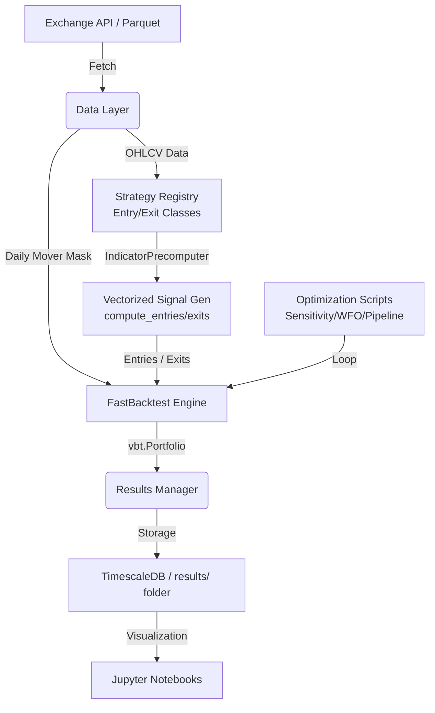

# ggTrader Architecture

This document provides a detailed technical overview of the components and data flow within the `ggTrader` project.

## 🏗️ Core Components

The project is structured into several modular layers, ensuring that logic for data handling, signal generation, and trade execution remains decoupled.

## Data Layer

- **Storage**: PostgreSQL (TimescaleDB) for OHLCV data, optimized for time-series.
- **Ingestion**: `KrakenPostgresIngestor` processes raw CSVs into Hypertable.
- **Access**: `KrakenHistoricalData` facade delegates to `KrakenPostgresReader`.
- **Caching**: `ResultDBManager` (PostgreSQL) stores backtest results, study caches, and optimization metadata.
- **Mover Mask**: `KrakenPostgresReader.get_daily_mover_mask()` builds a boolean DataFrame of daily top-N movers by notional volume in one SQL query.

## Core Engine

- **Backtesting**: `FastBacktest` is the **primary backtest engine**. It wraps `vectorbt.Portfolio.from_signals()` with proper position sizing (`max_position`), shared cash pool (`cash_sharing=True`), and optional dynamic mover masking.
- **Configuration**: `FastBacktest` accepts a `config` dict (CONSTANTS) for portfolio-level settings and a separate `params` dict for signal parameters. Signal parameters support list values for broadcasting parameter grids.
- **Broadcasting**: `SignalFactory` (vectorbt IndicatorFactory) enables running thousands of parameter combinations in a single vectorized operation.
- **Signals**: `signals.py` implements "Golden Source" logic (PSAR, ADX, ATR Trailing Stop) using Numba and VectorBT.

## Strategy Architecture

The project uses a **pluggable strategy framework** for flexible signal generation across multiple entry and exit strategies.

### Strategy Registry

- **Entry Strategies**: `ENTRY_REGISTRY` maps strategy names to classes:
  - `psar_adx`: Parabolic SAR + ADX momentum detection
  - `ema_cross`: EMA crossover (fast > slow)
  - `rsi_reversal`: RSI oversold reversal
  - Custom strategies can be added to `ggTrader/indicators/strategies.py`

- **Exit Strategies**: `EXIT_REGISTRY` maps exit classes:
  - `atr_trailing`: ATR-based trailing stop
  - `fixed_sl_tp`: Fixed percentage stop/take-profit

### Indicator Pre-computation

`IndicatorPrecomputer` optimizes performance by:
- Pre-computing each indicator (PSAR, ADX, ATR, EMA, RSI) once across full parameter ranges
- Caching results to avoid redundant calculations
- Enabling numpy broadcasting for efficient parameter grid evaluation

### Vectorized Signal Generation

`_generate_signals_vectorized()` in `FastBacktest` dispatches to the strategy registry:

1. Reads `config["ENTRY_STRATEGY"]` and `config["EXIT_STRATEGY"]`
2. Instantiates the strategy classes via `get_entry_strategy()` / `get_exit_strategy()`
3. Calls `compute_entries()` and `compute_exits()` which return numpy arrays
4. Wraps arrays in DataFrames with proper MultiIndex columns for VectorBT

### Per-Coin Walk-Forward Optimization

`run_wfo_per_coin_orchestrator()` extends WFO with per-coin independence:

1. Loads full 3-year OHLCV data once
2. For each symbol:
   - Runs standard WFO (rolling train/test folds) with the narrowed parameter grid
   - Selects best strategy based on robustness score (in-sample metric stability)
3. Combines results: uses the winning strategy + params for each coin
4. Runs final validation backtest on full 3-year range for each coin
5. Merges per-coin signals into single combined portfolio with shared cash

This approach respects the volatility diversity of individual cryptocurrencies while maintaining a unified portfolio structure.

## Workflows

1. **Single Backtest**: `scripts/run_backtest.py` runs a one-shot backtest on a symbol pool. Supports optional `--movers N` flag for dynamic universe filtering.
2. **Sensitivity Analysis**: `scripts/run_sensitivity_analysis.py` performs grid search using `FastBacktest` broadcasting.
3. **Walk-Forward Optimization**: `scripts/run_walk_forward_optimization.py` uses rolling time-series CV on vectorized results.
4. **Full Pipeline**: `scripts/run_full_pipeline.py` chains sensitivity analysis → per-coin multi-strategy WFO → final validation → comprehensive report.

## Legacy Modules

- **Trading Engine** (`trading.py`): Iterative day-by-day simulation with `Portfolio`/`Position` objects. Retained for paper/live trading scenarios but **not used for backtesting or optimization**.
- **WalkForwardOptimizer** (`optimization.py`): Optuna-based WFO. Archived to `research/archive/`.

## 🔄 Data Flow

## 📊 Result Management

Every run (backtest, sensitivity, or WFO) outputs results to a timestamped folder in the `results/` directory. This includes:

- **Trades**: Detailed log of every entry and exit.
- **Metrics**: Sharpe ratio, Max Drawdown, Profit Factor, etc.
- **Config**: A snapshot of the parameters used for that specific run.

---
*Back to [README.md](../readme.md)*
