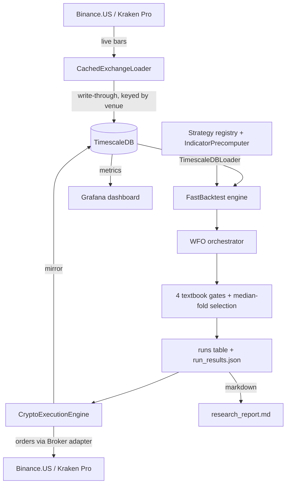

# Architecture

How ggTrader is put together. For commands and day-to-day usage see [CLI Reference](cli_reference.md); for live deployment see the [Live Trading Guide](live_trading_guide.md).

## Contents

1. [What it is](#what-it-is)
2. [The four layers](#the-four-layers) — [Data](#1-data) · [Strategy](#2-strategy) · [Optimization](#3-optimization-walk-forward) · [Execution](#4-execution)
3. [Position sizing](#position-sizing)
4. [Data flow](#data-flow) (diagram)
5. [Monthly recalibration](#monthly-recalibration)
6. [Where to find things](#where-to-find-things) (path map)

---

## Vocabulary

A few terms you'll see throughout — defined once so the rest of the doc can be brief.

| Short | Long | What it means |
|---|---|---|
| **OHLCV** | Open / High / Low / Close / Volume | One candle of price data per time interval (e.g. one 4-hour bar) |
| **WFO** | Walk-Forward Optimization | Find good parameters on a training window, validate on the next chunk of unseen data, slide forward, repeat |
| **IS / OOS** | In-Sample / Out-of-Sample | "Training" data the optimizer was allowed to see vs. "test" data it was locked out of |
| **CCXT** | (no expansion, library name) | Python library that wraps every major crypto exchange's REST/WebSocket API behind one interface |
| **PnL** | Profit and Loss | The dollar gain or loss on a position or portfolio |
| **OCO** | One-Cancels-Other | An exchange order type that pairs a stop-loss and a take-profit — when one fills, the other is automatically cancelled |

---

## At a glance

| Aspect | Detail |
|---|---|
| **Stack** | Python 3.10+ · TimescaleDB (PostgreSQL with time-series superpowers) · CCXT · Docker |
| **Venues** | Binance.US (0.04% round-trip fees, current target) · Kraken Pro (0.50–0.80% round-trip, legacy) |
| **Methodologies** | WFO on directional momentum signals (live) · Cash-and-carry on dated futures (backtest) · Funding-rate carry on perpetual futures (backtest) |
| **Cadence** | Live trader polls every 4 hours on UTC bar boundaries · WFO recalibrates on the 1st of each month at ~01:00 UTC |
| **Risk envelope** | `DAILY_LOSS_LIMIT_PCT=5%` intraday circuit breaker · `MAX_COIN_ALLOCATION=25%` per coin · venue-native trailing-stop or OCO order protects every open position |

---

## What it is

ggTrader is an algorithmic crypto trading bot. Once a month it searches three years of historical price data to find which strategy parameters have been working best **per coin**, then trades those parameters live on Binance.US or Kraken Pro (selected by the `EXCHANGE` config value). The same code path produces the research, runs the simulation, and places the orders — so what you backtest is what trades.

Three distinct strategy methodologies coexist behind the same data + execution stack:

- **WFO on directional momentum signals** — the original pipeline. Live today.
- **Cash-and-carry on dated futures** (`CashAndCarryBTC`) — buy spot, sell a dated future, capture the basis. Backtest only.
- **Funding-rate carry on perpetual futures** (`FundingCarryBTC`) — buy spot, short the perpetual, harvest the funding payment. Backtest only.

New strategies plug in by implementing the `Strategy` protocol in `src/ggTrader/strategies/`.

## The four layers

Each layer has one job. They communicate through plain Python objects (DataFrames, dicts) — no message bus, no service mesh.

### 1. Data

Where every price bar lives and how the rest of the system reads it.

- **Historical storage**: TimescaleDB. All spot OHLCV lives in one `ohlcv` table keyed by `(timestamp, symbol, interval, venue)`, so Kraken and Binance.US history coexist without colliding. Futures OHLCV (Kraken Futures + derived basis prices) lives in `futures_ohlcv`.
- **Live fetch**: `CachedExchangeLoader` (a thin CCXT wrapper that talks to the active venue) pulls the most recent bars and writes them straight back to the database. A cold-start of the live trader doesn't re-download history.
- **Read interface**: every component reads through `TimescaleDBLoader.fetch_ohlcv()`, which returns a pandas DataFrame with a two-level column index `(symbol, field) → values`. That shape is the contract across the rest of the system. Reads always filter by `venue` so multi-venue history stays segregated.
- **Code**: `src/ggTrader/data/`.

### 2. Strategy

The bricks the optimizer picks from per coin.

- An **entry strategy** decides when to buy. Eleven are registered:
  - **PSAR + ADX** (`psar_adx`) — Parabolic Stop-and-Reverse trend follower, gated by Average Directional Index trend strength.
  - **EMA crossover** (`ema_cross`) — buy when a fast Exponential Moving Average crosses above a slow one.
  - **RSI reversal** (`rsi_reversal`) — buy when the Relative Strength Index touches oversold territory, confirms.
  - Plus eight more (`bbands_mean_reversion`, `donchian_breakout`, `mtf_momentum`, etc.).
  - New ones plug in by subclassing the `EntryStrategy` protocol and registering in `ENTRY_REGISTRY`.
- An **exit strategy** decides when to sell. Three options:
  - **`atr_trailing`** — trailing stop sized by Average True Range (volatility-adaptive).
  - **`fixed_sl_tp`** — fixed-percent stop loss and take profit.
  - **`trailing_stop`** — fixed-percent trailing stop.
- `IndicatorPrecomputer` calculates each indicator (PSAR, ADX, RSI, etc.) once across the full parameter range. A 24-parameter grid for `rsi_reversal` reuses the same RSI series 24 times instead of recomputing it. This is the difference between a research run finishing in 30 minutes vs 3 hours.
- **Code**: `src/ggTrader/indicators/`.

### 3. Optimization (Walk-Forward)

The layer that picks good parameters per coin without overfitting. Rebuilt in May 2026 around textbook standards: strict train-only selection, locked holdout, rank-based scoring.

**How it works:**

1. Slice the price history into **10 overlapping folds**. The most recent **20% of history is reserved as a locked holdout** before the fold bounds are computed — research never touches it during selection.
2. Each fold has a **train window** (IS — where every parameter combination is tested) and a **test window** (OOS — used to evaluate the chosen parameters). The fold step size equals the test length, so every bar appears in exactly one test window.
3. Within each fold, every parameter cell is scored by a **rank composite**: rank-of-Sortino + rank-of-Calmar + rank-of-Profit-Factor (no Sharpe ratio — Sortino dominates it for asymmetric returns).
   - **Sortino ratio** = return per unit of *downside* volatility.
   - **Calmar ratio** = return per unit of *maximum drawdown*.
   - **Profit Factor** = total $ won / total $ lost.
4. Cells with too-few trades per fold are softened (their missing folds fill from the fold-median) rather than disqualified — sparse-fire cells survive with a finite score but rarely rank at the top.
5. After WFO, each `(entry strategy, exit strategy)` combo is scored against **four aggregate gates**. All four must pass.

| Gate | Default | Plain meaning |
|---|---|---|
| **Walk-Forward Efficiency (WFE)** | `≥ 0.5` | OOS annualized return is at least half of IS. If it looks great in training but falls off a cliff on unseen data, this gate kills it. |
| **% profitable folds** | `≥ 0.6` | At least 6 of the 10 historical chunks had positive OOS return. Not just lucky in one period. |
| **Parameter Coefficient of Variation (CV)** | `≤ 0.3` | How much the "best" parameter changes across folds (CV = standard deviation / mean). Low CV = stable parameters = robust. Caveat: this is mechanically inflated for large parameter grids. |
| **Drawdown (DD) ratio** | `≤ 2.0` | OOS drawdowns aren't more than 2× IS drawdowns. Risk profile doesn't blow up live. |

6. Among the combos that pass all four gates: **rank by mean per-fold Sortino**, tie-break by lowest parameter CV (within 5% of the top). The live deployment parameters are the **median of per-fold winners**, snapped to the nearest grid value.
7. The selected combo runs **once** on the locked holdout block. If holdout return is negative or max drawdown is worse than 1.5× the worst WFO test-fold drawdown, the result is flagged with a warning (but not auto-rejected — the warning is the operator's signal to investigate).

**Code**: `src/ggTrader/core/wfo.py`, `src/ggTrader/core/wfo_aggregate.py`, `src/ggTrader/core/orchestrator.py`.

### 4. Execution

Live trading.

- **`BaseExecutionEngine`** handles state persistence (live positions, circuit-breaker state, and start-of-day equity baseline live in the `system_state` TimescaleDB table, not a JSON file), the daily-loss circuit breaker (`DAILY_LOSS_LIMIT_PCT` = 5%), Telegram + Discord alerts, and the live mirror to TimescaleDB so Grafana dashboards see orders in real time.
- **`CryptoExecutionEngine`** polls the active venue every 4 hours (aligned to UTC bar boundaries: 00:00, 04:00, 08:00, …), places orders through a `Broker` adapter (`src/ggTrader/execution/{kraken_spot,binanceus_spot,kraken_futures}.py`), and protects every fill with a venue-native trailing-stop (on Kraken) or OCO (on Binance.US) order. The protection is server-side, so even if our Python process dies, the exchange still respects the stop.
- **Code**: `src/ggTrader/core/{base,crypto}_execution_engine.py`, `src/ggTrader/execution/`.

## Position sizing

Picked at trader startup. Pick one.

- **Weighted sizing** (default): each coin gets a fraction of total capital proportional to its OOS robustness score (high-confidence research result = bigger share). No coin exceeds `MAX_COIN_ALLOCATION` (default 25%). Use this when you trust the research.
- **Adaptive sizing** (`--adaptive-sizing`): Kelly-criterion-style. Each position is sized so a stop-out costs exactly `TARGET_RISK_PCT` (default 1%) of portfolio value — wider stops mean smaller positions. Use this when you want volatility to drive sizing.

## Data flow

## Monthly recalibration

The live engine kicks off its own WFO research run on the **1st of each month at ~01:00 UTC**. When it finishes, the new parameters hot-reload into the running bot — no restart, no downtime. The selection gates and sizing mode all carry over from the running config.

## Where to find things

| Path | What's there |
|---|---|
| `src/ggTrader/cli/` | The `ggt` command-line tool's subcommands (`research`, `trade`, `db`, etc.) |
| `src/ggTrader/core/` | Backtest engine, WFO orchestrator, aggregate gates |
| `src/ggTrader/indicators/` | Entry/exit strategy classes + `IndicatorPrecomputer` (the WFO methodology layer) |
| `src/ggTrader/strategies/` | Newer-architecture strategies (`carry/cash_and_carry.py`, `carry/funding_carry.py`) implementing the `Strategy` protocol |
| `src/ggTrader/execution/` | Venue-specific broker adapters (`binanceus_spot.py`, `kraken_spot.py`, `kraken_futures.py`) |
| `src/ggTrader/features/` | Feature store, derivative features, synthetic basis prices |
| `src/ggTrader/data/` | TimescaleDB loaders + live exchange loaders |
| `src/ggTrader/utils/` | Config defaults, report generators, PnL report builder |
| `scripts/` | One-off operational tooling (universe regeneration, correlation matrix, Binance.US backfill) |
| `results/research/` | Timestamped research output: `research_report.md` (human-readable), `run_results.json` (machine-readable), `wfo_stats_snapshot.json` (per-cell diagnostics), plots |
| TimescaleDB `system_state` table | Live trader state (open positions, circuit-breaker status, start-of-day equity) — key = `live_trader_state` |

---
*Back to [README.md](../README.md).*
