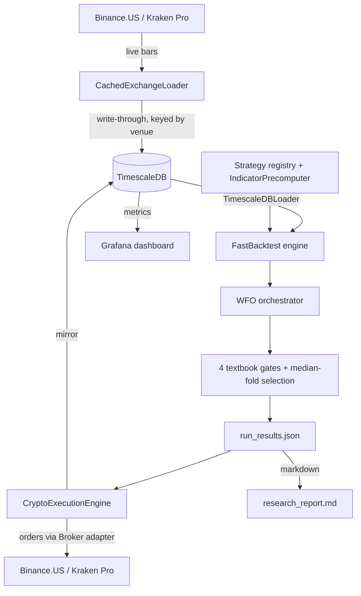

# Architecture

How ggTrader is put together. For commands and day-to-day usage see [CLI Reference](cli_reference.md); for live deployment see the [Live Trading Guide](live_trading_guide.md).

## Contents

1. [What it is](#what-it-is)
2. [The four layers](#the-four-layers) — [Data](#1-data) · [Strategy](#2-strategy) · [Optimization](#3-optimization-walk-forward) · [Execution](#4-execution)
3. [Regime filter](#regime-filter)
4. [Position sizing](#position-sizing)
5. [Data flow](#data-flow) (diagram)
6. [Monthly recalibration](#monthly-recalibration)
7. [Where to find things](#where-to-find-things) (path map)

---

## At a glance

| Aspect | Detail |
|---|---|
| **Stack** | Python 3.10+ · TimescaleDB · CCXT · Docker |
| **Venues** | Binance.US (0.04% RT, migration target) · Kraken Pro (0.50–0.80% RT, current live) |
| **Methodologies** | WFO momentum (live) · Cash-and-carry (backtest) · Funding-rate carry (backtest) |
| **Cadence** | Live trading every 4h on UTC bar boundaries · Monthly WFO recalibration on the 1st at ~01:00 UTC |
| **Risk envelope** | `DAILY_LOSS_LIMIT_PCT=5%` intraday circuit breaker · `MAX_COIN_ALLOCATION=25%` per coin · venue-native trailing-stop / OCO protects open positions |

---

## What it is

ggTrader is an algorithmic crypto trading bot. Once a month it searches historical price data for the parameters that have been working best per coin, then trades those parameters live on Binance.US or Kraken Pro (selected by config). The same code path produces the research, runs the simulation, and places the orders — so what you backtest is what trades.

Three distinct strategy methodologies coexist behind the same data + execution stack: WFO on directional momentum signals (the original pipeline), cash-and-carry on dated futures (`CashAndCarryBTC`), and funding-rate arbitrage on linear perps (`FundingCarryBTC`). New strategies plug in by implementing the `Strategy` protocol in `src/ggTrader/strategies/`.

## The four layers

Each layer has one job. They communicate through plain Python objects (DataFrames, dicts) — no message bus, no service mesh.

### 1. Data
- **Historical storage**: TimescaleDB (PostgreSQL with a time-series extension). All spot OHLCV lives in one `ohlcv` hypertable keyed by `(timestamp, symbol, interval, venue)` so Kraken and Binance.US history coexists without collision. Futures OHLCV (Kraken Futures + derived basis) lives in `futures_ohlcv`.
- **Live fetch**: `CachedExchangeLoader` (CCXT against the active venue — Kraken or Binance.US) pulls recent bars and writes them back to the DB so cold-starts don't re-download.
- **Read interface**: every component reads through `TimescaleDBLoader.fetch_ohlcv()`, which returns a MultiIndex DataFrame `(symbol, field) → values`. That format is the contract across the rest of the system. Reads filter by `venue` to keep the multi-venue history segregated.
- Code: `src/ggTrader/data/`.

### 2. Strategy
- An **entry strategy** decides when to buy (e.g. `psar_adx`, `ema_cross`, `rsi_reversal`). Eleven are registered; new ones plug in by subclassing the `EntryStrategy` protocol and registering in `ENTRY_REGISTRY`.
- An **exit strategy** decides when to sell (`atr_trailing`, `fixed_sl_tp`, `trailing_stop`). Same protocol pattern.
- `IndicatorPrecomputer` calculates each indicator (PSAR, ADX, RSI, etc.) once across the full parameter range — so a 24-combo grid for `rsi_reversal` reuses the same RSI series instead of recomputing it 24 times.
- Code: `src/ggTrader/indicators/`.

### 3. Optimization (Walk-Forward)
The job of this layer is to pick good parameters per coin without overfitting. The pipeline was rebuilt in May 2026 around textbook standards (strict train-only selection, locked holdout, rank-based scoring).

- We slice the price history into **10 overlapping folds**, reserving the most recent **20% as a locked holdout** before the fold bounds are computed. Each fold has a *train* window (where we test every parameter combination) and a *test* window (out-of-sample). The fold step size equals the test length, so every bar appears in exactly one test window.
- Within each fold, parameter cells are ranked on a **rank-of-Sortino + rank-of-Calmar + rank-of-ProfitFactor** composite (no Sharpe). Average ranks decide the per-fold winner. Cells with fewer than `MIN_CLOSED_TRADES_PER_FOLD` (default 19, calibrated for this codebase's strategy fire-rate) are disqualified before ranking with 8-of-10 forgiveness.
- After WFO, each (entry, exit) combo is scored against **four aggregate textbook gates** (all four must pass):

| Gate | Default | What it does |
|---|---|---|
| **WFE** | `≥ 0.5` | Walk-forward efficiency: `mean(test_ann_ret) / mean(train_ann_ret)` |
| **% profitable folds** | `≥ 0.6` | Fraction of folds with positive test annualized return |
| **Parameter CV** | `≤ 0.3` | Coefficient of variation in chosen params across folds (caveat: inflated for large grids) |
| **DD ratio** | `≤ 2.0` | `mean(\|test_dd\|) / mean(\|train_dd\|)` |

- Among gate-passing combos: **rank by mean per-fold Sortino**, tie-break (within 5% of top) by lowest parameter CV. Live params = **median of per-fold winners snapped to grid**. Median params are then run on the locked holdout block once with a warning if return < 0 or holdout maxDD > 1.5× worst WFO test-fold DD.
- The legacy `MIN_ROBUSTNESS_SCORE` gate is **disabled by default** (`None`) — the rank composite score is structurally negative, so a positive threshold would empty the deployable set. The four textbook gates already enforce quality.
- Code: `src/ggTrader/core/wfo.py`, `src/ggTrader/core/wfo_aggregate.py`, `src/ggTrader/core/orchestrator.py`.

### 4. Execution
Live trading.

- `BaseExecutionEngine` handles state persistence (`data/active_positions.json`), the daily-loss circuit breaker (`DAILY_LOSS_LIMIT_PCT` = 5%), Telegram + Discord alerts, and the live mirror to TimescaleDB so Grafana sees orders in real time.
- `CryptoExecutionEngine` polls the active venue every 4 hours (aligned to UTC bar boundaries), places orders through a `Broker` adapter (`src/ggTrader/execution/{kraken_spot,binanceus_spot,kraken_futures}.py`), and protects fills with venue-native trailing-stop (Kraken) or OCO (Binance.US) orders.
- Code: `src/ggTrader/core/{base,crypto}_execution_engine.py`, `src/ggTrader/execution/`.

## Regime filter

A coin's returns correlation to BTC decides whether the BTC bull/bear regime gates its entries:

- `corr_BTC ≥ LEADER_CORR_THRESHOLD` (default 0.7) → entries are only allowed when BTC is in a bull regime (close > EMA(200)).
- `corr_BTC < threshold` → coin trades freely; the BTC regime doesn't affect it.

The point is to mute correlated bets during BTC bear markets without holding back coins that march to their own beat (XMR, ZEC, TRX, etc.). The filter is currently `BTC_REGIME_FILTER=False` after research showed it underperformed unfiltered trading on recent data — kept available for future re-enabling.

Code: `src/ggTrader/core/regime_filtering.py`.

## Position sizing

Two modes, picked at trader startup:

- **Weighted sizing** (default): each coin gets a fraction of total capital proportional to its OOS robustness score. No coin exceeds `MAX_COIN_ALLOCATION` (default 25%). Trusts research weights.
- **Adaptive sizing** (`--adaptive-sizing`): Kelly-style. Each position is sized so a stop-out costs exactly `TARGET_RISK_PCT` (default 1%) of portfolio value. Wider stops mean smaller positions.

## Data flow

## Monthly recalibration

The live engine kicks off its own WFO research run on the 1st of each month at ~01:00 UTC. When it finishes, the new parameters hot-reload into the running bot — no restart, no downtime. The regime filter, selection gates, and sizing mode all carry over from the running config.

## Where to find things

| Path | What's there |
|---|---|
| `src/ggTrader/cli/` | `ggt` subcommands (`research`, `trade`, `db`, etc.) |
| `src/ggTrader/core/` | Backtest engine, WFO, orchestrator, regime filter, aggregate gates |
| `src/ggTrader/indicators/` | Entry/exit strategy classes + `IndicatorPrecomputer` (WFO methodology) |
| `src/ggTrader/strategies/` | New-architecture strategies (`carry/cash_and_carry.py`, `carry/funding_carry.py`) implementing the `Strategy` protocol |
| `src/ggTrader/execution/` | Venue-specific broker adapters (`binanceus_spot.py`, `kraken_spot.py`, `kraken_futures.py`) |
| `src/ggTrader/features/` | Feature store + derivatives + synthetic basis |
| `src/ggTrader/data/` | TimescaleDB + live exchange loaders |
| `src/ggTrader/utils/` | Config defaults, report generators, PnL builder |
| `scripts/` | One-off operational tooling (universe regen, correlation matrix, Binance.US backfill) |
| `results/research/` | Timestamped output: `research_report.md`, `run_results.json`, `wfo_stats_snapshot.json`, plots |
| `data/active_positions.json` | Live trader state (positions, circuit breaker, equity baseline) |

---
*Back to [README.md](../README.md).*
