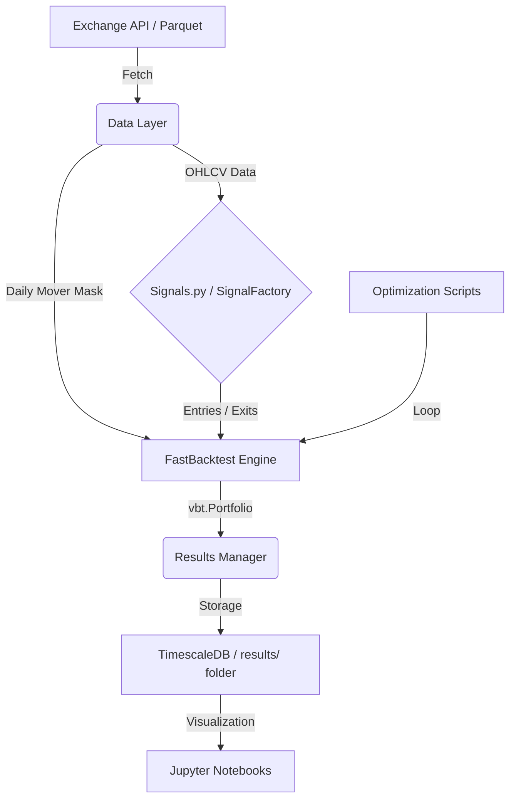

# ggTrader Architecture

This document provides a detailed technical overview of the components and data flow within the `ggTrader` project.

## 🏗️ Core Components

The project is structured into several modular layers, ensuring that logic for data handling, signal generation, and trade execution remains decoupled.

## Data Layer

- **Storage**: PostgreSQL (TimescaleDB) for OHLCV data, optimized for time-series.
- **Ingestion**: `KrakenPostgresIngestor` processes raw CSVs into Hypertable.
- **Access**: `KrakenHistoricalData` facade delegates to `KrakenPostgresReader`.
- **Caching**: `ResultDBManager` (PostgreSQL) stores backtest results, study caches, and optimization metadata.
- **Mover Mask**: `KrakenPostgresReader.get_daily_mover_mask()` builds a boolean DataFrame of daily top-N movers by notional volume in one SQL query.

## Core Engine

- **Backtesting**: `FastBacktest` is the **primary backtest engine**. It wraps `vectorbt.Portfolio.from_signals()` with proper position sizing (`max_position`), shared cash pool (`cash_sharing=True`), and optional dynamic mover masking.
- **Configuration**: `FastBacktest` accepts a `config` dict (CONSTANTS) for portfolio-level settings and a separate `params` dict for signal parameters. Signal parameters support list values for broadcasting parameter grids.
- **Broadcasting**: `SignalFactory` (vectorbt IndicatorFactory) enables running thousands of parameter combinations in a single vectorized operation.
- **Signals**: `signals.py` implements "Golden Source" logic (PSAR, ADX, ATR Trailing Stop) using Numba and VectorBT.

## Workflows

1. **Single Backtest**: `scripts/run_backtest.py` runs a one-shot backtest on a symbol pool. Supports optional `--movers N` flag for dynamic universe filtering.
2. **Sensitivity Analysis**: `scripts/run_sensitivity_analysis.py` performs grid search using `FastBacktest` broadcasting.
3. **Walk-Forward Optimization**: `scripts/run_walk_forward_optimization.py` uses rolling time-series CV on vectorized results.

## Legacy Modules

- **Trading Engine** (`trading.py`): Iterative day-by-day simulation with `Portfolio`/`Position` objects. Retained for paper/live trading scenarios but **not used for backtesting or optimization**.
- **WalkForwardOptimizer** (`optimization.py`): Optuna-based WFO. Archived to `research/archive/`.

## 🔄 Data Flow

## 📊 Result Management

Every run (backtest, sensitivity, or WFO) outputs results to a timestamped folder in the `results/` directory. This includes:

- **Trades**: Detailed log of every entry and exit.
- **Metrics**: Sharpe ratio, Max Drawdown, Profit Factor, etc.
- **Config**: A snapshot of the parameters used for that specific run.

---
*Back to [README.md](../readme.md)*
