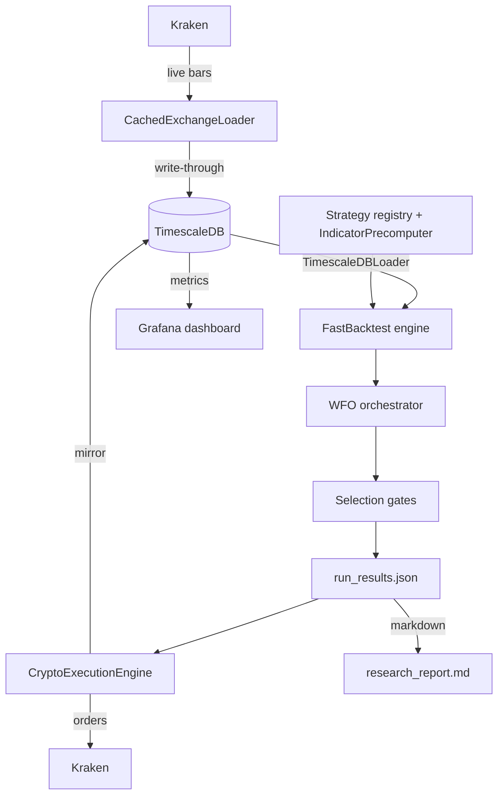

# Architecture

How ggTrader is put together. For commands and day-to-day usage see [CLI Reference](cli_reference.md); for live deployment see the [Live Trading Guide](live_trading_guide.md).

## What it is

ggTrader is an algorithmic crypto trading bot. Once a month it searches historical price data for the parameters that have been working best per coin, then trades those parameters live on Kraken. The same code path produces the research, runs the simulation, and places the orders — so what you backtest is what trades.

## The four layers

Each layer has one job. They communicate through plain Python objects (DataFrames, dicts) — no message bus, no service mesh.

### 1. Data
- **Historical storage**: TimescaleDB (PostgreSQL with a time-series extension). All OHLCV lives in one `ohlcv` hypertable.
- **Live fetch**: `CachedExchangeLoader` (CCXT against Kraken) pulls recent bars and writes them back to the DB so cold-starts don't re-download.
- **Read interface**: every component reads through `TimescaleDBLoader.fetch_ohlcv()`, which returns a MultiIndex DataFrame `(symbol, field) → values`. That format is the contract across the rest of the system.
- Code: `src/ggTrader/data/`.

### 2. Strategy
- An **entry strategy** decides when to buy (e.g. `psar_adx`, `ema_cross`, `rsi_reversal`). Eleven are registered; new ones plug in by subclassing the `EntryStrategy` protocol and registering in `ENTRY_REGISTRY`.
- An **exit strategy** decides when to sell (`atr_trailing`, `fixed_sl_tp`, `trailing_stop`). Same protocol pattern.
- `IndicatorPrecomputer` calculates each indicator (PSAR, ADX, RSI, etc.) once across the full parameter range — so a 24-combo grid for `rsi_reversal` reuses the same RSI series instead of recomputing it 24 times.
- Code: `src/ggTrader/indicators/`.

### 3. Optimization (Walk-Forward)
The job of this layer is to pick good parameters per coin without overfitting.

- We slice the price history into **10 overlapping folds**. Each fold has a *train* window (where we test every parameter combination) and a *test* window (out-of-sample, where we score the survivors).
- The fold step size equals the test length, so every bar eventually appears in exactly one test window.
- A combination's **robustness score** blends in-sample stability with out-of-sample performance: `(1 - α) × IS_score + α × OOS_score`, with `α = OOS_ROBUSTNESS_BLEND_ALPHA` (default 0.70). Combinations whose performance varies wildly across folds get penalised by `PARAM_STABILITY_WEIGHT`.
- The winning combo for each coin then passes through four **selection gates** before it can go live:

| Gate | Default | What it does |
|---|---|---|
| `MIN_ROBUSTNESS_SCORE` | 0.1 | Drops coins where the best combo is weak |
| `MIN_FOLD_CONSISTENCY` | 0.38 | Must be profitable in at least 38% of test folds |
| `MIN_VALID_TRAIN_FOLDS` | 3 | At least 3 of the 10 folds must have produced a real fit (finite Sharpe) |
| `MAX_COINS_PER_STRATEGY` | 10 | Diversification cap — one entry strategy can't dominate the whole portfolio |

- Code: `src/ggTrader/core/wfo.py`, `src/ggTrader/core/orchestrator.py`.

### 4. Execution
Live trading.

- `BaseExecutionEngine` handles state persistence (`data/active_positions.json`), the daily-loss circuit breaker (`DAILY_LOSS_LIMIT_PCT` = 5%), Telegram + Discord alerts, and the live mirror to TimescaleDB so Grafana sees orders in real time.
- `CryptoExecutionEngine` polls Kraken every 4 hours (aligned to UTC bar boundaries), places orders via CCXT, and uses Kraken-native trailing-stop orders so positions are protected even if our process dies.
- Code: `src/ggTrader/core/{base,crypto}_execution_engine.py`.

## Regime filter

A coin's returns correlation to BTC decides whether the BTC bull/bear regime gates its entries:

- `corr_BTC ≥ LEADER_CORR_THRESHOLD` (default 0.7) → entries are only allowed when BTC is in a bull regime (close > EMA(200)).
- `corr_BTC < threshold` → coin trades freely; the BTC regime doesn't affect it.

The point is to mute correlated bets during BTC bear markets without holding back coins that march to their own beat (XMR, ZEC, TRX, etc.). The filter is currently `BTC_REGIME_FILTER=False` after research showed it underperformed unfiltered trading on recent data — kept available for future re-enabling.

Code: `src/ggTrader/core/regime_filtering.py`.

## Position sizing

Two modes, picked at trader startup:

- **Weighted sizing** (default): each coin gets a fraction of total capital proportional to its OOS robustness score. No coin exceeds `MAX_COIN_ALLOCATION` (default 25%). Trusts research weights.
- **Adaptive sizing** (`--adaptive-sizing`): Kelly-style. Each position is sized so a stop-out costs exactly `TARGET_RISK_PCT` (default 1%) of portfolio value. Wider stops mean smaller positions.

## Data flow

## Monthly recalibration

The live engine kicks off its own WFO research run on the 1st of each month at ~01:00 UTC. When it finishes, the new parameters hot-reload into the running bot — no restart, no downtime. The regime filter, selection gates, and sizing mode all carry over from the running config.

## Where to find things

| Path | What's there |
|---|---|
| `src/ggTrader/cli/` | `ggt` subcommands (`research`, `trade`, `db`, etc.) |
| `src/ggTrader/core/` | Backtest engine, WFO, orchestrator, regime filter |
| `src/ggTrader/indicators/` | Entry/exit strategy classes + `IndicatorPrecomputer` |
| `src/ggTrader/data/` | TimescaleDB + live exchange loaders |
| `src/ggTrader/utils/` | Config defaults, report generators, PnL builder |
| `scripts/` | One-off operational tooling (universe regen, correlation matrix) |
| `results/research/` | Timestamped output: `research_report.md`, `run_results.json`, plots |
| `data/active_positions.json` | Live trader state (positions, circuit breaker, equity baseline) |

---
*Back to [README.md](../README.md).*
