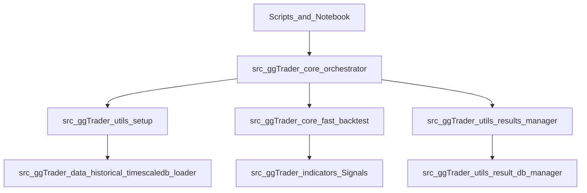

## Goal alignment report (deeper review)

This report summarizes what `ggTrader` is currently doing, what the intended goals are (per
`readme.md` and `docs/architecture.md`), and where the implementation diverges—especially in ways
that break cross-platform portability.

### 1) Stated goals (from docs)

- **Research-first trading framework**: modular data ingestion, vectorized signal generation,
  vectorized backtesting, and robust optimization (sensitivity + WFO).
- **TimescaleDB** as the authoritative OHLCV store, optimized for time-series access.
- **VectorBT** (optionally CuPy) for high-performance backtesting and broadcasting parameter grids.
- **Results persistence** to `results/` plus a DB-backed results store for metadata/metrics.
- **Clear separation** between research/backtesting engine (vectorized) and any live/paper engine.

### 2) What’s true today (implementation reality)

#### Gold path call graph (used by scripts and notebook)

- **Scripts**
  - `scripts/run_backtest.py` → `run_backtest_orchestrator`
  - `scripts/run_sensitivity_analysis.py` → `run_sensitivity_orchestrator`
  - `scripts/run_walk_forward_optimization.py` → `run_wfo_orchestrator`
- **Notebook**
  - `notebooks/single_backtest_runner.ipynb` imports and calls `run_backtest_orchestrator`

#### Data loading + mover masking behavior

- **OHLCV source**: `TimescaleDBLoader.fetch_ohlcv(...)` reads from the `ohlcv` table filtered by
  `symbols` + `interval` and pivots to a MultiIndex columns layout `(symbol, metric)`.
- **Symbol formatting**: `fetch_ohlcv` normalizes symbols: if a symbol lacks `-` or `/`, it appends
  `-{quote}` (default `USD`), e.g. `BTC` → `BTC-USD`.
- **Mover mask**:
  - `load_data_with_movers(config)` computes movers when `USE_MOVERS > 0`
  - `TimescaleDBLoader.get_daily_mover_mask(...)` ranks by notional volume using **interval
    `'1d'`** in the DB
  - mask is forward-filled from daily to intraday index and applied in `FastBacktest` by masking
    **entries only** (exits are not masked)

#### Backtesting engine (vectorized)

- **Signal generation**: `SignalFactory` (VectorBT `IndicatorFactory`) calls
  `Signals.calc_signals(...)` which combines:
  - PSAR + ADX(+DMP/DMN optional) entries
  - ATR trailing stop exits (Numba-parallel across columns)
  - stop-aware fill price (gap handling)
- **Portfolio construction**: `FastBacktest` wraps `vbt.Portfolio.from_signals(...)` with optional
  cash sharing and grouping for grid/broadcasted runs.

#### Results persistence

- `ResultsManager` creates a timestamped run folder under project-root `results/` and writes:
  - `run_results.json` (run_id, config snapshot, params, metrics)
  - plots under `plots/` (HTML/PNG for Plotly when possible)
- `ResultDBManager` mirrors runs and numeric metrics into Postgres tables (JSONB metadata, metrics
  rows, WFO windows if provided).

### 3) Required config keys (actual contracts)

The orchestrators rely on `load_data_with_movers(config)` which requires:

- **Universe**: `SYMBOLS` (list) **or** `SYMBOLS_FILE` (path to JSON list)
- **Time**: `START_DATE`, `END_DATE` (parseable) and `INTERVAL` (string used in DB query)
- **Movers**: `USE_MOVERS` (0 disables; N selects top-N daily movers)
- **Environment**: `POSTGRES_CONNECTION_STRING` must exist in project-root `.env` (for result DB and
  TimescaleDB connection)

Backtest engine config also uses:

- `START_CASH`, `PORTFOLIO_SHARE`, `FEES`, `SLIPPAGE`
- `FREQ` (portfolio metadata frequency; defaults to `4h`)

### 4) Largest goal mismatches / risks (portability-first)

#### A) Case-sensitive import breaks (Linux/macOS/CI)

On Windows, case-insensitive filesystems mask issues that will fail on case-sensitive platforms.
Concrete breakpoints found:

- **Indicators casing mismatch**
  - File: `src/ggTrader/indicators/Signals.py`
  - Imports expecting `ggTrader.indicators.signals`:
    - `src/ggTrader/core/fast_backtest.py`
    - `src/ggTrader/indicators/__init__.py`
    - `src/ggTrader/core/Trading.py`
    - tests: `tests/test_signals.py`, `tests/test_broadcasting.py`
    - notebook: `notebooks/ohlcv_signal_processing.ipynb`
  - Import expecting `ggTrader.indicators.Signals`:
    - `src/ggTrader/core/execution_engine.py`

- **Core module filename mismatch**
  - Files present: `src/ggTrader/core/Portfolio.py`, `Position.py`, `Trading.py`, `Screener.py`
  - Imports expecting lowercase module names:
    - `src/ggTrader/core/__init__.py` imports `.portfolio`, `.position`, `.trading`, `.screener`
    - `src/ggTrader/core/Trading.py` imports `ggTrader.core.portfolio/position/screener`
    - `src/ggTrader/core/Portfolio.py` imports `ggTrader.core.position`
    - tests import `ggTrader.core.portfolio/position/trading/screener`

This is the single highest priority fix for “runs on Windows only” risk.

#### B) Inconsistent time-frequency metadata

- OHLCV interval is driven by `config["INTERVAL"]`, but `FastBacktest` uses `config["FREQ"]`
  (default `4h`) when constructing the portfolio.
- If you run `INTERVAL="1h"` but leave `FREQ` unchanged, you will compute correct signals/returns
  but the portfolio’s frequency metadata (and some annualization assumptions) can be inconsistent.

#### C) Results filesystem vs docs drift (not prioritized, but real)

- WFO flow does not automatically write `params.json` or `wfo_results.csv` to disk as described in
  `docs/analysis_guide.md` (DB mirroring still occurs).

### 5) Legacy modules (keep vs. retire)

- The “legacy” bar-by-bar engine (`Trading`, `Portfolio`, `Position`) is **not used** by the main
  scripts or the primary notebook path. It appears to exist for historical iteration/paper-trading
  style workflows and for tests.
- `ExecutionEngine` exists but is not wired into scripts/notebooks; it currently has the same
  portability risk due to casing imports in indicators.

