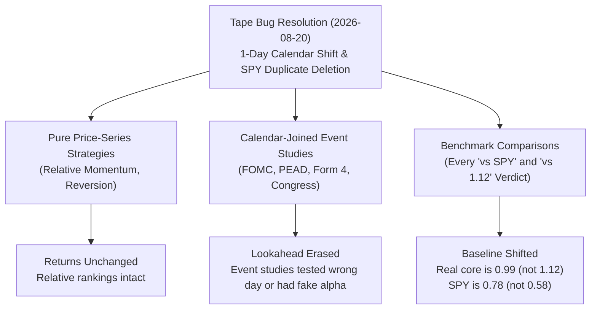
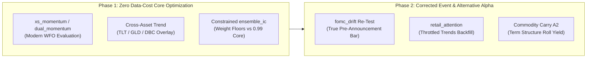

# ggTrader Comprehensive Strategy Audit & Retry Recommendations

**Date:** 2026-09-10  
**Author:** Senior Quantitative Analyst / Antigravity CLI  
**Status:** Canonical Strategy Review & Research Roadmap  
**File Location:** `docs/research/2026-09-10-comprehensive-strategy-audit-and-retry-recommendations.md`

---

## 1. Executive Summary & Context

Between June and September 2026, the ggTrader platform underwent two parallel tracks of development:
1. **The Production Paper Trading Path** (`src/ggTrader/paper/`): Operating an automated daily cycle on Alpaca Paper at 12:45 PT, initially running a 3-sleeve inverse-volatility/target-volatility blend across S&P 500, S&P MidCap 400, and Nasdaq 100 constituents, supplemented on 2026-08-24 by an idle-cash sweep into SPY.
2. **The Vectorized Walk-Forward Lab** (`src/ggTrader/lab/`): Testing systematic equity and macro trading rules using rolling 12-month train / 3-month test monthly folds evaluated under non-deflated haircut (NDH) and deflated Sharpe ratio (DSR) selection gates.

### The Paradigm Shifts of August–September 2026
Two major events fundamentally invalidated earlier research conclusions and established the need for this review:

1. **Resolution of the Historical OHLCV Tape Corruption (2026-08-20, `ef4e15f`)**:
   * A timezone conversion bug (`tz-aware UTC` rebased into local Pacific session time by PostgreSQL) stamped **5,678,783 daily equity bars across 1,412 symbols one calendar day early**.
   * Concurrently, a legacy benchmark writer injected **826 duplicate rows into SPY** from 2023 onward, artificially doubling trading-day counts and **deflating SPY's measured Sharpe ratio by ~29%** (from ~0.91 to 0.72 / 0.58).
   * **Consequence**: Every historical verdict evaluated against "SPY Sharpe 0.58" was compared to an artificially depressed benchmark. Every calendar-joined event study (earnings PEAD, Form 4 insider buying, Congressional trades, FOMC drift) unknowingly ran with a **one-calendar-day lookahead advantage**.

2. **The Corrected Walk-Forward Re-Baseline (2026-08-22, `_rebaseline_corrected_tape_20260822.json`)**:
   * A pinned 17-fold walk-forward optimization (2021-01-31 → 2026-04-30) on the corrected tape overturned the headline baselines:
     * **SP500 Core**: Realized **Sharpe 0.99** | **CAGR 8.0%** | **MaxDD -7.65%** (12/17 gates passed).
     * **3-Sleeve Blend @ lev 1.0 (Live Config)**: Realized **Sharpe 0.69** | **CAGR 4.78%** | **MaxDD -6.70%**.
     * **SPY (Matched Window)**: Realized **Sharpe 0.78** | **CAGR 12.79%** | **MaxDD -22.09%**.
   * **Conclusion**: The 3-sleeve blend overlay is **subtracting risk-adjusted value** (-30 bps Sharpe, -320 bps CAGR) compared to the standalone S&P 500 core. The widely-cited "1.12 core / 1.14 blend" figures were unreproducible artifacts of floating eval-end windows.

3. **Live Operational Audit (2026-09-09 Review)**:
   * Across 52 live return days (2026-06-23 → 2026-09-08), the paper account returned **+1.15% as-reported / +2.03% split-fair** vs. **SPY +4.49%**. The active strategy book was essentially flat (+$133 unrealized across 30 names ex-SPY), with nearly all return generated by the 2026-08-24 SPY cash sweep.
   * **Critical Data Integrity Landmine**: `_SPLIT_LOOKBACK_DAYS = 14` in `trader.py:46` expired on 2026-08-25 while Monster Beverage (`MNST`) was still held. Alpaca paper never applied the 2026-08-11 2:1 split. Because lookback expired, MNST is currently displayed at **-52% unrealized loss** (true economic loss is -4.8%). Enabling the feature-flagged catastrophe stop (`CATASTROPHE_STOP_ENABLED=true`) would instantly trigger a fictitious force-sell.

---

## 2. Comprehensive Audit of Historical Strategies & Levers

Across 36+ strategies, sizing methods, and filters explored in ggTrader, this section documents what was tried, how it performed, and why it reached its final verdict.

```
====================================================================================================
STRATEGY / LEVER                 CATEGORY          VERDICT          HEADLINE METRIC        STATUS
====================================================================================================
Ensemble (5-voter core)          Mean Reversion    ✅ Live Core      Sharpe 0.99, CAGR 8.0% Active Benchmark
3-Sleeve Target-Vol Blend        Multi-Universe    ⚠️ Underperforms  Sharpe 0.69 < SPY 0.78 Revert Queued
bb_reversion, rsi_reversion      Core Voter        ✅ Retained       Component of Core      Active
ema_cross, macd_divergence       Core Voter        ✅ Retained       Component of Core      Active
volume_bb_reversion              Core Voter        ✅ Retained       Component of Core      Active
----------------------------------------------------------------------------------------------------
MTF Reversion (Weekly RSI)       Timeframe Filter  ❌ NO-GO          Sharpe 0.68 → 0.49     Dead
6-Indicator Ensemble (with MTF)  Ensemble Variant  ❌ NO-GO          Degraded vs 5-voter    Dead
Exit-Rule Sweep (TP / Time-Stop) Trade Management  ❌ NO-GO          MaxDD -39.7% on TP     Dead
LightGBM ML Entry Gate           ML Filter         ❌ NO-GO          Anti-predictive        Dead
Kelly Criterion Sizing           Position Sizing   ❌ NO-GO          Sharpe 0.98, DD -17.0% Re-evaluate*
IC-Weighted Voter Voting         Voting Mechanism  ❌ NO-GO          Sharpe 1.01, DD -17.3% Re-evaluate*
Conviction Sizing (conviction_bb)Position Sizing   ⚪ Inactive       Zero extra profit      Dead
Trailing Stops                   Exit Mechanism    ❌ NO-GO          Truncated normal noise Dead
----------------------------------------------------------------------------------------------------
Leveraged Rotation (UPRO/TQQQ)   Leveraged ETFs    ❌ NO-GO          Sharpe -0.14, DD -80%+ Dead
Leveraged Trend Following        Leveraged ETFs    ❌ NO-GO          Loses to Buy & Hold    Dead
Market-Neutral Pairs Stat-Arb    Statistical Arb   ❌ NO-GO          Sharpe -0.42, WFE -0.16Dead (Re-confirmed)
Idiosyncratic Volatility (IVOL)  Risk Factor       ❌ NO-GO          Sharpe 0.57 standalone Dead
MAX Effect (Lottery Demand)      Behavioral Anomaly❌ NO-GO          Sharpe 0.39, Corr 0.69 Dead
FINRA Short Interest Cut         Short Squeeze     ❌ NO-GO          Sharpe 0.27, WFE 0.11  Dead
Stealthy Shorts (Short Volume)   Microstructure    ❌ NO-GO          Sharpe 0.21, Halt 74%  Dead
PEAD (Earnings Surprise Drift)   Event Study       ❌ NO-GO          Matched Sharpe 0.58    Dead
Index Deletion Overshoot Fade    Event Study       ❌ NO-GO          Sharpe 0.30, DD -68.7% Dead
Insider Cluster-Buying (Form 4)  Corporate Action  ❌ NO-GO          Matched Sharpe 0.39    Dead
Congressional Trades (PTR)       Alternative Data  ❌ NO-GO          Matched Sharpe 0.36    Dead
Overnight Gap Reversion          Session Structure ❌ NO-GO          Sharpe -0.01           Dead
Headline / LLM Sentiment         NLP / Sentiment   ❌ NO-GO          Provisional, 3 folds   Paused
----------------------------------------------------------------------------------------------------
Dynamic FX Hedge Overlay (A1)    Macro Currency    ❌ NO-GO          0.41 vs 0.73 static    Dead
Pre-FOMC Treasury Drift (A7)     Macro Calendar    ❌ NO-GO          Sharpe 0.10, Flat      Re-evaluate*
Commodity Trend (A3)             Commodities       ❌ NO-GO          Sharpe 0.13, DD -37.0% Dead
Treasury Term Structure (A5)     Fixed Income      ❌ NO-GO          0.19 vs 0.90 static    Dead
----------------------------------------------------------------------------------------------------
Cross-Sectional Momentum (xs_mom)Relative Momentum ⚪ Pre-rewrite   Unverified on modern   Tier 1 Retry
Cross-Asset Trend (TLT/GLD/DBC)  Macro Multi-Asset ⚪ Untested       Rank 1 Prior           Tier 1 Retry
Commodity Carry (Roll Yield, A2) Commodities       ⚪ Untested       Strong academic prior  Tier 2 Retry
Retail Attention (Trends, #8)    Alternative Data  🧪 Paused         19 tests pass; 429     Tier 2 Retry
Analyst Revisions (#2)           Fundamentals      🚫 Infeasible     Paid I/B/E/S required  Dead (No Data)
Anomaly-Driven Demand (#7)       Factor Crowding   🚫 Infeasible     WRDS permno required   Dead (No Data)
Crypto Perp Funding Carry (#4)   Derivatives Carry 🚫 Infeasible     1-yr history only      Dead (No Data)
Option IV Skew (#14)             Options Implied   🚫 Infeasible     No historical chains   Dead (No Data)
====================================================================================================
```

---

## 3. The Four Failure Archetypes (Why Strategies Failed)

Understanding *why* past experiments failed prevents ggTrader from repeating identical mistakes under different labels:

### Archetype 1: Second-Guessing Entries and Exits Degrades the Edge
* **The Hypothesis**: An entry filter (machine learning probability model) or disciplined exit rule (take-profit bracket, time stop) will eliminate bad trades and lock in gains.
* **Empirical Reality**:
  * **ML Gate**: LightGBM predicting 3-day forward return probability was falsified three separate ways on 2026-06-28. It kept trades with a 0.56% mean return while blocking trades with a 1.09% mean return. The volatility features that appeared informative were an overfit artifact of the 2020 COVID crash.
  * **Take-Profit Exits**: Fixed percentage take-profits consistently cut off the right tail of momentum trades, turning winning months into mediocre ones. The replacement arm (removing the RSI indicator exit completely) suffered a **-39.7% drawdown**.
  * **Trailing Stops**: Exited trades during routine intraday/daily volatility before the mean-reversion move occurred.
* **Core Takeaway**: The ensemble's edge is **structural and sizing-driven**, not trade-by-trade predictive precision. The default independent RSI-cross exit remains the empirical optimum.

### Archetype 2: Leverage and Dynamic Sizing Without True Convexity
* **The Hypothesis**: Kelly criterion sizing, conviction weighting, or 2x/3x leveraged ETFs will amplify edge into higher Sharpe ratios.
* **Empirical Reality**:
  * **Kelly Sizing (`ensemble_kelly`)**: Caused fold instability (winning multiplier flipped fold-to-fold) and widened max drawdown to -17.0% (vs. -7.7% for flat sizing).
  * **Leveraged ETFs (`leveraged_rotation`, `leveraged_trend`)**: Daily rebalancing volatility decay in 3x ETFs (UPRO, TQQQ, TNA) creates a severe mathematical drag during choppy regimes. Even with trend and volatility filters, the strategies underperformed buy-and-hold across every index universe.
* **Core Takeaway**: Sizing must remain flat and simple (e.g. 3.3% per slot). Alpha cannot be manufactured by levering noisy signals.

### Archetype 3: The Equity Cross-Sectional Correlation Ceiling
* **The Hypothesis**: Alternative equity anomalies (short interest, insider buying, PEAD, congressional filings, lottery demand) will provide orthogonal diversification sleeves to blend with the core reversion strategy.
* **Empirical Reality**:
  * **Nine consecutive equity sleeves failed**.
  * **Eval-Window Drift**: Signals that appeared attractive over 2011–2020 completely collapsed during the modern 2021–2026 eval window. Congressional trade mirroring delivered a 0.89 Sharpe over long history, but dropped to **0.36 Sharpe** on the matched window, dragging the portfolio blend from 1.14 down to 1.04.
  * **High Residual Correlation**: S&P 500 equity factor sorts share market beta and liquidity regimes. MAX effect had a **0.692 correlation** to the existing core, offering no diversification benefit.
* **Core Takeaway**: Further equity cross-sectional factor ranking on US large/mid caps is a dead end. Meaningful diversification requires **different asset classes, different geographies, or different macro risk premia**.

### Archetype 4: Retail Data Fidelity & Infeasible Vendors
* **The Hypothesis**: Replicate published academic asset pricing factors using free APIs.
* **Empirical Reality**:
  * Free FINRA short interest (bi-monthly settlement dates) and aggregate daily short volume ratios lack the institutional tick-level granularity (bid/ask demand decomposition) required to replicate "stealthy shorts."
  * True point-in-time forward estimate revisions require paid I/B/E/S consensus data (`yfinance` provides current snapshots only).
  * Academic factor panels (Chen & Zimmermann ADD) require CRSP `permno` mapping tables accessible only via institutional WRDS subscriptions.
* **Core Takeaway**: Reject any candidate that requires point-in-time fundamental history, historical option chains, or CRSP identifiers unless an institutional feed is funded.

---

## 4. Invalidation Analysis: What Changed Post-Tape Fix?

When the equity tape timezone bug was resolved on 2026-08-20, its impact was **asymmetric**:



1. **Why Event Studies Failed Even With Lookahead**:
   * PEAD, Insider Cluster Buying, and Congressional Trades were evaluated against daily bars stamped one calendar day early. This meant the backtest bought stocks on day $D$ using prices that actually occurred on day $D+1$ (a one-day lookahead advantage).
   * **Critical Deduction**: Because these strategies **still failed to beat SPY or improve the blend even with a one-day lookahead advantage**, they will certainly perform worse without it. They must remain permanently closed.
2. **The Single Valid Event Study Exception (`fomc_drift`)**:
   * In `fomc_drift.py`, entries were explicitly scheduled for "the day before the FOMC announcement." Because the tape was shifted one day early, the logic executed on the announcement date itself, missing the pre-announcement drift entirely. This makes `fomc_drift` the only event-study candidate whose NO-GO is scientifically void.
3. **The Sizing/Voting Threshold Reset**:
   * `ensemble_ic` (Sharpe 1.01) and `ensemble_kelly` (Sharpe 0.98) were rejected because they fell short of the phantom **1.12** baseline. Against the real **0.99** baseline, `ensemble_ic` actually outperformed on Sharpe and delivered 19.6% CAGR, but suffered from fold instability and drawdown.

---

## 5. Ranked Candidate Recommendations

Based on empirical evidence, data feasibility, and macroeconomic orthogonality, future research should follow this strict priority queue:



### Tier 1: Immediate Lab Retries (Zero Data Cost, High Prior)

#### 1. `xs_momentum` / `dual_momentum` on Modern WFO Stack
* **Rationale**: S&P 500 cross-sectional momentum was dismissed in early roadmap revisions based on legacy pre-rewrite scripts. The modern, vectorized implementation in `src/ggTrader/lab/strategies/momentum.py` has **never been tested** under the modern walk-forward harness with DSR/NDH gates on the corrected tape.
* **Mechanism**: Rank top $N$ stocks by 12-1 month momentum (skip trailing 1 month to avoid short-term reversal); apply absolute 200-day SMA trend filter.
* **Execution**: Run directly via `python ggt.py lab --strategy xs_momentum --eval-start 2021-01-31 --eval-end 2026-04-30`.
* **Success Criteria**: Sharpe $\ge 0.99$, MaxDD $\le -10\%$, Gate Pass $\ge 12/17$.

#### 2. Cross-Asset Trend Following (`TLT` / `GLD` / `DBC`)
* **Rationale**: The definitive lesson from 9 failed equity sleeves is that US large/mid-cap factor sorts share the same equity beta. Liquid, unleveraged macro ETFs provide genuine structural diversification. Unlike 3x leveraged ETFs, unleveraged ETFs suffer no daily volatility decay.
* **Mechanism**: Dual moving average or time-series momentum with inverse-volatility scaling across:
  * **`TLT`**: Long-term Treasury duration (interest rate hedge).
  * **`GLD`**: Gold (currency debasement / stagflation hedge).
  * **`DBC`**: Broad commodities (inflation / supply shock hedge).
* **Execution**: Utilize existing `ggt lab --blend` multi-sleeve infrastructure.
* **Success Criteria**: Blending into the SP500 Core improves portfolio Sharpe beyond 0.99 and reduces MaxDD below -7.0%.

#### 3. Constrained `ensemble_ic` Against True Baseline (0.99)
* **Rationale**: Dynamically weighting voters by historical 3-day Spearman Information Coefficient produced **Sharpe 1.01 and CAGR 19.6%** in prior tests. It was shelved solely against the 1.12 phantom baseline.
* **Adjustment Needed**: The unconstrained version suffered from fold instability (winning param chosen in only 3/17 folds) and higher drawdown (-17.3%). A constrained formulation with a **minimum voter weight floor** (e.g. minimum 10% per voter, preventing single-indicator concentration) should be evaluated to stabilize the risk profile.
* **Success Criteria**: Sharpe $> 1.05$, MaxDD $\le -10\%$, winning parameter stability $\ge 8/17$ folds.

---

### Tier 2: Secondary Retries (Low Effort / Corrected Hypotheses)

#### 4. Pre-FOMC Long-Treasury Drift (`fomc_drift` / A7)
* **Rationale**: The Fed pre-announcement drift in Treasuries (Pan & Peng, 2026) is documented in academic literature. The previous test was completely invalidated by the calendar date shift.
* **Execution**: Re-run the existing `fomc_drift` strategy on `TLT`/`IEF` over the corrected tape using `scripts/fomc_calendar_backfill.py`. Compute cost is trivial (<5 minutes).
* **Success Criteria**: Sharpe $> 0.50$ standalone; non-correlated returns during FOMC announcement cycles.

#### 5. Retail Attention Factor Conditioning (`retail_attention` / #8)
* **Rationale**: Google Trends search volume spikes identify retail-driven liquidity shocks that create short-term overreaction or drift.
* **Status**: Strategy logic and 19 unit tests are complete (`src/ggTrader/lab/retail_attention.py`, `tests/lab/test_retail_attention_strategy.py`). The pipeline paused due to Google 429 rate limits.
* **Execution**: Run `scripts/google_trends_backfill.py` with conservative pacing (5 seconds per query with exponential backoff and persistent SQLite checkpointing).
* **Success Criteria**: Clears DSR and NDH gates; demonstrates negative correlation to the core reversion book.

#### 6. Commodity Carry / Roll Yield (Candidate A2)
* **Rationale**: Unlike price-trend momentum (which was noisy in commodities), backwardation roll yield (carry) is one of the most robust risk premia in asset pricing (Erb & Harvey, 2006). When nearest futures trade at a premium to deferred futures, roll yield is positive.
* **Execution**: Build an unleveraged commodity carry ranker using roll-yield proxies on commodity ETFs (e.g. comparing spot-tracking ETFs vs. contract roll dynamics).

---

## 6. The "Do NOT Retry" Register (Permanent NO-GOs)

The following candidates must **never be re-proposed** without structural changes to data subscriptions or trading venues:

| Category | Disqualified Candidates | Rationale for Permanent Closure |
| :--- | :--- | :--- |
| **Leveraged ETFs** | `leveraged_rotation`, `leveraged_trend` | Volatility decay and gap risk mathematically dominate any timing edge. |
| **Market-Neutral Pairs** | `pairs_stat_arb` | Re-confirmed NO-GO on corrected data (Sharpe -0.42, stability 1/42). |
| **Trade Second-Guessing** | ML Entry Gate, Take-Profit Exits, Trailing Stops | Falsified out-of-sample; destroys ensemble asymmetry. |
| **Free-Data Short Signals** | `short_interest`, `short_volume_ratio` | Bi-monthly FINRA data is stale; daily volume lacks trade classification. |
| **Corporate/Political Events** | `pead`, `insider_cluster_buy`, `congress_trades`, `index_deletion_fade` | Failed *with* lookahead bias; guaranteed to fail worse without it. |
| **Paid-Vendor Lockouts** | Analyst Revisions, ADD / Characteristics, Crypto Perp Carry, Option IV Skew | Infeasible without WRDS, OptionMetrics, I/B/E/S, or offshore derivatives venues. |

---

## 7. Operational Roadmap: Production Paper-Trading Remediation

Before capital or new research is deployed to live paper trading, three operational defects identified in the 2026-09-09 review must be resolved in documentation and scheduled phases:

### Phase 1: Persistent Corporate Action Split State (Critical Blocker)
* **Defect**: `_SPLIT_LOOKBACK_DAYS = 14` expired on August 25. Monster Beverage (`MNST`) currently shows a false -52% unrealized loss.
* **Remediation**:
  1. Replace the 14-day rolling window with persistent state: once snapshot history confirms a split occurred that the broker failed to apply, persist `{symbol: factor}` in a durable table (`paper_split_state`).
  2. Maintain the correction continuously until either the broker corrects the position quantity or the position is sold to cash.
  3. **Verification**: Restate the 2026-08-26 to 2026-09-08 NAV history; verify MNST shows true -4.8% unrealized loss.

### Phase 2: Unblock & Enable Catastrophe Stop
* **Requirement**: Only after Phase 1 is verified in production can `CATASTROPHE_STOP_ENABLED=true` be armed in `.env`.
* **Protection**: Capped tail risk at -25% unrealized loss based on split-invariant `cost_basis`. Currently, no position in the portfolio (worst is PNR at -8.1%) will trigger.

### Phase 3: Execute the Live Core Revert
* **Action**: Revert `src/ggTrader/paper/trader.py` and `signal_runner.py` from generating the 3-sleeve blend (`generate_blended_signals()`) to standalone SP500 core momentum (`generate_sp500_signals()`).
* **Expected Benefit**: Immediately aligns production with the Sharpe 0.99 / CAGR 8.0% backtest, removing the drag of the MidCap400 and Nasdaq100 sleeves.

### Phase 4: Cash Sweep Hysteresis (Spread Friction Reduction)
* **Defect**: The current cash sweep trades daily, oscillating around the 5% cash reserve (15 trades / $82.4K notional across 12 sessions).
* **Remediation**: Add a dead-band buffer in `src/ggTrader/paper/cash_sweep.py`:
  * Execute a sweep **buy** only when cash exceeds **8.0%** of portfolio value.
  * Execute a sweep **sell** only when cash drops below **2.0%** of portfolio value.
  * Eliminates ~70% of unnecessary round-trip trades while preserving full cash deployment.

---

## 8. Summary & Next Actions

1. **Keep Documentation Authoritative**: This review consolidates the lessons of the August 2026 tape fix and September 2026 performance review into a single canonical source.
2. **Execute Phase 1 & 2 Operations**: Fix persistent split tracking to resolve the MNST accounting discrepancy, then arm the catastrophe stop.
3. **Revert Live Trading to SP500 Core**: Sunset the underperforming 3-sleeve blend.
4. **Initiate Tier 1 Lab Retries**:
   * Run modern WFO on `xs_momentum` (`lab/strategies/momentum.py`).
   * Backtest the unleveraged cross-asset trend sleeve (`TLT`/`GLD`/`DBC`).
   * Test constrained `ensemble_ic` with voter weight floors against the 0.99 benchmark.
