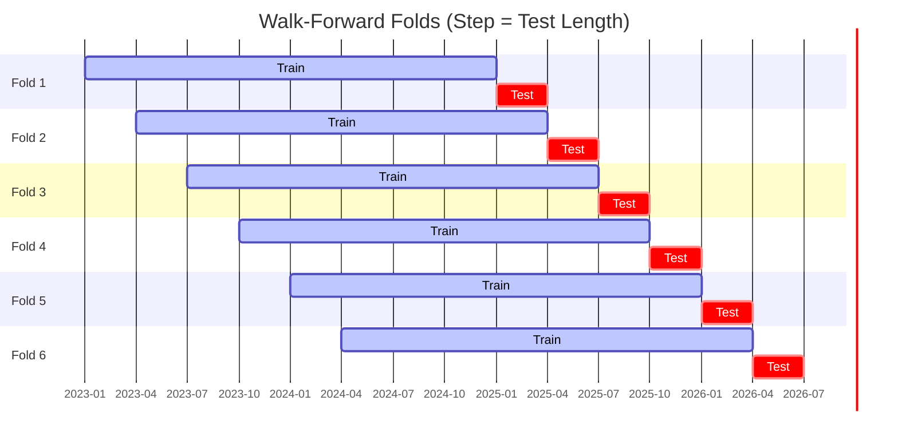

# ggTrader Unified CLI Guide (`ggt`)

This document describes the unified `ggt` command-line interface, which orchestrates the entire trading lifecycle—from live universe research to production execution.

## 🚀 The `ggt` Command

The unified entry point `ggt.py` replaces legacy standalone scripts with a structured workflow.

### 1. Research (`ggt research`)

Fetches the top assets by volume and runs a **Grand Walk-Forward Optimization (WFO)**.

- **Parallel Execution**: Splits the universe into concurrent workers (Default: **5 workers**), reducing a 50-coin 3-year WFO from ~1 hour to ~15 minutes.
- **Filtering**: Automatically excludes stablecoins, fiat, and gold-backed assets (`PAXG`, `XAUT`).
- **Asset Selection**: Selects the most liquid assets based on exchange volume (Default: **Top 50**).
- **Volume Window**: Aggregates volume over a specific lookback period to ensure sustained liquidity (Default: **30d**; Options: `24h`, `7d`, `30d`).
- **WFO Duration**: Runs the optimization over a dynamic sliding window relative to today (Default: **1095 days / 3 years**).
- **Command (Using Defaults)**:

```bash
python ggt.py research
```

*Note: The command above is equivalent to: `python ggt.py research --top 50 --window 30d --days 1095 --workers 5`*

### 2. Backtest (`ggt backtest`)

Simulates a portfolio backtest using specific parameters or files.

- **Discovery**: Automatically finds the latest research results if no file is specified.
- **Command**:

```bash
python ggt.py backtest --symbols BTC,ETH --params signals_config.json
```

### 3. Production (`ggt production`)

Performs the monthly recalibration. It runs the full portfolio analysis and generates the final allocation weights for live trading.

- **Output**: Generates `portfolio_weights.json` used by the live bot.
- **Command**:

```bash
python ggt.py production
```

### 4. Trade (`ggt trade`)

Starts the live `ExecutionEngine` heartbeat.

- **Loop**: Polls Kraken every 4 hours (aligned with candle closes).
- **Execution**: Uses optimized parameters to generate signals and `portfolio_weights.json` for position sizing.
- **Command**:
```bash
python ggt.py trade
```

### 5. Database (`ggt db`)

Unified administration for TimescaleDB maintenance and exports.

- **`diag`**: Check storage usage and row counts.
- **`clean`**: Purge malformed or old asset data.
- **`compression`**: Manage TimescaleDB native data compression.
- **`export`**: Backup the database using industrial-grade `pg_dump`.

### 6. Ingest (`ggt ingest`)

Synchronizes historical candle data from CCXT (Kraken) to the local database.

- **Command**:
```bash
python ggt.py ingest --days 180
```

### 7. Cleanup (`ggt cleanup`)

Maintains a lean project directory by removing old research logs and temporary files.

- **Function**: Keeps only the last 10 research runs and clears out root log files.
- **Command**:
```bash
python ggt.py cleanup --confirm
```

The system splits the historical window into a **6-fold sliding window** where each fold moves forward by the exact length of the test period (**Step = Test Length**):



Once Phase 1 finishes, the system aggregates the winners into `run_results.json`.

## 🏗️ The Pipeline Lifecycle

The system is designed to run autonomously via `ggt research`, which internally runs all three backtesting phases before handing off to live execution.

### Phase 1: Per-Coin WFO + Exit Tournament

Runs Walk-Forward Optimization for each coin across all (entry × exit) strategy combos using a 6-fold sliding window. Each fold trains on ~2 years and tests on ~3 months. The winning strategy + params per coin are saved to `run_results.json`. Parallel workers split the coin universe to reduce total wall-clock time.

### Phase 2: Full-Range Validation

Replays WFO-selected params on the entire training/test range with the three-tier BTC regime filter applied. OOS-robustness-weighted allocation assigns capital across coins. Produces the combined portfolio equity curve, per-coin stats, and allocation weights.

### Phase 3: YTD Performance

Same replay on the last 12 months (configurable via `RECENT_VALIDATION_START_DATE`). Pre-loads `EMA_WARMUP_BARS` (default 200) × interval bars before the window start so indicators are fully warm from bar 0. Generates the YTD dashboard plot alongside the full-range one.

### Phase 4: Live Execution

`ggt trade` uses `portfolio_weights.json` from Phase 2/3 to manage Kraken orders. The `ExecutionEngine` polls every 4 hours, aligned with candle closes, and uses **Native Trailing Stops** for server-side risk protection.

## 🐳 Docker Orchestration

Manage the entire lifecycle via `docker-compose.yaml`.

### Services

- **`ggtrader_db`**: TimescaleDB for high-speed OHLCV and results storage.
- **`ggtrader_live`**: The bot service running the live execution loop.

### Commands

- **View Heartbeat**: `docker compose logs -f ggtrader_live`
- **Manual Research**: `docker compose exec ggtrader_live python ggt.py research`

---

## Performance Tuning

### Worker count

The default of **5 workers** is the empirical sweet spot for a 50-coin universe on a 16-core machine.

- Fewer workers (2–3): useful when memory is tight or when running a `--dry-run`.
- More workers (8+): rarely faster due to Python GIL contention during Numba JIT compilation; can increase peak RAM to 20 GB+.

```bash
ggt research --top 50 --workers 5   # default, ~20-25 min
ggt research --top 20 --workers 3   # lighter, ~8 min
```

### Parameter grid size

The `DETAILED_ENTRY_PARAM_GRIDS` and `DETAILED_EXIT_AXIS_GRIDS` in `src/ggTrader/pipeline/param_grids.py` drive WFO search space:

- **psar_adx**: collapsed `sar_acceleration`→`[0.02]`, `sar_maximum`→`[0.1]` (empirically constant) — saves ~97% of combos.
- **donchian_breakout**: `donchian_length`→`[30, 50, 100]` — WFO selects the best channel width per coin.
- **fixed_sl_tp exit**: `stop_pct`→`[1.0, 1.5, 2.0, 3.0]`, `take_profit_pct`→`[2.0, 3.0, 4.0, 6.0]` — 16 combos.
- **trailing_stop exit**: `trailing_stop_pct`→`[2.0, 3.0, 5.0, 8.0]` — 4 combos.
- **rsi_reversal**: `rsi_trend_filter`→`[True, False]` — WFO decides per coin whether EMA200 alignment helps.

### Universe cache

`ggt research` caches the CCXT universe fetch to `results/research/universe_cache_YYYYMMDD_topN_Wwindow.json`.
On the second run of the same day the startup delay (~90 s for `load_markets` + `fetch_tickers`) is eliminated entirely.

### SPY benchmark cache

`benchmarking.py` caches `yfinance` SPY data to `results/spy_cache_YYYYMMDD.parquet` (TTL = 1 day).
Repeated research runs on the same day skip the network download.

### Disk cache warmup

The first WFO fold on a fresh process compiles Numba JIT functions (~20 s). Subsequent folds reuse the compiled cache (~2 s each). This is why multi-worker runs are faster than sequential single-worker runs proportionally.

---

## Troubleshooting

### Workers show "starting..." indefinitely

A worker process crashed during initialisation (usually an import error or DB connection failure). Check the worker log:

```bash
# Look for the traceback in the status file
Get-Content results/pipeline_<timestamp>/status.txt -Tail 60
```

The main process waits for all workers to check in; if one never does, it stalls. Fix the root cause and re-run.

### All per-coin stats show `n/a`

Symptom: Phase 1 finishes but every coin shows `robustness=n/a`, `trades=0`.

Cause: Multi-worker merge failure. Each worker writes `worker_N_results.json` to the shared run directory. The main process merges them into `run_results.json` before launching Phase 2/3. If one worker crashed silently, its coin subset is missing from the merged result.

Fix: Check individual `worker_N.log` files in the run directory for tracebacks. Reduce `--workers` to 1 to confirm results are valid, then increase back up. If it recurs, check disk space on the `results/` volume.

### YTD backtest starts trading much later than the window start

**Status: Resolved.** Phase 3 now pre-loads `EMA_WARMUP_BARS` (default 200) × `INTERVAL` bars before the YTD window start, ensuring strategy indicators (e.g. EMA200) and the BTC regime filter are fully warm from bar 0. The portfolio equity curve is then trimmed back to the intended YTD start via `PHASE3_STATS_CUTOFF` so reported stats cover only the intended window. No manual workaround needed.

### YTD plot missing from report

The `combined_portfolio_ytd_dashboard.html` is generated by Phase 3. If it's missing, regenerate:

```bash
ggt report --results-dir results/pipeline_<timestamp>
```

### `ValueError: cannot join with no overlapping index names`

This was a pandas MultiIndex alignment bug when applying regime masks to vbt portfolio DataFrames. It was fixed in a prior commit by using `.values` for numpy bitwise AND instead of DataFrame-level operators. If it reappears, the cause is likely a new code path constructing a boolean mask as a plain DataFrame and `&`-ing it directly against a MultiIndex vbt column set.

---
*For technical details on components, see the [Architecture Guide](architecture.md).*
