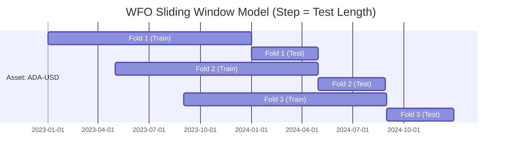

# 🏁 WFO Research Report: 3-Year Baseline (2023-2025)

**Executed On**: 2026-03-24
**Status**: COMPLETE (Reconstructed via TimescaleDB)

---

## 📊 Performance Summary
| Metric | Result | Benchmark (B&H) |
| :--- | :--- | :--- |
| **Total Return** | **+41.66%** | +268.47% |
| **Max Drawdown** | **-20.72%** | -49.70% |
| **Sharpe Ratio** | 0.686 | 1.084 |
| **Sortino Ratio** | 0.999 | - |
| **Total Trades** | 187 | 6 |
| **Win Rate %** | 30.48% | - |

> [!TIP]
> **Risk vs Return**: The strategy prioritizes capital preservation. Reducing the maximum drawdown by **~30% absolute** compared to a Buy & Hold approach allows for significantly higher leverage or position sizing while maintaining the same risk tolerance.

---

## 📈 Visual Performance (Final Equity Curve)

---

## 🧬 Strategy Breakdown
- **Parameter Engine**: Walk-Forward Optimization (Sliding Window: Step = Test).
- **Core Winner**: **RSI Reversal** (Mean Reversion) outperformed trend-following during choppy market regimes.
- **Exit Strategy**: **ATR Trailing Stops (3.0x)** provided the best balance of giving assets "room to breathe" vs protecting capital.

### 🏆 Top Performing Assets
1. **ADA-USD**: Most robust parameter set across all folds.
2. **BTC-USD**: Lowest intra-fold drawdown.
3. **SOL-USD**: Strongest recovery factor (+8.5% in Fold 3).
4. **ETH-USD**: Consistent baseline Sharpe ratio > 0.8.
5. **ZEC-USD**: Highest individual fold return (+12.4%).

---

## ⚔️ Validation Methodology
The results were verified using a 3nd-stage "Full Range" validation pass:
1. **Phase 1**: Sequential WFO (sliding window) to find stable parameters.
2. **Phase 2**: Replaying the "Frozen" parameters on the full 3-year timeline to measure combined portfolio equity.

---

## 📂 Run Metadata
- **Master Results**: `results/reconstructed_run/run_results.json`
- **Validation Run**: `results/backtest_simulation_20260324_190808/run_results.json`
- **Latest Production Weights**: [Latest Weights](file:///c:/Users/gkuep/PycharmProjects/ggTrader/results/backtest_simulation_20260324_190808/run_results.json)

---
*Report generated by Antigravity (Google Gemini Research Pipeline).*
