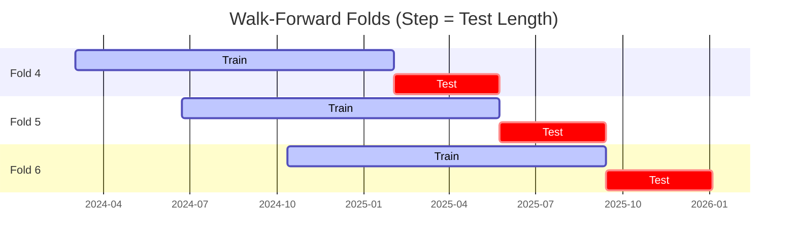

# Trading Strategy Pipeline Report

**Generated**: 2026-04-01 01:50:49

## Executive Summary

**WFO Training/Test period:** 2023-04-01 -> 2026-01-04  
**YTD performance window:** 2025-12-02 -> 2026-04-01  
**Coins:** 26

| | WFO Full Range | YTD |
|-|----------------|--------|
| Strategy CAGR | 31.61% | -15.10% |
| BTC buy & hold CAGR | 51.52% ❌ | -53.89% ✅ |
| S&P 500 CAGR | n/a | n/a |
| Strategy Sharpe | 1.05 | -0.84 |
| Max Drawdown | -31.76% | -11.80% |
| Total Trades | 583 | 120 |
| Win Rate | 34.65% | 23.33% |

## Result Validation (Training/Test Data)
**Period: 2023-04-01 -> 2026-01-04** — WFO-selected parameters replayed on the full training/test range.

### Combined Portfolio Performance

| Metric | Strategy | BTC (buy & hold) | S&P 500 (SPY) | Excess vs BTC |
|--------|----------|------------------|---------------|---------------|
| Total Return | 113.58% | 215.19% | n/a | - |
| CAGR | 31.61% | 51.52% | n/a | -19.91% |
| Sharpe Ratio | 1.0537 | 1.1411 | n/a | - |
| Max Drawdown | -31.76% | -34.46% | n/a | - |
| Total Trades | 583 | 1 | 1 | - |
| Win Rate | 34.65% | - | - | - |

## YTD Performance
**Period: 2025-12-02 -> 2026-04-01** — WFO-selected parameters replayed on the YTD window, no re-optimization.

| Metric | Strategy | BTC (buy & hold) | S&P 500 (SPY) | Excess vs BTC |
|--------|----------|------------------|---------------|---------------|
| Total Return | -5.24% | -22.46% | n/a | - |
| CAGR | -15.10% | -53.89% | n/a | 38.79% |
| Sharpe Ratio | -0.8356 | -1.3802 | n/a | - |
| Max Drawdown | -11.80% | -35.36% | n/a | - |
| Total Trades | 120 | 1 | 1 | - |
| Win Rate | 23.33% | - | - | - |

## Per-Coin Strategy Selection (WFO)

Best performing strategy per coin based on robustness scores (highest first).

| Symbol | Strategy | Selection | Robustness Score |
|--------|----------|-----------|------------------|
| KAS-USD | rsi_reversal+atr_trailing | wfo_robustness | 1.1412 |
| ZEC-USD | ema_cross+atr_trailing | wfo_robustness | 0.8805 |
| LINK-USD | donchian_breakout+atr_trailing | wfo_robustness | 0.8050 |
| ETH-USD | ema_cross+atr_trailing | wfo_robustness | 0.7855 |
| TAO-USD | psar_adx+fixed_sl_tp | wfo_robustness | 0.7332 |
| DOGE-USD | rsi_reversal+fixed_sl_tp | wfo_robustness | 0.7179 |
| SPX-USD | psar_adx+fixed_sl_tp | wfo_robustness | 0.6657 |
| BTC-USD | rsi_reversal+atr_trailing | wfo_robustness | 0.6254 |
| XLM-USD | rsi_reversal+trailing_stop | wfo_robustness | 0.6158 |
| NEAR-USD | rsi_reversal+fixed_sl_tp | wfo_robustness | 0.5606 |
| CRV-USD | donchian_breakout+atr_trailing | wfo_robustness | 0.4962 |
| XMR-USD | supertrend_flip+atr_trailing | wfo_robustness | 0.4593 |
| XRP-USD | psar_adx+atr_trailing | wfo_robustness | 0.4028 |
| SOL-USD | ema_cross+atr_trailing | wfo_robustness | 0.3868 |
| PEPE-USD | ema_cross+fixed_sl_tp | wfo_robustness | 0.3837 |
| ZRO-USD | psar_adx+fixed_sl_tp | wfo_robustness | 0.3504 |
| ADA-USD | supertrend_flip+atr_trailing | wfo_robustness | 0.3497 |
| LTC-USD | psar_adx+atr_trailing | wfo_robustness | 0.3316 |
| ALGO-USD | rsi_reversal+fixed_sl_tp | wfo_robustness | 0.3249 |
| WIF-USD | psar_adx+trailing_stop | wfo_robustness | 0.3199 |
| AAVE-USD | rsi_reversal+atr_trailing | wfo_robustness | 0.3082 |
| DOT-USD | rsi_reversal+atr_trailing | wfo_robustness | 0.2982 |
| SUI-USD | rsi_reversal+fixed_sl_tp | wfo_robustness | 0.2863 |
| TRX-USD | donchian_breakout+atr_trailing | wfo_robustness | 0.2824 |
| FET-USD | psar_adx+atr_trailing | wfo_robustness | 0.2112 |
| ONDO-USD | rsi_reversal+atr_trailing | wfo_robustness | 0.1913 |

### WFO Fold Timeline

### WFO Out-of-Sample Sharpe — Per Fold

Per-fold OOS Sharpe for each coin's winning strategy (folds ordered as above). Negative = strategy did not generalise.

| Symbol | Strategy+Exit | IS Rob | OOS Rob | Consistency | Fold 1 | Fold 2 | Fold 3 | Fold 4 | Fold 5 | Fold 6 |
|--------|---------------|--------|---------|-------------|--------|--------|--------|--------|--------|--------|
| KAS-USD | rsi_reversal+atr_trailing | 1.7097 | 0.8351 | 100% | n/a | n/a | n/a | 1.844 | 0.199 | n/a |
| ZEC-USD | ema_cross+atr_trailing | 1.8856 | 0.7908 | 67% | -2.292 | 0.092 | 0.427 | 0.402 | -0.333 | 3.883 |
| ETH-USD | ema_cross+atr_trailing | 1.8938 | 0.5915 | 67% | -1.370 | -3.256 | 1.125 | 0.971 | 3.273 | 0.245 |
| LINK-USD | donchian_breakout+atr_trailing | 1.8131 | 0.4807 | 80% | 1.043 | -1.075 | 1.108 | 0.025 | 1.197 | n/a |
| CRV-USD | donchian_breakout+atr_trailing | 1.7164 | 0.2971 | 50% | -2.173 | -0.181 | 1.705 | 0.542 | 1.215 | -0.411 |
| XMR-USD | supertrend_flip+atr_trailing | 1.6284 | 0.2537 | 50% | -1.231 | -2.569 | 0.718 | 3.549 | -1.926 | 1.230 |
| TAO-USD | psar_adx+fixed_sl_tp | 2.0436 | 0.2266 | 80% | n/a | 0.483 | 0.591 | -0.911 | 0.085 | 0.888 |
| DOGE-USD | rsi_reversal+fixed_sl_tp | 2.4840 | 0.1351 | 67% | 0.475 | -1.969 | 1.842 | 0.774 | 1.941 | -1.928 |
| ADA-USD | supertrend_flip+atr_trailing | 1.7627 | 0.1267 | 33% | -2.677 | -1.355 | 1.947 | -1.639 | 3.037 | -0.749 |
| XLM-USD | rsi_reversal+trailing_stop | 2.6512 | 0.0883 | 50% | -1.528 | -4.011 | 3.421 | 1.412 | 2.354 | -2.517 |
| SPX-USD | psar_adx+fixed_sl_tp | 2.3805 | 0.0837 | 67% | n/a | n/a | -1.584 | n/a | 0.995 | 0.295 |
| WIF-USD | psar_adx+trailing_stop | 1.1667 | 0.0748 | 60% | -1.061 | 1.139 | -2.324 | 0.402 | n/a | 1.065 |
| XRP-USD | psar_adx+atr_trailing | 1.4850 | 0.0266 | 67% | 0.494 | 0.118 | 3.785 | -0.390 | 0.741 | -2.465 |
| BTC-USD | rsi_reversal+atr_trailing | 2.3816 | 0.0004 | 67% | -2.700 | -4.137 | 0.352 | 2.074 | 0.522 | 0.168 |
| SOL-USD | ema_cross+atr_trailing | 1.6703 | -0.1060 | 67% | 0.311 | -0.508 | 1.425 | 0.162 | 1.777 | -2.762 |
| TRX-USD | donchian_breakout+atr_trailing | 1.3750 | -0.1612 | 67% | -3.290 | 1.531 | 1.106 | 0.871 | 2.430 | -3.833 |
| DOT-USD | rsi_reversal+atr_trailing | 1.7004 | -0.1815 | 50% | -1.859 | 0.812 | 0.918 | 0.630 | -0.042 | -1.555 |
| LTC-USD | psar_adx+atr_trailing | 2.1357 | -0.2223 | 40% | 0.358 | n/a | -0.873 | -0.144 | 1.034 | -1.230 |
| NEAR-USD | rsi_reversal+fixed_sl_tp | 2.5680 | -0.2329 | 67% | 1.505 | 0.499 | -0.358 | 1.559 | -3.102 | 0.118 |
| PEPE-USD | ema_cross+fixed_sl_tp | 2.2090 | -0.2451 | 50% | 0.636 | -1.891 | 1.408 | 1.651 | -1.042 | -1.542 |
| ALGO-USD | rsi_reversal+fixed_sl_tp | 2.4389 | -0.3135 | 33% | -3.414 | -4.508 | 2.846 | 0.719 | -0.888 | -0.230 |
| ZRO-USD | psar_adx+fixed_sl_tp | 2.2663 | -0.3578 | 50% | n/a | -1.698 | 0.823 | n/a | -1.564 | 0.415 |
| AAVE-USD | rsi_reversal+atr_trailing | 2.0888 | -0.3660 | 50% | -1.128 | 1.346 | 1.760 | -0.160 | 0.738 | -3.392 |
| SUI-USD | rsi_reversal+fixed_sl_tp | 2.5299 | -0.4813 | 33% | -4.269 | -0.670 | 0.736 | 0.869 | -0.493 | -1.454 |
| FET-USD | psar_adx+atr_trailing | 2.3805 | -0.6319 | 33% | -0.472 | -2.043 | -1.349 | 0.845 | 1.079 | -2.622 |
| ONDO-USD | rsi_reversal+atr_trailing | 2.4332 | -0.8897 | 60% | n/a | 0.863 | 1.323 | -3.144 | 0.798 | -3.398 |

## Full-Period Performance (Per-Coin)

Performance metrics from running WFO-selected parameters on full-range data.

| Symbol | Strategy | Selection | Return % | Sharpe | Max DD % | Trades | Win Rate % |
|--------|----------|-----------|----------|--------|----------|--------|-----------|
| PEPE-USD | ema_cross | wfo_robustness | 63.78% | 1.1958 | -12.55% | 81 | 37.04% |
| ZEC-USD | ema_cross | wfo_robustness | 40.99% | 1.0449 | -11.30% | 50 | 46.00% |
| TAO-USD | psar_adx | wfo_robustness | 21.40% | 0.9146 | -7.70% | 15 | 80.00% |
| BTC-USD | rsi_reversal | wfo_robustness | 28.21% | 0.8279 | -12.70% | 1 | 100.00% |
| XRP-USD | psar_adx | wfo_robustness | 14.70% | 0.8239 | -7.66% | 84 | 38.10% |
| XLM-USD | rsi_reversal | wfo_robustness | 12.19% | 0.6308 | -11.21% | 86 | 31.40% |
| SOL-USD | ema_cross | wfo_robustness | 10.89% | 0.5705 | -9.18% | 66 | 45.45% |
| ETH-USD | ema_cross | wfo_robustness | 8.87% | 0.3483 | -13.96% | 1 | 100.00% |
| TRX-USD | donchian_breakout | wfo_robustness | 3.31% | 0.2768 | -5.62% | 58 | 34.48% |
| NEAR-USD | rsi_reversal | wfo_robustness | 3.75% | 0.2303 | -9.97% | 77 | 37.66% |
| ADA-USD | supertrend_flip | wfo_robustness | 3.75% | 0.2010 | -17.71% | 45 | 31.11% |
| LINK-USD | donchian_breakout | wfo_robustness | 3.29% | 0.1874 | -13.16% | 61 | 37.70% |
| FET-USD | psar_adx | wfo_robustness | -4.78% | 0.0389 | -41.84% | 1 | 0.00% |
| LTC-USD | psar_adx | wfo_robustness | -0.09% | 0.0056 | -3.83% | 36 | 41.67% |
| ZRO-USD | psar_adx | wfo_robustness | -2.11% | -0.1652 | -4.80% | 52 | 23.08% |
| DOGE-USD | rsi_reversal | wfo_robustness | -6.96% | -0.3573 | -10.03% | 89 | 23.60% |
| SUI-USD | rsi_reversal | wfo_robustness | -7.60% | -0.4255 | -12.21% | 99 | 28.28% |
| XMR-USD | supertrend_flip | wfo_robustness | -7.24% | -0.5139 | -11.55% | 47 | 23.40% |

---

*For pipeline methodology, fold structure, and benchmark definitions see [docs/UNIFIED_PIPELINE.md](../docs/UNIFIED_PIPELINE.md).*

---

*Report generated by ggTrader Pipeline*