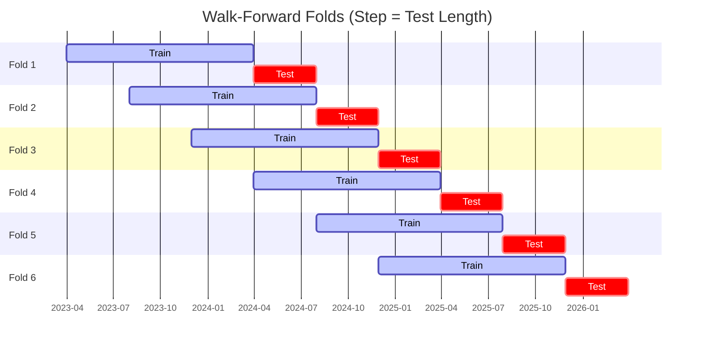

# Trading Strategy Pipeline Report

**Generated**: 2026-04-01 15:34:19

## Executive Summary

**WFO Training/Test period:** 2025-12-02 -> 2026-03-31  
**YTD performance window:** 2025-12-02 -> 2026-04-01  
**Coins:** 22

| | WFO Full Range | YTD |
|-|----------------|--------|
| Strategy CAGR | -23.15% | -22.56% |
| BTC buy & hold CAGR | -62.12% ✅ | -60.59% ✅ |
| S&P 500 CAGR | -18.95% ❌ | -9.23% ❌ |
| Strategy Sharpe | -1.72 | -1.69 |
| Max Drawdown | -13.95% | -13.78% |
| Total Trades | 80 | 80 |
| Win Rate | 17.50% | 17.50% |

## Result Validation (Training/Test Data)
**Period: 2025-12-02 -> 2026-03-31** — WFO-selected parameters replayed on the full training/test range.

### Combined Portfolio Performance

| Metric | Strategy | BTC (buy & hold) | S&P 500 (SPY) |
|--------|----------|------------------|---------------|
| Total Return | -8.16% | -26.95% | -6.57% |
| CAGR | -23.15% | -62.12% | -18.95% |
| Sharpe Ratio | -1.7159 | -1.8133 | -2.9946 |
| Max Drawdown | -13.95% | -35.36% | -6.57% |
| Total Trades | 80 | 1 | 1 |
| Win Rate | 17.50% | - | - |

## YTD Performance
**Period: 2025-12-02 -> 2026-04-01** — WFO-selected parameters replayed on the YTD window, no re-optimization.

| Metric | Strategy | BTC (buy & hold) | S&P 500 (SPY) |
|--------|----------|------------------|---------------|
| Total Return | -8.06% | -26.36% | -3.13% |
| CAGR | -22.56% | -60.59% | -9.23% |
| Sharpe Ratio | -1.6858 | -1.7340 | -1.0747 |
| Max Drawdown | -13.78% | -35.36% | -6.57% |
| Total Trades | 80 | 1 | 1 |
| Win Rate | 17.50% | - | - |

## Per-Coin Strategy Selection (WFO)

Best performing strategy per coin based on robustness scores (highest first).

| Symbol | Strategy | Selection | Robustness Score |
|--------|----------|-----------|------------------|
| ETH-USD | psar_adx+fixed_sl_tp | wfo_robustness | 0.9550 |
| TAO-USD | supertrend_flip+fixed_sl_tp | wfo_robustness | 0.7218 |
| SPX-USD | psar_adx+fixed_sl_tp | wfo_robustness | 0.5866 |
| CRV-USD | psar_adx+atr_trailing | wfo_robustness | 0.5664 |
| XMR-USD | rsi_reversal+atr_trailing | wfo_robustness | 0.4901 |
| XRP-USD | supertrend_flip+atr_trailing | wfo_robustness | 0.4548 |
| ALGO-USD | ema_cross+fixed_sl_tp | wfo_robustness | 0.4447 |
| DASH-USD | rsi_reversal+atr_trailing | wfo_robustness | 0.3900 |
| SUI-USD | psar_adx+trailing_stop | wfo_robustness | 0.3796 |
| AAVE-USD | supertrend_flip+atr_trailing | wfo_robustness | 0.3562 |
| XCN-USD | psar_adx+atr_trailing | wfo_robustness | 0.3512 |
| WIF-USD | psar_adx+fixed_sl_tp | wfo_robustness | 0.3152 |
| DOGE-USD | rsi_reversal+fixed_sl_tp | wfo_robustness | 0.3004 |
| XLM-USD | rsi_reversal+fixed_sl_tp | wfo_robustness | 0.2754 |
| TRX-USD | rsi_reversal+fixed_sl_tp | wfo_robustness | 0.2600 |
| NEAR-USD | rsi_reversal+atr_trailing | wfo_robustness | 0.2384 |
| LINK-USD | rsi_reversal+atr_trailing | wfo_robustness | 0.2336 |
| ADA-USD | rsi_reversal+fixed_sl_tp | wfo_robustness | 0.2116 |
| RENDER-USD | psar_adx+fixed_sl_tp | wfo_robustness | 0.2098 |
| SOL-USD | ema_cross+atr_trailing | wfo_robustness | 0.2054 |
| TRUMP-USD | psar_adx+atr_trailing | wfo_robustness | 0.1830 |
| BTC-USD | ema_cross+atr_trailing | wfo_robustness | 0.1147 |

### WFO Fold Timeline

### WFO Out-of-Sample Sharpe — Per Fold

Per-fold OOS Sharpe for each coin's winning strategy (folds ordered as above). Negative = strategy did not generalise.

| Symbol | Strategy+Exit | IS Rob | OOS Rob | Consistency | Fold 1 | Fold 2 | Fold 3 | Fold 4 | Fold 5 | Fold 6 |
|--------|---------------|--------|---------|-------------|--------|--------|--------|--------|--------|--------|
| ETH-USD | psar_adx+fixed_sl_tp | 2.2869 | 0.4970 | 80% | 0.234 | 0.503 | -0.803 | 2.072 | 0.316 | n/a |
| XMR-USD | rsi_reversal+atr_trailing | 1.3692 | 0.4690 | 50% | -1.612 | -0.661 | 0.898 | 2.225 | -0.771 | 1.362 |
| CRV-USD | psar_adx+atr_trailing | 1.4786 | 0.4487 | 60% | -1.391 | 2.401 | 0.170 | 1.259 | -0.169 | n/a |
| XCN-USD | psar_adx+atr_trailing | 1.1217 | 0.2605 | 50% | 0.271 | -0.132 | 2.270 | -0.663 | -1.275 | 1.411 |
| DASH-USD | rsi_reversal+atr_trailing | 1.4692 | 0.1689 | 50% | -3.997 | 2.428 | 1.264 | -0.997 | -0.979 | 1.609 |
| AAVE-USD | supertrend_flip+atr_trailing | 1.2553 | 0.0547 | 67% | 0.869 | 1.902 | -0.363 | 1.836 | 0.236 | -2.050 |
| TAO-USD | supertrend_flip+fixed_sl_tp | 3.0000 | -0.0289 | 60% | n/a | 1.703 | -1.319 | 0.203 | -0.313 | 0.026 |
| XRP-USD | supertrend_flip+atr_trailing | 2.1399 | -0.0327 | 50% | -1.051 | 3.395 | 0.156 | 0.663 | -0.893 | -1.035 |
| SPX-USD | psar_adx+fixed_sl_tp | 2.5370 | -0.1628 | 67% | n/a | n/a | -1.421 | 0.201 | 0.338 | n/a |
| ALGO-USD | ema_cross+fixed_sl_tp | 2.5620 | -0.2850 | 50% | -3.535 | 1.858 | 0.320 | 0.902 | -1.837 | -0.411 |
| WIF-USD | psar_adx+fixed_sl_tp | 2.1516 | -0.3826 | 50% | -0.789 | 0.825 | -3.515 | 1.372 | 0.739 | -1.521 |
| SUI-USD | psar_adx+trailing_stop | 2.5040 | -0.4138 | 50% | -0.938 | 0.423 | 2.000 | -1.983 | 0.620 | -2.022 |
| RENDER-USD | psar_adx+fixed_sl_tp | 2.0571 | -0.5207 | 40% | n/a | 0.907 | -1.964 | -0.580 | 0.854 | -1.740 |
| SOL-USD | ema_cross+atr_trailing | 2.1907 | -0.5474 | 33% | -0.520 | 1.327 | 0.339 | -0.056 | -0.540 | -2.500 |
| TRX-USD | rsi_reversal+fixed_sl_tp | 2.2271 | -0.5592 | 50% | -1.150 | 0.204 | 0.401 | 0.156 | -1.341 | -1.293 |
| LINK-USD | rsi_reversal+atr_trailing | 2.4261 | -0.5876 | 33% | -0.951 | -0.775 | -0.573 | 0.009 | 0.814 | -2.306 |
| DOGE-USD | rsi_reversal+fixed_sl_tp | 2.8403 | -0.6051 | 33% | -1.081 | 2.128 | -1.300 | 2.213 | -1.170 | -3.179 |
| XLM-USD | rsi_reversal+fixed_sl_tp | 2.7138 | -0.6140 | 33% | -2.183 | 3.325 | -3.332 | 2.909 | -2.726 | -1.556 |
| TRUMP-USD | psar_adx+atr_trailing | 2.6626 | -0.8707 | 33% | n/a | n/a | n/a | 0.943 | -1.657 | -1.906 |
| NEAR-USD | rsi_reversal+atr_trailing | 3.0000 | -0.8817 | 33% | -1.997 | 2.140 | -2.452 | 0.795 | -2.183 | -1.711 |
| ADA-USD | rsi_reversal+fixed_sl_tp | 2.9115 | -0.9166 | 33% | -5.226 | 3.877 | -1.070 | 0.611 | -1.322 | -3.334 |
| BTC-USD | ema_cross+atr_trailing | 2.7371 | -1.1208 | 33% | -2.967 | 0.143 | -2.935 | -0.383 | 0.221 | -2.589 |

## Full-Period Performance (Per-Coin)

Performance metrics from running WFO-selected parameters on full-range data.

| Symbol | Strategy | Exit | Selection | Return % | Sharpe | Max DD % | Trades | Win Rate % |
|--------|----------|------|-----------|----------|--------|----------|--------|-----------|
| XMR-USD | rsi_reversal | atr_trailing | wfo_robustness | 1.34% | 0.5513 | -6.21% | 6 | 33.33% |
| TAO-USD | supertrend_flip | fixed_sl_tp | wfo_robustness | 0.33% | 0.1597 | -3.51% | 24 | 29.17% |
| NEAR-USD | rsi_reversal | atr_trailing | wfo_robustness | -0.78% | -0.3779 | -3.24% | 7 | 28.57% |
| DOGE-USD | rsi_reversal | fixed_sl_tp | wfo_robustness | -1.90% | -1.2601 | -2.50% | 11 | 18.18% |
| XLM-USD | rsi_reversal | fixed_sl_tp | wfo_robustness | -2.79% | -2.0054 | -3.93% | 15 | 20.00% |
| LINK-USD | rsi_reversal | atr_trailing | wfo_robustness | -3.91% | -2.5995 | -4.32% | 7 | 14.29% |
| XRP-USD | supertrend_flip | atr_trailing | wfo_robustness | -4.08% | -2.6146 | -4.10% | 8 | 25.00% |
| ETH-USD | psar_adx | fixed_sl_tp | wfo_robustness | -4.88% | -3.0357 | -6.45% | 25 | 32.00% |
| SOL-USD | ema_cross | atr_trailing | wfo_robustness | -4.13% | -3.1652 | -4.13% | 10 | 10.00% |
| TRUMP-USD | psar_adx | atr_trailing | wfo_robustness | -6.51% | -3.5648 | -6.88% | 13 | 15.38% |
| SUI-USD | psar_adx | trailing_stop | wfo_robustness | -7.23% | -3.8076 | -7.82% | 23 | 17.39% |
| ADA-USD | rsi_reversal | fixed_sl_tp | wfo_robustness | -4.58% | -3.8116 | -5.73% | 14 | 21.43% |
| TRX-USD | rsi_reversal | fixed_sl_tp | wfo_robustness | -2.48% | -3.8260 | -2.60% | 18 | 16.67% |
| BTC-USD | ema_cross | atr_trailing | wfo_robustness | -3.30% | -4.7570 | -3.32% | 12 | 8.33% |

---

*For pipeline methodology, fold structure, and benchmark definitions see [docs/UNIFIED_PIPELINE.md](../docs/UNIFIED_PIPELINE.md).*

---

*Report generated by ggTrader Pipeline*