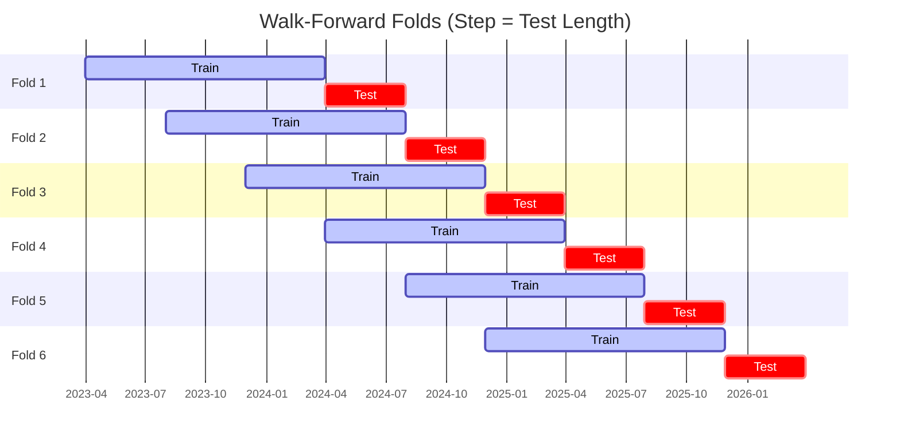

# Trading Strategy Pipeline Report

**Generated**: 2026-04-01 18:20:32

## Executive Summary

**WFO Training/Test period:** 2023-04-01 -> 2026-03-31  
**YTD performance window:** 2025-04-02 -> 2026-04-02  
**Coins:** 22

| | WFO Full Range | YTD |
|-|----------------|--------|
| Strategy CAGR | -0.15% | -0.60% |
| BTC buy & hold CAGR | -0.01% ❌ | -0.10% ❌ |
| S&P 500 CAGR | 19.71% ❌ | 17.42% ❌ |
| Strategy Sharpe | -0.58 | -0.34 |
| Max Drawdown | -0.45% | -1.77% |
| Total Trades | 13 | 17 |
| Win Rate | 0.00% | 35.29% |

## Result Validation (Training/Test Data)
**Period: 2023-04-01 -> 2026-03-31** — WFO-selected parameters replayed on the full training/test range.

### Combined Portfolio Performance

| Metric | Strategy | BTC (buy & hold) | S&P 500 (SPY) |
|--------|----------|------------------|---------------|
| Total Return | -0.45% | -0.04% | 71.50% |
| CAGR | -0.15% | -0.01% | 19.71% |
| Sharpe Ratio | -0.5774 | -0.0196 | 1.1606 |
| Max Drawdown | -0.45% | -0.70% | -14.53% |
| Total Trades | 13 | 1 | 1 |
| Win Rate | 0.00% | - | - |

## YTD Performance
**Period: 2025-04-02 -> 2026-04-02** — WFO-selected parameters replayed on the YTD window, no re-optimization.

| Metric | Strategy | BTC (buy & hold) | S&P 500 (SPY) |
|--------|----------|------------------|---------------|
| Total Return | -0.60% | -0.10% | 17.40% |
| CAGR | -0.60% | -0.10% | 17.42% |
| Sharpe Ratio | -0.3424 | -0.0126 | 1.0016 |
| Max Drawdown | -1.77% | -2.58% | -12.05% |
| Total Trades | 17 | 1 | 1 |
| Win Rate | 35.29% | - | - |

## Per-Coin Strategy Selection (WFO)

Best performing strategy per coin based on robustness scores (highest first).

| Symbol | Strategy | Selection | Robustness Score |
|--------|----------|-----------|------------------|
| ETH-USD | psar_adx+fixed_sl_tp | wfo_robustness | 0.9550 |
| TAO-USD | rsi_reversal+atr_trailing | wfo_robustness | 0.6893 |
| SPX-USD | psar_adx+fixed_sl_tp | wfo_robustness | 0.5866 |
| CRV-USD | psar_adx+atr_trailing | wfo_robustness | 0.5664 |
| XMR-USD | rsi_reversal+atr_trailing | wfo_robustness | 0.4862 |
| ALGO-USD | ema_cross+fixed_sl_tp | wfo_robustness | 0.3698 |
| SUI-USD | psar_adx+trailing_stop | wfo_robustness | 0.3680 |
| XRP-USD | supertrend_flip+atr_trailing | wfo_robustness | 0.3612 |
| DASH-USD | rsi_reversal+atr_trailing | wfo_robustness | 0.3607 |
| WIF-USD | psar_adx+fixed_sl_tp | wfo_robustness | 0.3152 |
| DOGE-USD | rsi_reversal+fixed_sl_tp | wfo_robustness | 0.3004 |
| TRX-USD | rsi_reversal+fixed_sl_tp | wfo_robustness | 0.2802 |
| AAVE-USD | supertrend_flip+atr_trailing | wfo_robustness | 0.2644 |
| XCN-USD | psar_adx+fixed_sl_tp | wfo_robustness | 0.2519 |
| NEAR-USD | rsi_reversal+atr_trailing | wfo_robustness | 0.2482 |
| LINK-USD | rsi_reversal+atr_trailing | wfo_robustness | 0.2418 |
| ADA-USD | rsi_reversal+fixed_sl_tp | wfo_robustness | 0.2357 |
| XLM-USD | rsi_reversal+fixed_sl_tp | wfo_robustness | 0.2274 |
| TRUMP-USD | psar_adx+atr_trailing | wfo_robustness | 0.2037 |
| AKT-USD | donchian_breakout+atr_trailing | wfo_robustness | 0.1939 |
| SOL-USD | ema_cross+atr_trailing | wfo_robustness | 0.1896 |
| BTC-USD | ema_cross+atr_trailing | wfo_robustness | 0.1129 |

### WFO Fold Timeline

### WFO Out-of-Sample Sharpe — Per Fold

Per-fold OOS Sharpe for each coin's winning strategy (folds ordered as above). Negative = strategy did not generalise.

| Symbol | Strategy+Exit | IS Rob | OOS Rob | Consistency | Fold 1 | Fold 2 | Fold 3 | Fold 4 | Fold 5 | Fold 6 |
|--------|---------------|--------|---------|-------------|--------|--------|--------|--------|--------|--------|
| ETH-USD | psar_adx+fixed_sl_tp | 2.2869 | 0.4970 | 80% | 0.234 | 0.503 | -0.803 | 2.072 | 0.316 | n/a |
| XMR-USD | rsi_reversal+atr_trailing | 1.3672 | 0.4605 | 50% | -1.612 | -0.661 | 0.898 | 2.225 | -0.771 | 1.324 |
| CRV-USD | psar_adx+atr_trailing | 1.4786 | 0.4487 | 60% | -1.391 | 2.401 | 0.170 | 1.259 | -0.169 | n/a |
| DASH-USD | rsi_reversal+atr_trailing | 1.4692 | 0.0968 | 50% | -3.997 | 2.428 | 1.264 | -0.997 | -0.979 | 1.278 |
| TAO-USD | rsi_reversal+atr_trailing | 2.7983 | 0.0081 | 60% | n/a | 2.140 | -2.341 | 0.487 | -0.588 | 0.620 |
| XCN-USD | psar_adx+fixed_sl_tp | 1.5136 | -0.0399 | 33% | -2.888 | 0.818 | 3.547 | -0.663 | -1.275 | -0.199 |
| AAVE-USD | supertrend_flip+atr_trailing | 1.2583 | -0.1352 | 67% | 0.869 | 1.902 | -0.363 | 1.836 | 0.236 | -2.871 |
| SPX-USD | psar_adx+fixed_sl_tp | 2.5370 | -0.1628 | 67% | n/a | n/a | -1.421 | 0.201 | 0.338 | n/a |
| XRP-USD | supertrend_flip+atr_trailing | 2.0809 | -0.2312 | 50% | -1.051 | 3.395 | 0.156 | 0.663 | -0.893 | -1.925 |
| AKT-USD | donchian_breakout+atr_trailing | 1.5260 | -0.3443 | 50% | -5.212 | 1.822 | -2.345 | 0.359 | -0.304 | 0.185 |
| WIF-USD | psar_adx+fixed_sl_tp | 2.1516 | -0.3826 | 50% | -0.789 | 0.825 | -3.515 | 1.372 | 0.739 | -1.521 |
| SUI-USD | psar_adx+trailing_stop | 2.4977 | -0.4392 | 50% | -0.938 | 0.423 | 2.000 | -1.983 | 0.620 | -2.138 |
| ALGO-USD | ema_cross+fixed_sl_tp | 2.5620 | -0.4693 | 50% | -3.535 | 1.858 | 0.320 | 0.902 | -1.837 | -1.251 |
| TRX-USD | rsi_reversal+fixed_sl_tp | 2.2271 | -0.5094 | 50% | -1.150 | 0.204 | 0.401 | 0.156 | -1.341 | -1.071 |
| LINK-USD | rsi_reversal+atr_trailing | 2.4261 | -0.5624 | 33% | -0.951 | -0.775 | -0.573 | 0.009 | 0.814 | -2.184 |
| SOL-USD | ema_cross+atr_trailing | 2.1956 | -0.5988 | 33% | -0.520 | 1.327 | 0.339 | -0.056 | -0.540 | -2.737 |
| DOGE-USD | rsi_reversal+fixed_sl_tp | 2.8403 | -0.6051 | 33% | -1.081 | 2.128 | -1.300 | 2.213 | -1.170 | -3.179 |
| XLM-USD | rsi_reversal+fixed_sl_tp | 2.7138 | -0.7615 | 33% | -2.183 | 3.325 | -3.332 | 2.909 | -2.726 | -2.248 |
| TRUMP-USD | psar_adx+atr_trailing | 2.6573 | -0.8042 | 33% | n/a | n/a | n/a | 0.943 | -1.657 | -1.692 |
| ADA-USD | rsi_reversal+fixed_sl_tp | 2.9133 | -0.8436 | 33% | -5.226 | 3.877 | -1.070 | 0.611 | -1.322 | -2.987 |
| NEAR-USD | rsi_reversal+atr_trailing | 3.0000 | -0.8517 | 33% | -1.997 | 2.140 | -2.452 | 0.795 | -2.183 | -1.572 |
| BTC-USD | ema_cross+atr_trailing | 2.7371 | -1.1265 | 33% | -2.967 | 0.143 | -2.935 | -0.383 | 0.221 | -2.616 |

## Full-Period Performance (Per-Coin)

Performance metrics from running WFO-selected parameters on full-range data.

| Symbol | Strategy | Exit | Selection | Return % | Sharpe | Max DD % | Trades | Win Rate % |
|--------|----------|------|-----------|----------|--------|----------|--------|-----------|
| TRX-USD | rsi_reversal | fixed_sl_tp | wfo_robustness | 0.00% | 0.0000 | 0.00% | 0 | 0.00% |
| ADA-USD | rsi_reversal | fixed_sl_tp | wfo_robustness | -0.07% | -0.5688 | -0.07% | 1 | 0.00% |
| BTC-USD | ema_cross | atr_trailing | wfo_robustness | -0.07% | -0.5688 | -0.07% | 1 | 0.00% |
| DOGE-USD | rsi_reversal | fixed_sl_tp | wfo_robustness | -0.07% | -0.5688 | -0.07% | 1 | 0.00% |
| ETH-USD | psar_adx | fixed_sl_tp | wfo_robustness | -0.07% | -0.5688 | -0.07% | 1 | 0.00% |
| LINK-USD | rsi_reversal | atr_trailing | wfo_robustness | -0.07% | -0.5688 | -0.07% | 1 | 0.00% |
| NEAR-USD | rsi_reversal | atr_trailing | wfo_robustness | -0.07% | -0.5688 | -0.07% | 1 | 0.00% |
| SOL-USD | ema_cross | atr_trailing | wfo_robustness | -0.07% | -0.5688 | -0.07% | 1 | 0.00% |
| SUI-USD | psar_adx | trailing_stop | wfo_robustness | -0.07% | -0.5688 | -0.07% | 1 | 0.00% |
| TAO-USD | rsi_reversal | atr_trailing | wfo_robustness | -0.07% | -0.5688 | -0.07% | 1 | 0.00% |
| TRUMP-USD | psar_adx | atr_trailing | wfo_robustness | -0.07% | -0.5688 | -0.07% | 1 | 0.00% |
| XLM-USD | rsi_reversal | fixed_sl_tp | wfo_robustness | -0.07% | -0.5688 | -0.07% | 1 | 0.00% |
| XMR-USD | rsi_reversal | atr_trailing | wfo_robustness | -0.07% | -0.5688 | -0.07% | 1 | 0.00% |
| XRP-USD | supertrend_flip | atr_trailing | wfo_robustness | -0.07% | -0.5688 | -0.07% | 1 | 0.00% |

---

*For pipeline methodology, fold structure, and benchmark definitions see [docs/UNIFIED_PIPELINE.md](../docs/UNIFIED_PIPELINE.md).*

---

*Report generated by ggTrader Pipeline*