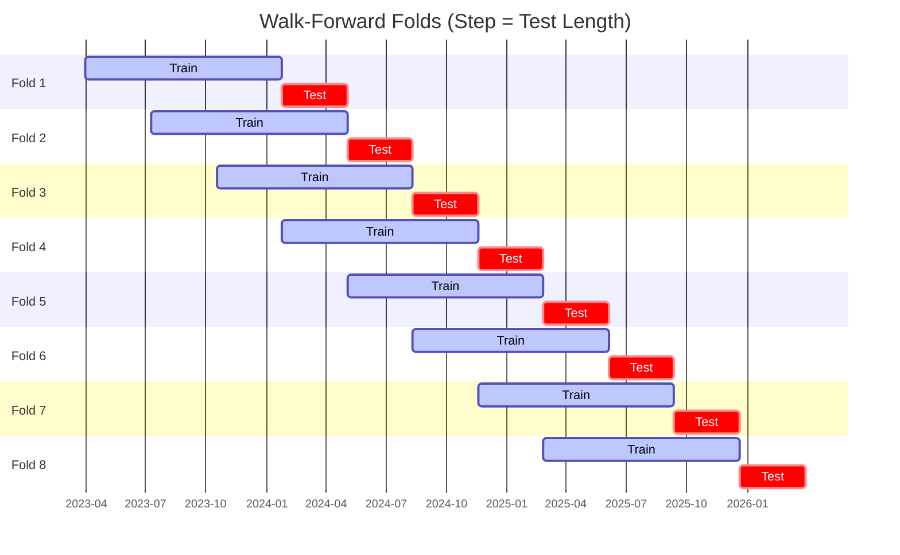

# Trading Strategy Pipeline Report

**Generated**: 2026-04-01 23:51:27

## Executive Summary

**WFO Training/Test period:** 2023-04-01 -> 2026-03-31  
**YTD performance window:** 2025-04-02 -> 2026-04-02  
**Coins:** 33

| | WFO Full Range | YTD |
|-|----------------|--------|
| Strategy CAGR | 15.15% | 27.41% |
| BTC buy & hold CAGR | 32.72% ❌ | -22.33% ✅ |
| S&P 500 CAGR | 19.71% ❌ | 27.85% ❌ |
| Strategy Sharpe | 0.83 | 1.28 |
| Max Drawdown | -23.10% | -12.25% |
| Total Trades | 454 | 121 |
| Win Rate | 33.26% | 38.02% |

## Result Validation (Training/Test Data)
**Period: 2023-04-01 -> 2026-03-31** — WFO-selected parameters replayed on the full training/test range.

### Combined Portfolio Performance

| Metric | Strategy | BTC (buy & hold) | S&P 500 (SPY) |
|--------|----------|------------------|---------------|
| Total Return | 52.66% | 133.63% | 71.50% |
| CAGR | 15.15% | 32.72% | 19.71% |
| Sharpe Ratio | 0.8306 | 0.8464 | 1.1606 |
| Max Drawdown | -23.10% | -49.89% | -14.53% |
| Total Trades | 454 | 1 | 1 |
| Win Rate | 33.26% | - | - |

## YTD Performance
**Period: 2025-04-02 -> 2026-04-02** — WFO-selected parameters replayed on the YTD window, no re-optimization.

| Metric | Strategy | BTC (buy & hold) | S&P 500 (SPY) |
|--------|----------|------------------|---------------|
| Total Return | 27.38% | -22.31% | 27.81% |
| CAGR | 27.41% | -22.33% | 27.85% |
| Sharpe Ratio | 1.2827 | -0.3829 | 1.5861 |
| Max Drawdown | -12.25% | -49.89% | -7.49% |
| Total Trades | 121 | 1 | 1 |
| Win Rate | 38.02% | - | - |

## Per-Coin Strategy Selection (WFO)

Best performing strategy per coin based on robustness scores (highest first).

| Symbol | Strategy | Selection | Robustness Score |
|--------|----------|-----------|------------------|
| TAO-USD | donchian_breakout+fixed_sl_tp | wfo_robustness | 0.9556 |
| ETH-USD | rsi_reversal+atr_trailing | wfo_robustness | 0.8728 |
| DOGE-USD | psar_adx+fixed_sl_tp | wfo_robustness | 0.8372 |
| TRX-USD | ema_cross+atr_trailing | wfo_robustness | 0.7166 |
| PENGU-USD | supertrend_flip+trailing_stop | wfo_robustness | 0.7028 |
| ALGO-USD | rsi_reversal+fixed_sl_tp | wfo_robustness | 0.6896 |
| XLM-USD | rsi_reversal+fixed_sl_tp | wfo_robustness | 0.6672 |
| RENDER-USD | rsi_reversal+atr_trailing | wfo_robustness | 0.6616 |
| PEPE-USD | rsi_reversal+trailing_stop | wfo_robustness | 0.6470 |
| ZRO-USD | psar_adx+atr_trailing | wfo_robustness | 0.6448 |
| DASH-USD | ema_cross+atr_trailing | wfo_robustness | 0.5807 |
| SPX-USD | supertrend_flip+trailing_stop | wfo_robustness | 0.5440 |
| TRUMP-USD | rsi_reversal+atr_trailing | wfo_robustness | 0.5417 |
| WIF-USD | psar_adx+trailing_stop | wfo_robustness | 0.5271 |
| ZEC-USD | macd_cross+atr_trailing | wfo_robustness | 0.5011 |
| XRP-USD | psar_adx+atr_trailing | wfo_robustness | 0.4888 |
| ADA-USD | rsi_reversal+fixed_sl_tp | wfo_robustness | 0.4695 |
| XCN-USD | psar_adx+atr_trailing | wfo_robustness | 0.4398 |
| FET-USD | rsi_reversal+atr_trailing | wfo_robustness | 0.4380 |
| AAVE-USD | rsi_reversal+atr_trailing | wfo_robustness | 0.4345 |
| ONDO-USD | rsi_reversal+atr_trailing | wfo_robustness | 0.4071 |
| NEAR-USD | supertrend_flip+fixed_sl_tp | wfo_robustness | 0.3822 |
| VIRTUAL-USD | psar_adx+trailing_stop | wfo_robustness | 0.3569 |
| SUI-USD | ema_cross+fixed_sl_tp | wfo_robustness | 0.3564 |
| CRV-USD | psar_adx+trailing_stop | wfo_robustness | 0.3382 |
| AVAX-USD | bbands_mean_reversion+atr_trailing | wfo_robustness | 0.3111 |
| LINK-USD | supertrend_flip+fixed_sl_tp | wfo_robustness | 0.2532 |
| KAS-USD | macd_cross+atr_trailing | wfo_robustness | 0.2476 |
| SOL-USD | rsi_reversal+atr_trailing | wfo_robustness | 0.2166 |
| XMR-USD | donchian_breakout+atr_trailing | wfo_robustness | 0.2043 |
| BTC-USD | psar_adx+fixed_sl_tp | wfo_robustness | 0.1924 |
| BNB-USD | supertrend_flip+fixed_sl_tp | wfo_robustness | 0.1526 |
| VVV-USD | ema_cross+atr_trailing | wfo_robustness | 0.1504 |

### WFO Fold Timeline

### WFO Out-of-Sample Sharpe — Per Fold

Per-fold OOS Sharpe for each coin's winning strategy (folds ordered as above). Negative = strategy did not generalise.

| Symbol | Strategy+Exit | IS Rob | OOS Rob | Consistency | Fold 1 | Fold 2 | Fold 3 | Fold 4 | Fold 5 | Fold 6 | Fold 7 | Fold 8 |
|--------|---------------|--------|---------|-------------|--------|--------|--------|--------|--------|--------|--------|--------|
| TRX-USD | ema_cross+atr_trailing | 1.2364 | 0.6911 | 75% | 0.829 | -0.748 | 1.020 | 0.952 | 0.893 | 1.973 | -1.980 | 2.674 |
| ETH-USD | rsi_reversal+atr_trailing | 1.7950 | 0.6862 | 75% | 0.718 | 0.172 | 1.045 | -0.326 | 2.888 | 4.024 | -2.109 | 0.387 |
| TAO-USD | donchian_breakout+fixed_sl_tp | 2.2909 | 0.6376 | 71% | n/a | 0.367 | 2.311 | -1.652 | 0.752 | 0.492 | -0.524 | 2.869 |
| DASH-USD | ema_cross+atr_trailing | 1.3082 | 0.5385 | 62% | -0.365 | -1.065 | 1.225 | 2.844 | -1.350 | 0.832 | 0.394 | 1.281 |
| DOGE-USD | psar_adx+fixed_sl_tp | 2.4890 | 0.3772 | 67% | 0.493 | n/a | 3.749 | -2.498 | -0.922 | 1.448 | n/a | 0.807 |
| PENGU-USD | supertrend_flip+trailing_stop | 2.5533 | 0.3552 | 50% | n/a | n/a | n/a | n/a | 2.461 | 3.367 | -2.329 | -0.687 |
| WIF-USD | psar_adx+trailing_stop | 1.2812 | 0.3423 | 71% | 3.698 | 1.206 | 0.191 | -0.567 | 1.299 | n/a | -0.527 | 0.282 |
| ALGO-USD | rsi_reversal+fixed_sl_tp | 2.1621 | 0.3120 | 62% | -2.753 | -5.235 | 3.001 | 0.620 | 1.107 | 0.232 | -0.535 | 1.948 |
| ZEC-USD | macd_cross+atr_trailing | 1.4791 | 0.2761 | 62% | 1.057 | 2.538 | 2.058 | -0.962 | 1.715 | -1.624 | 2.167 | -1.600 |
| XCN-USD | psar_adx+atr_trailing | 1.6179 | 0.2115 | 50% | 0.295 | -2.675 | -1.209 | 3.314 | -1.472 | -0.258 | 0.024 | 1.890 |
| CRV-USD | psar_adx+trailing_stop | 1.0960 | 0.1766 | 57% | -2.943 | -0.898 | 0.168 | 1.164 | -1.542 | 1.795 | n/a | 0.645 |
| XLM-USD | rsi_reversal+fixed_sl_tp | 2.3269 | 0.1752 | 62% | -2.603 | -1.223 | 3.221 | 1.904 | 1.128 | 2.718 | -4.008 | 0.252 |
| RENDER-USD | rsi_reversal+atr_trailing | 2.2109 | 0.1666 | 67% | n/a | n/a | 0.978 | 0.793 | -0.070 | 0.107 | -2.054 | 1.736 |
| FET-USD | rsi_reversal+atr_trailing | 1.4998 | 0.1299 | 62% | 2.854 | -1.283 | 1.023 | 1.436 | 1.375 | -0.836 | -3.888 | 2.583 |
| SUI-USD | ema_cross+fixed_sl_tp | 1.7702 | 0.0789 | 38% | -1.080 | -1.578 | 1.988 | -0.845 | -0.041 | 0.812 | -1.958 | 1.934 |
| ZRO-USD | psar_adx+atr_trailing | 2.4958 | 0.0732 | 60% | n/a | n/a | 0.105 | 2.137 | -1.689 | -2.330 | n/a | 2.009 |
| XMR-USD | donchian_breakout+atr_trailing | 0.9977 | 0.0544 | 38% | -1.988 | 0.780 | -0.444 | -0.169 | 2.889 | -1.274 | 1.738 | -1.699 |
| PEPE-USD | rsi_reversal+trailing_stop | 2.4930 | 0.0424 | 62% | 2.658 | -0.299 | 2.762 | -1.632 | 0.515 | 0.666 | -2.582 | 0.927 |
| AVAX-USD | bbands_mean_reversion+atr_trailing | 1.6876 | -0.0078 | 38% | -1.013 | -1.085 | 2.085 | 0.387 | -0.300 | 2.050 | -1.197 | -0.930 |
| XRP-USD | psar_adx+atr_trailing | 1.7233 | -0.0685 | 83% | n/a | 0.605 | 3.910 | 1.080 | n/a | 0.787 | -5.189 | 1.240 |
| VIRTUAL-USD | psar_adx+trailing_stop | 1.7879 | -0.0842 | 50% | n/a | n/a | n/a | n/a | 2.140 | -0.412 | 1.159 | -2.489 |
| TRUMP-USD | rsi_reversal+atr_trailing | 2.7009 | -0.1209 | 50% | n/a | n/a | n/a | n/a | 2.726 | -0.692 | 0.098 | -1.869 |
| AAVE-USD | rsi_reversal+atr_trailing | 2.5651 | -0.1228 | 38% | -0.283 | -1.450 | 2.005 | 2.061 | -0.451 | 0.975 | -1.733 | -1.108 |
| NEAR-USD | supertrend_flip+fixed_sl_tp | 2.1248 | -0.2033 | 50% | 0.987 | -0.749 | 3.118 | -1.181 | 0.183 | -2.213 | -0.678 | 0.340 |
| SPX-USD | supertrend_flip+trailing_stop | 2.8960 | -0.2204 | 50% | n/a | n/a | n/a | n/a | 0.434 | -0.810 | 0.655 | -1.060 |
| ONDO-USD | rsi_reversal+atr_trailing | 2.1810 | -0.2515 | 57% | n/a | -1.171 | 1.879 | 0.504 | -0.525 | 1.289 | -3.393 | 0.235 |
| SOL-USD | rsi_reversal+atr_trailing | 1.2862 | -0.2824 | 75% | 1.062 | -0.018 | 0.334 | 0.118 | 0.261 | 1.285 | -3.781 | 0.125 |
| ADA-USD | rsi_reversal+fixed_sl_tp | 2.7349 | -0.3170 | 50% | -4.646 | -3.153 | 4.790 | 1.302 | -2.075 | 1.774 | -3.345 | 0.118 |
| KAS-USD | macd_cross+atr_trailing | 1.7886 | -0.3537 | 50% | n/a | n/a | n/a | n/a | 2.210 | 0.038 | -2.979 | -0.307 |
| LINK-USD | supertrend_flip+fixed_sl_tp | 1.9394 | -0.4211 | 50% | -0.966 | 0.639 | -1.956 | 2.148 | -1.459 | 0.172 | -2.287 | 0.131 |
| BTC-USD | psar_adx+fixed_sl_tp | 2.0869 | -0.6500 | 50% | 0.196 | -2.312 | 0.629 | n/a | -5.109 | -0.617 | 1.803 | n/a |
| BNB-USD | supertrend_flip+fixed_sl_tp | 2.0240 | -0.7768 | 67% | n/a | n/a | n/a | n/a | n/a | 0.197 | 1.122 | -3.747 |
| VVV-USD | ema_cross+atr_trailing | 2.7314 | -1.0081 | 33% | n/a | n/a | n/a | n/a | n/a | -0.743 | -3.182 | 0.187 |

## Full-Period Performance (Per-Coin)

Performance metrics from running WFO-selected parameters on full-range data.

| Symbol | Strategy | Exit | Selection | Return % | Sharpe | Max DD % | Trades | Win Rate % |
|--------|----------|------|-----------|----------|--------|----------|--------|-----------|
| XRP-USD | psar_adx | atr_trailing | wfo_robustness | 21.84% | 1.0750 | -3.91% | 16 | 50.00% |
| ZEC-USD | macd_cross | atr_trailing | wfo_robustness | 30.80% | 0.8007 | -12.98% | 54 | 40.74% |
| PEPE-USD | rsi_reversal | trailing_stop | wfo_robustness | 26.25% | 0.7004 | -14.10% | 115 | 31.30% |
| ZRO-USD | psar_adx | atr_trailing | wfo_robustness | 9.30% | 0.6150 | -4.35% | 34 | 50.00% |
| XLM-USD | rsi_reversal | fixed_sl_tp | wfo_robustness | 23.84% | 0.6006 | -16.29% | 54 | 22.22% |
| NEAR-USD | supertrend_flip | fixed_sl_tp | wfo_robustness | 10.89% | 0.5678 | -7.47% | 77 | 38.96% |
| SOL-USD | rsi_reversal | atr_trailing | wfo_robustness | 12.42% | 0.5210 | -14.65% | 60 | 36.67% |
| DOGE-USD | psar_adx | fixed_sl_tp | wfo_robustness | 1.80% | 0.1725 | -4.20% | 22 | 54.55% |
| ETH-USD | rsi_reversal | atr_trailing | wfo_robustness | 1.59% | 0.1323 | -7.90% | 58 | 29.31% |
| BTC-USD | psar_adx | fixed_sl_tp | wfo_robustness | 0.69% | 0.0845 | -6.32% | 36 | 30.56% |
| TAO-USD | donchian_breakout | fixed_sl_tp | wfo_robustness | -0.18% | 0.0272 | -15.59% | 69 | 33.33% |
| FET-USD | rsi_reversal | atr_trailing | wfo_robustness | -1.05% | -0.0043 | -11.40% | 93 | 27.96% |
| SUI-USD | ema_cross | fixed_sl_tp | wfo_robustness | -6.84% | -0.2647 | -14.72% | 62 | 33.87% |
| TRX-USD | ema_cross | atr_trailing | wfo_robustness | -3.93% | -0.3015 | -6.80% | 91 | 31.87% |
| TRUMP-USD | rsi_reversal | atr_trailing | wfo_robustness | -12.03% | -0.4611 | -20.95% | 34 | 23.53% |
| LINK-USD | supertrend_flip | fixed_sl_tp | wfo_robustness | -8.64% | -0.5590 | -11.92% | 106 | 24.53% |
| ADA-USD | rsi_reversal | fixed_sl_tp | wfo_robustness | -8.36% | -0.5966 | -12.27% | 107 | 28.97% |
| XMR-USD | donchian_breakout | atr_trailing | wfo_robustness | -11.20% | -0.7349 | -11.75% | 57 | 22.81% |

---

*For pipeline methodology, fold structure, and benchmark definitions see [docs/UNIFIED_PIPELINE.md](../docs/UNIFIED_PIPELINE.md).*

---

*Report generated by ggTrader Pipeline*