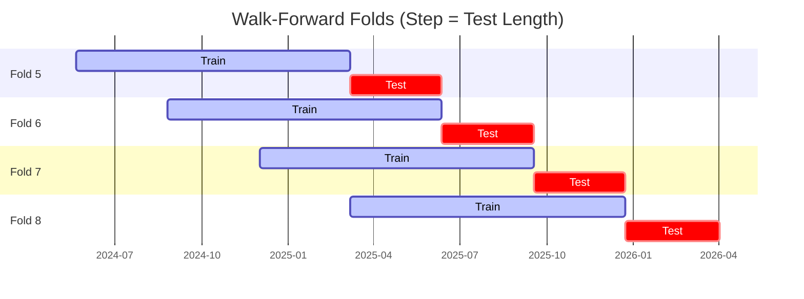

# Trading Strategy Pipeline Report

**Generated**: 2026-04-02 15:36:50

## Executive Summary

**WFO Training/Test period:** 2023-04-03 -> 2026-04-02  
**YTD performance window:** 2025-04-03 -> 2026-04-02  
**Coins:** 32

| | WFO Full Range | YTD |
|-|----------------|--------|
| Strategy CAGR | 15.46% | -10.66% |
| BTC buy & hold CAGR | 33.27% ❌ | -20.92% ✅ |
| S&P 500 CAGR | 19.71% ❌ | 27.85% ❌ |
| Strategy Sharpe | 0.56 | -0.23 |
| Max Drawdown | -44.95% | -36.12% |
| Total Trades | 339 | 94 |
| Win Rate | 33.04% | 38.30% |

## Result Validation (Training/Test Data)
**Period: 2023-04-03 -> 2026-04-02** — WFO-selected parameters replayed on the full training/test range.

### Combined Portfolio Performance

| Metric | Strategy | BTC (buy & hold) | S&P 500 (SPY) |
|--------|----------|------------------|---------------|
| Total Return | 53.89% | 136.55% | 71.50% |
| CAGR | 15.46% | 33.27% | 19.71% |
| Sharpe Ratio | 0.5586 | 0.8553 | 1.1606 |
| Max Drawdown | -44.95% | -49.89% | -14.53% |
| Total Trades | 339 | 1 | 1 |
| Win Rate | 33.04% | - | - |

## YTD Performance
**Period: 2025-04-03 -> 2026-04-02** — WFO-selected parameters replayed on the YTD window, no re-optimization.

| Metric | Strategy | BTC (buy & hold) | S&P 500 (SPY) |
|--------|----------|------------------|---------------|
| Total Return | -10.65% | -20.89% | 27.81% |
| CAGR | -10.66% | -20.92% | 27.85% |
| Sharpe Ratio | -0.2317 | -0.3474 | 1.5861 |
| Max Drawdown | -36.12% | -49.89% | -7.49% |
| Total Trades | 94 | 1 | 1 |
| Win Rate | 38.30% | - | - |

## Per-Coin Strategy Selection (WFO)

Best performing strategy per coin based on robustness scores (highest first).

| Symbol | Strategy | Selection | Robustness Score |
|--------|----------|-----------|------------------|
| PENGU-USD | psar_adx+atr_trailing | wfo_robustness | 1.3931 |
| TAO-USD | keltner_breakout+fixed_sl_tp | wfo_robustness | 0.9896 |
| PEPE-USD | psar_adx+atr_trailing | wfo_robustness | 0.7928 |
| SPX-USD | psar_adx+trailing_stop | wfo_robustness | 0.7673 |
| XRP-USD | psar_adx+atr_trailing | wfo_robustness | 0.7418 |
| NEAR-USD | rsi_reversal+atr_trailing | wfo_robustness | 0.7383 |
| RENDER-USD | rsi_reversal+atr_trailing | wfo_robustness | 0.6829 |
| XLM-USD | rsi_reversal+fixed_sl_tp | wfo_robustness | 0.6500 |
| ALGO-USD | ema_cross+fixed_sl_tp | wfo_robustness | 0.6100 |
| DOGE-USD | psar_adx+fixed_sl_tp | wfo_robustness | 0.6084 |
| ETH-USD | bbands_mean_reversion+atr_trailing | wfo_robustness | 0.5816 |
| ZEC-USD | rsi_reversal+atr_trailing | wfo_robustness | 0.5506 |
| UNI-USD | rsi_reversal+atr_trailing | wfo_robustness | 0.5477 |
| WIF-USD | psar_adx+fixed_sl_tp | wfo_robustness | 0.5303 |
| ADA-USD | rsi_reversal+fixed_sl_tp | wfo_robustness | 0.5208 |
| DASH-USD | macd_cross+atr_trailing | wfo_robustness | 0.5115 |
| TRUMP-USD | stoch_rsi_reversal+atr_trailing | wfo_robustness | 0.5045 |
| ZRO-USD | psar_adx+atr_trailing | wfo_robustness | 0.4911 |
| KAS-USD | psar_adx+atr_trailing | wfo_robustness | 0.4586 |
| VVV-USD | ema_cross+atr_trailing | wfo_robustness | 0.4538 |
| FET-USD | rsi_reversal+atr_trailing | wfo_robustness | 0.4321 |
| ONDO-USD | psar_adx+fixed_sl_tp | wfo_robustness | 0.4214 |
| LINK-USD | psar_adx+trailing_stop | wfo_robustness | 0.4021 |
| SUI-USD | psar_adx+fixed_sl_tp | wfo_robustness | 0.3999 |
| XCN-USD | psar_adx+atr_trailing | wfo_robustness | 0.3762 |
| BNB-USD | supertrend_flip+fixed_sl_tp | wfo_robustness | 0.3720 |
| TRX-USD | rsi_reversal+fixed_sl_tp | wfo_robustness | 0.2859 |
| AAVE-USD | rsi_reversal+atr_trailing | wfo_robustness | 0.2614 |
| CRV-USD | ema_cross+atr_trailing | wfo_robustness | 0.2240 |
| AVAX-USD | psar_adx+atr_trailing | wfo_robustness | 0.2099 |
| AKT-USD | bbands_mean_reversion+atr_trailing | wfo_robustness | 0.1937 |
| SOL-USD | macd_cross+atr_trailing | wfo_robustness | 0.1514 |

### WFO Fold Timeline

### WFO Out-of-Sample Sharpe — Per Fold

Per-fold OOS Sharpe for each coin's winning strategy (folds ordered as above). Negative = strategy did not generalise.

| Symbol | Strategy+Exit | IS Rob | OOS Rob | Consistency | Fold 1 | Fold 2 | Fold 3 | Fold 4 | Fold 5 | Fold 6 | Fold 7 | Fold 8 |
|--------|---------------|--------|---------|-------------|--------|--------|--------|--------|--------|--------|--------|--------|
| PENGU-USD | psar_adx+atr_trailing | 1.5456 | 1.3110 | 100% | n/a | n/a | n/a | n/a | 2.759 | 1.806 | n/a | 0.380 |
| XRP-USD | psar_adx+atr_trailing | 1.4911 | 0.6496 | 71% | -0.965 | 0.167 | 3.325 | 1.155 | -1.019 | 0.787 | n/a | 1.151 |
| PEPE-USD | psar_adx+atr_trailing | 1.4639 | 0.5779 | 86% | 2.891 | n/a | 1.237 | 0.429 | 0.882 | -0.435 | 0.581 | 0.666 |
| ETH-USD | bbands_mean_reversion+atr_trailing | 1.0631 | 0.5288 | 75% | 1.385 | 0.174 | 1.136 | -0.589 | 2.521 | 3.325 | -2.333 | 0.387 |
| DOGE-USD | psar_adx+fixed_sl_tp | 1.6113 | 0.5117 | 57% | 0.132 | n/a | 3.749 | -2.523 | -0.922 | 2.745 | -0.249 | 1.271 |
| TAO-USD | keltner_breakout+fixed_sl_tp | 2.7916 | 0.4344 | 71% | n/a | 0.367 | 2.311 | -2.060 | 0.752 | 0.223 | -1.256 | 2.869 |
| NEAR-USD | rsi_reversal+atr_trailing | 2.1957 | 0.3981 | 62% | -0.527 | -1.151 | 2.339 | -1.194 | 1.136 | 0.467 | 0.908 | 0.438 |
| UNI-USD | rsi_reversal+atr_trailing | 1.6052 | 0.3775 | 57% | -0.503 | 0.519 | 1.464 | 1.721 | -0.318 | 2.254 | -1.678 | n/a |
| DASH-USD | macd_cross+atr_trailing | 1.3336 | 0.3768 | 62% | -4.470 | -0.770 | 1.349 | 2.562 | -1.450 | 0.900 | 0.732 | 0.992 |
| WIF-USD | psar_adx+fixed_sl_tp | 1.4081 | 0.3295 | 67% | 3.704 | n/a | -1.181 | n/a | 1.301 | -1.841 | 0.657 | 1.312 |
| SPX-USD | psar_adx+trailing_stop | 2.0891 | 0.3280 | 75% | n/a | n/a | n/a | -1.983 | 0.010 | 0.015 | 2.506 | n/a |
| XLM-USD | rsi_reversal+fixed_sl_tp | 2.1663 | 0.2248 | 62% | -2.603 | -1.223 | 2.988 | 1.384 | 1.128 | 2.833 | -4.643 | 1.401 |
| RENDER-USD | rsi_reversal+atr_trailing | 2.2456 | 0.1917 | 67% | n/a | n/a | 1.558 | 0.799 | 0.071 | -0.064 | -2.054 | 1.639 |
| FET-USD | rsi_reversal+atr_trailing | 1.4434 | 0.1477 | 62% | 2.609 | -3.261 | 1.023 | 1.578 | 1.168 | -0.792 | -3.330 | 2.890 |
| ALGO-USD | ema_cross+fixed_sl_tp | 2.6215 | 0.0899 | 50% | -4.320 | -0.625 | 3.862 | -3.194 | 0.628 | 0.223 | -1.039 | 1.964 |
| TRUMP-USD | stoch_rsi_reversal+atr_trailing | 2.1563 | 0.0808 | 50% | n/a | n/a | n/a | n/a | 2.726 | -1.010 | 0.265 | -0.961 |
| LINK-USD | psar_adx+trailing_stop | 1.7842 | 0.0291 | 50% | 1.794 | -1.135 | 1.303 | -0.029 | -3.053 | -0.045 | 0.425 | 1.280 |
| ZEC-USD | rsi_reversal+atr_trailing | 2.4851 | 0.0171 | 50% | 1.491 | -0.755 | -1.739 | 0.234 | 1.254 | -2.315 | 2.706 | -0.778 |
| CRV-USD | ema_cross+atr_trailing | 1.3651 | -0.0864 | 38% | -2.295 | -1.257 | 4.089 | -2.233 | 0.773 | 1.370 | -0.178 | -1.606 |
| XCN-USD | psar_adx+atr_trailing | 1.7038 | -0.1123 | 62% | 0.119 | -0.918 | 0.345 | 3.025 | -5.972 | 0.807 | -0.500 | 1.536 |
| KAS-USD | psar_adx+atr_trailing | 2.1515 | -0.1506 | 60% | n/a | n/a | n/a | -1.667 | 2.806 | 0.831 | -3.747 | 1.009 |
| SUI-USD | psar_adx+fixed_sl_tp | 2.2017 | -0.2012 | 50% | -1.378 | -1.180 | 1.361 | 0.937 | 0.877 | -0.862 | -1.751 | 0.094 |
| ADA-USD | rsi_reversal+fixed_sl_tp | 2.8289 | -0.2413 | 50% | -3.521 | -2.766 | 4.790 | 0.792 | -2.075 | 1.462 | -3.345 | 0.787 |
| ZRO-USD | psar_adx+atr_trailing | 2.4619 | -0.2463 | 60% | n/a | n/a | 0.283 | 1.080 | -1.689 | n/a | -2.887 | 1.901 |
| AKT-USD | bbands_mean_reversion+atr_trailing | 1.5770 | -0.2883 | 38% | -2.383 | -5.553 | 1.578 | -1.157 | -0.479 | 0.332 | -2.703 | 2.816 |
| AVAX-USD | psar_adx+atr_trailing | 1.7478 | -0.3333 | 38% | -2.411 | -3.103 | 2.333 | -3.226 | 1.605 | 1.101 | -0.202 | -1.496 |
| ONDO-USD | psar_adx+fixed_sl_tp | 2.4025 | -0.3383 | 57% | -0.194 | 3.445 | 1.327 | -2.975 | n/a | 0.488 | -3.096 | 0.652 |
| SOL-USD | macd_cross+atr_trailing | 1.3504 | -0.3544 | 50% | 0.102 | -0.830 | 1.179 | -2.276 | 0.261 | 2.648 | -3.378 | -0.317 |
| VVV-USD | ema_cross+atr_trailing | 2.7505 | -0.3641 | 50% | n/a | n/a | n/a | n/a | 1.868 | -0.038 | -4.043 | 0.861 |
| AAVE-USD | rsi_reversal+atr_trailing | 2.1574 | -0.4048 | 38% | -3.393 | -1.171 | 0.712 | 1.381 | -0.332 | 0.904 | -1.882 | -1.107 |
| BNB-USD | supertrend_flip+fixed_sl_tp | 2.1841 | -0.4130 | 67% | n/a | n/a | n/a | n/a | n/a | 1.075 | 0.941 | -3.043 |
| TRX-USD | rsi_reversal+fixed_sl_tp | 2.5538 | -0.5473 | 38% | 2.723 | -0.884 | 0.497 | 1.184 | -1.503 | -0.205 | -2.562 | -0.897 |

## Full-Period Performance (Per-Coin)

Performance metrics from running WFO-selected parameters on full-range data.

| Symbol | Strategy | Exit | Selection | Return % | Sharpe | Max DD % | Trades | Win Rate % |
|--------|----------|------|-----------|----------|--------|----------|--------|-----------|
| ZEC-USD | rsi_reversal | atr_trailing | wfo_robustness | 29.92% | 0.7812 | -12.98% | 55 | 40.00% |
| XLM-USD | rsi_reversal | fixed_sl_tp | wfo_robustness | 24.12% | 0.6056 | -16.29% | 54 | 20.37% |
| XRP-USD | psar_adx | atr_trailing | wfo_robustness | 24.01% | 0.4082 | -33.85% | 1 | 100.00% |
| SOL-USD | macd_cross | atr_trailing | wfo_robustness | 26.05% | 0.3956 | -43.25% | 1 | 100.00% |
| PEPE-USD | psar_adx | atr_trailing | wfo_robustness | 8.97% | 0.3298 | -12.49% | 120 | 35.00% |
| TRX-USD | rsi_reversal | fixed_sl_tp | wfo_robustness | 1.38% | 0.1245 | -6.02% | 68 | 32.35% |
| SUI-USD | psar_adx | fixed_sl_tp | wfo_robustness | 1.68% | 0.1181 | -9.22% | 50 | 42.00% |
| ETH-USD | bbands_mean_reversion | atr_trailing | wfo_robustness | 1.41% | 0.0958 | -14.29% | 1 | 100.00% |
| NEAR-USD | rsi_reversal | atr_trailing | wfo_robustness | -4.73% | -0.0120 | -27.64% | 1 | 0.00% |
| FET-USD | rsi_reversal | atr_trailing | wfo_robustness | -1.97% | -0.0428 | -11.40% | 94 | 28.72% |
| TAO-USD | keltner_breakout | fixed_sl_tp | wfo_robustness | -1.79% | -0.0455 | -13.68% | 74 | 36.49% |
| AVAX-USD | psar_adx | atr_trailing | wfo_robustness | -5.06% | -0.0519 | -24.82% | 1 | 0.00% |
| DOGE-USD | psar_adx | fixed_sl_tp | wfo_robustness | -3.33% | -0.1463 | -12.86% | 78 | 34.62% |
| TRUMP-USD | stoch_rsi_reversal | atr_trailing | wfo_robustness | -12.37% | -0.4850 | -21.25% | 39 | 20.51% |
| LINK-USD | psar_adx | trailing_stop | wfo_robustness | -8.36% | -0.5142 | -10.38% | 73 | 36.99% |
| ADA-USD | rsi_reversal | fixed_sl_tp | wfo_robustness | -8.62% | -0.6139 | -12.34% | 107 | 28.97% |

---

*For pipeline methodology, fold structure, and benchmark definitions see [docs/UNIFIED_PIPELINE.md](../docs/UNIFIED_PIPELINE.md).*

---

*Report generated by ggTrader Pipeline*