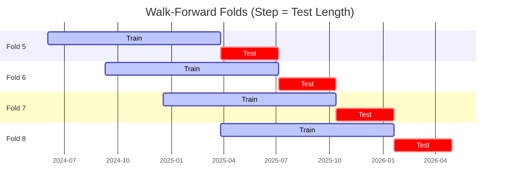

# Trading Strategy Pipeline Report

**Generated**: 2026-05-01 02:26:47

## Executive Summary

**WFO Training/Test period:** 2023-05-01 -> 2026-04-30  
**YTD performance window:** 2025-05-01 -> 2026-05-01  
**Coins:** 30

| | WFO Full Range | YTD |
|-|----------------|--------|
| Strategy CAGR | 33.47% | 48.46% |
| BTC buy & hold CAGR | 37.89% ❌ | -21.34% ✅ |
| S&P 500 CAGR | 19.27% ✅ | 28.29% ✅ |
| Strategy Sharpe | 1.15 | 1.24 |
| Max Drawdown | -33.32% | -23.76% |
| Total Trades | 651 | 193 |
| Win Rate | 32.41% | 35.75% |

## Result Validation (Training/Test Data)
**Period: 2023-05-01 -> 2026-04-30** — WFO-selected parameters replayed on the full training/test range.

### Combined Portfolio Performance

| Metric | Strategy | BTC (buy & hold) | S&P 500 (SPY) |
|--------|----------|------------------|---------------|
| Total Return | 137.60% | 162.02% | 69.61% |
| CAGR | 33.47% | 37.89% | 19.27% |
| Sharpe Ratio | 1.1521 | 0.9312 | 1.1446 |
| Max Drawdown | -33.32% | -49.89% | -14.53% |
| Total Trades | 651 | 1 | 1 |
| Win Rate | 32.41% | - | - |

## YTD Performance
**Period: 2025-05-01 -> 2026-05-01** — WFO-selected parameters replayed on the YTD window, no re-optimization.

| Metric | Strategy | BTC (buy & hold) | S&P 500 (SPY) |
|--------|----------|------------------|---------------|
| Total Return | 48.40% | -21.32% | 28.26% |
| CAGR | 48.46% | -21.34% | 28.29% |
| Sharpe Ratio | 1.2378 | -0.3825 | 2.5051 |
| Max Drawdown | -23.76% | -49.89% | -2.98% |
| Total Trades | 193 | 1 | 1 |
| Win Rate | 35.75% | - | - |

## Per-Coin Strategy Selection (WFO)

Best performing strategy per coin based on robustness scores (highest first).

| Symbol | Strategy | Selection | Robustness Score |
|--------|----------|-----------|------------------|
| PENGU-USD | supertrend_flip+atr_trailing | wfo_robustness | 1.7154 |
| ZEC-USD | supertrend_flip+atr_trailing | wfo_robustness | 0.9324 |
| SUI-USD | psar_adx+fixed_sl_tp | wfo_robustness | 0.7346 |
| SPX-USD | psar_adx+atr_trailing | wfo_robustness | 0.7081 |
| TAO-USD | ema_cross+atr_trailing | wfo_robustness | 0.6839 |
| NEAR-USD | supertrend_flip+fixed_sl_tp | wfo_robustness | 0.6363 |
| ENJ-USD | psar_adx+fixed_sl_tp | wfo_robustness | 0.6154 |
| FET-USD | supertrend_flip+fixed_sl_tp | wfo_robustness | 0.6002 |
| XLM-USD | keltner_breakout+fixed_sl_tp | wfo_robustness | 0.5897 |
| BNB-USD | psar_adx+trailing_stop | wfo_robustness | 0.5856 |
| ALGO-USD | keltner_breakout+atr_trailing | wfo_robustness | 0.5781 |
| RENDER-USD | psar_adx+fixed_sl_tp | wfo_robustness | 0.5528 |
| ZRO-USD | psar_adx+atr_trailing | wfo_robustness | 0.5423 |
| VVV-USD | ema_cross+atr_trailing | wfo_robustness | 0.5423 |
| XMR-USD | donchian_breakout+atr_trailing | wfo_robustness | 0.5182 |
| DOGE-USD | psar_adx+atr_trailing | wfo_robustness | 0.5086 |
| DASH-USD | donchian_breakout+atr_trailing | wfo_robustness | 0.5032 |
| TRUMP-USD | macd_cross+atr_trailing | wfo_robustness | 0.4644 |
| PEPE-USD | rsi_reversal+trailing_stop | wfo_robustness | 0.4549 |
| XCN-USD | supertrend_flip+trailing_stop | wfo_robustness | 0.4468 |
| AAVE-USD | rsi_reversal+atr_trailing | wfo_robustness | 0.4184 |
| LINK-USD | rsi_reversal+trailing_stop | wfo_robustness | 0.4182 |
| FARTCOIN-USD | psar_adx+atr_trailing | wfo_robustness | 0.4078 |
| TRX-USD | donchian_breakout+atr_trailing | wfo_robustness | 0.4029 |
| XRP-USD | rsi_reversal+atr_trailing | wfo_robustness | 0.3784 |
| ETH-USD | bbands_mean_reversion+atr_trailing | wfo_robustness | 0.3716 |
| SOL-USD | stoch_rsi_reversal+atr_trailing | wfo_robustness | 0.3689 |
| UNI-USD | psar_adx+atr_trailing | wfo_robustness | 0.3506 |
| ONDO-USD | supertrend_flip+atr_trailing | wfo_robustness | 0.3261 |
| BTC-USD | bbands_mean_reversion+atr_trailing | wfo_robustness | 0.1988 |

### WFO Fold Timeline

### WFO Out-of-Sample Sharpe — Per Fold

Per-fold OOS Sharpe for each coin's winning strategy (folds ordered as above). Negative = strategy did not generalise.

| Symbol | Strategy+Exit | IS Rob | OOS Rob | Consistency | Fold 1 | Fold 2 | Fold 3 | Fold 4 | Fold 5 | Fold 6 | Fold 7 | Fold 8 |
|--------|---------------|--------|---------|-------------|--------|--------|--------|--------|--------|--------|--------|--------|
| PENGU-USD | supertrend_flip+atr_trailing | 2.0750 | 1.5218 | 100% | n/a | n/a | n/a | n/a | 3.184 | 1.624 | 0.140 | 2.319 |
| ALGO-USD | keltner_breakout+atr_trailing | 1.1159 | 0.7099 | 57% | -0.287 | -3.420 | 2.597 | n/a | -0.584 | 1.337 | 2.036 | 1.271 |
| ZEC-USD | supertrend_flip+atr_trailing | 1.7530 | 0.6389 | 88% | 0.300 | 0.233 | 0.234 | 0.481 | 0.232 | 1.469 | -0.098 | 1.570 |
| SUI-USD | psar_adx+fixed_sl_tp | 1.7157 | 0.5146 | 71% | -4.497 | 0.138 | 0.804 | n/a | 0.877 | 2.714 | 0.805 | -0.181 |
| DASH-USD | donchian_breakout+atr_trailing | 1.3981 | 0.4858 | 50% | -0.100 | -2.022 | 2.673 | -2.972 | -0.419 | 2.464 | 0.703 | 1.728 |
| XMR-USD | donchian_breakout+atr_trailing | 1.2067 | 0.4594 | 62% | 0.963 | -1.760 | 1.110 | -1.142 | 3.069 | 0.506 | 1.581 | -0.676 |
| RENDER-USD | psar_adx+fixed_sl_tp | 1.2117 | 0.4300 | 71% | n/a | 0.753 | 2.161 | -4.806 | -1.367 | 0.628 | 1.221 | 3.251 |
| SPX-USD | psar_adx+atr_trailing | 1.8717 | 0.3330 | 75% | n/a | n/a | n/a | n/a | 2.531 | -1.903 | 0.184 | 0.966 |
| XLM-USD | keltner_breakout+fixed_sl_tp | 2.1064 | 0.3174 | 50% | -2.408 | -0.790 | 3.693 | -2.386 | 0.617 | 2.524 | -2.071 | 1.800 |
| XRP-USD | rsi_reversal+atr_trailing | 0.9515 | 0.2975 | 62% | -0.344 | 0.174 | 3.959 | -0.540 | -1.476 | 0.458 | 0.864 | 0.149 |
| ZRO-USD | psar_adx+atr_trailing | 1.5174 | 0.2953 | 67% | n/a | n/a | 1.795 | -3.464 | -1.709 | 1.783 | 0.516 | 1.982 |
| ENJ-USD | psar_adx+fixed_sl_tp | 1.8051 | 0.2904 | 67% | 0.092 | n/a | 2.714 | -0.392 | 0.853 | 2.591 | -2.590 | n/a |
| TRX-USD | donchian_breakout+atr_trailing | 1.0823 | 0.2797 | 62% | -3.950 | -2.001 | 1.266 | -2.374 | 1.078 | 1.202 | 0.193 | 1.995 |
| ETH-USD | bbands_mean_reversion+atr_trailing | 0.9720 | 0.2721 | 62% | 1.104 | -4.115 | 1.314 | -1.567 | 2.011 | 3.709 | -2.230 | 0.765 |
| BNB-USD | psar_adx+trailing_stop | 2.1753 | 0.2702 | 50% | n/a | n/a | n/a | n/a | -1.676 | 1.993 | 2.584 | -1.615 |
| TAO-USD | ema_cross+atr_trailing | 2.2841 | 0.1730 | 67% | n/a | n/a | 2.023 | -2.652 | 0.674 | -0.597 | 0.180 | 1.326 |
| SOL-USD | stoch_rsi_reversal+atr_trailing | 1.1687 | 0.1603 | 62% | 0.274 | -0.878 | 2.274 | 0.226 | 0.254 | 1.871 | -1.055 | -0.705 |
| XCN-USD | supertrend_flip+trailing_stop | 1.7803 | 0.1412 | 50% | -2.775 | -0.472 | 0.752 | 3.828 | -2.490 | 0.232 | -1.911 | 2.278 |
| NEAR-USD | supertrend_flip+fixed_sl_tp | 2.3374 | 0.1033 | 62% | 0.444 | 1.629 | 1.079 | -1.574 | -0.155 | -0.974 | 0.460 | 0.752 |
| DOGE-USD | psar_adx+atr_trailing | 2.1906 | 0.0723 | 50% | 1.031 | -2.437 | 3.337 | -2.719 | -1.561 | 3.004 | 0.286 | -0.512 |
| FET-USD | supertrend_flip+fixed_sl_tp | 2.2925 | 0.0504 | 62% | 0.709 | 0.894 | 0.613 | -3.141 | 1.854 | -2.251 | -0.084 | 1.904 |
| TRUMP-USD | macd_cross+atr_trailing | 2.0449 | 0.0421 | 50% | n/a | n/a | n/a | n/a | 2.562 | -1.475 | 0.269 | -0.644 |
| PEPE-USD | rsi_reversal+trailing_stop | 2.0223 | 0.0309 | 50% | 1.621 | -3.452 | 2.587 | -2.421 | -0.743 | 1.323 | 0.705 | -0.009 |
| AAVE-USD | rsi_reversal+atr_trailing | 2.0367 | 0.0297 | 43% | 0.002 | -2.490 | 3.606 | n/a | 2.063 | -0.237 | -1.679 | -0.294 |
| ONDO-USD | supertrend_flip+atr_trailing | 1.6034 | -0.0608 | 50% | n/a | n/a | 3.864 | -2.175 | -0.204 | 1.373 | -2.050 | 0.078 |
| UNI-USD | psar_adx+atr_trailing | 2.0105 | -0.0672 | 38% | -0.779 | -2.577 | 3.273 | -0.258 | 1.449 | -0.893 | 1.538 | -2.316 |
| BTC-USD | bbands_mean_reversion+atr_trailing | 1.6303 | -0.3022 | 38% | 1.466 | -1.587 | 2.828 | -1.858 | 2.656 | -0.392 | -3.403 | -0.206 |
| VVV-USD | ema_cross+atr_trailing | 2.7579 | -0.4582 | 75% | n/a | n/a | n/a | n/a | 1.423 | 0.128 | -3.785 | 0.425 |
| FARTCOIN-USD | psar_adx+atr_trailing | 2.7545 | -0.4794 | 50% | n/a | n/a | n/a | n/a | 0.799 | n/a | n/a | -1.498 |
| LINK-USD | rsi_reversal+trailing_stop | 2.8967 | -0.5304 | 50% | 0.557 | -2.143 | 1.188 | 0.012 | -2.263 | 0.573 | -0.626 | -1.324 |

## Full-Period Performance (Per-Coin)

Performance metrics from running WFO-selected parameters on full-range data.

| Symbol | Strategy | Exit | Selection | Return % | Sharpe | Max DD % | Trades | Win Rate % |
|--------|----------|------|-----------|----------|--------|----------|--------|-----------|
| ZEC-USD | supertrend_flip | atr_trailing | wfo_robustness | 35.67% | 0.8928 | -12.98% | 53 | 43.40% |
| PEPE-USD | rsi_reversal | trailing_stop | wfo_robustness | 25.96% | 0.6921 | -14.37% | 119 | 31.93% |
| DOGE-USD | psar_adx | atr_trailing | wfo_robustness | 14.00% | 0.6920 | -8.13% | 48 | 35.42% |
| XLM-USD | keltner_breakout | fixed_sl_tp | wfo_robustness | 21.13% | 0.6142 | -15.08% | 79 | 22.78% |
| XRP-USD | rsi_reversal | atr_trailing | wfo_robustness | 15.24% | 0.5508 | -14.70% | 66 | 25.76% |
| PENGU-USD | supertrend_flip | atr_trailing | wfo_robustness | 13.85% | 0.5245 | -16.38% | 25 | 32.00% |
| BTC-USD | bbands_mean_reversion | atr_trailing | wfo_robustness | 14.81% | 0.5219 | -15.61% | 1 | 100.00% |
| TRX-USD | donchian_breakout | atr_trailing | wfo_robustness | 5.61% | 0.4461 | -5.62% | 59 | 37.29% |
| SOL-USD | stoch_rsi_reversal | atr_trailing | wfo_robustness | 22.53% | 0.3721 | -40.51% | 1 | 100.00% |
| ALGO-USD | keltner_breakout | atr_trailing | wfo_robustness | 8.29% | 0.3364 | -13.65% | 63 | 20.63% |
| FARTCOIN-USD | psar_adx | atr_trailing | wfo_robustness | 4.86% | 0.2451 | -7.40% | 13 | 23.08% |
| FET-USD | supertrend_flip | fixed_sl_tp | wfo_robustness | 2.10% | 0.1239 | -15.90% | 98 | 35.71% |
| SUI-USD | psar_adx | fixed_sl_tp | wfo_robustness | 1.68% | 0.1181 | -9.22% | 50 | 42.00% |
| TAO-USD | ema_cross | atr_trailing | wfo_robustness | 0.76% | 0.0722 | -14.32% | 38 | 23.68% |
| AAVE-USD | rsi_reversal | atr_trailing | wfo_robustness | -2.98% | -0.1117 | -11.14% | 50 | 36.00% |
| DASH-USD | donchian_breakout | atr_trailing | wfo_robustness | -4.43% | -0.1210 | -15.20% | 1 | 0.00% |
| XMR-USD | donchian_breakout | atr_trailing | wfo_robustness | -2.39% | -0.1409 | -7.77% | 59 | 22.03% |
| ETH-USD | bbands_mean_reversion | atr_trailing | wfo_robustness | -4.60% | -0.3682 | -7.79% | 71 | 25.35% |
| LINK-USD | rsi_reversal | trailing_stop | wfo_robustness | -14.27% | -1.0664 | -15.10% | 114 | 26.32% |

---

*For pipeline methodology, fold structure, and benchmark definitions see [docs/UNIFIED_PIPELINE.md](../docs/UNIFIED_PIPELINE.md).*

---

*Report generated by ggTrader Pipeline*