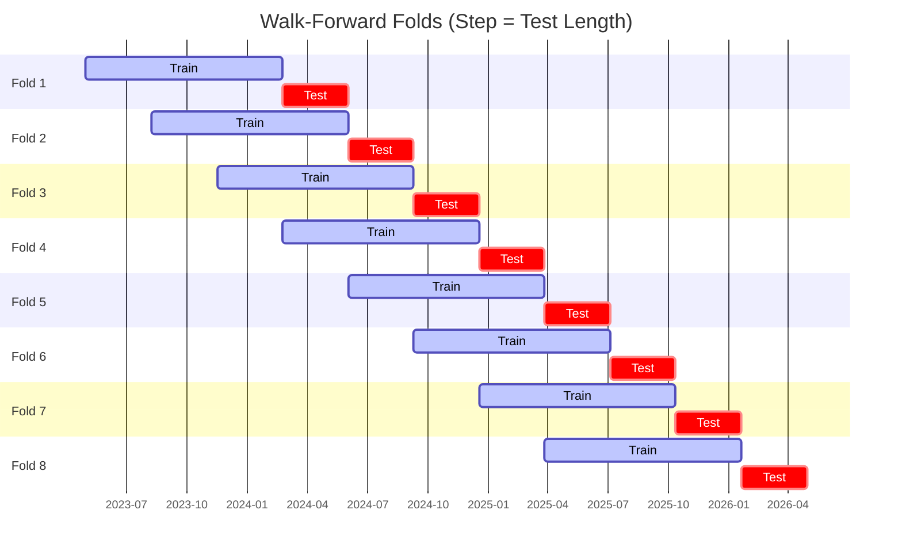

# Trading Strategy Pipeline Report

**Generated**: 2026-05-01 20:57:24

## Executive Summary

**WFO Training/Test period:** 2023-05-01 -> 2026-04-30  
**YTD performance window:** 2025-05-02 -> 2026-05-02  
**Coins:** 2

| | WFO Full Range | YTD |
|-|----------------|--------|
| Strategy CAGR | 25.72% | 2.12% |
| BTC buy & hold CAGR | 37.89% ❌ | -19.82% ✅ |
| S&P 500 CAGR | 19.27% ✅ | 28.65% ❌ |
| Strategy Sharpe | 0.86 | 0.21 |
| Max Drawdown | -40.61% | -21.22% |
| Total Trades | 46 | 26 |
| Win Rate | 36.96% | 38.46% |

## Result Validation (Training/Test Data)
**Period: 2023-05-01 -> 2026-04-30** — WFO-selected parameters replayed on the full training/test range.

### Combined Portfolio Performance

| Metric | Strategy | BTC (buy & hold) | S&P 500 (SPY) |
|--------|----------|------------------|---------------|
| Total Return | 98.63% | 162.02% | 69.61% |
| CAGR | 25.72% | 37.89% | 19.27% |
| Sharpe Ratio | 0.8617 | 0.9312 | 1.1446 |
| Max Drawdown | -40.61% | -49.89% | -14.53% |
| Total Trades | 46 | 1 | 1 |
| Win Rate | 36.96% | - | - |

## YTD Performance
**Period: 2025-05-02 -> 2026-05-02** — WFO-selected parameters replayed on the YTD window, no re-optimization.

| Metric | Strategy | BTC (buy & hold) | S&P 500 (SPY) |
|--------|----------|------------------|---------------|
| Total Return | 2.12% | -19.80% | 28.61% |
| CAGR | 2.12% | -19.82% | 28.65% |
| Sharpe Ratio | 0.2086 | -0.3354 | 2.4910 |
| Max Drawdown | -21.22% | -49.89% | -2.98% |
| Total Trades | 26 | 1 | 1 |
| Win Rate | 38.46% | - | - |

## Per-Coin Strategy Selection (WFO)

Best performing strategy per coin based on robustness scores (highest first).

| Symbol | Strategy | Selection | Robustness Score |
|--------|----------|-----------|------------------|
| ETH-USD | supertrend_flip+fixed_sl_tp | wfo_robustness | 0.3891 |
| BTC-USD | bbands_mean_reversion+atr_trailing | wfo_robustness | 0.2017 |

### WFO Fold Timeline

### WFO Out-of-Sample Sharpe — Per Fold

Per-fold OOS Sharpe for each coin's winning strategy (folds ordered as above). Negative = strategy did not generalise.

| Symbol | Strategy+Exit | IS Rob | OOS Rob | Consistency | Fold 1 | Fold 2 | Fold 3 | Fold 4 | Fold 5 | Fold 6 | Fold 7 | Fold 8 |
|--------|---------------|--------|---------|-------------|--------|--------|--------|--------|--------|--------|--------|--------|
| ETH-USD | supertrend_flip+fixed_sl_tp | 1.8790 | -0.0538 | 50% | 0.020 | -2.296 | 0.039 | -0.119 | -1.780 | 4.771 | -2.419 | 0.069 |
| BTC-USD | bbands_mean_reversion+atr_trailing | 1.6455 | -0.3019 | 38% | 1.463 | -1.550 | 2.743 | -1.847 | 2.733 | -0.430 | -3.403 | -0.206 |

## Full-Period Performance (Per-Coin)

Performance metrics from running WFO-selected parameters on full-range data.

| Symbol | Strategy | Exit | Selection | Return % | Sharpe | Max DD % | Trades | Win Rate % |
|--------|----------|------|-----------|----------|--------|----------|--------|-----------|
| BTC-USD | bbands_mean_reversion | atr_trailing | wfo_robustness | 14.81% | 0.5219 | -15.61% | 1 | 100.00% |
| ETH-USD | supertrend_flip | fixed_sl_tp | wfo_robustness | -5.92% | -0.4796 | -9.75% | 74 | 24.32% |

---

*For pipeline methodology, fold structure, and benchmark definitions see [docs/UNIFIED_PIPELINE.md](../docs/UNIFIED_PIPELINE.md).*

---

*Report generated by ggTrader Pipeline*