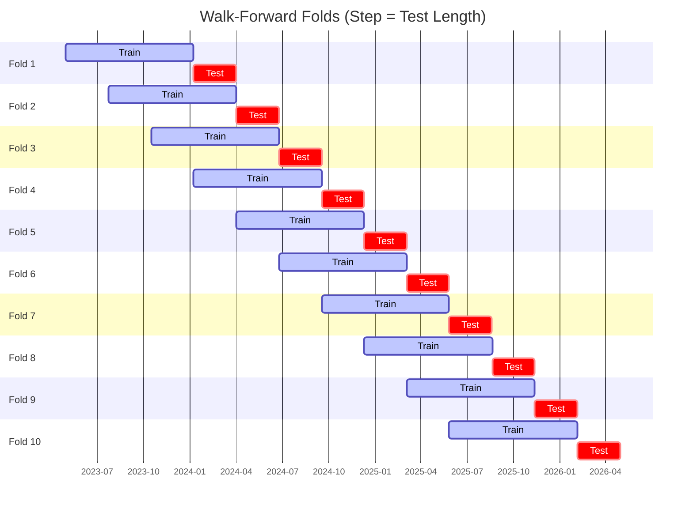

# Trading Strategy Pipeline Report

**Generated**: 2026-05-01 21:04:06

## Executive Summary

**WFO Training/Test period:** 2023-05-01 -> 2026-04-30  
**YTD performance window:** 2025-05-02 -> 2026-05-02  
**Coins:** 2

| | WFO Full Range | YTD |
|-|----------------|--------|
| Strategy CAGR | 23.98% | -8.68% |
| BTC buy & hold CAGR | 37.89% ❌ | -20.27% ✅ |
| S&P 500 CAGR | 19.27% ✅ | 21.76% ❌ |
| Strategy Sharpe | 0.81 | -0.31 |
| Max Drawdown | -41.45% | -30.40% |
| Total Trades | 51 | 16 |
| Win Rate | 37.25% | 43.75% |

## Result Validation (Training/Test Data)
**Period: 2023-05-01 -> 2026-04-30** — WFO-selected parameters replayed on the full training/test range.

### Combined Portfolio Performance

| Metric | Strategy | BTC (buy & hold) | S&P 500 (SPY) |
|--------|----------|------------------|---------------|
| Total Return | 90.48% | 162.02% | 69.61% |
| CAGR | 23.98% | 37.89% | 19.27% |
| Sharpe Ratio | 0.8108 | 0.9312 | 1.1446 |
| Max Drawdown | -41.45% | -49.89% | -14.53% |
| Total Trades | 51 | 1 | 1 |
| Win Rate | 37.25% | - | - |

## YTD Performance
**Period: 2025-05-02 -> 2026-05-02** — WFO-selected parameters replayed on the YTD window, no re-optimization.

| Metric | Strategy | BTC (buy & hold) | S&P 500 (SPY) |
|--------|----------|------------------|---------------|
| Total Return | -8.67% | -20.25% | 21.73% |
| CAGR | -8.68% | -20.27% | 21.76% |
| Sharpe Ratio | -0.3087 | -0.3494 | 2.4446 |
| Max Drawdown | -30.40% | -49.89% | -2.98% |
| Total Trades | 16 | 1 | 1 |
| Win Rate | 43.75% | - | - |

## Per-Coin Strategy Selection (WFO)

Best performing strategy per coin based on robustness scores (highest first).

| Symbol | Strategy | Selection | Robustness Score |
|--------|----------|-----------|------------------|
| ETH-USD | keltner_breakout+fixed_sl_tp | wfo_robustness | 0.4431 |
| BTC-USD | psar_adx+atr_trailing | wfo_robustness | 0.2734 |

### WFO Fold Timeline

### WFO Out-of-Sample Sharpe — Per Fold

Per-fold OOS Sharpe for each coin's winning strategy (folds ordered as above). Negative = strategy did not generalise.

| Symbol | Strategy+Exit | IS Rob | OOS Rob | Consistency | Fold 1 | Fold 2 | Fold 3 | Fold 4 | Fold 5 | Fold 6 | Fold 7 | Fold 8 | Fold 9 | Fold 10 |
|--------|---------------|--------|---------|-------------|--------|--------|--------|--------|--------|--------|--------|--------|--------|--------|
| ETH-USD | keltner_breakout+fixed_sl_tp | 1.5900 | 0.1177 | 60% | 0.354 | 1.440 | -2.497 | 1.640 | -0.130 | -0.815 | 3.988 | 0.684 | -2.630 | 0.074 |
| BTC-USD | psar_adx+atr_trailing | 2.6638 | -0.7615 | 50% | 2.530 | -2.784 | n/a | 1.719 | 0.099 | -3.828 | -2.080 | 0.195 | n/a | -1.068 |

## Full-Period Performance (Per-Coin)

Performance metrics from running WFO-selected parameters on full-range data.

| Symbol | Strategy | Exit | Selection | Return % | Sharpe | Max DD % | Trades | Win Rate % |
|--------|----------|------|-----------|----------|--------|----------|--------|-----------|
| BTC-USD | psar_adx | atr_trailing | wfo_robustness | 14.81% | 0.5219 | -15.61% | 1 | 100.00% |
| ETH-USD | keltner_breakout | fixed_sl_tp | wfo_robustness | -3.61% | -0.3213 | -8.43% | 79 | 26.58% |

---

*For pipeline methodology, fold structure, and benchmark definitions see [docs/UNIFIED_PIPELINE.md](../docs/UNIFIED_PIPELINE.md).*

---

*Report generated by ggTrader Pipeline*