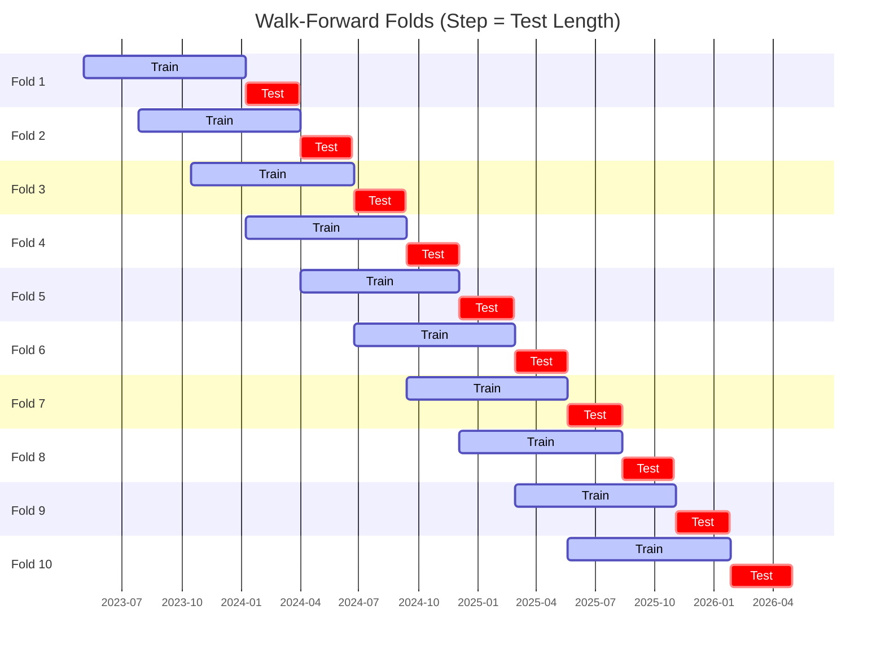

# Trading Strategy Pipeline Report

**Generated**: 2026-05-03 09:01:34

## Executive Summary

**WFO Training/Test period:** 2023-05-04 -> 2026-05-01  
**YTD performance window:** 2025-05-04 -> 2026-04-30  
**Coins:** 5

| | WFO Full Range | YTD |
|-|----------------|--------|
| Strategy CAGR | 9.18% | 10.17% |
| BTC buy & hold CAGR | n/a | n/a |
| S&P 500 CAGR | n/a | n/a |
| Strategy Sharpe | 1.08 | 1.34 |
| Max Drawdown | -11.93% | -10.57% |
| Total Trades | 28 | 12 |
| Win Rate | 60.71% | 58.33% |

## Result Validation (Training/Test Data)
**Period: 2023-05-04 -> 2026-05-01** — WFO-selected parameters replayed on the full training/test range.

### Combined Portfolio Performance

| Metric | Strategy | BTC (buy & hold) | S&P 500 (SPY) |
|--------|----------|------------------|---------------|
| Total Return | 30.03% | n/a | n/a |
| CAGR | 9.18% | n/a | n/a |
| Sharpe Ratio | 1.0750 | n/a | n/a |
| Max Drawdown | -11.93% | n/a | n/a |
| Total Trades | 28 | 1 | 1 |
| Win Rate | 60.71% | - | - |

## YTD Performance
**Period: 2025-05-04 -> 2026-04-30** — WFO-selected parameters replayed on the YTD window, no re-optimization.

| Metric | Strategy | BTC (buy & hold) | S&P 500 (SPY) |
|--------|----------|------------------|---------------|
| Total Return | 10.04% | n/a | n/a |
| CAGR | 10.17% | n/a | n/a |
| Sharpe Ratio | 1.3395 | n/a | n/a |
| Max Drawdown | -10.57% | n/a | n/a |
| Total Trades | 12 | 1 | 1 |
| Win Rate | 58.33% | - | - |

## Per-Coin Strategy Selection (WFO)

Best performing strategy per coin based on robustness scores (highest first).

| Symbol | Strategy | Selection | Robustness Score |
|--------|----------|-----------|------------------|
| MSFT | stoch_rsi_reversal+atr_trailing | wfo_robustness | 1.6970 |
| AMZN | bbands_mean_reversion+atr_trailing | wfo_robustness | 0.8003 |
| TSLA | supertrend_flip+trailing_stop | wfo_robustness | 0.7738 |
| NVDA | macd_cross+fixed_sl_tp | wfo_robustness | 0.6266 |
| AAPL | stoch_rsi_reversal+atr_trailing | wfo_robustness | 0.2794 |

### WFO Fold Timeline

### WFO Out-of-Sample Sharpe — Per Fold

Per-fold OOS Sharpe for each coin's winning strategy (folds ordered as above). Negative = strategy did not generalise.

| Symbol | Strategy+Exit | IS Rob | OOS Rob | Consistency | Fold 1 | Fold 2 | Fold 3 | Fold 4 | Fold 5 | Fold 6 | Fold 7 | Fold 8 | Fold 9 | Fold 10 |
|--------|---------------|--------|---------|-------------|--------|--------|--------|--------|--------|--------|--------|--------|--------|--------|
| MSFT | stoch_rsi_reversal+atr_trailing | 0.8404 | 2.0641 | 100% | 1.090 | n/a | n/a | n/a | n/a | 3.825 | 4.231 | 1.272 | n/a | 1.445 |
| AMZN | bbands_mean_reversion+atr_trailing | 1.1944 | 0.8952 | 75% | 0.995 | n/a | 1.160 | 2.543 | n/a | 1.969 | 0.354 | -1.440 | -0.511 | 3.811 |
| TSLA | supertrend_flip+trailing_stop | 2.3751 | 0.6112 | 57% | -3.280 | 0.596 | n/a | 3.227 | -0.480 | 0.157 | n/a | 2.747 | -0.321 | n/a |
| NVDA | macd_cross+fixed_sl_tp | 2.0751 | 0.4535 | 56% | 3.498 | 5.027 | -3.381 | -0.017 | n/a | 4.413 | 4.774 | 2.146 | -2.631 | -3.070 |
| AAPL | stoch_rsi_reversal+atr_trailing | 0.6331 | 0.4272 | 43% | -2.338 | 3.903 | -0.967 | n/a | -1.713 | n/a | -0.678 | 3.238 | 0.528 | n/a |

## Full-Period Performance (Per-Coin)

Performance metrics from running WFO-selected parameters on full-range data.

| Symbol | Strategy | Exit | Selection | Return % | Sharpe | Max DD % | Trades | Win Rate % |
|--------|----------|------|-----------|----------|--------|----------|--------|-----------|
| NVDA | macd_cross | fixed_sl_tp | wfo_robustness | 8.38% | 1.2349 | -2.99% | 10 | 60.00% |
| AMZN | bbands_mean_reversion | atr_trailing | wfo_robustness | 5.26% | 0.8933 | -2.89% | 7 | 71.43% |
| AAPL | stoch_rsi_reversal | atr_trailing | wfo_robustness | 5.79% | 0.7760 | -4.63% | 1 | 100.00% |
| MSFT | stoch_rsi_reversal | atr_trailing | wfo_robustness | 3.17% | 0.4429 | -5.43% | 1 | 100.00% |
| TSLA | supertrend_flip | trailing_stop | wfo_robustness | 0.99% | 0.1327 | -5.99% | 9 | 44.44% |

---

*For pipeline methodology, fold structure, and benchmark definitions see [docs/architecture.md](../../../docs/architecture.md).*

---

*Report generated by ggTrader Pipeline*