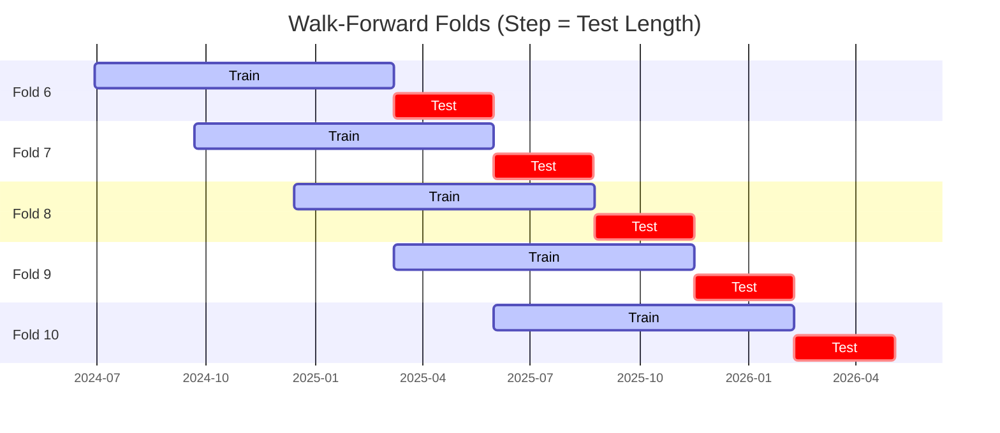

# Trading Strategy Pipeline Report

**Generated**: 2026-05-04 17:51:32

## Executive Summary

**WFO Training/Test period:** 2023-05-05 -> 2026-05-04  
**YTD performance window:** 2025-05-05 -> 2026-05-05  
**Coins:** 26

| | WFO Full Range | YTD |
|-|----------------|--------|
| Strategy CAGR | 43.91% | 54.49% |
| BTC buy & hold CAGR | 39.48% ✅ | -16.66% ✅ |
| S&P 500 CAGR | 22.00% ✅ | 28.92% ✅ |
| Strategy Sharpe | 1.46 | 1.41 |
| Max Drawdown | -35.49% | -17.45% |
| Total Trades | 364 | 107 |
| Win Rate | 34.62% | 46.73% |

## Result Validation (Training/Test Data)
**Period: 2023-05-05 -> 2026-05-04** — WFO-selected parameters replayed on the full training/test range.

### Combined Portfolio Performance

| Metric | Strategy | BTC (buy & hold) | S&P 500 (SPY) |
|--------|----------|------------------|---------------|
| Total Return | 197.82% | 171.17% | 81.49% |
| CAGR | 43.91% | 39.48% | 22.00% |
| Sharpe Ratio | 1.4594 | 0.9563 | 1.2587 |
| Max Drawdown | -35.49% | -49.89% | -14.53% |
| Total Trades | 364 | 1 | 1 |
| Win Rate | 34.62% | - | - |

## YTD Performance
**Period: 2025-05-05 -> 2026-05-05** — WFO-selected parameters replayed on the YTD window, no re-optimization.

| Metric | Strategy | BTC (buy & hold) | S&P 500 (SPY) |
|--------|----------|------------------|---------------|
| Total Return | 54.42% | -16.64% | 28.88% |
| CAGR | 54.49% | -16.66% | 28.92% |
| Sharpe Ratio | 1.4134 | -0.2380 | 2.5063 |
| Max Drawdown | -17.45% | -49.89% | -7.54% |
| Total Trades | 107 | 1 | 1 |
| Win Rate | 46.73% | - | - |

## Per-Coin Strategy Selection (WFO)

Best performing strategy per coin based on robustness scores (highest first).

| Symbol | Strategy | Selection | Robustness Score |
|--------|----------|-----------|------------------|
| PENGU-USD | rsi_reversal+atr_trailing | wfo_robustness | 1.0883 |
| ZEC-USD | ema_cross+atr_trailing | wfo_robustness | 0.8632 |
| VVV-USD | supertrend_flip+atr_trailing | wfo_robustness | 0.8442 |
| TRX-USD | bbands_mean_reversion+atr_trailing | wfo_robustness | 0.5411 |
| TAO-USD | ema_cross+fixed_sl_tp | wfo_robustness | 0.5402 |
| ALGO-USD | psar_adx+atr_trailing | wfo_robustness | 0.5384 |
| ETH-USD | rsi_reversal+atr_trailing | wfo_robustness | 0.5337 |
| XCN-USD | psar_adx+atr_trailing | wfo_robustness | 0.5177 |
| XMR-USD | macd_cross+atr_trailing | wfo_robustness | 0.5041 |
| DOGE-USD | psar_adx+fixed_sl_tp | wfo_robustness | 0.4787 |
| RENDER-USD | rsi_reversal+atr_trailing | wfo_robustness | 0.4115 |
| KAS-USD | keltner_breakout+fixed_sl_tp | wfo_robustness | 0.3596 |
| XLM-USD | keltner_breakout+fixed_sl_tp | wfo_robustness | 0.3523 |
| DASH-USD | ema_cross+atr_trailing | wfo_robustness | 0.3397 |
| PEPE-USD | rsi_reversal+trailing_stop | wfo_robustness | 0.3392 |
| NEAR-USD | supertrend_flip+fixed_sl_tp | wfo_robustness | 0.3228 |
| XRP-USD | bbands_mean_reversion+atr_trailing | wfo_robustness | 0.2801 |
| SPX-USD | supertrend_flip+trailing_stop | wfo_robustness | 0.2675 |
| SOL-USD | rsi_reversal+atr_trailing | wfo_robustness | 0.2515 |
| AVAX-USD | rsi_reversal+atr_trailing | wfo_robustness | 0.2496 |
| SUI-USD | ema_cross+fixed_sl_tp | wfo_robustness | 0.2456 |
| HBAR-USD | stoch_rsi_reversal+fixed_sl_tp | wfo_robustness | 0.2433 |
| BNB-USD | psar_adx+atr_trailing | wfo_robustness | 0.2403 |
| FET-USD | donchian_breakout+atr_trailing | wfo_robustness | 0.2278 |
| BTC-USD | bbands_mean_reversion+atr_trailing | wfo_robustness | 0.1281 |
| ONDO-USD | supertrend_flip+atr_trailing | wfo_robustness | 0.1080 |

### WFO Fold Timeline

### WFO Out-of-Sample Sharpe — Per Fold

Per-fold OOS Sharpe for each coin's winning strategy (folds ordered as above). Negative = strategy did not generalise.

| Symbol | Strategy+Exit | IS Rob | OOS Rob | Consistency | Fold 1 | Fold 2 | Fold 3 | Fold 4 | Fold 5 | Fold 6 | Fold 7 | Fold 8 | Fold 9 | Fold 10 |
|--------|---------------|--------|---------|-------------|--------|--------|--------|--------|--------|--------|--------|--------|--------|--------|
| ZEC-USD | ema_cross+atr_trailing | 1.3143 | 0.8876 | 80% | 1.711 | -1.206 | 0.199 | 1.024 | -1.749 | 0.229 | 0.564 | 5.085 | 0.519 | 1.587 |
| TRX-USD | bbands_mean_reversion+atr_trailing | 0.8777 | 0.7281 | 60% | 1.858 | -4.097 | 1.135 | 1.974 | -1.817 | -2.185 | 3.382 | -0.488 | 2.214 | 3.079 |
| VVV-USD | supertrend_flip+atr_trailing | 3.0000 | 0.6440 | 50% | n/a | n/a | n/a | n/a | n/a | n/a | -2.359 | -0.875 | 2.233 | 3.210 |
| PENGU-USD | rsi_reversal+atr_trailing | 2.8336 | 0.6147 | 80% | n/a | n/a | n/a | n/a | n/a | 2.676 | 2.536 | -2.757 | 0.152 | 1.668 |
| XMR-USD | macd_cross+atr_trailing | 0.8692 | 0.5567 | 70% | -1.758 | 1.309 | 0.140 | 0.922 | -3.395 | 3.574 | -1.501 | 0.048 | 3.699 | 0.785 |
| XCN-USD | psar_adx+atr_trailing | 1.4549 | 0.4858 | 56% | -0.357 | n/a | -3.198 | 2.623 | 2.181 | -1.231 | -0.205 | 1.184 | 1.291 | 0.954 |
| DASH-USD | ema_cross+atr_trailing | 0.8067 | 0.4307 | 50% | -4.680 | 0.488 | -0.006 | 2.186 | -1.605 | -1.467 | -0.592 | 2.281 | 1.674 | 1.654 |
| ETH-USD | rsi_reversal+atr_trailing | 1.6868 | 0.3662 | 60% | 1.837 | 0.811 | -2.110 | -0.213 | -1.703 | 3.141 | 4.000 | 0.377 | -2.425 | 0.890 |
| DOGE-USD | psar_adx+fixed_sl_tp | 1.2918 | 0.3581 | 67% | 0.670 | -2.610 | n/a | 3.322 | -2.103 | -2.867 | 2.294 | 2.186 | 0.346 | 0.717 |
| TAO-USD | ema_cross+fixed_sl_tp | 2.0872 | 0.3403 | 50% | n/a | n/a | 0.847 | -0.459 | -1.078 | 0.817 | 0.703 | -0.486 | -0.751 | 2.710 |
| ALGO-USD | psar_adx+atr_trailing | 2.0223 | 0.1122 | 71% | 1.336 | n/a | -3.704 | 3.502 | n/a | 2.036 | 0.663 | n/a | 0.862 | -2.427 |
| XLM-USD | keltner_breakout+fixed_sl_tp | 1.9666 | 0.0722 | 40% | -2.486 | -2.172 | -1.511 | 3.706 | -1.715 | 1.227 | 2.866 | -2.363 | -1.719 | 1.954 |
| XRP-USD | bbands_mean_reversion+atr_trailing | 1.4577 | 0.0155 | 50% | -2.476 | -2.974 | 0.170 | 4.920 | -0.520 | -0.718 | 0.941 | -1.994 | 0.410 | 0.366 |
| FET-USD | donchian_breakout+atr_trailing | 1.1955 | -0.0474 | 60% | 3.104 | -2.432 | 0.856 | 0.195 | -0.261 | 0.800 | -1.284 | -3.332 | 0.592 | 2.117 |
| SOL-USD | rsi_reversal+atr_trailing | 1.4235 | -0.0967 | 60% | 0.244 | -2.312 | -0.268 | 0.900 | 0.639 | 0.283 | 1.633 | -0.703 | -2.199 | 0.479 |
| RENDER-USD | rsi_reversal+atr_trailing | 2.2579 | -0.1013 | 57% | n/a | n/a | n/a | 1.383 | -0.940 | 0.819 | 0.210 | -3.641 | 3.123 | -1.290 |
| SUI-USD | ema_cross+fixed_sl_tp | 1.7048 | -0.1693 | 50% | -0.444 | -1.703 | 0.111 | 1.874 | -0.947 | -0.045 | 0.724 | -2.740 | 0.646 | 0.181 |
| BTC-USD | bbands_mean_reversion+atr_trailing | 1.1324 | -0.1924 | 50% | 3.126 | -3.096 | -2.319 | 4.344 | -1.654 | 1.559 | 0.622 | -2.278 | -2.399 | 1.253 |
| AVAX-USD | rsi_reversal+atr_trailing | 2.0609 | -0.2719 | 44% | -1.345 | -3.506 | 0.467 | 3.015 | n/a | -0.739 | 0.739 | 1.980 | -1.646 | -2.322 |
| NEAR-USD | supertrend_flip+fixed_sl_tp | 2.1302 | -0.3180 | 70% | 1.615 | -2.538 | 0.410 | 0.242 | -1.691 | 0.214 | -3.083 | 0.622 | 0.049 | 0.400 |
| PEPE-USD | rsi_reversal+trailing_stop | 2.6134 | -0.3446 | 50% | 3.137 | 0.691 | -3.504 | 3.038 | -5.669 | 0.576 | -1.864 | -0.004 | 0.767 | -0.010 |
| KAS-USD | keltner_breakout+fixed_sl_tp | 2.5723 | -0.3455 | 57% | n/a | n/a | n/a | -0.580 | 0.218 | 1.682 | -3.004 | -2.589 | 0.871 | 0.474 |
| ONDO-USD | supertrend_flip+atr_trailing | 1.7121 | -0.4638 | 43% | n/a | n/a | n/a | 3.047 | -0.754 | -4.162 | 0.862 | -0.456 | -2.908 | 1.117 |
| SPX-USD | supertrend_flip+trailing_stop | 2.8295 | -0.5177 | 40% | n/a | n/a | n/a | n/a | n/a | -1.100 | 0.565 | 1.124 | -0.607 | -2.591 |
| BNB-USD | psar_adx+atr_trailing | 2.7657 | -0.6361 | 50% | n/a | n/a | n/a | n/a | n/a | n/a | 1.272 | 2.007 | -0.473 | -4.945 |
| HBAR-USD | stoch_rsi_reversal+fixed_sl_tp | 3.0000 | -0.7297 | 50% | n/a | n/a | n/a | n/a | n/a | n/a | 1.697 | 2.022 | -2.902 | -3.457 |

## Full-Period Performance (Per-Coin)

Performance metrics from running WFO-selected parameters on full-range data.

| Symbol | Strategy | Exit | Selection | Return % | Sharpe | Max DD % | Trades | Win Rate % |
|--------|----------|------|-----------|----------|--------|----------|--------|-----------|
| ZEC-USD | ema_cross | atr_trailing | wfo_robustness | 37.59% | 0.9286 | -13.11% | 55 | 45.45% |
| TRX-USD | bbands_mean_reversion | atr_trailing | wfo_robustness | 40.81% | 0.8750 | -21.40% | 1 | 100.00% |
| PENGU-USD | rsi_reversal | atr_trailing | wfo_robustness | 23.17% | 0.7142 | -18.79% | 23 | 39.13% |
| PEPE-USD | rsi_reversal | trailing_stop | wfo_robustness | 25.96% | 0.6921 | -14.37% | 119 | 31.93% |
| XLM-USD | keltner_breakout | fixed_sl_tp | wfo_robustness | 21.13% | 0.6142 | -15.08% | 79 | 22.78% |
| XRP-USD | bbands_mean_reversion | atr_trailing | wfo_robustness | 15.90% | 0.5715 | -14.70% | 65 | 26.15% |
| SOL-USD | rsi_reversal | atr_trailing | wfo_robustness | 3.67% | 0.2284 | -14.34% | 86 | 40.70% |
| DASH-USD | ema_cross | atr_trailing | wfo_robustness | 3.54% | 0.1602 | -16.43% | 61 | 31.15% |
| AVAX-USD | rsi_reversal | atr_trailing | wfo_robustness | 2.28% | 0.1371 | -13.17% | 55 | 30.91% |
| ETH-USD | rsi_reversal | atr_trailing | wfo_robustness | 1.50% | 0.1272 | -7.74% | 57 | 31.58% |
| TAO-USD | ema_cross | fixed_sl_tp | wfo_robustness | 1.28% | 0.0935 | -12.51% | 63 | 34.92% |
| BTC-USD | bbands_mean_reversion | atr_trailing | wfo_robustness | 0.49% | 0.0637 | -7.39% | 59 | 30.51% |
| ALGO-USD | psar_adx | atr_trailing | wfo_robustness | -0.19% | 0.0246 | -10.00% | 76 | 39.47% |
| DOGE-USD | psar_adx | fixed_sl_tp | wfo_robustness | -1.78% | -0.0626 | -13.12% | 80 | 35.00% |
| XMR-USD | macd_cross | atr_trailing | wfo_robustness | -4.14% | -0.2440 | -11.51% | 53 | 26.42% |
| SUI-USD | ema_cross | fixed_sl_tp | wfo_robustness | -7.33% | -0.2861 | -15.45% | 64 | 34.38% |

---

*For pipeline methodology, fold structure, and benchmark definitions see [docs/architecture.md](../../../docs/architecture.md).*

---

*Report generated by ggTrader Pipeline*