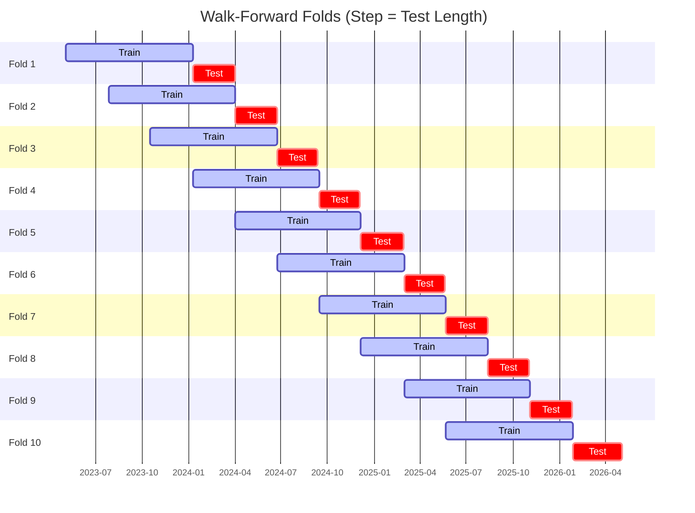

# Trading Strategy Pipeline Report

**Generated**: 2026-05-04 19:58:48

## Executive Summary

**WFO Training/Test period:** 2023-05-07 -> 2026-05-04  
**YTD performance window:** 2025-05-05 -> 2026-05-03  
**Coins:** 26

| | WFO Full Range | YTD |
|-|----------------|--------|
| Strategy CAGR | 20.82% | 55.54% |
| BTC buy & hold CAGR | n/a | n/a |
| S&P 500 CAGR | n/a | n/a |
| Strategy Sharpe | 1.73 | 3.52 |
| Max Drawdown | -11.54% | -7.92% |
| Total Trades | 164 | 75 |
| Win Rate | 50.61% | 52.00% |

## Result Validation (Training/Test Data)
**Period: 2023-05-07 -> 2026-05-04** — WFO-selected parameters replayed on the full training/test range.

### Combined Portfolio Performance

| Metric | Strategy | BTC (buy & hold) | S&P 500 (SPY) |
|--------|----------|------------------|---------------|
| Total Return | 76.06% | n/a | n/a |
| CAGR | 20.82% | n/a | n/a |
| Sharpe Ratio | 1.7347 | n/a | n/a |
| Max Drawdown | -11.54% | n/a | n/a |
| Total Trades | 164 | 1 | 1 |
| Win Rate | 50.61% | - | - |

## YTD Performance
**Period: 2025-05-05 -> 2026-05-03** — WFO-selected parameters replayed on the YTD window, no re-optimization.

| Metric | Strategy | BTC (buy & hold) | S&P 500 (SPY) |
|--------|----------|------------------|---------------|
| Total Return | 55.12% | n/a | n/a |
| CAGR | 55.54% | n/a | n/a |
| Sharpe Ratio | 3.5249 | n/a | n/a |
| Max Drawdown | -7.92% | n/a | n/a |
| Total Trades | 75 | 1 | 1 |
| Win Rate | 52.00% | - | - |

## Per-Coin Strategy Selection (WFO)

Best performing strategy per coin based on robustness scores (highest first).

| Symbol | Strategy | Selection | Robustness Score |
|--------|----------|-----------|------------------|
| AMZN | supertrend_flip+fixed_sl_tp | wfo_robustness | 1.7231 |
| AMD | psar_adx+atr_trailing | wfo_robustness | 1.4454 |
| GOOGL | bbands_mean_reversion+atr_trailing | wfo_robustness | 1.2233 |
| NFLX | psar_adx+atr_trailing | wfo_robustness | 1.1190 |
| DIS | psar_adx+trailing_stop | wfo_robustness | 1.0609 |
| LIN | psar_adx+atr_trailing | wfo_robustness | 0.9729 |
| MSFT | psar_adx+atr_trailing | wfo_robustness | 0.8179 |
| META | macd_cross+atr_trailing | wfo_robustness | 0.7616 |
| UNH | psar_adx+fixed_sl_tp | wfo_robustness | 0.7417 |
| AVGO | donchian_breakout+trailing_stop | wfo_robustness | 0.7139 |
| NVDA | stoch_rsi_reversal+atr_trailing | wfo_robustness | 0.6817 |
| INTC | donchian_breakout+atr_trailing | wfo_robustness | 0.5621 |
| ORCL | psar_adx+fixed_sl_tp | wfo_robustness | 0.5401 |
| XOM | psar_adx+atr_trailing | wfo_robustness | 0.5051 |
| KO | bbands_mean_reversion+fixed_sl_tp | wfo_robustness | 0.5030 |
| HD | psar_adx+fixed_sl_tp | wfo_robustness | 0.4791 |
| TSLA | psar_adx+fixed_sl_tp | wfo_robustness | 0.4625 |
| PM | psar_adx+trailing_stop | wfo_robustness | 0.4483 |
| PFE | psar_adx+fixed_sl_tp | wfo_robustness | 0.4065 |
| MCD | supertrend_flip+fixed_sl_tp | wfo_robustness | 0.3854 |
| MRK | psar_adx+atr_trailing | wfo_robustness | 0.3845 |
| LLY | psar_adx+atr_trailing | wfo_robustness | 0.3816 |
| ACN | bbands_mean_reversion+trailing_stop | wfo_robustness | 0.3467 |
| ADBE | psar_adx+atr_trailing | wfo_robustness | 0.3445 |
| AAPL | psar_adx+atr_trailing | wfo_robustness | 0.2072 |
| AMGN | psar_adx+atr_trailing | wfo_robustness | 0.1047 |

### WFO Fold Timeline

### WFO Out-of-Sample Sharpe — Per Fold

Per-fold OOS Sharpe for each coin's winning strategy (folds ordered as above). Negative = strategy did not generalise.

| Symbol | Strategy+Exit | IS Rob | OOS Rob | Consistency | Fold 1 | Fold 2 | Fold 3 | Fold 4 | Fold 5 | Fold 6 | Fold 7 | Fold 8 | Fold 9 | Fold 10 |
|--------|---------------|--------|---------|-------------|--------|--------|--------|--------|--------|--------|--------|--------|--------|--------|
| GOOGL | bbands_mean_reversion+atr_trailing | 0.2697 | 1.8128 | 88% | -0.908 | 1.479 | n/a | 0.199 | n/a | 0.990 | 1.527 | 3.871 | 1.410 | 4.414 |
| AMZN | supertrend_flip+fixed_sl_tp | 2.5739 | 1.7101 | 83% | 1.307 | n/a | -3.815 | 2.056 | 0.159 | 1.562 | n/a | n/a | n/a | 5.853 |
| DIS | psar_adx+trailing_stop | 0.7337 | 1.7064 | 67% | 5.701 | -1.350 | -3.928 | 5.317 | n/a | 4.446 | n/a | n/a | n/a | 1.914 |
| AMD | psar_adx+atr_trailing | 1.7649 | 1.6729 | 80% | -4.197 | 0.284 | 0.173 | 1.050 | -2.570 | 3.079 | 3.085 | 4.423 | 2.386 | 3.806 |
| LIN | psar_adx+atr_trailing | 1.1762 | 1.1638 | 78% | 4.927 | 2.164 | 3.157 | 2.969 | 4.471 | n/a | 0.688 | -2.705 | 3.740 | -0.327 |
| MSFT | psar_adx+atr_trailing | 0.8363 | 1.0797 | 75% | 0.945 | n/a | 3.509 | -1.210 | n/a | 2.400 | 3.941 | 0.593 | -0.271 | 1.078 |
| INTC | donchian_breakout+atr_trailing | 0.3209 | 1.0459 | 57% | -2.983 | n/a | -1.976 | 0.330 | -3.472 | n/a | n/a | 3.408 | 0.623 | 5.115 |
| UNH | psar_adx+fixed_sl_tp | 1.5311 | 1.0391 | 50% | -3.058 | n/a | 3.478 | -0.911 | -1.901 | -2.115 | 3.820 | 1.092 | n/a | 4.500 |
| NVDA | stoch_rsi_reversal+atr_trailing | 1.0273 | 0.9510 | 60% | 3.829 | 2.991 | -0.658 | 2.060 | -1.674 | 4.254 | 3.219 | -0.294 | -0.417 | 1.198 |
| META | macd_cross+atr_trailing | 0.7967 | 0.8770 | 86% | 2.498 | 0.219 | n/a | 1.216 | 2.293 | 2.642 | n/a | n/a | 1.376 | -1.197 |
| NFLX | psar_adx+atr_trailing | 2.5900 | 0.8083 | 78% | 2.308 | 1.790 | -1.409 | 6.282 | 2.462 | 6.544 | 0.440 | n/a | -5.077 | 1.063 |
| ORCL | psar_adx+fixed_sl_tp | 0.6309 | 0.7583 | 67% | 1.464 | 1.111 | 2.231 | -2.236 | -0.232 | 3.481 | 3.308 | -2.148 | n/a | 1.552 |
| XOM | psar_adx+atr_trailing | 1.3717 | 0.5668 | 50% | 6.872 | -2.619 | n/a | -2.532 | 1.238 | n/a | -0.497 | -1.006 | 4.192 | 0.910 |
| HD | psar_adx+fixed_sl_tp | 1.1420 | 0.5372 | 56% | -0.958 | n/a | -1.171 | 3.430 | 1.913 | 0.235 | 3.220 | -0.780 | 1.870 | -1.865 |
| AVGO | donchian_breakout+trailing_stop | 2.3427 | 0.5257 | 56% | 1.142 | 1.562 | -3.642 | -1.989 | -2.070 | 4.622 | -0.538 | 0.602 | n/a | 2.891 |
| PFE | psar_adx+fixed_sl_tp | 0.8706 | 0.4827 | 57% | -0.620 | 0.339 | 0.639 | n/a | -2.715 | 0.716 | -1.040 | n/a | 4.031 | n/a |
| TSLA | psar_adx+fixed_sl_tp | 1.5285 | 0.2888 | 60% | -1.270 | 0.572 | 1.192 | 3.446 | -3.059 | 3.183 | -0.552 | 1.600 | 0.293 | -1.365 |
| KO | bbands_mean_reversion+fixed_sl_tp | 1.8012 | 0.1863 | 67% | -3.081 | 0.381 | 4.328 | n/a | 1.821 | 0.194 | -3.161 | 0.931 | 0.992 | -0.338 |
| MRK | psar_adx+atr_trailing | 1.4759 | 0.1769 | 57% | 2.223 | 1.894 | -2.274 | n/a | n/a | -2.087 | n/a | 0.758 | 2.554 | -0.799 |
| PM | psar_adx+trailing_stop | 1.6724 | 0.1744 | 62% | -2.994 | n/a | 4.650 | 0.614 | 4.329 | 0.302 | -3.369 | n/a | 1.940 | -2.173 |
| ADBE | psar_adx+atr_trailing | 1.4646 | 0.1598 | 50% | -2.868 | 0.812 | -1.562 | 0.742 | n/a | 7.074 | -4.182 | n/a | 0.151 | -0.196 |
| LLY | psar_adx+atr_trailing | 2.0808 | 0.0426 | 44% | -2.139 | 4.084 | -0.326 | 2.027 | 2.332 | -1.993 | n/a | 2.249 | -0.576 | -2.522 |
| ACN | bbands_mean_reversion+trailing_stop | 1.8249 | -0.0523 | 57% | -2.832 | 0.560 | -4.426 | -3.687 | 0.270 | 2.426 | n/a | n/a | 1.668 | n/a |
| MCD | supertrend_flip+fixed_sl_tp | 1.9946 | -0.0887 | 62% | n/a | n/a | 4.081 | -2.326 | 0.983 | -1.772 | 1.041 | -3.010 | 1.179 | 0.199 |
| AAPL | psar_adx+atr_trailing | 1.4318 | -0.1062 | 44% | -0.320 | 4.410 | -1.521 | 2.698 | -1.566 | -0.826 | 4.333 | n/a | -4.801 | 0.215 |
| AMGN | psar_adx+atr_trailing | 1.7238 | -0.4668 | 40% | -2.094 | 2.912 | -0.867 | -3.552 | 4.286 | -3.420 | -1.444 | 1.055 | 0.981 | -2.803 |

## Full-Period Performance (Per-Coin)

Performance metrics from running WFO-selected parameters on full-range data.

| Symbol | Strategy | Exit | Selection | Return % | Sharpe | Max DD % | Trades | Win Rate % |
|--------|----------|------|-----------|----------|--------|----------|--------|-----------|
| GOOGL | bbands_mean_reversion | atr_trailing | wfo_robustness | 13.46% | 1.7160 | -2.34% | 6 | 66.67% |
| NVDA | stoch_rsi_reversal | atr_trailing | wfo_robustness | 53.66% | 1.3640 | -12.81% | 1 | 100.00% |
| PM | psar_adx | trailing_stop | wfo_robustness | 6.91% | 1.3019 | -2.36% | 32 | 50.00% |
| INTC | donchian_breakout | atr_trailing | wfo_robustness | 22.24% | 1.1908 | -10.07% | 1 | 100.00% |
| MSFT | psar_adx | atr_trailing | wfo_robustness | 4.11% | 1.1012 | -1.79% | 6 | 66.67% |
| AMZN | supertrend_flip | fixed_sl_tp | wfo_robustness | 6.23% | 1.0769 | -3.04% | 7 | 71.43% |
| AMD | psar_adx | atr_trailing | wfo_robustness | 21.59% | 1.0431 | -11.24% | 1 | 100.00% |
| NFLX | psar_adx | atr_trailing | wfo_robustness | 15.05% | 0.9056 | -12.59% | 1 | 100.00% |
| XOM | psar_adx | atr_trailing | wfo_robustness | 5.84% | 0.8978 | -2.40% | 1 | 100.00% |
| LIN | psar_adx | atr_trailing | wfo_robustness | 4.44% | 0.8440 | -2.59% | 1 | 100.00% |
| META | macd_cross | atr_trailing | wfo_robustness | 14.75% | 0.8335 | -8.72% | 1 | 100.00% |
| LLY | psar_adx | atr_trailing | wfo_robustness | 12.29% | 0.8243 | -6.74% | 1 | 100.00% |
| HD | psar_adx | fixed_sl_tp | wfo_robustness | 2.51% | 0.7921 | -1.24% | 13 | 38.46% |
| AAPL | psar_adx | atr_trailing | wfo_robustness | 6.08% | 0.7909 | -4.76% | 1 | 100.00% |
| MRK | psar_adx | atr_trailing | wfo_robustness | 3.15% | 0.7502 | -1.86% | 14 | 50.00% |
| KO | bbands_mean_reversion | fixed_sl_tp | wfo_robustness | 2.71% | 0.7483 | -1.48% | 5 | 60.00% |
| UNH | psar_adx | fixed_sl_tp | wfo_robustness | 2.35% | 0.6818 | -1.49% | 9 | 55.56% |
| AMGN | psar_adx | atr_trailing | wfo_robustness | 5.72% | 0.6647 | -3.36% | 1 | 100.00% |
| AVGO | donchian_breakout | trailing_stop | wfo_robustness | 3.89% | 0.5660 | -5.27% | 13 | 46.15% |
| ORCL | psar_adx | fixed_sl_tp | wfo_robustness | 3.62% | 0.3952 | -6.26% | 27 | 40.74% |
| TSLA | psar_adx | fixed_sl_tp | wfo_robustness | 3.12% | 0.3942 | -4.00% | 8 | 50.00% |
| ACN | bbands_mean_reversion | trailing_stop | wfo_robustness | 0.97% | 0.3036 | -1.95% | 19 | 42.11% |
| MCD | supertrend_flip | fixed_sl_tp | wfo_robustness | -0.12% | -0.0482 | -2.20% | 10 | 20.00% |
| PFE | psar_adx | fixed_sl_tp | wfo_robustness | -0.15% | -0.0521 | -1.52% | 5 | 40.00% |
| ADBE | psar_adx | atr_trailing | wfo_robustness | -3.18% | -0.2997 | -10.27% | 1 | 0.00% |
| DIS | psar_adx | trailing_stop | wfo_robustness | -1.91% | -0.7633 | -1.91% | 10 | 30.00% |

---

*For pipeline methodology, fold structure, and benchmark definitions see [docs/architecture.md](../../../docs/architecture.md).*

---

*Report generated by ggTrader Pipeline*