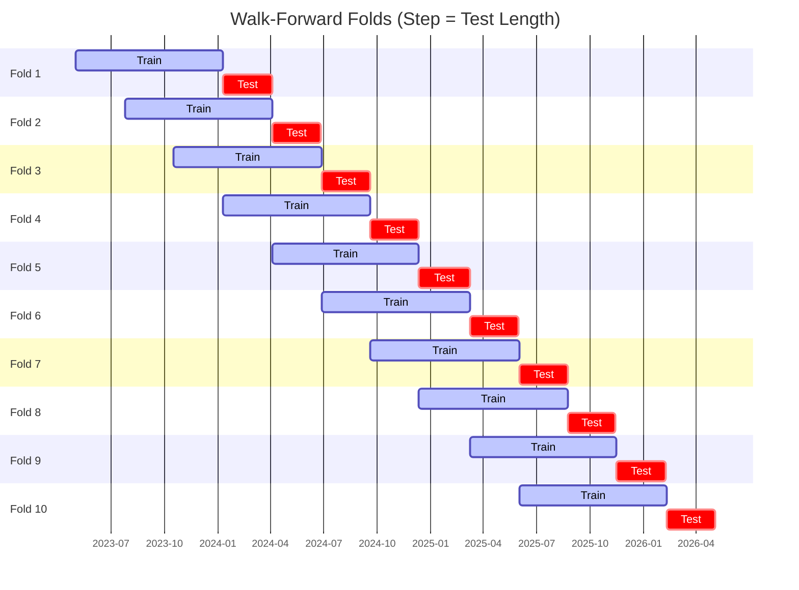

# Trading Strategy Pipeline Report

**Generated**: 2026-05-05 04:11:18

## Executive Summary

**WFO Training/Test period:** 2023-05-02 -> 2026-05-04  
**YTD performance window:** 2025-05-05 -> 2026-05-03  
**Coins:** 23

| | WFO Full Range | YTD |
|-|----------------|--------|
| Strategy CAGR | 20.33% | 27.44% |
| BTC buy & hold CAGR | n/a | n/a |
| S&P 500 CAGR | 22.25% ❌ | 30.18% ❌ |
| Strategy Sharpe | 1.97 | 3.26 |
| Max Drawdown | -12.27% | -5.24% |
| Total Trades | 95 | 38 |
| Win Rate | 57.89% | 65.79% |

## Result Validation (Training/Test Data)
**Period: 2023-05-02 -> 2026-05-04** — WFO-selected parameters replayed on the full training/test range.

### Combined Portfolio Performance

| Metric | Strategy | BTC (buy & hold) | S&P 500 (SPY) |
|--------|----------|------------------|---------------|
| Total Return | 74.38% | n/a | 82.87% |
| CAGR | 20.33% | n/a | 22.25% |
| Sharpe Ratio | 1.9718 | n/a | 1.6948 |
| Max Drawdown | -12.27% | n/a | -18.76% |
| Total Trades | 95 | 1 | 1 |
| Win Rate | 57.89% | - | - |

## YTD Performance
**Period: 2025-05-05 -> 2026-05-03** — WFO-selected parameters replayed on the YTD window, no re-optimization.

| Metric | Strategy | BTC (buy & hold) | S&P 500 (SPY) |
|--------|----------|------------------|---------------|
| Total Return | 27.25% | n/a | 29.96% |
| CAGR | 27.44% | n/a | 30.18% |
| Sharpe Ratio | 3.2601 | n/a | 2.6433 |
| Max Drawdown | -5.24% | n/a | -8.88% |
| Total Trades | 38 | 1 | 1 |
| Win Rate | 65.79% | - | - |

## Per-Coin Strategy Selection (WFO)

Best performing strategy per coin based on robustness scores (highest first).

| Symbol | Strategy | Selection | Robustness Score |
|--------|----------|-----------|------------------|
| GOOGL | stoch_rsi_reversal+atr_trailing | wfo_robustness | 1.6206 |
| NFLX | psar_adx+fixed_sl_tp | wfo_robustness | 1.1224 |
| AVGO | psar_adx+atr_trailing | wfo_robustness | 1.0407 |
| AAPL | psar_adx+atr_trailing | wfo_robustness | 1.0340 |
| TSLA | psar_adx+fixed_sl_tp | wfo_robustness | 1.0184 |
| LIN | psar_adx+atr_trailing | wfo_robustness | 0.9732 |
| ORCL | psar_adx+atr_trailing | wfo_robustness | 0.8271 |
| AMZN | psar_adx+fixed_sl_tp | wfo_robustness | 0.7239 |
| AMD | psar_adx+fixed_sl_tp | wfo_robustness | 0.7228 |
| LLY | psar_adx+trailing_stop | wfo_robustness | 0.6716 |
| META | bbands_mean_reversion+atr_trailing | wfo_robustness | 0.6333 |
| NVDA | stoch_rsi_reversal+atr_trailing | wfo_robustness | 0.6042 |
| INTC | bbands_mean_reversion+fixed_sl_tp | wfo_robustness | 0.5757 |
| KO | bbands_mean_reversion+fixed_sl_tp | wfo_robustness | 0.5032 |
| HD | psar_adx+fixed_sl_tp | wfo_robustness | 0.4800 |
| XOM | supertrend_flip+fixed_sl_tp | wfo_robustness | 0.4436 |
| PFE | psar_adx+fixed_sl_tp | wfo_robustness | 0.4065 |
| MCD | supertrend_flip+fixed_sl_tp | wfo_robustness | 0.3853 |
| MRK | psar_adx+atr_trailing | wfo_robustness | 0.3850 |
| ACN | bbands_mean_reversion+trailing_stop | wfo_robustness | 0.3467 |
| ADBE | psar_adx+atr_trailing | wfo_robustness | 0.3446 |
| MSFT | psar_adx+atr_trailing | wfo_robustness | 0.1935 |
| AMGN | psar_adx+atr_trailing | wfo_robustness | 0.1058 |

### WFO Fold Timeline

### WFO Out-of-Sample Sharpe — Per Fold

Per-fold OOS Sharpe for each coin's winning strategy (folds ordered as above). Negative = strategy did not generalise.

| Symbol | Strategy+Exit | IS Rob | OOS Rob | Consistency | Fold 1 | Fold 2 | Fold 3 | Fold 4 | Fold 5 | Fold 6 | Fold 7 | Fold 8 | Fold 9 | Fold 10 |
|--------|---------------|--------|---------|-------------|--------|--------|--------|--------|--------|--------|--------|--------|--------|--------|
| GOOGL | stoch_rsi_reversal+atr_trailing | 1.4382 | 2.3301 | 71% | -0.145 | 2.517 | n/a | 2.588 | -0.883 | n/a | 4.896 | 2.103 | n/a | 4.796 |
| AVGO | psar_adx+atr_trailing | 0.9885 | 1.4686 | 71% | 0.034 | 1.727 | -1.899 | n/a | -1.670 | 3.464 | 1.315 | n/a | n/a | 4.655 |
| NFLX | psar_adx+fixed_sl_tp | 1.0448 | 1.3215 | 88% | 2.220 | 5.095 | 0.169 | 4.304 | 3.086 | 5.780 | 0.743 | n/a | n/a | -2.534 |
| TSLA | psar_adx+fixed_sl_tp | 1.2776 | 1.2430 | 75% | -1.259 | 1.403 | 1.950 | 5.256 | n/a | 4.245 | 1.604 | -0.525 | n/a | 0.162 |
| AMD | psar_adx+fixed_sl_tp | 0.8736 | 1.1744 | 56% | -3.165 | -1.636 | 1.647 | n/a | -1.477 | 5.027 | 1.678 | 0.795 | -1.079 | 5.100 |
| LIN | psar_adx+atr_trailing | 1.1762 | 1.1642 | 78% | 4.927 | 2.164 | 3.157 | 2.969 | 4.471 | n/a | 0.688 | -2.705 | 3.740 | -0.325 |
| AMZN | psar_adx+fixed_sl_tp | 1.7898 | 1.0428 | 43% | -1.976 | n/a | -0.654 | 3.592 | 0.465 | n/a | -1.394 | n/a | -1.222 | 6.270 |
| LLY | psar_adx+trailing_stop | 0.7600 | 0.9535 | 67% | 1.463 | 5.825 | 2.171 | 0.388 | 2.450 | -1.519 | -1.560 | 6.118 | n/a | -0.900 |
| AAPL | psar_adx+atr_trailing | 2.4547 | 0.9175 | 67% | -1.074 | 3.059 | n/a | 6.477 | 1.588 | -1.761 | 3.172 | -2.419 | 2.851 | 0.240 |
| META | bbands_mean_reversion+atr_trailing | 0.8743 | 0.7767 | 71% | 3.079 | n/a | 1.926 | 1.605 | 5.022 | -2.432 | 0.965 | n/a | n/a | -0.043 |
| INTC | bbands_mean_reversion+fixed_sl_tp | 1.5510 | 0.6512 | 50% | -2.957 | n/a | -2.743 | n/a | -3.669 | 0.297 | 1.169 | 2.726 | -0.091 | 4.477 |
| HD | psar_adx+fixed_sl_tp | 1.1420 | 0.5392 | 56% | -0.958 | n/a | -1.171 | 3.430 | 1.913 | 0.235 | 3.220 | -0.780 | 1.870 | -1.851 |
| PFE | psar_adx+fixed_sl_tp | 0.8706 | 0.4827 | 57% | -0.620 | 0.339 | 0.639 | n/a | -2.715 | 0.716 | -1.040 | n/a | 4.031 | n/a |
| ORCL | psar_adx+atr_trailing | 2.9127 | 0.3956 | 62% | 1.542 | 2.815 | 4.051 | -1.767 | -1.625 | 4.413 | 1.270 | n/a | -2.617 | n/a |
| NVDA | stoch_rsi_reversal+atr_trailing | 1.7855 | 0.3857 | 67% | 3.432 | 1.905 | -3.339 | 0.761 | -2.939 | 2.797 | 4.333 | n/a | -2.608 | 1.296 |
| KO | bbands_mean_reversion+fixed_sl_tp | 1.8012 | 0.1866 | 67% | -3.081 | 0.381 | 4.328 | n/a | 1.821 | 0.194 | -3.161 | 0.931 | 0.992 | -0.336 |
| MRK | psar_adx+atr_trailing | 1.4759 | 0.1781 | 57% | 2.223 | 1.894 | -2.274 | n/a | n/a | -2.087 | n/a | 0.758 | 2.554 | -0.793 |
| ADBE | psar_adx+atr_trailing | 1.4646 | 0.1600 | 50% | -2.868 | 0.812 | -1.562 | 0.742 | n/a | 7.074 | -4.182 | n/a | 0.151 | -0.194 |
| XOM | supertrend_flip+fixed_sl_tp | 2.3598 | 0.0026 | 50% | 6.313 | n/a | -1.831 | -2.324 | n/a | -2.568 | -4.491 | 0.087 | 5.628 | 0.347 |
| ACN | bbands_mean_reversion+trailing_stop | 1.8249 | -0.0523 | 57% | -2.832 | 0.560 | -4.426 | -3.687 | 0.270 | 2.426 | n/a | n/a | 1.668 | n/a |
| MSFT | psar_adx+atr_trailing | 1.1217 | -0.0660 | 56% | 1.535 | n/a | 4.035 | -0.664 | -2.421 | 0.482 | 0.935 | -0.366 | -2.630 | 1.128 |
| MCD | supertrend_flip+fixed_sl_tp | 1.9946 | -0.0890 | 62% | n/a | n/a | 4.081 | -2.326 | 0.983 | -1.772 | 1.041 | -3.010 | 1.179 | 0.198 |
| AMGN | psar_adx+atr_trailing | 1.7238 | -0.4640 | 40% | -2.094 | 2.912 | -0.867 | -3.552 | 4.286 | -3.420 | -1.444 | 1.055 | 0.981 | -2.782 |

## Full-Period Performance (Per-Coin)

Performance metrics from running WFO-selected parameters on full-range data.

| Symbol | Strategy | Exit | Selection | Return % | Sharpe | Max DD % | Trades | Win Rate % |
|--------|----------|------|-----------|----------|--------|----------|--------|-----------|
| GOOGL | stoch_rsi_reversal | atr_trailing | wfo_robustness | 20.87% | 1.7552 | -4.79% | 1 | 100.00% |
| LLY | psar_adx | trailing_stop | wfo_robustness | 8.31% | 1.6032 | -1.38% | 15 | 73.33% |
| NVDA | stoch_rsi_reversal | atr_trailing | wfo_robustness | 53.66% | 1.3640 | -12.81% | 1 | 100.00% |
| MSFT | psar_adx | atr_trailing | wfo_robustness | 4.24% | 1.1960 | -1.48% | 6 | 83.33% |
| AVGO | psar_adx | atr_trailing | wfo_robustness | 13.95% | 1.1020 | -3.24% | 4 | 100.00% |
| NFLX | psar_adx | fixed_sl_tp | wfo_robustness | 7.47% | 0.9456 | -3.60% | 13 | 69.23% |
| AAPL | psar_adx | atr_trailing | wfo_robustness | 6.08% | 0.7909 | -4.76% | 1 | 100.00% |
| INTC | bbands_mean_reversion | fixed_sl_tp | wfo_robustness | 8.26% | 0.7404 | -4.98% | 11 | 54.55% |
| AMD | psar_adx | fixed_sl_tp | wfo_robustness | 4.74% | 0.5051 | -5.57% | 17 | 58.82% |
| META | bbands_mean_reversion | atr_trailing | wfo_robustness | 2.65% | 0.4064 | -3.92% | 8 | 50.00% |
| TSLA | psar_adx | fixed_sl_tp | wfo_robustness | 3.12% | 0.3942 | -4.00% | 8 | 50.00% |
| AMZN | psar_adx | fixed_sl_tp | wfo_robustness | 0.21% | 0.0926 | -1.22% | 1 | 100.00% |
| XOM | supertrend_flip | fixed_sl_tp | wfo_robustness | -1.11% | -0.3260 | -3.30% | 13 | 23.08% |
| ORCL | psar_adx | atr_trailing | wfo_robustness | -0.92% | -0.5037 | -1.26% | 2 | 0.00% |

---

*For pipeline methodology, fold structure, and benchmark definitions see [docs/architecture.md](../../../docs/architecture.md).*

---

*Report generated by ggTrader Pipeline*