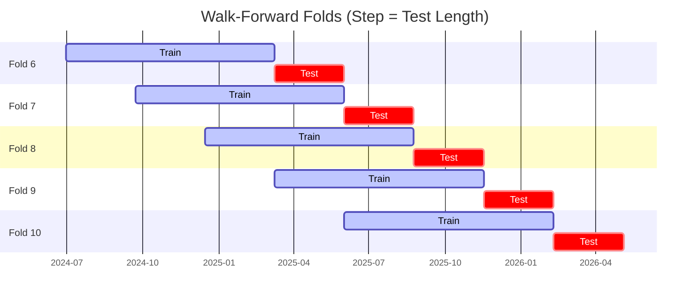

# Trading Strategy Pipeline Report

**Generated**: 2026-05-05 21:19:35

## Executive Summary

**WFO Training/Test period:** 2023-05-06 -> 2026-05-05  
**YTD performance window:** 2025-05-06 -> 2026-05-06  
**Coins:** 22

| | WFO Full Range | YTD |
|-|----------------|--------|
| Strategy CAGR | 28.30% | 41.14% |
| BTC buy & hold CAGR | 39.51% ❌ | -14.22% ✅ |
| S&P 500 CAGR | 22.17% ✅ | 31.05% ✅ |
| Strategy Sharpe | 1.09 | 1.15 |
| Max Drawdown | -27.90% | -19.63% |
| Total Trades | 270 | 71 |
| Win Rate | 35.93% | 45.07% |

## Result Validation (Training/Test Data)
**Period: 2023-05-06 -> 2026-05-05** — WFO-selected parameters replayed on the full training/test range.

### Combined Portfolio Performance

| Metric | Strategy | BTC (buy & hold) | S&P 500 (SPY) |
|--------|----------|------------------|---------------|
| Total Return | 111.07% | 171.36% | 82.27% |
| CAGR | 28.30% | 39.51% | 22.17% |
| Sharpe Ratio | 1.0931 | 0.9569 | 1.3983 |
| Max Drawdown | -27.90% | -49.89% | -18.76% |
| Total Trades | 270 | 1 | 1 |
| Win Rate | 35.93% | - | - |

## YTD Performance
**Period: 2025-05-06 -> 2026-05-06** — WFO-selected parameters replayed on the YTD window, no re-optimization.

| Metric | Strategy | BTC (buy & hold) | S&P 500 (SPY) |
|--------|----------|------------------|---------------|
| Total Return | 41.08% | -14.20% | 31.01% |
| CAGR | 41.14% | -14.22% | 31.05% |
| Sharpe Ratio | 1.1474 | -0.1690 | 2.2338 |
| Max Drawdown | -19.63% | -49.89% | -8.88% |
| Total Trades | 71 | 1 | 1 |
| Win Rate | 45.07% | - | - |

## Per-Coin Strategy Selection (WFO)

Best performing strategy per coin based on robustness scores (highest first).

| Symbol | Strategy | Selection | Robustness Score |
|--------|----------|-----------|------------------|
| PENGU-USD | rsi_reversal+atr_trailing | wfo_robustness | 1.0692 |
| VVV-USD | ema_cross+atr_trailing | wfo_robustness | 0.7212 |
| TAO-USD | rsi_reversal+atr_trailing | wfo_robustness | 0.7185 |
| DOGE-USD | psar_adx+fixed_sl_tp | wfo_robustness | 0.7128 |
| RENDER-USD | ema_cross+trailing_stop | wfo_robustness | 0.5806 |
| ZEC-USD | supertrend_flip+atr_trailing | wfo_robustness | 0.4811 |
| TRX-USD | rsi_reversal+atr_trailing | wfo_robustness | 0.4702 |
| HBAR-USD | ema_cross+fixed_sl_tp | wfo_robustness | 0.4375 |
| XMR-USD | donchian_breakout+atr_trailing | wfo_robustness | 0.4212 |
| NEAR-USD | rsi_reversal+atr_trailing | wfo_robustness | 0.4108 |
| ETH-USD | supertrend_flip+fixed_sl_tp | wfo_robustness | 0.3827 |
| SUI-USD | supertrend_flip+fixed_sl_tp | wfo_robustness | 0.3684 |
| XLM-USD | keltner_breakout+fixed_sl_tp | wfo_robustness | 0.3208 |
| PEPE-USD | rsi_reversal+fixed_sl_tp | wfo_robustness | 0.3131 |
| FET-USD | donchian_breakout+atr_trailing | wfo_robustness | 0.3077 |
| XRP-USD | ema_cross+atr_trailing | wfo_robustness | 0.3048 |
| CRV-USD | psar_adx+atr_trailing | wfo_robustness | 0.2720 |
| SOL-USD | rsi_reversal+atr_trailing | wfo_robustness | 0.2666 |
| ONDO-USD | rsi_reversal+atr_trailing | wfo_robustness | 0.2535 |
| LINK-USD | psar_adx+trailing_stop | wfo_robustness | 0.2041 |
| ZRO-USD | bbands_mean_reversion+atr_trailing | wfo_robustness | 0.1615 |
| BTC-USD | bbands_mean_reversion+atr_trailing | wfo_robustness | 0.1343 |

### WFO Fold Timeline

### WFO Out-of-Sample Sharpe — Per Fold

Per-fold OOS Sharpe for each coin's winning strategy (folds ordered as above). Negative = strategy did not generalise.

| Symbol | Strategy+Exit | IS Rob | OOS Rob | Consistency | Fold 1 | Fold 2 | Fold 3 | Fold 4 | Fold 5 | Fold 6 | Fold 7 | Fold 8 | Fold 9 | Fold 10 |
|--------|---------------|--------|---------|-------------|--------|--------|--------|--------|--------|--------|--------|--------|--------|--------|
| DOGE-USD | psar_adx+fixed_sl_tp | 1.3448 | 0.6770 | 75% | 0.670 | n/a | n/a | 2.948 | -1.775 | -0.357 | 1.945 | 2.186 | 0.346 | 0.422 |
| PENGU-USD | rsi_reversal+atr_trailing | 2.8800 | 0.5627 | 80% | n/a | n/a | n/a | n/a | n/a | 2.676 | 2.536 | -2.757 | 0.091 | 1.458 |
| XMR-USD | donchian_breakout+atr_trailing | 1.2265 | 0.4371 | 50% | -1.478 | 1.226 | -2.424 | 0.795 | 0.027 | 3.574 | -1.051 | -0.010 | 3.699 | -1.280 |
| TAO-USD | rsi_reversal+atr_trailing | 2.0747 | 0.4173 | 71% | n/a | n/a | n/a | 0.086 | -1.410 | 0.966 | 0.703 | -1.622 | 1.240 | 2.343 |
| ZEC-USD | supertrend_flip+atr_trailing | 1.3315 | 0.4112 | 60% | 1.551 | -2.748 | -0.900 | 1.007 | -2.425 | 0.229 | 0.244 | 5.112 | -1.475 | 1.462 |
| VVV-USD | ema_cross+atr_trailing | 2.7239 | 0.3044 | 60% | n/a | n/a | n/a | n/a | n/a | 1.716 | -0.807 | -2.731 | 2.103 | 1.349 |
| TRX-USD | rsi_reversal+atr_trailing | 1.9210 | 0.2514 | 50% | 1.836 | -4.256 | -1.138 | 1.744 | -1.180 | -0.577 | 3.494 | -0.930 | 1.415 | 0.195 |
| RENDER-USD | ema_cross+trailing_stop | 2.2209 | 0.2021 | 62% | n/a | n/a | 0.169 | 0.160 | 0.881 | -2.369 | -1.102 | -1.354 | 3.425 | 1.036 |
| CRV-USD | psar_adx+atr_trailing | 1.1882 | 0.1707 | 43% | 0.366 | n/a | -2.132 | 3.961 | -0.924 | -1.506 | 1.619 | -0.036 | n/a | n/a |
| FET-USD | donchian_breakout+atr_trailing | 1.3140 | 0.0649 | 60% | 3.031 | -4.566 | 0.413 | 1.850 | -0.261 | 0.800 | -0.427 | -3.099 | 0.592 | 2.115 |
| ETH-USD | supertrend_flip+fixed_sl_tp | 1.7927 | 0.0126 | 60% | 0.343 | 1.585 | -2.627 | 1.754 | -2.700 | -0.815 | 3.809 | 0.646 | -2.655 | 0.862 |
| XRP-USD | ema_cross+atr_trailing | 1.6339 | -0.0036 | 50% | -3.434 | -2.240 | 0.601 | 5.014 | -0.484 | -0.718 | 1.663 | -3.192 | 0.410 | 0.424 |
| NEAR-USD | rsi_reversal+atr_trailing | 2.2172 | -0.0113 | 50% | 0.363 | -1.444 | -1.039 | 2.780 | -3.257 | 1.283 | 0.060 | -0.152 | -0.099 | 0.502 |
| XLM-USD | keltner_breakout+fixed_sl_tp | 1.9762 | -0.0138 | 40% | -2.486 | -2.348 | -1.511 | 3.822 | -2.945 | 1.227 | 2.893 | -2.363 | -1.719 | 1.952 |
| SOL-USD | rsi_reversal+atr_trailing | 1.2822 | -0.0581 | 70% | 0.244 | -3.663 | -1.024 | 1.142 | 0.639 | 0.315 | 1.790 | 0.165 | -2.257 | 0.478 |
| LINK-USD | psar_adx+trailing_stop | 1.6514 | -0.1975 | 43% | 1.950 | -1.759 | n/a | -0.704 | -0.470 | -1.214 | 0.371 | 0.462 | n/a | n/a |
| SUI-USD | supertrend_flip+fixed_sl_tp | 2.4754 | -0.2187 | 50% | -0.444 | -2.210 | 0.249 | 1.324 | -0.947 | -0.045 | 0.724 | -2.740 | 0.659 | 0.181 |
| HBAR-USD | ema_cross+fixed_sl_tp | 2.8847 | -0.2364 | 50% | n/a | n/a | n/a | n/a | n/a | n/a | 1.660 | 0.226 | -0.841 | -1.625 |
| ZRO-USD | bbands_mean_reversion+atr_trailing | 1.5768 | -0.2720 | 43% | n/a | n/a | n/a | 1.328 | -3.825 | -1.268 | -0.451 | -1.598 | 1.272 | 1.114 |
| BTC-USD | bbands_mean_reversion+atr_trailing | 1.4470 | -0.3133 | 50% | 0.262 | -3.009 | -2.174 | 1.992 | -1.648 | 1.559 | 0.769 | -1.364 | -2.399 | 1.071 |
| PEPE-USD | rsi_reversal+fixed_sl_tp | 2.4731 | -0.3442 | 50% | 3.137 | 0.515 | -3.411 | 2.888 | -5.669 | 0.481 | -1.572 | -0.004 | 0.696 | -0.010 |
| ONDO-USD | rsi_reversal+atr_trailing | 2.5961 | -0.5331 | 50% | n/a | n/a | 2.911 | 0.622 | -2.252 | -4.842 | 1.078 | -0.964 | -0.741 | 0.041 |

## Full-Period Performance (Per-Coin)

Performance metrics from running WFO-selected parameters on full-range data.

| Symbol | Strategy | Exit | Selection | Return % | Sharpe | Max DD % | Trades | Win Rate % |
|--------|----------|------|-----------|----------|--------|----------|--------|-----------|
| ZEC-USD | supertrend_flip | atr_trailing | wfo_robustness | 34.97% | 0.8764 | -12.98% | 58 | 41.38% |
| PEPE-USD | rsi_reversal | fixed_sl_tp | wfo_robustness | 54.48% | 0.8637 | -17.75% | 72 | 33.33% |
| PENGU-USD | rsi_reversal | atr_trailing | wfo_robustness | 22.73% | 0.7036 | -19.26% | 23 | 39.13% |
| XLM-USD | keltner_breakout | fixed_sl_tp | wfo_robustness | 20.57% | 0.6007 | -15.08% | 80 | 22.50% |
| XRP-USD | ema_cross | atr_trailing | wfo_robustness | 15.32% | 0.5532 | -14.70% | 66 | 25.76% |
| SOL-USD | rsi_reversal | atr_trailing | wfo_robustness | 5.83% | 0.3195 | -12.92% | 72 | 38.89% |
| DOGE-USD | psar_adx | fixed_sl_tp | wfo_robustness | -0.15% | 0.0063 | -4.20% | 25 | 48.00% |
| BTC-USD | bbands_mean_reversion | atr_trailing | wfo_robustness | -0.47% | -0.0262 | -7.39% | 61 | 29.51% |
| XMR-USD | donchian_breakout | atr_trailing | wfo_robustness | -1.62% | -0.0878 | -7.70% | 60 | 23.33% |
| TAO-USD | rsi_reversal | atr_trailing | wfo_robustness | -5.79% | -0.2459 | -16.14% | 91 | 32.97% |
| TRX-USD | rsi_reversal | atr_trailing | wfo_robustness | -3.61% | -0.2554 | -10.45% | 95 | 30.53% |
| ETH-USD | supertrend_flip | fixed_sl_tp | wfo_robustness | -5.94% | -0.4203 | -10.26% | 65 | 26.15% |
| LINK-USD | psar_adx | trailing_stop | wfo_robustness | -7.68% | -0.4682 | -9.88% | 71 | 36.62% |
| SUI-USD | supertrend_flip | fixed_sl_tp | wfo_robustness | -11.26% | -0.5669 | -12.70% | 98 | 27.55% |

---

*For pipeline methodology, fold structure, and benchmark definitions see [docs/architecture.md](../../../docs/architecture.md).*

---

*Report generated by ggTrader Pipeline*