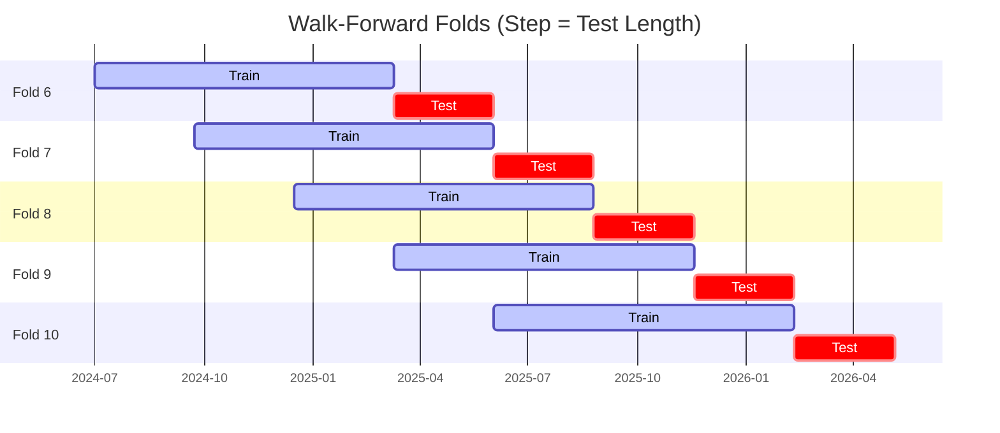

# Trading Strategy Pipeline Report

**Generated**: 2026-05-07 00:44:50

## Executive Summary

**WFO Training/Test period:** 2023-05-07 -> 2026-05-06  
**YTD performance window:** 2025-05-07 -> 2026-05-07  
**Coins:** 23

| | WFO Full Range | YTD |
|-|----------------|--------|
| Strategy CAGR | 8.37% | 16.63% |
| BTC buy & hold CAGR | 40.79% ❌ | -17.24% ✅ |
| S&P 500 CAGR | 22.72% ❌ | 32.31% ❌ |
| Strategy Sharpe | 0.49 | 0.57 |
| Max Drawdown | -25.51% | -37.12% |
| Total Trades | 325 | 38 |
| Win Rate | 34.15% | 36.84% |

## Result Validation (Training/Test Data)
**Period: 2023-05-07 -> 2026-05-06** — WFO-selected parameters replayed on the full training/test range.

### Combined Portfolio Performance

| Metric | Strategy | BTC (buy & hold) | S&P 500 (SPY) |
|--------|----------|------------------|---------------|
| Total Return | 27.24% | 178.87% | 84.76% |
| CAGR | 8.37% | 40.79% | 22.72% |
| Sharpe Ratio | 0.4901 | 0.9770 | 1.4263 |
| Max Drawdown | -25.51% | -49.89% | -18.76% |
| Total Trades | 325 | 1 | 1 |
| Win Rate | 34.15% | - | - |

## YTD Performance
**Period: 2025-05-07 -> 2026-05-07** — WFO-selected parameters replayed on the YTD window, no re-optimization.

| Metric | Strategy | BTC (buy & hold) | S&P 500 (SPY) |
|--------|----------|------------------|---------------|
| Total Return | 16.61% | -17.22% | 32.27% |
| CAGR | 16.63% | -17.24% | 32.31% |
| Sharpe Ratio | 0.5733 | -0.2565 | 2.2987 |
| Max Drawdown | -37.12% | -49.89% | -8.88% |
| Total Trades | 38 | 1 | 1 |
| Win Rate | 36.84% | - | - |

## Per-Coin Strategy Selection (WFO)

Best performing strategy per coin based on robustness scores (highest first).

| Symbol | Strategy | Selection | Robustness Score |
|--------|----------|-----------|------------------|
| VVV-USD | ema_cross+atr_trailing | wfo_robustness | 0.8513 |
| XMR-USD | adx_filtered_rsi+atr_trailing | wfo_robustness | 0.7368 |
| ZEC-USD | rsi_reversal+atr_trailing | wfo_robustness | 0.6065 |
| PENGU-USD | donchian_breakout+atr_trailing | wfo_robustness | 0.5960 |
| RENDER-USD | rsi_reversal+atr_trailing | wfo_robustness | 0.5443 |
| TRX-USD | macd_cross+atr_trailing | wfo_robustness | 0.4642 |
| WIF-USD | psar_adx+trailing_stop | wfo_robustness | 0.4639 |
| ZRO-USD | bbands_mean_reversion+atr_trailing | wfo_robustness | 0.4349 |
| DOGE-USD | supertrend_flip+atr_trailing | wfo_robustness | 0.3775 |
| TAO-USD | ema_cross+atr_trailing | wfo_robustness | 0.3580 |
| XRP-USD | psar_adx+trailing_stop | wfo_robustness | 0.2923 |
| PEPE-USD | macd_cross+atr_trailing | wfo_robustness | 0.2574 |
| LINK-USD | psar_adx+trailing_stop | wfo_robustness | 0.2486 |
| NEAR-USD | donchian_breakout+atr_trailing | wfo_robustness | 0.2483 |
| FET-USD | macd_cross+trailing_stop | wfo_robustness | 0.2426 |
| ETH-USD | ema_cross+atr_trailing | wfo_robustness | 0.2242 |
| CRV-USD | psar_adx+atr_trailing | wfo_robustness | 0.2128 |
| SPX-USD | psar_adx+atr_trailing | wfo_robustness | 0.2108 |
| XLM-USD | psar_adx+atr_trailing | wfo_robustness | 0.2018 |
| DASH-USD | psar_adx+trailing_stop | wfo_robustness | 0.1866 |
| ADA-USD | psar_adx+trailing_stop | wfo_robustness | 0.1455 |
| SUI-USD | psar_adx+atr_trailing | wfo_robustness | 0.1375 |
| ICP-USD | psar_adx+atr_trailing | wfo_robustness | 0.1134 |

### WFO Fold Timeline

### WFO Out-of-Sample Sharpe — Per Fold

Per-fold OOS Sharpe for each coin's winning strategy (folds ordered as above). Negative = strategy did not generalise.

| Symbol | Strategy+Exit | IS Rob | OOS Rob | Consistency | Fold 1 | Fold 2 | Fold 3 | Fold 4 | Fold 5 | Fold 6 | Fold 7 | Fold 8 | Fold 9 | Fold 10 |
|--------|---------------|--------|---------|-------------|--------|--------|--------|--------|--------|--------|--------|--------|--------|--------|
| XMR-USD | adx_filtered_rsi+atr_trailing | 2.2151 | 0.5544 | 60% | -0.826 | 0.916 | -0.746 | 1.249 | -4.434 | 3.010 | -1.109 | 1.167 | 3.166 | 1.083 |
| VVV-USD | ema_cross+atr_trailing | 2.0960 | 0.5324 | 80% | n/a | n/a | n/a | n/a | n/a | 1.716 | 0.640 | -3.169 | 1.840 | 2.051 |
| PENGU-USD | donchian_breakout+atr_trailing | 1.6599 | 0.5050 | 60% | n/a | n/a | n/a | n/a | n/a | 3.146 | 2.554 | -1.640 | -0.665 | 0.584 |
| TRX-USD | macd_cross+atr_trailing | 1.1860 | 0.4392 | 60% | 3.332 | -2.551 | 1.309 | 1.291 | -1.623 | -1.654 | 2.901 | -2.465 | 0.004 | 4.093 |
| ZEC-USD | rsi_reversal+atr_trailing | 2.2227 | 0.4337 | 50% | 0.971 | -0.874 | 0.588 | -0.108 | 2.539 | -0.059 | -2.937 | 1.395 | -0.898 | 3.455 |
| DOGE-USD | supertrend_flip+atr_trailing | 1.3513 | 0.2836 | 50% | 1.649 | -0.404 | -0.483 | 3.678 | -2.035 | -0.767 | 1.362 | 1.343 | -1.180 | 0.893 |
| WIF-USD | psar_adx+trailing_stop | 1.8225 | 0.2794 | 50% | 4.574 | -0.146 | 0.986 | -1.386 | -1.370 | 2.137 | 0.652 | -0.348 | 0.846 | -0.116 |
| TAO-USD | ema_cross+atr_trailing | 1.5607 | 0.2261 | 43% | n/a | n/a | n/a | 0.151 | -2.407 | 2.191 | -0.433 | -0.190 | -0.511 | 2.186 |
| RENDER-USD | rsi_reversal+atr_trailing | 2.2547 | 0.1795 | 57% | n/a | n/a | n/a | 1.496 | -0.724 | 0.700 | -0.675 | -1.113 | 0.383 | 1.344 |
| ZRO-USD | bbands_mean_reversion+atr_trailing | 1.8696 | 0.1143 | 57% | n/a | n/a | n/a | 1.824 | -2.638 | 0.996 | -0.476 | -1.207 | 1.212 | 0.911 |
| XRP-USD | psar_adx+trailing_stop | 1.4776 | 0.0827 | 44% | -1.807 | 0.059 | -1.039 | 3.405 | -1.571 | -0.720 | 1.549 | -1.102 | 0.787 | n/a |
| ETH-USD | ema_cross+atr_trailing | 0.9478 | 0.0514 | 60% | 1.346 | 1.836 | -1.588 | 1.946 | -4.300 | 2.294 | 3.640 | 0.212 | -2.110 | -0.656 |
| XLM-USD | psar_adx+atr_trailing | 1.4238 | -0.0861 | 40% | -2.151 | -3.573 | 0.889 | 4.227 | -1.626 | -0.110 | 1.322 | -1.424 | -0.605 | 0.187 |
| CRV-USD | psar_adx+atr_trailing | 1.2204 | -0.0888 | 60% | 0.892 | -1.758 | 0.100 | 1.698 | -0.252 | 0.666 | 1.461 | 1.314 | -3.900 | -0.005 |
| SPX-USD | psar_adx+atr_trailing | 1.1635 | -0.0971 | 67% | n/a | n/a | n/a | n/a | 0.295 | 2.724 | 0.591 | -2.060 | -2.909 | 1.437 |
| ADA-USD | psar_adx+trailing_stop | 1.0916 | -0.1115 | 44% | -0.765 | -2.286 | 0.633 | 4.505 | -1.065 | -2.338 | 1.787 | 0.246 | -1.782 | n/a |
| FET-USD | macd_cross+trailing_stop | 1.4570 | -0.1293 | 60% | 3.396 | 0.165 | 0.180 | -0.876 | -4.222 | 2.900 | -2.538 | 0.268 | -1.429 | 2.129 |
| DASH-USD | psar_adx+trailing_stop | 1.1874 | -0.1535 | 67% | 0.758 | 0.018 | 3.498 | 0.563 | 0.384 | -0.681 | 0.309 | -0.021 | -2.808 | n/a |
| LINK-USD | psar_adx+trailing_stop | 1.5950 | -0.1761 | 60% | 1.727 | 0.897 | -1.858 | -0.609 | -0.928 | 0.489 | 0.225 | 1.318 | -2.321 | 0.222 |
| PEPE-USD | macd_cross+atr_trailing | 1.6425 | -0.1786 | 60% | 3.236 | 0.858 | -2.427 | 2.069 | -4.647 | 1.780 | -0.395 | -2.098 | 0.563 | 0.733 |
| NEAR-USD | donchian_breakout+atr_trailing | 1.7881 | -0.2595 | 60% | 0.806 | -2.001 | 0.308 | 1.112 | -3.134 | 1.321 | 0.032 | -0.324 | -1.980 | 0.880 |
| SUI-USD | psar_adx+atr_trailing | 1.2556 | -0.2648 | 62% | 1.049 | 0.373 | 3.673 | 0.159 | n/a | 1.435 | -0.253 | -1.885 | -2.465 | n/a |
| ICP-USD | psar_adx+atr_trailing | 1.3232 | -0.3079 | 50% | 2.968 | -1.644 | -0.467 | 0.399 | 0.295 | 0.782 | -0.267 | 1.745 | -1.635 | -2.704 |

## Full-Period Performance (Per-Coin)

Performance metrics from running WFO-selected parameters on full-range data.

| Symbol | Strategy | Exit | Selection | Return % | Sharpe | Max DD % | Trades | Win Rate % |
|--------|----------|------|-----------|----------|--------|----------|--------|-----------|
| PEPE-USD | macd_cross | atr_trailing | wfo_robustness | 53.57% | 0.7676 | -24.58% | 59 | 32.20% |
| ZEC-USD | rsi_reversal | atr_trailing | wfo_robustness | 20.57% | 0.6992 | -12.86% | 74 | 40.54% |
| XRP-USD | psar_adx | trailing_stop | wfo_robustness | 8.63% | 0.6880 | -3.96% | 51 | 49.02% |
| PENGU-USD | donchian_breakout | atr_trailing | wfo_robustness | 14.26% | 0.6169 | -10.81% | 44 | 38.64% |
| ADA-USD | psar_adx | trailing_stop | wfo_robustness | 4.01% | 0.4772 | -3.33% | 25 | 48.00% |
| TRX-USD | macd_cross | atr_trailing | wfo_robustness | 5.33% | 0.4254 | -5.58% | 60 | 40.00% |
| TAO-USD | ema_cross | atr_trailing | wfo_robustness | 9.43% | 0.3620 | -12.07% | 33 | 36.36% |
| XLM-USD | psar_adx | atr_trailing | wfo_robustness | 7.09% | 0.2115 | -31.16% | 1 | 100.00% |
| DASH-USD | psar_adx | trailing_stop | wfo_robustness | 2.96% | 0.1816 | -5.96% | 43 | 60.47% |
| SUI-USD | psar_adx | atr_trailing | wfo_robustness | 0.05% | 0.0384 | -10.74% | 40 | 40.00% |
| XMR-USD | adx_filtered_rsi | atr_trailing | wfo_robustness | -3.94% | -0.2307 | -11.51% | 53 | 26.42% |
| ETH-USD | ema_cross | atr_trailing | wfo_robustness | -3.50% | -0.2664 | -8.19% | 71 | 26.76% |
| LINK-USD | psar_adx | trailing_stop | wfo_robustness | -7.35% | -0.5809 | -9.13% | 40 | 37.50% |
| DOGE-USD | supertrend_flip | atr_trailing | wfo_robustness | -12.40% | -0.6202 | -15.43% | 85 | 23.53% |

---

*For pipeline methodology, fold structure, and benchmark definitions see [docs/architecture.md](../../../docs/architecture.md).*

---

*Report generated by ggTrader Pipeline*