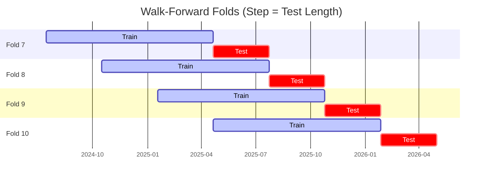

# Trading Strategy Pipeline Report

**Generated**: 2026-05-07 22:24:33

## Executive Summary

**WFO Training/Test period:** 2023-01-01 -> 2026-05-01  
**YTD performance window:** 2025-05-08 -> 2026-05-08  
**Coins:** 29

| | WFO Full Range | YTD |
|-|----------------|--------|
| Strategy CAGR | 43.32% | 86.27% |
| BTC buy & hold CAGR | 57.74% ❌ | -20.67% ✅ |
| S&P 500 CAGR | 21.05% ✅ | 30.99% ✅ |
| Strategy Sharpe | 1.24 | 1.69 |
| Max Drawdown | -38.67% | -30.81% |
| Total Trades | 448 | 150 |
| Win Rate | 36.38% | 34.00% |

## Result Validation (Training/Test Data)
**Period: 2023-01-01 -> 2026-05-01** — WFO-selected parameters replayed on the full training/test range.

### Combined Portfolio Performance

| Metric | Strategy | BTC (buy & hold) | S&P 500 (SPY) |
|--------|----------|------------------|---------------|
| Total Return | 231.41% | 356.05% | 88.88% |
| CAGR | 43.32% | 57.74% | 21.05% |
| Sharpe Ratio | 1.2360 | 1.2138 | 1.3834 |
| Max Drawdown | -38.67% | -49.89% | -18.76% |
| Total Trades | 448 | 1 | 1 |
| Win Rate | 36.38% | - | - |

## YTD Performance
**Period: 2025-05-08 -> 2026-05-08** — WFO-selected parameters replayed on the YTD window, no re-optimization.

| Metric | Strategy | BTC (buy & hold) | S&P 500 (SPY) |
|--------|----------|------------------|---------------|
| Total Return | 86.14% | -20.65% | 30.95% |
| CAGR | 86.27% | -20.67% | 30.99% |
| Sharpe Ratio | 1.6859 | -0.3606 | 2.2211 |
| Max Drawdown | -30.81% | -49.89% | -8.88% |
| Total Trades | 150 | 1 | 1 |
| Win Rate | 34.00% | - | - |

## Per-Coin Strategy Selection (WFO)

Best performing strategy per coin based on robustness scores (highest first).

| Symbol | Strategy | Selection | Robustness Score |
|--------|----------|-----------|------------------|
| VVV-USD | adx_filtered_rsi+atr_trailing | wfo_robustness | 1.0993 |
| ZEC-USD | macd_cross+atr_trailing | wfo_robustness | 1.0148 |
| DYDX-USD | supertrend_flip+atr_trailing | wfo_robustness | 0.6866 |
| OP-USD | donchian_breakout+atr_trailing | wfo_robustness | 0.5750 |
| NEAR-USD | rsi_reversal+atr_trailing | wfo_robustness | 0.5375 |
| ZRO-USD | psar_adx+trailing_stop | wfo_robustness | 0.5192 |
| PENGU-USD | supertrend_flip+fixed_sl_tp | wfo_robustness | 0.4534 |
| JTO-USD | psar_adx+atr_trailing | wfo_robustness | 0.4472 |
| XMR-USD | adx_filtered_rsi+atr_trailing | wfo_robustness | 0.4401 |
| JUP-USD | bbands_mean_reversion+fixed_sl_tp | wfo_robustness | 0.4309 |
| FET-USD | rsi_reversal+atr_trailing | wfo_robustness | 0.4198 |
| USDUC-USD | macd_cross+atr_trailing | wfo_robustness | 0.4152 |
| XRP-USD | psar_adx+fixed_sl_tp | wfo_robustness | 0.4080 |
| TAO-USD | donchian_breakout+atr_trailing | wfo_robustness | 0.3826 |
| TRX-USD | donchian_breakout+atr_trailing | wfo_robustness | 0.3603 |
| HBAR-USD | psar_adx+trailing_stop | wfo_robustness | 0.3519 |
| DOGE-USD | psar_adx+trailing_stop | wfo_robustness | 0.3310 |
| ENA-USD | psar_adx+trailing_stop | wfo_robustness | 0.3257 |
| B3-USD | stoch_rsi_reversal+atr_trailing | wfo_robustness | 0.3074 |
| SOL-USD | psar_adx+atr_trailing | wfo_robustness | 0.2971 |
| RENDER-USD | rsi_reversal+atr_trailing | wfo_robustness | 0.2871 |
| DASH-USD | supertrend_flip+atr_trailing | wfo_robustness | 0.2787 |
| SPX-USD | psar_adx+fixed_sl_tp | wfo_robustness | 0.2513 |
| PEPE-USD | ema_cross+atr_trailing | wfo_robustness | 0.2165 |
| ICP-USD | psar_adx+fixed_sl_tp | wfo_robustness | 0.2091 |
| VIRTUAL-USD | psar_adx+fixed_sl_tp | wfo_robustness | 0.2090 |
| AVAX-USD | psar_adx+atr_trailing | wfo_robustness | 0.1724 |
| XLM-USD | psar_adx+atr_trailing | wfo_robustness | 0.1580 |
| ADA-USD | psar_adx+fixed_sl_tp | wfo_robustness | 0.1575 |

### WFO Fold Timeline

### WFO Out-of-Sample Sharpe — Per Fold

Per-fold OOS Sharpe for each coin's winning strategy (folds ordered as above). Negative = strategy did not generalise.

| Symbol | Strategy+Exit | IS Rob | OOS Rob | Consistency | Fold 1 | Fold 2 | Fold 3 | Fold 4 | Fold 5 | Fold 6 | Fold 7 | Fold 8 | Fold 9 | Fold 10 |
|--------|---------------|--------|---------|-------------|--------|--------|--------|--------|--------|--------|--------|--------|--------|--------|
| OP-USD | donchian_breakout+atr_trailing | 0.0000 | 1.3142 | 50% | n/a | -1.726 | n/a | n/a | 5.533 | n/a | n/a | n/a | 4.497 | -1.979 |
| VVV-USD | adx_filtered_rsi+atr_trailing | 1.4282 | 0.9584 | 100% | n/a | n/a | n/a | n/a | n/a | n/a | 0.740 | 1.079 | 1.765 | 0.369 |
| DYDX-USD | supertrend_flip+atr_trailing | 1.1984 | 0.8511 | 62% | n/a | -6.377 | -6.270 | n/a | 6.480 | 2.364 | 5.465 | -7.798 | 7.642 | 0.051 |
| ZEC-USD | macd_cross+atr_trailing | 1.7351 | 0.8236 | 90% | 0.542 | 0.879 | 3.633 | 0.419 | 0.989 | -1.175 | 0.761 | 3.786 | 0.451 | 0.033 |
| USDUC-USD | macd_cross+atr_trailing | 0.9353 | 0.6373 | 43% | -7.347 | 6.268 | -0.043 | -2.914 | n/a | -6.379 | n/a | 3.542 | 5.236 | n/a |
| JTO-USD | psar_adx+atr_trailing | 1.3911 | 0.4989 | 44% | -4.391 | 0.237 | n/a | -6.289 | 9.830 | -2.071 | -6.180 | 9.723 | 2.761 | -3.018 |
| B3-USD | stoch_rsi_reversal+atr_trailing | 0.9500 | 0.3613 | 43% | n/a | -1.682 | n/a | -2.020 | -1.492 | n/a | 2.592 | 0.770 | -1.680 | 3.314 |
| DOGE-USD | psar_adx+trailing_stop | 0.7365 | 0.3598 | 60% | -2.247 | -0.857 | -0.122 | 1.073 | 0.488 | -1.672 | 1.550 | 0.834 | 0.280 | 1.480 |
| XRP-USD | psar_adx+fixed_sl_tp | 1.5833 | 0.2541 | 50% | 0.867 | -1.715 | 0.728 | -2.609 | 5.091 | -0.474 | 2.490 | 1.197 | -0.138 | -2.044 |
| TRX-USD | donchian_breakout+atr_trailing | 1.1514 | 0.2419 | 60% | 0.474 | 1.226 | -1.541 | -0.660 | 1.692 | -1.210 | 0.855 | -0.817 | 0.248 | 1.765 |
| ENA-USD | psar_adx+trailing_stop | 1.1012 | 0.2138 | 57% | n/a | n/a | -3.141 | 1.300 | 0.460 | n/a | 1.302 | -0.409 | -1.052 | 1.914 |
| TAO-USD | donchian_breakout+atr_trailing | 1.8309 | 0.1719 | 43% | n/a | n/a | n/a | 2.180 | -0.666 | -0.104 | 0.855 | -1.629 | -0.867 | 1.949 |
| ZRO-USD | psar_adx+trailing_stop | 1.7876 | 0.1468 | 75% | n/a | n/a | 0.833 | -1.671 | 0.901 | 0.541 | 1.869 | -1.408 | 0.135 | 0.199 |
| NEAR-USD | rsi_reversal+atr_trailing | 1.9940 | 0.1362 | 70% | 3.390 | 0.770 | -2.020 | 1.067 | 0.351 | -1.103 | 0.242 | -0.939 | 0.741 | 0.768 |
| SOL-USD | psar_adx+atr_trailing | 1.2439 | 0.1035 | 56% | 3.023 | -0.987 | 2.162 | -0.704 | -1.438 | 0.287 | 1.377 | 0.149 | n/a | -0.673 |
| JUP-USD | bbands_mean_reversion+fixed_sl_tp | 1.4695 | 0.0597 | 86% | n/a | 2.800 | 1.865 | 2.960 | n/a | n/a | 2.269 | -9.670 | 3.544 | 0.788 |
| PENGU-USD | supertrend_flip+fixed_sl_tp | 2.3818 | 0.0155 | 50% | n/a | n/a | n/a | n/a | n/a | n/a | 4.014 | -3.127 | -1.115 | 0.720 |
| PEPE-USD | ema_cross+atr_trailing | 1.2425 | -0.0376 | 50% | 2.101 | 3.466 | 0.814 | -1.666 | 2.021 | -2.475 | 1.209 | -0.662 | -0.160 | -0.854 |
| XMR-USD | adx_filtered_rsi+atr_trailing | 2.5569 | -0.0898 | 50% | -4.161 | -2.553 | 1.138 | -1.192 | -0.184 | 0.030 | 1.400 | 0.086 | 1.771 | -1.682 |
| ICP-USD | psar_adx+fixed_sl_tp | 1.3224 | -0.1400 | 60% | 3.285 | 2.498 | 1.507 | -2.817 | -3.239 | 1.364 | 2.430 | -1.643 | 2.422 | -3.213 |
| DASH-USD | supertrend_flip+atr_trailing | 1.6866 | -0.1541 | 60% | 0.370 | 1.043 | -1.836 | 0.947 | 4.086 | -3.541 | -0.225 | 0.207 | 1.265 | -2.347 |
| XLM-USD | psar_adx+atr_trailing | 1.2069 | -0.1561 | 50% | 1.675 | -3.445 | -3.107 | 1.472 | 3.817 | -1.226 | 1.382 | 0.323 | -1.686 | -1.086 |
| FET-USD | rsi_reversal+atr_trailing | 2.6479 | -0.1753 | 50% | 0.985 | 2.741 | -1.073 | -0.139 | 0.361 | -0.917 | 0.229 | -3.800 | -0.428 | 1.993 |
| AVAX-USD | psar_adx+atr_trailing | 1.3259 | -0.2053 | 57% | 1.979 | n/a | 1.043 | 0.677 | n/a | -1.387 | 1.912 | -0.836 | -2.084 | n/a |
| ADA-USD | psar_adx+fixed_sl_tp | 1.3435 | -0.2159 | 50% | 3.511 | 0.699 | -0.712 | 0.274 | 3.746 | -0.688 | -0.034 | -1.565 | -2.881 | 0.100 |
| HBAR-USD | psar_adx+trailing_stop | 2.2663 | -0.3009 | 67% | n/a | n/a | n/a | n/a | n/a | n/a | 0.915 | -3.271 | 1.196 | n/a |
| SPX-USD | psar_adx+fixed_sl_tp | 2.2474 | -0.3887 | 50% | n/a | n/a | n/a | n/a | 1.285 | 2.864 | 2.556 | -0.726 | -3.730 | -2.670 |
| VIRTUAL-USD | psar_adx+fixed_sl_tp | 2.1739 | -0.3889 | 40% | n/a | n/a | n/a | n/a | n/a | -1.785 | 1.457 | 1.088 | -1.785 | -1.088 |
| RENDER-USD | rsi_reversal+atr_trailing | 2.5327 | -0.4291 | 50% | n/a | n/a | n/a | n/a | 0.864 | 0.864 | -0.644 | -1.901 | 0.354 | -1.664 |

## Full-Period Performance (Per-Coin)

Performance metrics from running WFO-selected parameters on full-range data.

| Symbol | Strategy | Exit | Selection | Return % | Sharpe | Max DD % | Trades | Win Rate % |
|--------|----------|------|-----------|----------|--------|----------|--------|-----------|
| XRP-USD | psar_adx | fixed_sl_tp | wfo_robustness | 23.05% | 1.1988 | -6.38% | 61 | 40.98% |
| XLM-USD | psar_adx | atr_trailing | wfo_robustness | 34.41% | 1.0217 | -11.52% | 40 | 35.00% |
| TRX-USD | donchian_breakout | atr_trailing | wfo_robustness | 48.43% | 0.8589 | -23.60% | 1 | 100.00% |
| ZEC-USD | macd_cross | atr_trailing | wfo_robustness | 33.52% | 0.8013 | -12.98% | 61 | 40.98% |
| ADA-USD | psar_adx | fixed_sl_tp | wfo_robustness | 15.35% | 0.7991 | -8.49% | 16 | 37.50% |
| PEPE-USD | ema_cross | atr_trailing | wfo_robustness | 52.38% | 0.7226 | -24.58% | 59 | 32.20% |
| AVAX-USD | psar_adx | atr_trailing | wfo_robustness | 15.88% | 0.5997 | -8.14% | 60 | 38.33% |
| SOL-USD | psar_adx | atr_trailing | wfo_robustness | 48.86% | 0.4999 | -50.46% | 1 | 100.00% |
| PENGU-USD | supertrend_flip | fixed_sl_tp | wfo_robustness | 11.78% | 0.4463 | -15.24% | 34 | 29.41% |
| DOGE-USD | psar_adx | trailing_stop | wfo_robustness | 4.37% | 0.4075 | -4.12% | 22 | 54.55% |
| TAO-USD | donchian_breakout | atr_trailing | wfo_robustness | 8.04% | 0.3037 | -12.07% | 33 | 33.33% |
| DASH-USD | supertrend_flip | atr_trailing | wfo_robustness | -1.91% | 0.0112 | -19.65% | 1 | 0.00% |
| XMR-USD | adx_filtered_rsi | atr_trailing | wfo_robustness | -6.50% | -0.3785 | -12.52% | 59 | 27.12% |

---

*For pipeline methodology, fold structure, and benchmark definitions see [docs/architecture.md](../../../docs/architecture.md).*

---

*Report generated by ggTrader Pipeline*