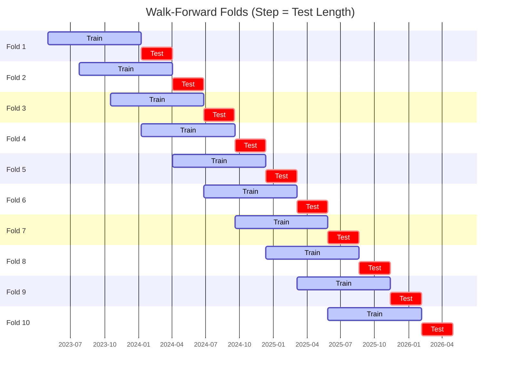

# Trading Strategy Pipeline Report

**Generated**: 2026-05-08 04:45:34

## Executive Summary

**WFO Training/Test period:** n/a  
**Coins:** 7

| | WFO Full Range | YTD |
|-|----------------|--------|
| Strategy CAGR | n/a | n/a |
| BTC buy & hold CAGR | n/a | n/a |
| S&P 500 CAGR | n/a | n/a |
| Strategy Sharpe | n/a | n/a |
| Max Drawdown | n/a | n/a |
| Total Trades | 0 | n/a |
| Win Rate | n/a | n/a |

## Result Validation (Training/Test Data)
**Period: n/a** — WFO-selected parameters replayed on the full training/test range.

### Combined Portfolio Performance

| Metric | Strategy | BTC (buy & hold) | S&P 500 (SPY) |
|--------|----------|------------------|---------------|
| Total Return | n/a | n/a | n/a |
| CAGR | n/a | n/a | n/a |
| Sharpe Ratio | n/a | n/a | n/a |
| Max Drawdown | n/a | n/a | n/a |
| Total Trades | 0 | 1 | 1 |
| Win Rate | n/a | - | - |

## YTD Performance

*Not executed.*

## Per-Coin Strategy Selection (WFO)

Best performing strategy per coin based on robustness scores (highest first).

| Symbol | Strategy | Selection | Robustness Score |
|--------|----------|-----------|------------------|
| ZEC-USD | macd_cross+atr_trailing | wfo_robustness | 0.4180 |
| DOGE-USD | adx_filtered_rsi+trailing_stop | wfo_robustness | 0.4175 |
| XLM-USD | psar_adx+trailing_stop | wfo_robustness | 0.3797 |
| ETH-USD | psar_adx+atr_trailing | wfo_robustness | 0.3440 |
| XRP-USD | psar_adx+atr_trailing | wfo_robustness | 0.2762 |
| ADA-USD | psar_adx+fixed_sl_tp | wfo_robustness | 0.1906 |
| DASH-USD | psar_adx+fixed_sl_tp | wfo_robustness | 0.1438 |

### WFO Fold Timeline

### WFO Out-of-Sample Sharpe — Per Fold

Per-fold OOS Sharpe for each coin's winning strategy (folds ordered as above). Negative = strategy did not generalise.

| Symbol | Strategy+Exit | IS Rob | OOS Rob | Consistency | Fold 1 | Fold 2 | Fold 3 | Fold 4 | Fold 5 | Fold 6 | Fold 7 | Fold 8 | Fold 9 | Fold 10 |
|--------|---------------|--------|---------|-------------|--------|--------|--------|--------|--------|--------|--------|--------|--------|--------|
| ZEC-USD | macd_cross+atr_trailing | 1.4719 | 0.3247 | 50% | 1.118 | -1.691 | 1.443 | 2.071 | -0.900 | 0.466 | -1.489 | 4.251 | -1.174 | -0.021 |
| XRP-USD | psar_adx+atr_trailing | 0.9398 | 0.1610 | 60% | -4.679 | 0.570 | 3.325 | 5.354 | 0.058 | 0.910 | 1.002 | -1.205 | -1.987 | -0.268 |
| XLM-USD | psar_adx+trailing_stop | 1.7057 | 0.1369 | 50% | -2.588 | -2.696 | 0.582 | 3.609 | -2.023 | -0.492 | 1.229 | 0.007 | -0.665 | 1.446 |
| ETH-USD | psar_adx+atr_trailing | 1.6531 | 0.0778 | 50% | -1.297 | -0.393 | 0.558 | 0.777 | -2.910 | 2.214 | 2.109 | 1.579 | -2.646 | n/a |
| DOGE-USD | adx_filtered_rsi+trailing_stop | 2.3198 | -0.0399 | 50% | 0.769 | -2.107 | -1.241 | 2.669 | -2.192 | 0.775 | 2.734 | -1.575 | -1.244 | 0.521 |
| ADA-USD | psar_adx+fixed_sl_tp | 1.5400 | -0.1649 | 40% | -0.857 | -1.164 | 0.289 | 5.546 | -0.565 | -3.184 | 0.508 | 0.373 | -1.242 | -0.553 |
| DASH-USD | psar_adx+fixed_sl_tp | 1.4134 | -0.2771 | 50% | 2.242 | 0.946 | 0.981 | 0.785 | -1.872 | 0.394 | -0.150 | -1.770 | -0.246 | -0.821 |

## Full-Period Performance (Per-Coin)

Performance metrics from running WFO-selected parameters on full-range data.

---

*For pipeline methodology, fold structure, and benchmark definitions see [docs/architecture.md](../../../docs/architecture.md).*

---

*Report generated by ggTrader Pipeline*