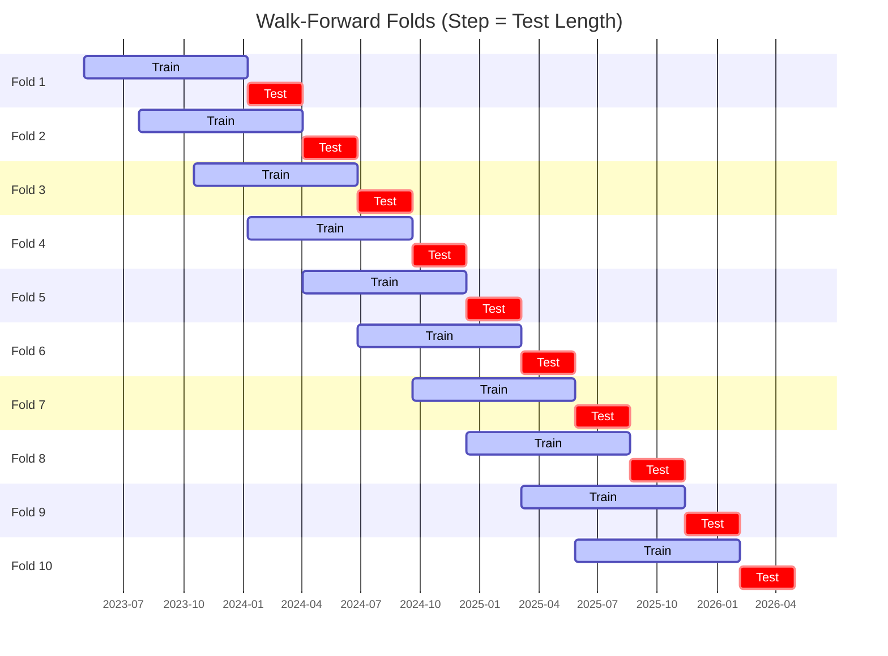

# Trading Strategy Pipeline Report

**Generated**: 2026-05-08 08:00:13

## Executive Summary

**WFO Training/Test period:** n/a  
**Coins:** 3

| | WFO Full Range | YTD |
|-|----------------|--------|
| Strategy CAGR | n/a | n/a |
| BTC buy & hold CAGR | n/a | n/a |
| S&P 500 CAGR | n/a | n/a |
| Strategy Sharpe | n/a | n/a |
| Max Drawdown | n/a | n/a |
| Total Trades | 0 | n/a |
| Win Rate | n/a | n/a |

## Result Validation (Training/Test Data)
**Period: n/a** — WFO-selected parameters replayed on the full training/test range.

### Combined Portfolio Performance

| Metric | Strategy | BTC (buy & hold) | S&P 500 (SPY) |
|--------|----------|------------------|---------------|
| Total Return | n/a | n/a | n/a |
| CAGR | n/a | n/a | n/a |
| Sharpe Ratio | n/a | n/a | n/a |
| Max Drawdown | n/a | n/a | n/a |
| Total Trades | 0 | 1 | 1 |
| Win Rate | n/a | - | - |

## YTD Performance

*Not executed.*

## Per-Coin Strategy Selection (WFO)

Best performing strategy per coin based on robustness scores (highest first).

| Symbol | Strategy | Selection | Robustness Score |
|--------|----------|-----------|------------------|
| WIF-USD | psar_adx+trailing_stop | wfo_robustness | 0.5635 |
| CRV-USD | psar_adx+fixed_sl_tp | wfo_robustness | 0.2377 |
| ZRO-USD | keltner_breakout+atr_trailing | wfo_robustness | 0.1964 |

### WFO Fold Timeline

### WFO Out-of-Sample Sharpe — Per Fold

Per-fold OOS Sharpe for each coin's winning strategy (folds ordered as above). Negative = strategy did not generalise.

| Symbol | Strategy+Exit | IS Rob | OOS Rob | Consistency | Fold 1 | Fold 2 | Fold 3 | Fold 4 | Fold 5 | Fold 6 | Fold 7 | Fold 8 | Fold 9 | Fold 10 |
|--------|---------------|--------|---------|-------------|--------|--------|--------|--------|--------|--------|--------|--------|--------|--------|
| WIF-USD | psar_adx+trailing_stop | 1.9233 | 0.2144 | 70% | 4.620 | 0.184 | 0.986 | 1.336 | -0.962 | 1.831 | 1.747 | 0.322 | -1.407 | -1.233 |
| ZRO-USD | keltner_breakout+atr_trailing | 1.4539 | -0.1129 | 40% | nan | nan | nan | 1.391 | -3.117 | 0.996 | -0.696 | -1.968 | 0.764 | 1.180 |
| CRV-USD | psar_adx+fixed_sl_tp | 1.7230 | -0.2534 | 60% | -0.899 | 0.503 | 0.619 | 1.778 | 0.533 | -1.235 | 2.450 | -2.096 | -3.981 | 1.228 |

## Full-Period Performance (Per-Coin)

Performance metrics from running WFO-selected parameters on full-range data.

---

*For pipeline methodology, fold structure, and benchmark definitions see [docs/architecture.md](../../../docs/architecture.md).*

---

*Report generated by ggTrader Pipeline*