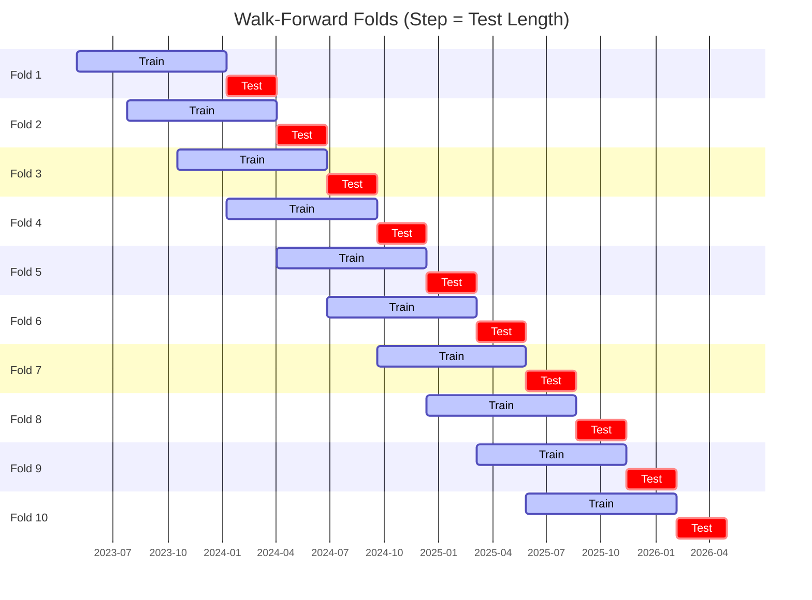

# Trading Strategy Pipeline Report

**Generated**: 2026-05-08 14:04:29

## Executive Summary

**WFO Training/Test period:** 2023-05-02 -> 2026-05-01  
**YTD performance window:** 2025-05-09 -> 2026-05-08  
**Coins:** 17

| | WFO Full Range | YTD |
|-|----------------|--------|
| Strategy CAGR | 29.03% | 43.61% |
| BTC buy & hold CAGR | 39.06% ❌ | -22.85% ✅ |
| S&P 500 CAGR | 22.06% ✅ | 32.25% ✅ |
| Strategy Sharpe | 1.04 | 1.17 |
| Max Drawdown | -33.73% | -34.71% |
| Total Trades | 602 | 204 |
| Win Rate | 34.39% | 32.35% |

## Result Validation (Training/Test Data)
**Period: 2023-05-02 -> 2026-05-01** — WFO-selected parameters replayed on the full training/test range.

### Combined Portfolio Performance

| Metric | Strategy | BTC (buy & hold) | S&P 500 (SPY) |
|--------|----------|------------------|---------------|
| Total Return | 114.72% | 168.75% | 81.78% |
| CAGR | 29.03% | 39.06% | 22.06% |
| Sharpe Ratio | 1.0370 | 0.9498 | 1.2589 |
| Max Drawdown | -33.73% | -49.89% | -14.53% |
| Total Trades | 602 | 1 | 1 |
| Win Rate | 34.39% | - | - |

## YTD Performance
**Period: 2025-05-09 -> 2026-05-08** — WFO-selected parameters replayed on the YTD window, no re-optimization.

| Metric | Strategy | BTC (buy & hold) | S&P 500 (SPY) |
|--------|----------|------------------|---------------|
| Total Return | 43.55% | -22.83% | 32.20% |
| CAGR | 43.61% | -22.85% | 32.25% |
| Sharpe Ratio | 1.1675 | -0.4300 | 2.7294 |
| Max Drawdown | -34.71% | -49.89% | -7.54% |
| Total Trades | 204 | 1 | 1 |
| Win Rate | 32.35% | - | - |

## Per-Coin Strategy Selection (WFO)

Best performing strategy per coin based on robustness scores (highest first).

| Symbol | Strategy | Selection | Robustness Score |
|--------|----------|-----------|------------------|
| TRX-USD | psar_adx+atr_trailing | wfo_robustness | 0.7567 |
| VVV-USD | ema_cross+atr_trailing | wfo_robustness | 0.6688 |
| WIF-USD | psar_adx+trailing_stop | wfo_robustness | 0.5635 |
| XMR-USD | adx_filtered_rsi+atr_trailing | wfo_robustness | 0.5289 |
| ZEC-USD | macd_cross+atr_trailing | wfo_robustness | 0.4180 |
| DOGE-USD | adx_filtered_rsi+trailing_stop | wfo_robustness | 0.4175 |
| XLM-USD | psar_adx+trailing_stop | wfo_robustness | 0.3797 |
| ETH-USD | psar_adx+atr_trailing | wfo_robustness | 0.3440 |
| AVAX-USD | psar_adx+fixed_sl_tp | wfo_robustness | 0.3440 |
| PEPE-USD | psar_adx+atr_trailing | wfo_robustness | 0.2815 |
| XRP-USD | psar_adx+atr_trailing | wfo_robustness | 0.2762 |
| CRV-USD | psar_adx+fixed_sl_tp | wfo_robustness | 0.2377 |
| FET-USD | supertrend_flip+fixed_sl_tp | wfo_robustness | 0.2292 |
| NEAR-USD | donchian_breakout+atr_trailing | wfo_robustness | 0.2112 |
| ZRO-USD | keltner_breakout+atr_trailing | wfo_robustness | 0.1964 |
| ADA-USD | psar_adx+fixed_sl_tp | wfo_robustness | 0.1906 |
| DASH-USD | psar_adx+fixed_sl_tp | wfo_robustness | 0.1438 |

### WFO Fold Timeline

### WFO Out-of-Sample Sharpe — Per Fold

Per-fold OOS Sharpe for each coin's winning strategy (folds ordered as above). Negative = strategy did not generalise.

| Symbol | Strategy+Exit | IS Rob | OOS Rob | Consistency | Fold 1 | Fold 2 | Fold 3 | Fold 4 | Fold 5 | Fold 6 | Fold 7 | Fold 8 | Fold 9 | Fold 10 |
|--------|---------------|--------|---------|-------------|--------|--------|--------|--------|--------|--------|--------|--------|--------|--------|
| VVV-USD | ema_cross+atr_trailing | 1.9082 | 0.9193 | 40% | n/a | n/a | n/a | n/a | n/a | 1.827 | 1.168 | -1.785 | 2.526 | 1.646 |
| TRX-USD | psar_adx+atr_trailing | 1.2045 | 0.7556 | 80% | 1.010 | 0.231 | 2.152 | 1.656 | 1.214 | 1.181 | 2.930 | -2.957 | -0.834 | 3.238 |
| ZEC-USD | macd_cross+atr_trailing | 1.4719 | 0.3247 | 50% | 1.118 | -1.691 | 1.443 | 2.071 | -0.900 | 0.466 | -1.489 | 4.251 | -1.174 | -0.021 |
| WIF-USD | psar_adx+trailing_stop | 1.9233 | 0.2144 | 70% | 4.620 | 0.184 | 0.986 | 1.336 | -0.962 | 1.831 | 1.747 | 0.322 | -1.407 | -1.233 |
| XRP-USD | psar_adx+atr_trailing | 0.9398 | 0.1610 | 60% | -4.679 | 0.570 | 3.325 | 5.354 | 0.058 | 0.910 | 1.002 | -1.205 | -1.987 | -0.268 |
| XLM-USD | psar_adx+trailing_stop | 1.7057 | 0.1369 | 50% | -2.588 | -2.696 | 0.582 | 3.609 | -2.023 | -0.492 | 1.229 | 0.007 | -0.665 | 1.446 |
| AVAX-USD | psar_adx+fixed_sl_tp | 1.5321 | 0.1296 | 50% | 0.783 | -1.049 | -0.455 | 2.477 | -2.851 | 0.678 | 0.566 | -1.388 | -0.160 | 2.094 |
| ETH-USD | psar_adx+atr_trailing | 1.6531 | 0.0778 | 50% | -1.297 | -0.393 | 0.558 | 0.777 | -2.910 | 2.214 | 2.109 | 1.579 | -2.646 | n/a |
| PEPE-USD | psar_adx+atr_trailing | 1.3867 | 0.0089 | 56% | 3.148 | 4.770 | 0.276 | 1.991 | -1.934 | -0.600 | n/a | -0.759 | -2.256 | 1.396 |
| XMR-USD | adx_filtered_rsi+atr_trailing | 2.2598 | 0.0064 | 70% | -2.217 | 1.323 | 0.212 | 0.198 | 0.280 | 3.499 | -3.738 | 1.839 | 1.748 | -2.830 |
| DOGE-USD | adx_filtered_rsi+trailing_stop | 2.3198 | -0.0399 | 50% | 0.769 | -2.107 | -1.241 | 2.669 | -2.192 | 0.775 | 2.734 | -1.575 | -1.244 | 0.521 |
| FET-USD | supertrend_flip+fixed_sl_tp | 1.5322 | -0.0613 | 40% | 3.396 | -0.178 | -0.848 | -0.423 | -4.400 | 2.485 | -2.847 | 0.176 | -0.642 | 2.814 |
| ZRO-USD | keltner_breakout+atr_trailing | 1.4539 | -0.1129 | 40% | n/a | n/a | n/a | 1.391 | -3.117 | 0.996 | -0.696 | -1.968 | 0.764 | 1.180 |
| ADA-USD | psar_adx+fixed_sl_tp | 1.5400 | -0.1649 | 40% | -0.857 | -1.164 | 0.289 | 5.546 | -0.565 | -3.184 | 0.508 | 0.373 | -1.242 | -0.553 |
| CRV-USD | psar_adx+fixed_sl_tp | 1.7230 | -0.2534 | 60% | -0.899 | 0.503 | 0.619 | 1.778 | 0.533 | -1.235 | 2.450 | -2.096 | -3.981 | 1.228 |
| DASH-USD | psar_adx+fixed_sl_tp | 1.4134 | -0.2771 | 50% | 2.242 | 0.946 | 0.981 | 0.785 | -1.872 | 0.394 | -0.150 | -1.770 | -0.246 | -0.821 |
| NEAR-USD | donchian_breakout+atr_trailing | 1.8467 | -0.3086 | 50% | 0.753 | -2.031 | -1.135 | 2.078 | -3.269 | 1.399 | -1.301 | 0.586 | -1.678 | 0.588 |

## Full-Period Performance (Per-Coin)

Performance metrics from running WFO-selected parameters on full-range data.

| Symbol | Strategy | Exit | Selection | Return % | Sharpe | Max DD % | Trades | Win Rate % |
|--------|----------|------|-----------|----------|--------|----------|--------|-----------|
| XRP-USD | psar_adx | atr_trailing | wfo_robustness | 39.20% | 1.2917 | -8.42% | 47 | 36.17% |
| XLM-USD | psar_adx | trailing_stop | wfo_robustness | 23.67% | 0.9706 | -8.08% | 22 | 45.45% |
| DASH-USD | psar_adx | fixed_sl_tp | wfo_robustness | 29.16% | 0.9587 | -9.38% | 38 | 65.79% |
| PEPE-USD | psar_adx | atr_trailing | wfo_robustness | 65.85% | 0.9507 | -21.24% | 30 | 43.33% |
| ZEC-USD | macd_cross | atr_trailing | wfo_robustness | 32.34% | 0.8224 | -12.98% | 58 | 39.66% |
| ADA-USD | psar_adx | fixed_sl_tp | wfo_robustness | 11.17% | 0.6687 | -8.49% | 14 | 28.57% |
| AVAX-USD | psar_adx | fixed_sl_tp | wfo_robustness | -3.30% | -0.2253 | -5.87% | 63 | 38.10% |
| DOGE-USD | adx_filtered_rsi | trailing_stop | wfo_robustness | -4.63% | -0.2433 | -9.91% | 103 | 26.21% |
| XMR-USD | adx_filtered_rsi | atr_trailing | wfo_robustness | -4.48% | -0.2661 | -11.51% | 53 | 24.53% |
| ETH-USD | donchian_breakout | atr_trailing | trade_freq_fallback | -5.95% | -0.4960 | -8.88% | 72 | 23.61% |
| TRX-USD | psar_adx | atr_trailing | wfo_robustness | -7.82% | -0.6938 | -8.10% | 108 | 31.48% |

---

*For pipeline methodology, fold structure, and benchmark definitions see [docs/architecture.md](../../../docs/architecture.md).*

---

*Report generated by ggTrader Pipeline*