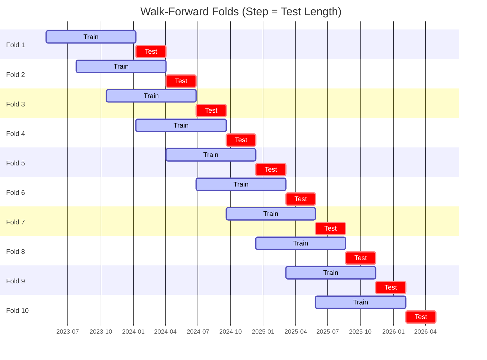

# Trading Strategy Pipeline Report

**Generated**: 2026-05-09 21:25:00

## Executive Summary

**WFO Training/Test period:** 2023-05-02 -> 2026-05-01  
**YTD performance window:** 2025-05-10 -> 2026-05-10  
**Coins:** 4

| | WFO Full Range | YTD |
|-|----------------|--------|
| Strategy CAGR | -9.90% | -14.80% |
| BTC buy & hold CAGR | 39.06% ❌ | -23.11% ✅ |
| S&P 500 CAGR | 22.06% ❌ | 28.01% ❌ |
| Strategy Sharpe | -0.35 | -0.75 |
| Max Drawdown | -35.75% | -27.46% |
| Total Trades | 322 | 87 |
| Win Rate | 27.64% | 29.89% |

## Result Validation (Training/Test Data)
**Period: 2023-05-02 -> 2026-05-01** — WFO-selected parameters replayed on the full training/test range.

### Combined Portfolio Performance

| Metric | Strategy | BTC (buy & hold) | S&P 500 (SPY) |
|--------|----------|------------------|---------------|
| Total Return | -26.83% | 168.75% | 81.78% |
| CAGR | -9.90% | 39.06% | 22.06% |
| Sharpe Ratio | -0.3458 | 0.9498 | 1.2589 |
| Max Drawdown | -35.75% | -49.89% | -14.53% |
| Total Trades | 322 | 1 | 1 |
| Win Rate | 27.64% | - | - |

## YTD Performance
**Period: 2025-05-10 -> 2026-05-10** — WFO-selected parameters replayed on the YTD window, no re-optimization.

| Metric | Strategy | BTC (buy & hold) | S&P 500 (SPY) |
|--------|----------|------------------|---------------|
| Total Return | -14.79% | -23.09% | 27.97% |
| CAGR | -14.80% | -23.11% | 28.01% |
| Sharpe Ratio | -0.7518 | -0.4390 | 2.5426 |
| Max Drawdown | -27.46% | -49.89% | -7.54% |
| Total Trades | 87 | 1 | 1 |
| Win Rate | 29.89% | - | - |

## Per-Coin Strategy Selection (WFO)

Best performing strategy per coin based on robustness scores (highest first).

| Symbol | Strategy | Selection | Robustness Score |
|--------|----------|-----------|------------------|
| TRX-USD | psar_adx+atr_trailing | wfo_robustness | 0.7567 |
| DOGE-USD | adx_filtered_rsi+trailing_stop | wfo_robustness | 0.4175 |
| ETH-USD | psar_adx+atr_trailing | wfo_robustness | 0.3742 |
| ADA-USD | psar_adx+fixed_sl_tp | wfo_robustness | 0.2381 |

### WFO Fold Timeline

### WFO Out-of-Sample Sharpe — Per Fold

Per-fold OOS Sharpe for each coin's winning strategy (folds ordered as above). Negative = strategy did not generalise.

| Symbol | Strategy+Exit | IS Rob | OOS Rob | Consistency | Fold 1 | Fold 2 | Fold 3 | Fold 4 | Fold 5 | Fold 6 | Fold 7 | Fold 8 | Fold 9 | Fold 10 |
|--------|---------------|--------|---------|-------------|--------|--------|--------|--------|--------|--------|--------|--------|--------|--------|
| TRX-USD | psar_adx+atr_trailing | 1.2045 | 0.7556 | 80% | 1.010 | 0.231 | 2.152 | 1.656 | 1.214 | 1.181 | 2.930 | -2.957 | -0.834 | 3.238 |
| ETH-USD | psar_adx+atr_trailing | 1.6435 | 0.0593 | 60% | -1.230 | 0.120 | 0.480 | -0.808 | -2.861 | 3.958 | 0.326 | 1.676 | -2.580 | 0.583 |
| DOGE-USD | adx_filtered_rsi+trailing_stop | 2.3198 | -0.0399 | 50% | 0.769 | -2.107 | -1.241 | 2.669 | -2.192 | 0.775 | 2.734 | -1.575 | -1.244 | 0.521 |
| ADA-USD | psar_adx+fixed_sl_tp | 1.5611 | -0.1249 | 50% | -0.485 | -1.539 | 0.289 | 5.297 | 0.289 | -3.184 | 2.933 | 0.373 | -3.297 | -0.465 |

## Full-Period Performance (Per-Coin)

Performance metrics from running WFO-selected parameters on full-range data.

| Symbol | Strategy | Exit | Selection | Return % | Sharpe | Max DD % | Trades | Win Rate % |
|--------|----------|------|-----------|----------|--------|----------|--------|-----------|
| ADA-USD | psar_adx | fixed_sl_tp | wfo_robustness | 4.31% | 0.2430 | -10.17% | 43 | 25.58% |
| DOGE-USD | adx_filtered_rsi | trailing_stop | wfo_robustness | -4.63% | -0.2433 | -9.91% | 103 | 26.21% |
| ETH-USD | donchian_breakout | atr_trailing | trade_freq_fallback | -5.95% | -0.4960 | -8.88% | 72 | 23.61% |
| TRX-USD | psar_adx | atr_trailing | wfo_robustness | -7.82% | -0.6938 | -8.10% | 108 | 31.48% |

---

*For pipeline methodology, fold structure, and benchmark definitions see [docs/architecture.md](../../../docs/architecture.md).*

---

*Report generated by ggTrader Pipeline*