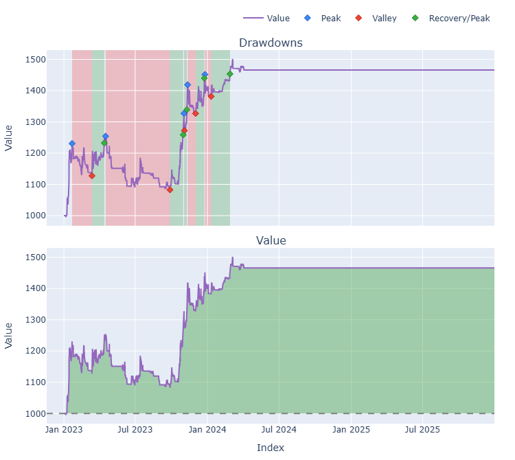
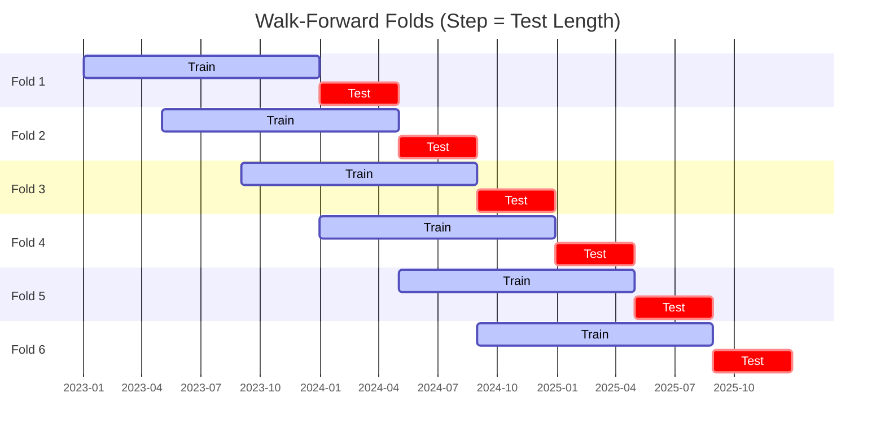

# Trading Strategy Pipeline Report

**Generated**: 2026-03-28 09:42:20

## Executive Summary

**WFO Training/Test period:** n/a  
**Coins:** 5

| | WFO Full Range | YTD |
|-|----------------|--------|
| Strategy CAGR | n/a | n/a |
| BTC buy & hold CAGR | n/a | n/a |
| S&P 500 CAGR | n/a | n/a |
| Strategy Sharpe | n/a | n/a |
| Max Drawdown | n/a | n/a |
| Total Trades | 0 | n/a |
| Win Rate | n/a | n/a |

### Full Range Portfolio

## Result Validation (Training/Test Data)
**Period: n/a** — WFO-selected parameters replayed on the full training/test range.

### Combined Portfolio Performance

| Metric | Strategy | BTC (buy & hold) | S&P 500 (SPY) | Excess vs BTC |
|--------|----------|------------------|---------------|---------------|
| Total Return | n/a | n/a | n/a | - |
| CAGR | n/a | n/a | n/a | n/a |
| Sharpe Ratio | n/a | n/a | n/a | - |
| Max Drawdown | n/a | n/a | n/a | - |
| Total Trades | 0 | 1 | 1 | - |
| Win Rate | n/a | - | - | - |

## YTD Performance

*Not executed.*

## Per-Coin Strategy Selection (WFO)

Best performing strategy per coin based on robustness scores (highest first).

| Symbol | Strategy | Selection | Robustness Score |
|--------|----------|-----------|------------------|
| ETH-USD | supertrend_flip+atr_trailing | wfo_robustness | 0.7094 |
| ZEC-USD | supertrend_flip+atr_trailing | wfo_robustness | 0.5370 |
| SOL-USD | ema_cross+atr_trailing | wfo_robustness | 0.5235 |
| SUI-USD | ema_cross+fixed_sl_tp | wfo_robustness | 0.3128 |
| BTC-USD | rsi_reversal+atr_trailing | wfo_robustness | 0.2560 |

### WFO Fold Timeline

### WFO Out-of-Sample Sharpe — Per Fold

Per-fold OOS Sharpe for each coin's winning strategy (folds ordered as above). Negative = strategy did not generalise.

| Symbol | Strategy+Exit | IS Rob | OOS Rob | Consistency | Fold 1 | Fold 2 | Fold 3 | Fold 4 | Fold 5 | Fold 6 |
|--------|---------------|--------|---------|-------------|--------|--------|--------|--------|--------|--------|
| ETH-USD | supertrend_flip+atr_trailing | 1.0647 | 0.6739 | 83% | 0.010 | 0.770 | 1.769 | -3.405 | 4.079 | 0.759 |
| ZEC-USD | supertrend_flip+atr_trailing | 2.5656 | 0.2709 | 33% | nan | nan | nan | -0.498 | -2.076 | 2.982 |
| SOL-USD | ema_cross+atr_trailing | 1.7893 | 0.1871 | 60% | n/a | -1.182 | 0.651 | -1.260 | 0.894 | 1.031 |
| BTC-USD | rsi_reversal+atr_trailing | 1.7165 | -0.1367 | 33% | 2.868 | -3.269 | 1.564 | -0.253 | -0.157 | -0.571 |
| SUI-USD | ema_cross+fixed_sl_tp | 2.3463 | -0.4933 | 50% | 2.535 | -2.557 | 2.003 | 0.605 | -1.294 | -2.272 |

## Full-Period Performance (Per-Coin)

Performance metrics from running WFO-selected parameters on full-range data.

---

*For pipeline methodology, fold structure, and benchmark definitions see [docs/UNIFIED_PIPELINE.md](../docs/UNIFIED_PIPELINE.md).*

---

*Report generated by ggTrader Pipeline*