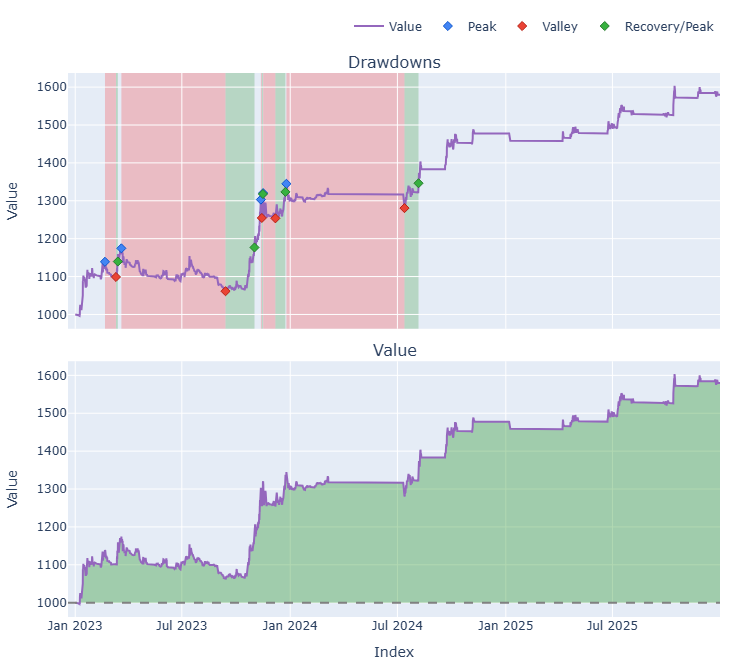

# Trading Strategy Pipeline Report

**Generated**: 2026-03-25 22:54:30

## Executive Summary

## Phase 2: Result Validation (Full Data)

### Combined Portfolio Performance (Full 3-Year Backtest)

| Metric | Strategy | Buy & Hold | Excess |
|--------|----------|------------|--------|
| Backtest period | 2023-01-01 -> 2025-12-30 | - | - |
| Total Return | 43.87% | 426.04% | - |
| CAGR | 12.90% | 74.01% | -61.11% |
| Sharpe Ratio | 0.7761 | 1.4255 | - |
| Max Drawdown | -20.76% | -34.46% | - |
| Total Trades | 361 | 1 | - |
| Win Rate | 35.73% | - | - |

## Phase 3: Recent Performance (Past Year)

Combined portfolio replay on the **recent-only** window below using the same entry/exit/params chosen by WFO on the full training range (no re-optimization).

| Metric | Strategy | Buy & Hold | Excess |
|--------|----------|------------|--------|
| Backtest period | 2025-03-26 -> 2026-03-26 | - | - |
| Total Return | -14.66% | 0.00% | - |
| CAGR | -14.67% | 0.00% | -14.67% |
| Sharpe Ratio | -1.3596 | n/a | - |
| Max Drawdown | -24.80% | 0.00% | - |
| Total Trades | 163 | 0 | - |
| Win Rate | 28.22% | - | - |

## Phase 0: Sensitivity Analysis Findings

Analysis of parameter impact across expanded ranges for each strategy.

*No sensitivity phase was run (default pipeline omits Phase 0 unless you pass `--sensitivity`); WFO used the configured parameter grids directly.*

## Phase 1: Per-Coin Strategy Selection (From WFO)

Best performing strategy per coin based on robustness scores.

| Symbol | Strategy | Selection | Robustness Score |
|--------|----------|-----------|------------------|
| DOT-USD | psar_adx | wfo_robustness | 0.5379 |
| NEAR-USD | rsi_reversal | wfo_robustness | 1.0344 |
| XLM-USD | rsi_reversal | wfo_robustness | 0.7250 |
| ZRO-USD | rsi_reversal | wfo_robustness | 0.8497 |
| FARTCOIN-USD | rsi_reversal | wfo_robustness | 0.9643 |
| HBAR-USD | ema_cross | wfo_robustness | 0.8510 |
| LINK-USD | ema_cross | wfo_robustness | 0.7320 |
| LTC-USD | rsi_reversal | wfo_robustness | 0.4401 |
| XMR-USD | rsi_reversal | wfo_robustness | 0.5238 |
| AVAX-USD | supertrend_flip | wfo_robustness | 0.4653 |
| CC-USD | ema_cross | wfo_robustness | 1.9594 |
| FET-USD | rsi_reversal | wfo_robustness | 0.6394 |
| PEPE-USD | rsi_reversal | wfo_robustness | 0.7836 |
| TRX-USD | rsi_reversal | wfo_robustness | 0.6926 |
| BTC-USD | psar_adx | wfo_robustness | 0.4302 |
| ETH-USD | rsi_reversal | wfo_robustness | 0.7745 |
| SOL-USD | rsi_reversal | wfo_robustness | 0.5882 |
| TAO-USD | psar_adx | wfo_robustness | 1.0828 |
| XRP-USD | rsi_reversal | wfo_robustness | 0.8019 |

### WFO Out-of-Sample Sharpe — Per Fold Breakdown

Per-fold OOS Sharpe for each coin's winning strategy. Negative values indicate the strategy did not generalise in that fold.

| Symbol | Strategy+Exit | IS Rob | OOS Rob | Consistency | Fold 1 | Fold 2 | Fold 3 | Fold 4 | Fold 5 | Fold 6 |
|--------|---------------|--------|---------|-------------|--------|--------|--------|--------|--------|--------|
| DOT-USD | psar_adx+trailing_stop | 2.6065 | -0.8852 | 25% | 0.440 | -1.755 | -0.208 | n/a | -1.576 | n/a |
| NEAR-USD | rsi_reversal+fixed_sl_tp | 2.7584 | -0.2758 | 67% | 0.555 | 0.129 | 0.556 | -2.001 | -1.639 | 1.090 |
| XLM-USD | rsi_reversal+atr_trailing | 2.2469 | -0.0719 | 33% | -1.164 | -0.888 | 3.066 | -2.131 | 2.251 | -1.796 |
| ZRO-USD | rsi_reversal+atr_trailing | 2.6348 | -0.3688 | 50% | n/a | n/a | 1.343 | 1.158 | -0.633 | -2.418 |
| FARTCOIN-USD | rsi_reversal+atr_trailing | 2.9705 | -0.3992 | 50% | n/a | n/a | n/a | n/a | -1.747 | 0.616 |
| HBAR-USD | ema_cross+fixed_sl_tp | 2.9884 | -0.7190 | 50% | n/a | n/a | n/a | n/a | 1.019 | -2.535 |
| LINK-USD | ema_cross+atr_trailing | 2.0844 | -0.1324 | 50% | -0.996 | 0.369 | 1.232 | -1.144 | 0.681 | -0.913 |
| LTC-USD | rsi_reversal+atr_trailing | 1.9259 | -0.6056 | 33% | -1.851 | -1.357 | 1.367 | -2.373 | 0.487 | -1.147 |
| XMR-USD | rsi_reversal+atr_trailing | 2.2631 | -0.4673 | 17% | -2.795 | -2.215 | -2.120 | -0.538 | -0.645 | 1.616 |
| AVAX-USD | supertrend_flip+atr_trailing | 1.3833 | -0.0538 | 40% | -0.863 | -0.478 | 1.435 | n/a | -1.329 | 0.574 |
| CC-USD | ema_cross+fixed_sl_tp | n/a | 1.9594 | 100% | n/a | n/a | n/a | n/a | n/a | 1.959 |
| FET-USD | rsi_reversal+fixed_sl_tp | 2.6604 | -0.4683 | 17% | 2.662 | -0.724 | -0.885 | -0.894 | -0.668 | -0.779 |
| PEPE-USD | rsi_reversal+fixed_sl_tp | 2.7460 | -0.3953 | 33% | 2.448 | -0.928 | 2.012 | -1.894 | -0.307 | -1.541 |
| TRX-USD | rsi_reversal+atr_trailing | 1.9109 | -0.2488 | 67% | 0.217 | 1.172 | 1.026 | 0.257 | -1.177 | -1.390 |
| BTC-USD | psar_adx+fixed_sl_tp | 2.0757 | -0.7849 | 33% | -0.669 | 0.358 | -0.059 | 0.144 | -2.968 | -0.927 |
| ETH-USD | rsi_reversal+fixed_sl_tp | 2.8654 | -0.5420 | 33% | 0.787 | -0.267 | -0.817 | -3.977 | 2.019 | -1.048 |
| SOL-USD | rsi_reversal+atr_trailing | 2.4415 | -0.7609 | 40% | n/a | -0.306 | 0.790 | -2.235 | 0.290 | -2.126 |
| TAO-USD | psar_adx+trailing_stop | 2.5097 | 0.1972 | 60% | n/a | 0.943 | 2.684 | -1.671 | 1.270 | -0.950 |
| XRP-USD | rsi_reversal+fixed_sl_tp | 2.6776 | -0.2719 | 33% | -1.393 | -0.778 | 3.894 | -2.313 | 0.363 | -1.423 |

## Final Full-Period Performance (Per-Coin)

Performance metrics from running WFO-selected parameters on full 3-year data.

| Symbol | Strategy | Selection | Return % | Sharpe | Max DD % | Trades | Win Rate % |
|--------|----------|-----------|----------|--------|----------|--------|-----------|
| AVAX-USD | supertrend_flip | wfo_robustness | -0.71% | -0.1571 | -2.08% | 2 | 0.00% |
| BTC-USD | psar_adx | wfo_robustness | 5.97% | 1.0801 | -2.89% | 24 | 50.00% |
| CC-USD | ema_cross | wfo_robustness | -0.21% | -0.1243 | -0.95% | 10 | 60.00% |
| DOT-USD | psar_adx | wfo_robustness | -0.02% | 0.0032 | -2.74% | 10 | 40.00% |
| ETH-USD | rsi_reversal | wfo_robustness | 0.00% | 0.0000 | 0.00% | 0 | 0.00% |
| FARTCOIN-USD | rsi_reversal | wfo_robustness | 1.89% | 0.8123 | -0.52% | 1 | 100.00% |
| FET-USD | rsi_reversal | wfo_robustness | 0.00% | 0.0000 | 0.00% | 0 | 0.00% |
| HBAR-USD | ema_cross | wfo_robustness | -2.04% | -1.1798 | -2.56% | 18 | 38.89% |
| LINK-USD | ema_cross | wfo_robustness | 4.03% | 0.3730 | -4.50% | 12 | 33.33% |
| LTC-USD | rsi_reversal | wfo_robustness | 4.48% | 0.6826 | -1.90% | 5 | 80.00% |
| NEAR-USD | rsi_reversal | wfo_robustness | 0.00% | 0.0000 | 0.00% | 0 | 0.00% |
| PEPE-USD | rsi_reversal | wfo_robustness | 0.00% | 0.0000 | 0.00% | 0 | 0.00% |
| SOL-USD | rsi_reversal | wfo_robustness | 0.00% | 0.0000 | 0.00% | 0 | 0.00% |
| TAO-USD | psar_adx | wfo_robustness | 12.00% | 0.9062 | -5.73% | 55 | 38.18% |
| TRX-USD | rsi_reversal | wfo_robustness | 41.76% | 0.8149 | -23.75% | 1 | 100.00% |
| XLM-USD | rsi_reversal | wfo_robustness | 0.00% | 0.0000 | 0.00% | 0 | 0.00% |
| XMR-USD | rsi_reversal | wfo_robustness | 0.00% | 0.0000 | 0.00% | 0 | 0.00% |
| XRP-USD | rsi_reversal | wfo_robustness | 0.16% | 0.2631 | -0.20% | 1 | 100.00% |
| ZRO-USD | rsi_reversal | wfo_robustness | 6.43% | 0.6567 | -3.43% | 3 | 66.67% |

## Combined Portfolio Performance

Aggregate results when all configured symbols trade simultaneously with shared capital.

| Metric | Value |
|--------|-------|
| Starting Capital | $1,000 |
| Final Value | $1,438.65 |
| Total Profit/Loss | $438.65 |
| Return % | 43.87% |
| Sharpe Ratio | 0.7761 |
| Max Drawdown | -20.76% |
| Total Trades | 361 |
| Win Rate | 35.73% |

## Methodology

### Phase 0: Sensitivity Analysis
- Expanded parameter ranges tested for each entry strategy (PSAR+ADX, EMA Crossover, RSI Reversal)
- Grid search evaluated all parameter combinations on the configured symbol universe
- WFO train fold: metric from `TRAIN_METRIC` (sharpe / sortino / calmar); gates via `MIN_CLOSED_TRADES_TRAIN` and optional `MAX_TRAIN_DRAWDOWN_PCT`

### Phase 1: Per-Coin Multi-Strategy WFO
- Walk-Forward Optimization with 4 folds, 2:1 train/test ratio
- Each coin optimized independently with each strategy
- Best strategy selected per coin based on out-of-sample robustness score

### Phase 2: Result Validation (Full Data)
- WFO-selected strategy + parameters applied to full 3-year range for each coin
- Per-coin results combined into single portfolio with shared capital
- Performance compared against an equal-weight Buy & Hold benchmark

### Phase 3: Recent Performance (Past Year)
- Frozen parameters applied to the most recent 1-year data window
- Provides an 'out-of-sample' check on the most recent market conditions
- Performance compared against a 1-year Buy & Hold benchmark

### Reporting
- Comprehensive analysis of parameter sensitivity, strategy selection, and final performance
- Per-coin and combined portfolio metrics
- **CAGR**: geometric annualized return from total return over the calendar span between the first and last bar of the combined close matrix
- **Benchmark**: equal-weight buy-and-hold on the same symbols, first-bar entry and last-bar exit per leg, using the same `START_CASH`, `FEES`, `SLIPPAGE`, and bar frequency

## Plots

### Combined Portfolio Final Dashboard

---

*Report generated by ggTrader Pipeline*