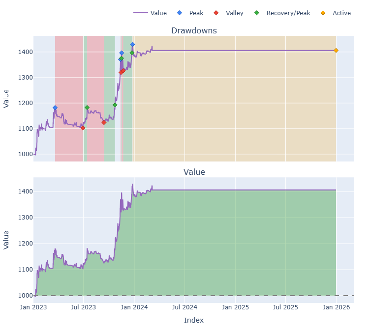

# Trading Strategy Pipeline Report

**Generated**: 2026-03-25 23:36:22

## Executive Summary

| | Phase 2 (full range) | Phase 3 (1-year) |
|-|---------------------|----------|
| Strategy CAGR | 18.46% | -7.75% |
| BTC CAGR | 74.01% | 0.00% |
| S&P 500 CAGR | 23.37% | 16.85% |
| Strategy Sharpe | 1.80 | -1.66 |
| Max Drawdown | -7.33% | -12.88% |
| Coins analyzed | 5 | 5 |

## Phase 2: Result Validation (Full Data)

### Combined Portfolio Performance (Full-Range Backtest)

| Metric | Strategy | BTC (buy & hold) | S&P 500 (SPY) | Excess vs BTC |
|--------|----------|------------------|---------------|---------------|
| Backtest period | 2023-01-01 -> 2025-12-30 | - | - | - |
| Total Return | 66.16% | 426.04% | 87.67% | - |
| CAGR | 18.46% | 74.01% | 23.37% | -55.55% |
| Sharpe Ratio | 1.7990 | 1.4255 | 1.4446 | - |
| Max Drawdown | -7.33% | -34.46% | -18.76% | - |
| Total Trades | 116 | 1 | 1 | - |
| Win Rate | 50.00% | - | - | - |

## Phase 3: Recent Performance (Past Year)

Combined portfolio replay on the **recent-only** window using the same entry/exit/params chosen by WFO (no re-optimization).

| Metric | Strategy | BTC (buy & hold) | S&P 500 (SPY) | Excess vs BTC |
|--------|----------|------------------|---------------|---------------|
| Backtest period | 2025-03-26 -> 2026-03-26 | - | - | - |
| Total Return | -7.75% | 0.00% | 16.84% | - |
| CAGR | -7.75% | 0.00% | 16.85% | -7.75% |
| Sharpe Ratio | -1.6629 | n/a | 1.0434 | - |
| Max Drawdown | -12.88% | 0.00% | -12.68% | - |
| Total Trades | 53 | 0 | 1 | - |
| Win Rate | 28.30% | - | - | - |

## Phase 1: Per-Coin Strategy Selection (From WFO)

Best performing strategy per coin based on robustness scores.

| Symbol | Strategy | Selection | Robustness Score |
|--------|----------|-----------|------------------|
| TAO-USD | psar_adx | wfo_robustness | 1.0791 |
| XRP-USD | psar_adx | wfo_robustness | 0.7796 |
| BTC-USD | psar_adx | wfo_robustness | 0.4302 |
| ETH-USD | rsi_reversal | wfo_robustness | 0.7745 |
| SOL-USD | rsi_reversal | wfo_robustness | 0.5882 |

### WFO Out-of-Sample Sharpe — Per Fold Breakdown

Per-fold OOS Sharpe for each coin's winning strategy. Negative values indicate the strategy did not generalise in that fold.

| Symbol | Strategy+Exit | IS Rob | OOS Rob | Consistency | Fold 1 | Fold 2 | Fold 3 | Fold 4 | Fold 5 | Fold 6 |
|--------|---------------|--------|---------|-------------|--------|--------|--------|--------|--------|--------|
| TAO-USD | psar_adx+trailing_stop | 2.4999 | 0.1979 | 60% | n/a | 0.943 | 2.684 | -1.671 | 1.275 | -0.950 |
| XRP-USD | psar_adx+trailing_stop | 1.8961 | 0.1829 | 50% | -1.393 | 1.010 | 3.752 | -0.122 | 1.471 | -2.423 |
| BTC-USD | psar_adx+fixed_sl_tp | 2.0757 | -0.7849 | 33% | -0.669 | 0.358 | -0.059 | 0.144 | -2.968 | -0.927 |
| ETH-USD | rsi_reversal+fixed_sl_tp | 2.8654 | -0.5420 | 33% | 0.787 | -0.267 | -0.817 | -3.977 | 2.019 | -1.048 |
| SOL-USD | rsi_reversal+atr_trailing | 2.4415 | -0.7609 | 40% | n/a | -0.306 | 0.790 | -2.235 | 0.290 | -2.126 |

## Final Full-Period Performance (Per-Coin)

Performance metrics from running WFO-selected parameters on full-range data.

| Symbol | Strategy | Selection | Return % | Sharpe | Max DD % | Trades | Win Rate % |
|--------|----------|-----------|----------|--------|----------|--------|-----------|
| BTC-USD | psar_adx | wfo_robustness | 6.44% | 0.8881 | -3.96% | 18 | 55.56% |
| ETH-USD | rsi_reversal | wfo_robustness | -1.78% | -0.3010 | -5.48% | 37 | 35.14% |
| SOL-USD | rsi_reversal | wfo_robustness | 38.71% | 1.5904 | -4.83% | 16 | 62.50% |
| TAO-USD | psar_adx | wfo_robustness | 19.90% | 1.3360 | -2.81% | 25 | 60.00% |
| XRP-USD | psar_adx | wfo_robustness | -0.04% | 0.0013 | -4.19% | 20 | 50.00% |

## Methodology

### Phase 1: Per-Coin Multi-Strategy WFO
- Walk-Forward Optimization with configurable folds and train/test ratio
- Each coin optimized independently across all (entry, exit) strategy combos
- Best strategy selected per coin based on blended IS+OOS robustness score

### Phase 2: Result Validation (Full Data)
- WFO-selected strategy + parameters applied to full data range per coin
- Per-coin results combined into single portfolio with shared capital

### Phase 3: Recent Performance (Past Year)
- Frozen parameters replayed on the most recent 1-year window (no re-opt)
- Provides an out-of-sample check on the most recent market conditions

### Benchmarks
- **BTC (buy & hold)**: equal-weight buy-and-hold on the strategy's coin universe, first-bar entry and last-bar exit per leg — crypto baseline
- **S&P 500 (SPY)**: SPY buy-and-hold over the same calendar window via yfinance — traditional-finance baseline
- **CAGR**: geometric annualized return computed from total return over the calendar span between the first and last bar of the combined close matrix

## Plots

### Combined Portfolio Final Dashboard

---

*Report generated by ggTrader Pipeline*