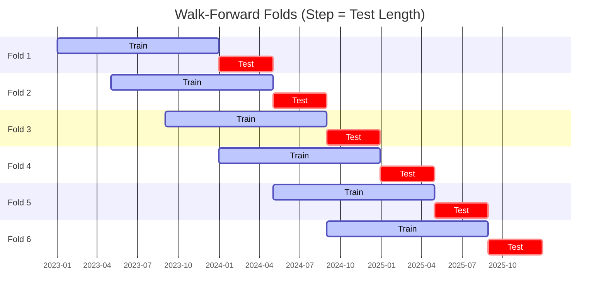
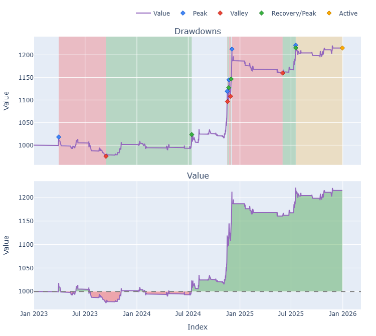

# Trading Strategy Pipeline Report

**Generated**: 2026-03-26 07:55:05

## Executive Summary

**WFO Training/Test period:** 2023-01-01 -> 2025-12-30  
**Recent performance window:** 2025-03-26 -> 2026-03-26  
**Coins:** 5

| | WFO Full Range (2023-01-01 -> 2025-12-30) | Recent (2025-03-26 -> 2026-03-26) |
|-|-------------------------------|--------|
| Strategy CAGR | 19.33% | 0.98% |
| BTC buy & hold CAGR | 74.01% | -21.39% |
| S&P 500 CAGR | 23.37% | 15.81% |
| Strategy Sharpe | 1.71 | 0.24 |
| Max Drawdown | -7.33% | -11.25% |
| Total Trades | 104 | 39 |
| Win Rate | 49.04% | 30.77% |

## Result Validation (Full Data)
**Period: 2023-01-01 -> 2025-12-30** — WFO-selected parameters replayed on full training range.

### Combined Portfolio Performance

| Metric | Strategy | BTC (buy & hold) | S&P 500 (SPY) | Excess vs BTC |
|--------|----------|------------------|---------------|---------------|
| Total Return | 69.85% | 426.04% | 87.67% | - |
| CAGR | 19.33% | 74.01% | 23.37% | -54.68% |
| Sharpe Ratio | 1.7086 | 1.4255 | 1.4446 | - |
| Max Drawdown | -7.33% | -34.46% | -18.76% | - |
| Total Trades | 104 | 1 | 1 | - |
| Win Rate | 49.04% | - | - | - |

## Recent Performance (Past Year)
**Period: 2025-03-26 -> 2026-03-26** — same frozen parameters, no re-optimization.

| Metric | Strategy | BTC (buy & hold) | S&P 500 (SPY) | Excess vs BTC |
|--------|----------|------------------|---------------|---------------|
| Total Return | 0.98% | -21.38% | 15.81% | - |
| CAGR | 0.98% | -21.39% | 15.81% | 22.37% |
| Sharpe Ratio | 0.2421 | -1.1236 | 0.9796 | - |
| Max Drawdown | -11.25% | -35.36% | -12.68% | - |
| Total Trades | 39 | 1 | 1 | - |
| Win Rate | 30.77% | - | - | - |

## Per-Coin Strategy Selection (WFO)

Best performing strategy per coin based on robustness scores (highest first).

| Symbol | Strategy | Selection | Robustness Score |
|--------|----------|-----------|------------------|
| XRP-USD | psar_adx+trailing_stop | wfo_robustness | 0.7796 |
| SOL-USD | rsi_reversal+atr_trailing | wfo_robustness | 0.7118 |
| ETH-USD | rsi_reversal+fixed_sl_tp | wfo_robustness | 0.6446 |
| TAO-USD | psar_adx+atr_trailing | wfo_robustness | 0.5331 |
| BTC-USD | psar_adx+fixed_sl_tp | wfo_robustness | 0.5259 |

### WFO Fold Timeline

### WFO Out-of-Sample Sharpe — Per Fold

Per-fold OOS Sharpe for each coin's winning strategy (folds ordered as above). Negative = strategy did not generalise.

| Symbol | Strategy+Exit | IS Rob | OOS Rob | Consistency | Fold 1 | Fold 2 | Fold 3 | Fold 4 | Fold 5 | Fold 6 |
|--------|---------------|--------|---------|-------------|--------|--------|--------|--------|--------|--------|
| XRP-USD | psar_adx+trailing_stop | 1.8961 | 0.1829 | 50% | -1.393 | 1.010 | 3.752 | -0.122 | 1.471 | -2.423 |
| SOL-USD | rsi_reversal+atr_trailing | 2.4396 | -0.5415 | 50% | 0.233 | -0.253 | 0.827 | -1.164 | 0.222 | -2.128 |
| ETH-USD | rsi_reversal+fixed_sl_tp | 2.8639 | -0.6539 | 17% | -0.227 | -0.256 | -0.817 | -4.349 | 2.003 | -1.049 |
| TAO-USD | psar_adx+atr_trailing | 1.7585 | -0.2353 | 40% | -3.110 | 0.251 | -0.315 | 0.228 | -0.075 | n/a |
| BTC-USD | psar_adx+fixed_sl_tp | 2.4192 | -0.8414 | 33% | -1.629 | 0.326 | -0.043 | 0.144 | -2.968 | -0.928 |

## Full-Period Performance (Per-Coin)

Performance metrics from running WFO-selected parameters on full-range data.

| Symbol | Strategy | Selection | Return % | Sharpe | Max DD % | Trades | Win Rate % |
|--------|----------|-----------|----------|--------|----------|--------|-----------|
| BTC-USD | psar_adx | wfo_robustness | 6.44% | 0.8881 | -3.96% | 18 | 55.56% |
| ETH-USD | rsi_reversal | wfo_robustness | -1.78% | -0.3010 | -5.48% | 37 | 35.14% |
| SOL-USD | rsi_reversal | wfo_robustness | 38.71% | 1.5904 | -4.83% | 16 | 62.50% |
| TAO-USD | psar_adx | wfo_robustness | 22.57% | 1.0843 | -4.72% | 13 | 61.54% |
| XRP-USD | psar_adx | wfo_robustness | -0.04% | 0.0013 | -4.19% | 20 | 50.00% |

---

*For pipeline methodology, fold structure, and benchmark definitions see [docs/UNIFIED_PIPELINE.md](../docs/UNIFIED_PIPELINE.md).*

## Plots

### Combined Portfolio Final Dashboard

---

*Report generated by ggTrader Pipeline*