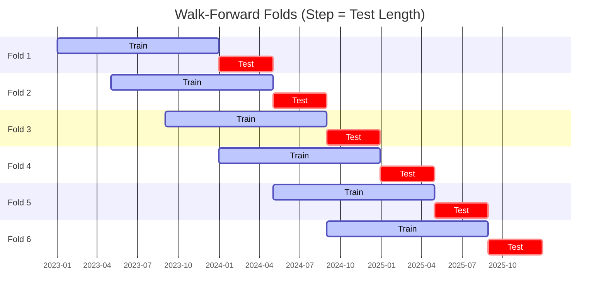
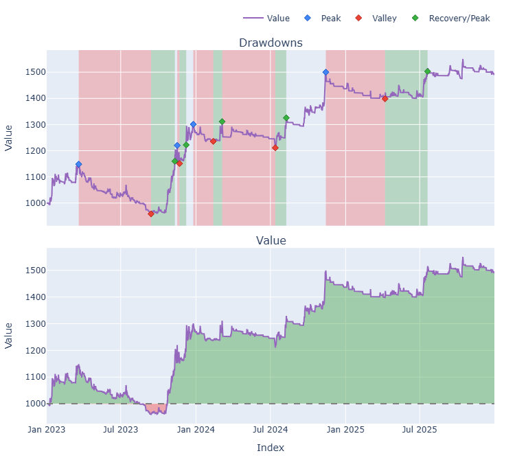

# Trading Strategy Pipeline Report

**Generated**: 2026-03-26 08:55:40

## Executive Summary

**WFO Training/Test period:** 2023-01-01 -> 2025-12-30  
**Recent performance window:** 2025-03-26 -> 2026-03-26  
**Coins:** 43

| | WFO Full Range | Recent (Past Year) |
|-|----------------|--------|
| Strategy CAGR | 11.27% | -14.37% |
| BTC buy & hold CAGR | 74.01% | -21.52% |
| S&P 500 CAGR | 23.37% | 15.94% |
| Strategy Sharpe | 0.65 | -1.36 |
| Max Drawdown | -26.29% | -23.45% |
| Total Trades | 469 | 243 |
| Win Rate | 33.05% | 25.10% |

## Result Validation (Training/Test Data)
**Period: 2023-01-01 -> 2025-12-30** — WFO-selected parameters replayed on the full training/test range.

### Combined Portfolio Performance

| Metric | Strategy | BTC (buy & hold) | S&P 500 (SPY) | Excess vs BTC |
|--------|----------|------------------|---------------|---------------|
| Total Return | 37.70% | 426.04% | 87.67% | - |
| CAGR | 11.27% | 74.01% | 23.37% | -62.75% |
| Sharpe Ratio | 0.6542 | 1.4255 | 1.4446 | - |
| Max Drawdown | -26.29% | -34.46% | -18.76% | - |
| Total Trades | 469 | 1 | 1 | - |
| Win Rate | 33.05% | - | - | - |

## Recent Performance (Past Year)
**Period: 2025-03-26 -> 2026-03-26** — same frozen parameters, no re-optimization.

| Metric | Strategy | BTC (buy & hold) | S&P 500 (SPY) | Excess vs BTC |
|--------|----------|------------------|---------------|---------------|
| Total Return | -14.36% | -21.51% | 15.93% | - |
| CAGR | -14.37% | -21.52% | 15.94% | 7.15% |
| Sharpe Ratio | -1.3611 | -1.2367 | 1.0771 | - |
| Max Drawdown | -23.45% | -35.36% | -6.49% | - |
| Total Trades | 243 | 1 | 1 | - |
| Win Rate | 25.10% | - | - | - |

## Per-Coin Strategy Selection (WFO)

Best performing strategy per coin based on robustness scores (highest first).

| Symbol | Strategy | Selection | Robustness Score |
|--------|----------|-----------|------------------|
| NIGHT-USD | psar_adx+fixed_sl_tp | wfo_robustness | 2.5551 |
| USELESS-USD | supertrend_flip+trailing_stop | wfo_robustness | 2.5373 |
| PENGU-USD | psar_adx+trailing_stop | wfo_robustness | 1.9707 |
| CC-USD | ema_cross+fixed_sl_tp | wfo_robustness | 1.9594 |
| VIRTUAL-USD | psar_adx+trailing_stop | wfo_robustness | 1.6657 |
| PUMP-USD | macd_cross+atr_trailing | wfo_robustness | 1.6465 |
| BNB-USD | psar_adx+fixed_sl_tp | wfo_robustness | 1.6201 |
| VVV-USD | rsi_reversal+fixed_sl_tp | wfo_robustness | 1.5000 |
| ICP-USD | psar_adx+atr_trailing | wfo_robustness | 1.4366 |
| KAS-USD | rsi_reversal+atr_trailing | wfo_robustness | 1.0997 |
| AAVE-USD | psar_adx+atr_trailing | wfo_robustness | 1.0871 |
| TAO-USD | psar_adx+trailing_stop | wfo_robustness | 1.0828 |
| ZEC-USD | psar_adx+atr_trailing | wfo_robustness | 1.0388 |
| NEAR-USD | rsi_reversal+fixed_sl_tp | wfo_robustness | 1.0344 |
| FARTCOIN-USD | rsi_reversal+atr_trailing | wfo_robustness | 0.9643 |
| SPX-USD | ema_cross+trailing_stop | wfo_robustness | 0.9626 |
| UNI-USD | psar_adx+atr_trailing | wfo_robustness | 0.9377 |
| HBAR-USD | ema_cross+fixed_sl_tp | wfo_robustness | 0.8510 |
| ZRO-USD | rsi_reversal+atr_trailing | wfo_robustness | 0.8497 |
| XRP-USD | rsi_reversal+fixed_sl_tp | wfo_robustness | 0.8019 |
| SUI-USD | rsi_reversal+fixed_sl_tp | wfo_robustness | 0.7926 |
| PEPE-USD | rsi_reversal+fixed_sl_tp | wfo_robustness | 0.7836 |
| ETH-USD | rsi_reversal+fixed_sl_tp | wfo_robustness | 0.7745 |
| DOGE-USD | rsi_reversal+trailing_stop | wfo_robustness | 0.7679 |
| ENA-USD | psar_adx+trailing_stop | wfo_robustness | 0.7327 |
| LINK-USD | ema_cross+atr_trailing | wfo_robustness | 0.7320 |
| XLM-USD | rsi_reversal+atr_trailing | wfo_robustness | 0.7250 |
| ADA-USD | rsi_reversal+fixed_sl_tp | wfo_robustness | 0.7044 |
| TRX-USD | rsi_reversal+atr_trailing | wfo_robustness | 0.6926 |
| WIF-USD | psar_adx+fixed_sl_tp | wfo_robustness | 0.6918 |
| FET-USD | rsi_reversal+fixed_sl_tp | wfo_robustness | 0.6394 |
| SOL-USD | rsi_reversal+atr_trailing | wfo_robustness | 0.5882 |
| RENDER-USD | rsi_reversal+atr_trailing | wfo_robustness | 0.5475 |
| DOT-USD | psar_adx+trailing_stop | wfo_robustness | 0.5379 |
| CRV-USD | rsi_reversal+atr_trailing | wfo_robustness | 0.5300 |
| XMR-USD | rsi_reversal+atr_trailing | wfo_robustness | 0.5238 |
| XCN-USD | ema_cross+atr_trailing | wfo_robustness | 0.4811 |
| AKT-USD | psar_adx+trailing_stop | wfo_robustness | 0.4667 |
| AVAX-USD | supertrend_flip+atr_trailing | wfo_robustness | 0.4653 |
| LTC-USD | rsi_reversal+atr_trailing | wfo_robustness | 0.4401 |
| BTC-USD | psar_adx+fixed_sl_tp | wfo_robustness | 0.4302 |
| TRUMP-USD | rsi_reversal+trailing_stop | wfo_robustness | 0.4214 |
| BCH-USD | psar_adx+trailing_stop | wfo_robustness | 0.4187 |

### WFO Fold Timeline

### WFO Out-of-Sample Sharpe — Per Fold

Per-fold OOS Sharpe for each coin's winning strategy (folds ordered as above). Negative = strategy did not generalise.

| Symbol | Strategy+Exit | IS Rob | OOS Rob | Consistency | Fold 1 | Fold 2 | Fold 3 | Fold 4 | Fold 5 | Fold 6 |
|--------|---------------|--------|---------|-------------|--------|--------|--------|--------|--------|--------|
| NIGHT-USD | psar_adx+fixed_sl_tp | n/a | 2.5551 | 100% | n/a | n/a | n/a | n/a | n/a | 2.555 |
| USELESS-USD | supertrend_flip+trailing_stop | 2.6725 | 2.4020 | 100% | n/a | n/a | n/a | n/a | n/a | 2.402 |
| CC-USD | ema_cross+fixed_sl_tp | n/a | 1.9594 | 100% | n/a | n/a | n/a | n/a | n/a | 1.959 |
| PENGU-USD | psar_adx+trailing_stop | 2.7246 | 1.2168 | 100% | n/a | n/a | n/a | 0.502 | 2.112 | n/a |
| BNB-USD | psar_adx+fixed_sl_tp | 2.0612 | 1.1789 | 100% | n/a | n/a | n/a | 1.551 | 1.391 | 0.678 |
| ZEC-USD | psar_adx+atr_trailing | 1.7956 | 0.6974 | 67% | n/a | n/a | n/a | -1.637 | 0.373 | 3.048 |
| VIRTUAL-USD | psar_adx+trailing_stop | 2.6929 | 0.6385 | 100% | n/a | n/a | n/a | 1.596 | n/a | 0.077 |
| PUMP-USD | macd_cross+atr_trailing | 2.6700 | 0.6230 | 100% | n/a | n/a | n/a | n/a | n/a | 0.623 |
| WIF-USD | psar_adx+fixed_sl_tp | 1.1657 | 0.5637 | 60% | 3.313 | -0.688 | 0.411 | 2.600 | -0.816 | n/a |
| KAS-USD | rsi_reversal+atr_trailing | 2.3702 | 0.2692 | 67% | n/a | n/a | n/a | 0.679 | 0.971 | -0.587 |
| AAVE-USD | psar_adx+atr_trailing | 2.3591 | 0.2500 | 67% | -3.009 | 0.731 | n/a | n/a | 0.988 | n/a |
| ICP-USD | psar_adx+atr_trailing | 2.6277 | 0.2456 | 100% | n/a | n/a | n/a | n/a | 0.073 | 0.346 |
| TAO-USD | psar_adx+trailing_stop | 2.5097 | 0.1972 | 60% | n/a | 0.943 | 2.684 | -1.671 | 1.270 | -0.950 |
| UNI-USD | psar_adx+atr_trailing | 2.0897 | 0.1608 | 67% | n/a | n/a | n/a | -2.501 | 1.403 | 1.075 |
| AVAX-USD | supertrend_flip+atr_trailing | 1.3833 | -0.0538 | 40% | -0.863 | -0.478 | 1.435 | n/a | -1.329 | 0.574 |
| XLM-USD | rsi_reversal+atr_trailing | 2.2469 | -0.0719 | 33% | -1.164 | -0.888 | 3.066 | -2.131 | 2.251 | -1.796 |
| LINK-USD | ema_cross+atr_trailing | 2.0844 | -0.1324 | 50% | -0.996 | 0.369 | 1.232 | -1.144 | 0.681 | -0.913 |
| TRX-USD | rsi_reversal+atr_trailing | 1.9109 | -0.2488 | 67% | 0.217 | 1.172 | 1.026 | 0.257 | -1.177 | -1.390 |
| ADA-USD | rsi_reversal+fixed_sl_tp | 2.6038 | -0.2557 | 20% | -0.785 | -1.918 | 3.167 | n/a | -0.011 | -1.719 |
| XRP-USD | rsi_reversal+fixed_sl_tp | 2.6776 | -0.2719 | 33% | -1.393 | -0.778 | 3.894 | -2.313 | 0.363 | -1.423 |
| NEAR-USD | rsi_reversal+fixed_sl_tp | 2.7584 | -0.2758 | 67% | 0.555 | 0.129 | 0.556 | -2.001 | -1.639 | 1.090 |
| SPX-USD | ema_cross+trailing_stop | 2.8666 | -0.2996 | 50% | n/a | n/a | 0.825 | 0.279 | -0.263 | -1.518 |
| ZRO-USD | rsi_reversal+atr_trailing | 2.6348 | -0.3688 | 50% | n/a | n/a | 1.343 | 1.158 | -0.633 | -2.418 |
| PEPE-USD | rsi_reversal+fixed_sl_tp | 2.7460 | -0.3953 | 33% | 2.448 | -0.928 | 2.012 | -1.894 | -0.307 | -1.541 |
| FARTCOIN-USD | rsi_reversal+atr_trailing | 2.9705 | -0.3992 | 50% | n/a | n/a | n/a | n/a | -1.747 | 0.616 |
| DOGE-USD | rsi_reversal+trailing_stop | 2.4605 | -0.4129 | 50% | 0.188 | -2.148 | 1.651 | -1.832 | 1.890 | -2.296 |
| XMR-USD | rsi_reversal+atr_trailing | 2.2631 | -0.4673 | 17% | -2.795 | -2.215 | -2.120 | -0.538 | -0.645 | 1.616 |
| FET-USD | rsi_reversal+fixed_sl_tp | 2.6604 | -0.4683 | 17% | 2.662 | -0.724 | -0.885 | -0.894 | -0.668 | -0.779 |
| ENA-USD | psar_adx+trailing_stop | 2.8737 | -0.5290 | 25% | n/a | -5.046 | -0.276 | -1.397 | 1.645 | n/a |
| ETH-USD | rsi_reversal+fixed_sl_tp | 2.8654 | -0.5420 | 33% | 0.787 | -0.267 | -0.817 | -3.977 | 2.019 | -1.048 |
| CRV-USD | rsi_reversal+atr_trailing | 1.9930 | -0.5798 | 50% | -2.304 | -2.116 | 3.648 | 0.143 | 0.401 | -3.746 |
| SUI-USD | rsi_reversal+fixed_sl_tp | 2.5071 | -0.6049 | 67% | 2.535 | 0.557 | 1.592 | 0.385 | -1.155 | -3.739 |
| LTC-USD | rsi_reversal+atr_trailing | 1.9259 | -0.6056 | 33% | -1.851 | -1.357 | 1.367 | -2.373 | 0.487 | -1.147 |
| RENDER-USD | rsi_reversal+atr_trailing | 2.1660 | -0.7061 | 50% | n/a | n/a | 1.333 | 0.739 | -1.744 | -2.442 |
| HBAR-USD | ema_cross+fixed_sl_tp | 2.9884 | -0.7190 | 50% | n/a | n/a | n/a | n/a | 1.019 | -2.535 |
| SOL-USD | rsi_reversal+atr_trailing | 2.4415 | -0.7609 | 40% | n/a | -0.306 | 0.790 | -2.235 | 0.290 | -2.126 |
| XCN-USD | ema_cross+atr_trailing | 2.2273 | -0.7840 | 33% | n/a | n/a | n/a | 1.721 | -1.465 | -2.435 |
| BTC-USD | psar_adx+fixed_sl_tp | 2.0757 | -0.7849 | 33% | -0.669 | 0.358 | -0.059 | 0.144 | -2.968 | -0.927 |
| DOT-USD | psar_adx+trailing_stop | 2.6065 | -0.8852 | 25% | 0.440 | -1.755 | -0.208 | n/a | -1.576 | n/a |
| BCH-USD | psar_adx+trailing_stop | 2.2202 | -1.0240 | 40% | 0.706 | -0.663 | 0.184 | -1.351 | n/a | -2.519 |
| TRUMP-USD | rsi_reversal+trailing_stop | 2.7099 | -1.0242 | 0% | n/a | n/a | n/a | -0.400 | -0.256 | -2.536 |
| AKT-USD | psar_adx+trailing_stop | 2.6366 | -1.0811 | 20% | -2.741 | -2.555 | 0.469 | n/a | -1.531 | -1.029 |
| VVV-USD | rsi_reversal+fixed_sl_tp | 3.0000 | n/a | 0% | n/a | n/a | n/a | n/a | n/a | n/a |

## Full-Period Performance (Per-Coin)

Performance metrics from running WFO-selected parameters on full-range data.

| Symbol | Strategy | Selection | Return % | Sharpe | Max DD % | Trades | Win Rate % |
|--------|----------|-----------|----------|--------|----------|--------|-----------|
| SOL-USD | rsi_reversal | wfo_robustness | 38.71% | 1.5904 | -4.83% | 16 | 62.50% |
| TAO-USD | psar_adx | wfo_robustness | 19.90% | 1.3360 | -2.81% | 25 | 60.00% |
| BTC-USD | psar_adx | wfo_robustness | 6.44% | 0.8881 | -3.96% | 18 | 55.56% |
| ADA-USD | rsi_reversal | wfo_robustness | 9.43% | 0.8532 | -4.51% | 6 | 33.33% |
| AVAX-USD | supertrend_flip | wfo_robustness | 5.71% | 0.6577 | -2.89% | 5 | 60.00% |
| CC-USD | ema_cross | wfo_robustness | 5.02% | 0.6047 | -3.71% | 9 | 66.67% |
| LINK-USD | ema_cross | wfo_robustness | 6.95% | 0.5387 | -4.99% | 22 | 45.45% |
| TRX-USD | rsi_reversal | wfo_robustness | 12.23% | 0.4618 | -15.12% | 35 | 34.29% |
| XLM-USD | rsi_reversal | wfo_robustness | 0.06% | 0.0209 | -3.19% | 13 | 46.15% |
| FET-USD | rsi_reversal | wfo_robustness | 0.00% | 0.0000 | 0.00% | 0 | 0.00% |
| NEAR-USD | rsi_reversal | wfo_robustness | 0.00% | 0.0000 | 0.00% | 0 | 0.00% |
| SUI-USD | rsi_reversal | wfo_robustness | 0.00% | 0.0000 | 0.00% | 0 | 0.00% |
| ZEC-USD | psar_adx | wfo_robustness | 0.00% | 0.0000 | 0.00% | 0 | 0.00% |
| DOT-USD | psar_adx | wfo_robustness | -0.67% | -0.0984 | -4.25% | 11 | 27.27% |
| HBAR-USD | ema_cross | wfo_robustness | -1.53% | -0.2281 | -4.18% | 7 | 42.86% |
| ZRO-USD | rsi_reversal | wfo_robustness | -4.57% | -0.2292 | -12.78% | 42 | 26.19% |
| ETH-USD | rsi_reversal | wfo_robustness | -1.78% | -0.3010 | -5.48% | 37 | 35.14% |
| LTC-USD | rsi_reversal | wfo_robustness | -3.86% | -0.4249 | -7.22% | 23 | 30.43% |
| FARTCOIN-USD | rsi_reversal | wfo_robustness | -12.45% | -0.6652 | -18.69% | 49 | 22.45% |
| DOGE-USD | rsi_reversal | wfo_robustness | -12.16% | -0.7339 | -14.59% | 102 | 23.53% |
| XMR-USD | rsi_reversal | wfo_robustness | -3.05% | -0.8663 | -4.48% | 20 | 10.00% |
| PEPE-USD | rsi_reversal | wfo_robustness | -2.07% | -1.0396 | -2.07% | 1 | 0.00% |
| XRP-USD | rsi_reversal | wfo_robustness | -6.90% | -1.2249 | -8.05% | 28 | 25.00% |

---

*For pipeline methodology, fold structure, and benchmark definitions see [docs/UNIFIED_PIPELINE.md](../docs/UNIFIED_PIPELINE.md).*

## Plots

### Combined Portfolio Final Dashboard

---

*Report generated by ggTrader Pipeline*