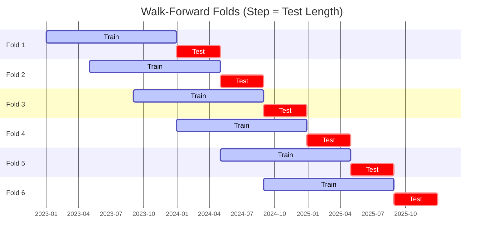
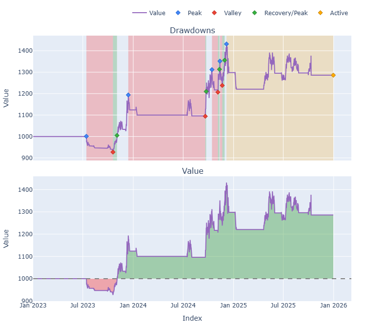

# Trading Strategy Pipeline Report

**Generated**: 2026-03-26 18:56:15

## Executive Summary

**WFO Training/Test period:** 2023-01-01 -> 2025-12-30  
**Recent performance window:** 2025-03-26 -> 2026-03-27  
**Coins:** 34

| | WFO Full Range | Recent (Past Year) |
|-|----------------|--------|
| Strategy CAGR | 6.90% | 3.77% |
| BTC buy & hold CAGR | 74.01% | -25.39% |
| S&P 500 CAGR | 23.37% | 14.76% |
| Strategy Sharpe | 0.64 | 0.58 |
| Max Drawdown | -9.20% | -10.51% |
| Total Trades | 24 | 30 |
| Win Rate | 41.67% | 26.67% |

## Result Validation (Training/Test Data)
**Period: 2023-01-01 -> 2025-12-30** — WFO-selected parameters replayed on the full training/test range.

### Combined Portfolio Performance

| Metric | Strategy | BTC (buy & hold) | S&P 500 (SPY) | Excess vs BTC |
|--------|----------|------------------|---------------|---------------|
| Total Return | 22.13% | 426.04% | 87.67% | - |
| CAGR | 6.90% | 74.01% | 23.37% | -67.11% |
| Sharpe Ratio | 0.6371 | 1.4255 | 1.4446 | - |
| Max Drawdown | -9.20% | -34.46% | -18.76% | - |
| Total Trades | 24 | 1 | 1 | - |
| Win Rate | 41.67% | - | - | - |

## Recent Performance (Past Year)
**Period: 2025-03-26 -> 2026-03-27** — same frozen parameters, no re-optimization.

| Metric | Strategy | BTC (buy & hold) | S&P 500 (SPY) | Excess vs BTC |
|--------|----------|------------------|---------------|---------------|
| Total Return | 3.77% | -25.39% | 14.75% | - |
| CAGR | 3.77% | -25.39% | 14.76% | 29.16% |
| Sharpe Ratio | 0.5802 | -1.5619 | 0.8869 | - |
| Max Drawdown | -10.51% | -35.36% | -11.13% | - |
| Total Trades | 30 | 1 | 1 | - |
| Win Rate | 26.67% | - | - | - |

## Per-Coin Strategy Selection (WFO)

Best performing strategy per coin based on robustness scores (highest first).

| Symbol | Strategy | Selection | Robustness Score |
|--------|----------|-----------|------------------|
| NIGHT-USD | psar_adx+fixed_sl_tp | wfo_robustness | 2.5551 |
| USELESS-USD | ema_cross+atr_trailing | wfo_robustness | 2.4020 |
| CC-USD | ema_cross+fixed_sl_tp | wfo_robustness | 1.9594 |
| PENGU-USD | psar_adx+trailing_stop | wfo_robustness | 1.7177 |
| ICP-USD | psar_adx+atr_trailing | wfo_robustness | 1.4737 |
| SPX-USD | psar_adx+trailing_stop | wfo_robustness | 1.4019 |
| VIRTUAL-USD | psar_adx+trailing_stop | wfo_robustness | 1.3914 |
| WIF-USD | psar_adx+trailing_stop | wfo_robustness | 1.2962 |
| PUMP-USD | supertrend_flip+fixed_sl_tp | wfo_robustness | 1.2879 |
| ZEC-USD | ema_cross+atr_trailing | wfo_robustness | 0.7418 |
| PEPE-USD | psar_adx+atr_trailing | wfo_robustness | 0.6307 |
| UNI-USD | psar_adx+atr_trailing | wfo_robustness | 0.6269 |
| TAO-USD | psar_adx+fixed_sl_tp | wfo_robustness | 0.6226 |
| NEAR-USD | rsi_reversal+fixed_sl_tp | wfo_robustness | 0.6065 |
| SUI-USD | psar_adx+atr_trailing | wfo_robustness | 0.5183 |
| ADA-USD | ema_cross+atr_trailing | wfo_robustness | 0.5119 |
| XRP-USD | rsi_reversal+fixed_sl_tp | wfo_robustness | 0.4085 |
| LINK-USD | ema_cross+atr_trailing | wfo_robustness | 0.4022 |
| KAS-USD | ema_cross+atr_trailing | wfo_robustness | 0.3993 |
| AVAX-USD | supertrend_flip+atr_trailing | wfo_robustness | 0.3907 |
| FET-USD | rsi_reversal+atr_trailing | wfo_robustness | 0.3776 |
| DOGE-USD | rsi_reversal+trailing_stop | wfo_robustness | 0.3423 |
| TRX-USD | rsi_reversal+fixed_sl_tp | wfo_robustness | 0.3417 |
| HBAR-USD | macd_cross+fixed_sl_tp | wfo_robustness | 0.3248 |
| XLM-USD | psar_adx+fixed_sl_tp | wfo_robustness | 0.3199 |
| BTC-USD | rsi_reversal+atr_trailing | wfo_robustness | 0.3117 |
| ZRO-USD | supertrend_flip+fixed_sl_tp | wfo_robustness | 0.2990 |
| FARTCOIN-USD | supertrend_flip+fixed_sl_tp | wfo_robustness | 0.2883 |
| ETH-USD | ema_cross+atr_trailing | wfo_robustness | 0.2865 |
| RENDER-USD | ema_cross+atr_trailing | wfo_robustness | 0.2751 |
| BNB-USD | psar_adx+atr_trailing | wfo_robustness | 0.2562 |
| XMR-USD | ema_cross+atr_trailing | wfo_robustness | 0.2535 |
| CRV-USD | donchian_breakout+atr_trailing | wfo_robustness | 0.2141 |
| AAVE-USD | macd_cross+fixed_sl_tp | wfo_robustness | 0.2095 |

### WFO Fold Timeline

### WFO Out-of-Sample Sharpe — Per Fold

Per-fold OOS Sharpe for each coin's winning strategy (folds ordered as above). Negative = strategy did not generalise.

| Symbol | Strategy+Exit | IS Rob | OOS Rob | Consistency | Fold 1 | Fold 2 | Fold 3 | Fold 4 | Fold 5 | Fold 6 |
|--------|---------------|--------|---------|-------------|--------|--------|--------|--------|--------|--------|
| NIGHT-USD | psar_adx+fixed_sl_tp | n/a | 2.5551 | 100% | n/a | n/a | n/a | n/a | n/a | 2.555 |
| USELESS-USD | ema_cross+atr_trailing | n/a | 2.4020 | 100% | n/a | n/a | n/a | n/a | n/a | 2.402 |
| CC-USD | ema_cross+fixed_sl_tp | n/a | 1.9594 | 100% | n/a | n/a | n/a | n/a | n/a | 1.959 |
| PENGU-USD | psar_adx+trailing_stop | 2.6702 | 1.2048 | 100% | n/a | n/a | n/a | 0.502 | 2.080 | n/a |
| SPX-USD | psar_adx+trailing_stop | 2.2274 | 0.9574 | 100% | n/a | n/a | 1.637 | 0.002 | 0.377 | 2.087 |
| WIF-USD | psar_adx+trailing_stop | 2.2240 | 0.7967 | 100% | 3.114 | 0.418 | 0.710 | 0.855 | 0.606 | n/a |
| ICP-USD | psar_adx+atr_trailing | 2.7347 | 0.7947 | 100% | n/a | n/a | n/a | n/a | 0.073 | 1.605 |
| VIRTUAL-USD | psar_adx+trailing_stop | 2.7073 | 0.6828 | 100% | n/a | n/a | n/a | 1.596 | 0.738 | 0.077 |
| PUMP-USD | supertrend_flip+fixed_sl_tp | 2.7794 | 0.4847 | 100% | n/a | n/a | n/a | n/a | n/a | 0.485 |
| ZEC-USD | ema_cross+atr_trailing | 2.0348 | 0.4260 | 67% | n/a | n/a | n/a | 1.558 | -2.677 | 2.557 |
| XLM-USD | psar_adx+fixed_sl_tp | 1.1366 | 0.2828 | 40% | -4.163 | -2.507 | 3.507 | n/a | 1.760 | -0.423 |
| TAO-USD | psar_adx+fixed_sl_tp | 2.1748 | 0.1972 | 60% | n/a | 0.943 | 2.684 | -1.671 | 1.270 | -0.950 |
| UNI-USD | psar_adx+atr_trailing | 2.0897 | 0.1608 | 67% | n/a | n/a | n/a | -2.501 | 1.403 | 1.075 |
| XMR-USD | ema_cross+atr_trailing | 1.2237 | 0.1211 | 33% | -1.426 | -0.375 | -0.185 | -1.193 | 0.487 | 1.616 |
| SUI-USD | psar_adx+atr_trailing | 1.9570 | 0.0853 | 60% | 2.706 | 0.524 | n/a | -0.186 | 1.054 | -1.364 |
| ADA-USD | ema_cross+atr_trailing | 2.5283 | 0.0706 | 40% | -1.631 | -1.549 | 2.624 | n/a | 0.418 | -0.515 |
| AVAX-USD | supertrend_flip+atr_trailing | 2.1018 | -0.0389 | 40% | -0.863 | -0.478 | 1.435 | n/a | -1.329 | 0.626 |
| LINK-USD | ema_cross+atr_trailing | 2.0844 | -0.1324 | 50% | -0.996 | 0.369 | 1.232 | -1.144 | 0.681 | -0.913 |
| KAS-USD | ema_cross+atr_trailing | 2.5315 | -0.1346 | 33% | n/a | n/a | n/a | -1.213 | 1.142 | -0.504 |
| BNB-USD | psar_adx+atr_trailing | 1.4837 | -0.1681 | 50% | n/a | n/a | n/a | n/a | -1.319 | 0.768 |
| FET-USD | rsi_reversal+atr_trailing | 2.3639 | -0.2166 | 40% | n/a | -0.724 | 0.545 | 0.592 | -0.041 | -1.234 |
| PEPE-USD | psar_adx+atr_trailing | 2.6227 | -0.2180 | 75% | 1.510 | 0.341 | n/a | n/a | 0.752 | -1.820 |
| XRP-USD | rsi_reversal+fixed_sl_tp | 2.8393 | -0.2719 | 33% | -1.393 | -0.778 | 3.894 | -2.313 | 0.363 | -1.423 |
| NEAR-USD | rsi_reversal+fixed_sl_tp | 2.8227 | -0.2758 | 67% | 0.555 | 0.129 | 0.556 | -2.001 | -1.639 | 1.090 |
| BTC-USD | rsi_reversal+atr_trailing | 2.5228 | -0.3993 | 33% | 3.133 | -2.146 | 2.073 | -1.928 | -0.409 | -1.173 |
| DOGE-USD | rsi_reversal+trailing_stop | 2.3316 | -0.4129 | 50% | 0.188 | -2.148 | 1.651 | -1.832 | 1.890 | -2.296 |
| ETH-USD | ema_cross+atr_trailing | 2.1984 | -0.4785 | 50% | 0.010 | -0.212 | 1.472 | -3.977 | 2.078 | -1.908 |
| ZRO-USD | supertrend_flip+fixed_sl_tp | 2.3091 | -0.5074 | 50% | n/a | n/a | 0.974 | 0.673 | -2.350 | -0.900 |
| FARTCOIN-USD | supertrend_flip+fixed_sl_tp | 2.3469 | -0.5541 | 50% | n/a | n/a | n/a | n/a | -1.489 | 0.118 |
| TRX-USD | rsi_reversal+fixed_sl_tp | 2.6222 | -0.5708 | 50% | 0.217 | 1.056 | 1.026 | -0.015 | -1.489 | -2.303 |
| RENDER-USD | ema_cross+atr_trailing | 2.4415 | -0.6375 | 50% | n/a | n/a | 0.336 | 0.888 | -1.617 | -1.769 |
| CRV-USD | donchian_breakout+atr_trailing | 2.0885 | -0.6541 | 60% | n/a | -4.334 | 1.627 | 0.284 | 0.767 | -2.888 |
| HBAR-USD | macd_cross+fixed_sl_tp | 2.8200 | -0.7190 | 50% | n/a | n/a | n/a | n/a | 1.019 | -2.535 |
| AAVE-USD | macd_cross+fixed_sl_tp | 2.7792 | -0.9106 | 40% | -3.545 | 1.002 | 2.250 | n/a | -0.522 | -3.770 |

## Full-Period Performance (Per-Coin)

Performance metrics from running WFO-selected parameters on full-range data.

| Symbol | Strategy | Selection | Return % | Sharpe | Max DD % | Trades | Win Rate % |
|--------|----------|-----------|----------|--------|----------|--------|-----------|
| BTC-USD | rsi_reversal | wfo_robustness | 41.99% | 0.9049 | -15.55% | 1 | 100.00% |
| TAO-USD | psar_adx | wfo_robustness | 20.27% | 0.7972 | -6.45% | 12 | 50.00% |
| AVAX-USD | supertrend_flip | wfo_robustness | 5.71% | 0.6577 | -2.89% | 5 | 60.00% |
| XMR-USD | ema_cross | wfo_robustness | 18.38% | 0.6089 | -10.34% | 1 | 100.00% |
| CC-USD | ema_cross | wfo_robustness | 5.02% | 0.6047 | -3.71% | 9 | 66.67% |
| LINK-USD | ema_cross | wfo_robustness | 6.95% | 0.5387 | -4.99% | 22 | 45.45% |
| ADA-USD | ema_cross | wfo_robustness | 4.35% | 0.5206 | -3.39% | 9 | 33.33% |
| ETH-USD | ema_cross | wfo_robustness | 3.18% | 0.4174 | -4.70% | 20 | 40.00% |
| FET-USD | rsi_reversal | wfo_robustness | 0.00% | 0.0000 | 0.00% | 0 | 0.00% |
| NEAR-USD | rsi_reversal | wfo_robustness | 0.00% | 0.0000 | 0.00% | 0 | 0.00% |
| PEPE-USD | psar_adx | wfo_robustness | 0.00% | 0.0000 | 0.00% | 0 | 0.00% |
| SUI-USD | psar_adx | wfo_robustness | 0.00% | 0.0000 | 0.00% | 0 | 0.00% |
| ZEC-USD | ema_cross | wfo_robustness | 0.00% | 0.0000 | 0.00% | 0 | 0.00% |
| XLM-USD | psar_adx | wfo_robustness | -0.64% | -0.1102 | -4.53% | 10 | 30.00% |
| TRX-USD | rsi_reversal | wfo_robustness | -1.01% | -0.1412 | -3.41% | 22 | 45.45% |
| ZRO-USD | supertrend_flip | wfo_robustness | -9.50% | -0.4092 | -19.24% | 28 | 25.00% |
| HBAR-USD | macd_cross | wfo_robustness | -4.01% | -0.5116 | -6.43% | 6 | 33.33% |
| XRP-USD | rsi_reversal | wfo_robustness | -4.31% | -0.6014 | -6.07% | 24 | 29.17% |
| FARTCOIN-USD | supertrend_flip | wfo_robustness | -12.84% | -0.6208 | -18.67% | 25 | 16.00% |
| DOGE-USD | rsi_reversal | wfo_robustness | -12.16% | -0.7339 | -14.59% | 102 | 23.53% |

---

*For pipeline methodology, fold structure, and benchmark definitions see [docs/UNIFIED_PIPELINE.md](../docs/UNIFIED_PIPELINE.md).*

## Plots

### Combined Portfolio Final Dashboard

---

*Report generated by ggTrader Pipeline*