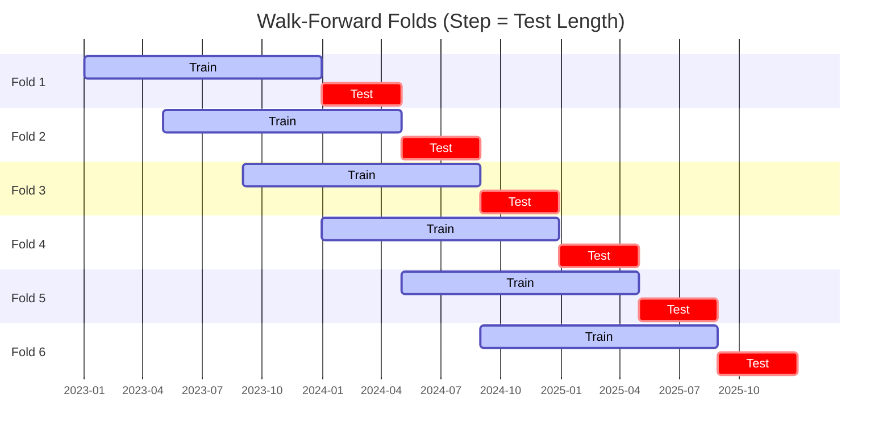
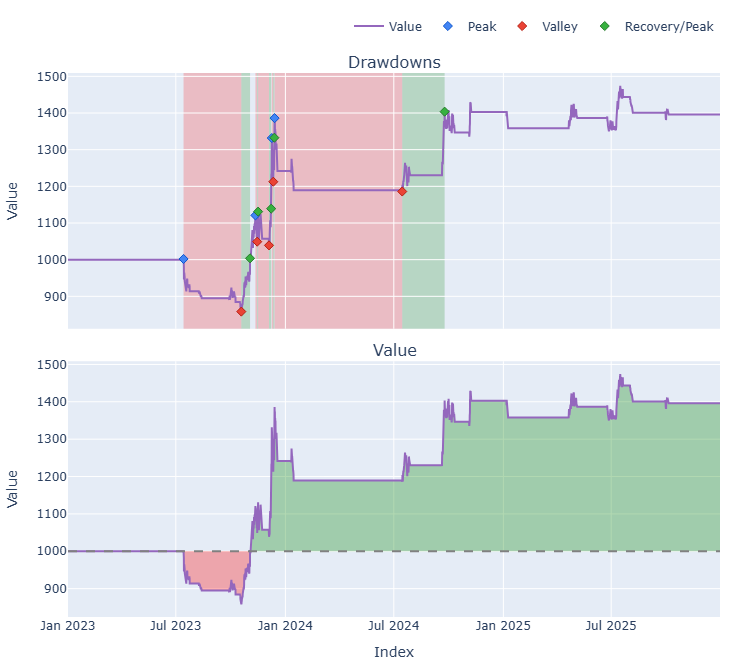

# Trading Strategy Pipeline Report

**Generated**: 2026-03-26 22:30:24

## Executive Summary

**WFO Training/Test period:** 2023-01-01 -> 2025-12-30  
**YTD performance window:** 2025-03-27 -> 2026-03-27  
**Coins:** 37

| | WFO Full Range | YTD |
|-|----------------|--------|
| Strategy CAGR | 8.19% | -7.78% |
| BTC buy & hold CAGR | 74.01% ❌ | -26.04% ✅ |
| S&P 500 CAGR | 23.37% ❌ | 15.06% ❌ |
| Strategy Sharpe | 0.77 | -0.97 |
| Max Drawdown | -10.18% | -17.46% |
| Total Trades | 34 | 34 |
| Win Rate | 44.12% | 26.47% |

## Result Validation (Training/Test Data)
**Period: 2023-01-01 -> 2025-12-30** — WFO-selected parameters replayed on the full training/test range.

### Combined Portfolio Performance

| Metric | Strategy | BTC (buy & hold) | S&P 500 (SPY) | Excess vs BTC |
|--------|----------|------------------|---------------|---------------|
| Total Return | 26.59% | 426.04% | 87.67% | - |
| CAGR | 8.19% | 74.01% | 23.37% | -65.83% |
| Sharpe Ratio | 0.7700 | 1.4255 | 1.4446 | - |
| Max Drawdown | -10.18% | -34.46% | -18.76% | - |
| Total Trades | 34 | 1 | 1 | - |
| Win Rate | 44.12% | - | - | - |

## YTD Performance
**Period: 2025-03-27 -> 2026-03-27** — same frozen parameters, no re-optimization.

| Metric | Strategy | BTC (buy & hold) | S&P 500 (SPY) | Excess vs BTC |
|--------|----------|------------------|---------------|---------------|
| Total Return | -7.78% | -26.04% | 15.06% | - |
| CAGR | -7.78% | -26.04% | 15.06% | 18.26% |
| Sharpe Ratio | -0.9688 | -1.6146 | 0.8991 | - |
| Max Drawdown | -17.46% | -35.36% | -10.90% | - |
| Total Trades | 34 | 1 | 1 | - |
| Win Rate | 26.47% | - | - | - |

## Per-Coin Strategy Selection (WFO)

Best performing strategy per coin based on robustness scores (highest first).

| Symbol | Strategy | Selection | Robustness Score |
|--------|----------|-----------|------------------|
| NIGHT-USD | psar_adx+fixed_sl_tp | wfo_robustness | 2.5551 |
| USELESS-USD | ema_cross+atr_trailing | wfo_robustness | 2.4020 |
| CC-USD | ema_cross+fixed_sl_tp | wfo_robustness | 1.9594 |
| PUMP-USD | macd_cross+atr_trailing | wfo_robustness | 1.9593 |
| PENGU-USD | psar_adx+trailing_stop | wfo_robustness | 1.7445 |
| ICP-USD | psar_adx+atr_trailing | wfo_robustness | 1.4324 |
| VIRTUAL-USD | psar_adx+trailing_stop | wfo_robustness | 1.3575 |
| WIF-USD | psar_adx+trailing_stop | wfo_robustness | 1.2962 |
| SPX-USD | psar_adx+trailing_stop | wfo_robustness | 1.2938 |
| BNB-USD | psar_adx+atr_trailing | wfo_robustness | 1.0834 |
| ZEC-USD | supertrend_flip+fixed_sl_tp | wfo_robustness | 0.7384 |
| TAO-USD | psar_adx+trailing_stop | wfo_robustness | 0.7046 |
| UNI-USD | psar_adx+atr_trailing | wfo_robustness | 0.6269 |
| NEAR-USD | rsi_reversal+fixed_sl_tp | wfo_robustness | 0.5975 |
| PEPE-USD | psar_adx+atr_trailing | wfo_robustness | 0.5330 |
| ADA-USD | ema_cross+atr_trailing | wfo_robustness | 0.4299 |
| XRP-USD | rsi_reversal+atr_trailing | wfo_robustness | 0.4076 |
| KAS-USD | ema_cross+atr_trailing | wfo_robustness | 0.4042 |
| LINK-USD | ema_cross+atr_trailing | wfo_robustness | 0.4022 |
| SUI-USD | psar_adx+trailing_stop | wfo_robustness | 0.3785 |
| HBAR-USD | ema_cross+fixed_sl_tp | wfo_robustness | 0.3616 |
| DOGE-USD | rsi_reversal+trailing_stop | wfo_robustness | 0.3423 |
| TRX-USD | ema_cross+atr_trailing | wfo_robustness | 0.3334 |
| XLM-USD | psar_adx+fixed_sl_tp | wfo_robustness | 0.3199 |
| RENDER-USD | ema_cross+atr_trailing | wfo_robustness | 0.3025 |
| ZRO-USD | supertrend_flip+fixed_sl_tp | wfo_robustness | 0.2990 |
| FARTCOIN-USD | supertrend_flip+fixed_sl_tp | wfo_robustness | 0.2883 |
| ETH-USD | rsi_reversal+atr_trailing | wfo_robustness | 0.2833 |
| AAVE-USD | psar_adx+atr_trailing | wfo_robustness | 0.2829 |
| CRV-USD | donchian_breakout+atr_trailing | wfo_robustness | 0.2788 |
| BTC-USD | rsi_reversal+atr_trailing | wfo_robustness | 0.2596 |
| XMR-USD | ema_cross+atr_trailing | wfo_robustness | 0.2535 |
| AVAX-USD | supertrend_flip+atr_trailing | wfo_robustness | 0.2519 |
| FET-USD | psar_adx+trailing_stop | wfo_robustness | 0.2152 |
| SOL-USD | rsi_reversal+atr_trailing | wfo_robustness | 0.1707 |
| AKT-USD | psar_adx+atr_trailing | wfo_robustness | 0.1546 |
| LTC-USD | rsi_reversal+atr_trailing | wfo_robustness | 0.1034 |

### WFO Fold Timeline

### WFO Out-of-Sample Sharpe — Per Fold

Per-fold OOS Sharpe for each coin's winning strategy (folds ordered as above). Negative = strategy did not generalise.

| Symbol | Strategy+Exit | IS Rob | OOS Rob | Consistency | Fold 1 | Fold 2 | Fold 3 | Fold 4 | Fold 5 | Fold 6 |
|--------|---------------|--------|---------|-------------|--------|--------|--------|--------|--------|--------|
| NIGHT-USD | psar_adx+fixed_sl_tp | n/a | 2.5551 | 100% | n/a | n/a | n/a | n/a | n/a | 2.555 |
| USELESS-USD | ema_cross+atr_trailing | n/a | 2.4020 | 100% | n/a | n/a | n/a | n/a | n/a | 2.402 |
| CC-USD | ema_cross+fixed_sl_tp | n/a | 1.9594 | 100% | n/a | n/a | n/a | n/a | n/a | 1.959 |
| PUMP-USD | macd_cross+atr_trailing | 2.6676 | 1.5779 | 100% | n/a | n/a | n/a | n/a | n/a | 1.578 |
| PENGU-USD | psar_adx+trailing_stop | 2.7246 | 1.2168 | 100% | n/a | n/a | n/a | 0.502 | 2.112 | n/a |
| SPX-USD | psar_adx+trailing_stop | 1.9187 | 0.9574 | 100% | n/a | n/a | 1.637 | 0.002 | 0.377 | 2.087 |
| WIF-USD | psar_adx+trailing_stop | 2.2240 | 0.7967 | 100% | 3.114 | 0.418 | 0.710 | 0.855 | 0.606 | n/a |
| ICP-USD | psar_adx+atr_trailing | 2.7347 | 0.7311 | 100% | n/a | n/a | n/a | n/a | 0.073 | 1.448 |
| VIRTUAL-USD | psar_adx+trailing_stop | 2.6929 | 0.6385 | 100% | n/a | n/a | n/a | 1.596 | n/a | 0.077 |
| BNB-USD | psar_adx+atr_trailing | 2.0763 | 0.5488 | 100% | n/a | n/a | n/a | n/a | 0.090 | 0.989 |
| XLM-USD | psar_adx+fixed_sl_tp | 1.1366 | 0.2828 | 40% | -4.163 | -2.507 | 3.507 | n/a | 1.760 | -0.423 |
| ZEC-USD | supertrend_flip+fixed_sl_tp | 2.3062 | 0.2728 | 67% | n/a | n/a | n/a | 1.558 | -1.467 | 0.977 |
| TAO-USD | psar_adx+trailing_stop | 2.5097 | 0.1972 | 60% | n/a | 0.943 | 2.684 | -1.671 | 1.270 | -0.950 |
| UNI-USD | psar_adx+atr_trailing | 2.0897 | 0.1608 | 67% | n/a | n/a | n/a | -2.501 | 1.403 | 1.075 |
| XMR-USD | ema_cross+atr_trailing | 1.2237 | 0.1211 | 33% | -1.426 | -0.375 | -0.185 | -1.193 | 0.487 | 1.616 |
| ADA-USD | ema_cross+atr_trailing | 2.1023 | 0.0706 | 40% | -1.631 | -1.549 | 2.624 | n/a | 0.418 | -0.515 |
| AVAX-USD | supertrend_flip+atr_trailing | 1.4086 | -0.0538 | 40% | -0.863 | -0.478 | 1.435 | n/a | -1.329 | 0.574 |
| TRX-USD | ema_cross+atr_trailing | 1.4275 | -0.0848 | 67% | 1.602 | 0.001 | 1.226 | -0.520 | 0.286 | -1.384 |
| LINK-USD | ema_cross+atr_trailing | 2.0844 | -0.1324 | 50% | -0.996 | 0.369 | 1.232 | -1.144 | 0.681 | -0.913 |
| KAS-USD | ema_cross+atr_trailing | 2.5596 | -0.1346 | 33% | n/a | n/a | n/a | -1.213 | 1.142 | -0.504 |
| BTC-USD | rsi_reversal+atr_trailing | 1.7615 | -0.1496 | 33% | 3.007 | -2.146 | 2.073 | -0.253 | -0.409 | -1.173 |
| PEPE-USD | psar_adx+atr_trailing | 2.1550 | -0.1511 | 75% | 1.834 | 0.638 | n/a | n/a | 0.752 | -1.820 |
| NEAR-USD | rsi_reversal+fixed_sl_tp | 2.7884 | -0.2758 | 67% | 0.555 | 0.129 | 0.556 | -2.001 | -1.639 | 1.090 |
| AAVE-USD | psar_adx+atr_trailing | 1.8276 | -0.2878 | 50% | -0.690 | 1.541 | n/a | n/a | 0.988 | -2.146 |
| SUI-USD | psar_adx+trailing_stop | 1.9987 | -0.2998 | 67% | 2.801 | 0.201 | 1.306 | -0.186 | 0.227 | -2.903 |
| FET-USD | psar_adx+trailing_stop | 1.5732 | -0.3175 | 50% | 1.588 | -1.719 | -1.137 | 1.270 | 0.785 | -2.061 |
| XRP-USD | rsi_reversal+atr_trailing | 2.5344 | -0.3612 | 50% | -1.783 | 0.184 | 4.074 | -2.546 | 0.590 | -2.257 |
| DOGE-USD | rsi_reversal+trailing_stop | 2.3316 | -0.4129 | 50% | 0.188 | -2.148 | 1.651 | -1.832 | 1.890 | -2.296 |
| RENDER-USD | ema_cross+atr_trailing | 2.2293 | -0.4558 | 50% | n/a | n/a | 1.875 | 0.545 | -1.617 | -1.769 |
| CRV-USD | donchian_breakout+atr_trailing | 2.0088 | -0.4689 | 60% | n/a | -2.137 | 1.627 | 0.284 | 0.767 | -2.888 |
| ZRO-USD | supertrend_flip+fixed_sl_tp | 2.3091 | -0.5074 | 50% | n/a | n/a | 0.974 | 0.673 | -2.350 | -0.900 |
| FARTCOIN-USD | supertrend_flip+fixed_sl_tp | 2.3469 | -0.5541 | 50% | n/a | n/a | n/a | n/a | -1.489 | 0.118 |
| ETH-USD | rsi_reversal+atr_trailing | 2.5483 | -0.6747 | 50% | 0.010 | -0.512 | 0.855 | -4.500 | 2.078 | -2.002 |
| HBAR-USD | ema_cross+fixed_sl_tp | 2.9884 | -0.7190 | 50% | n/a | n/a | n/a | n/a | 1.019 | -2.535 |
| SOL-USD | rsi_reversal+atr_trailing | 2.2270 | -0.7217 | 40% | n/a | -0.306 | 0.790 | -1.495 | 0.290 | -2.477 |
| LTC-USD | rsi_reversal+atr_trailing | 2.1114 | -0.8187 | 33% | -1.851 | -2.689 | 1.367 | -2.373 | 0.487 | -1.620 |
| AKT-USD | psar_adx+atr_trailing | 2.4122 | -0.8231 | 33% | n/a | n/a | 0.469 | n/a | -0.176 | -2.476 |

## Full-Period Performance (Per-Coin)

Performance metrics from running WFO-selected parameters on full-range data.

| Symbol | Strategy | Selection | Return % | Sharpe | Max DD % | Trades | Win Rate % |
|--------|----------|-----------|----------|--------|----------|--------|-----------|
| TAO-USD | psar_adx | wfo_robustness | 19.90% | 1.3360 | -2.81% | 25 | 60.00% |
| SOL-USD | rsi_reversal | wfo_robustness | 19.57% | 1.1576 | -5.32% | 27 | 48.15% |
| BTC-USD | rsi_reversal | wfo_robustness | 41.99% | 0.9049 | -15.55% | 1 | 100.00% |
| AVAX-USD | supertrend_flip | wfo_robustness | 5.71% | 0.6577 | -2.89% | 5 | 60.00% |
| XMR-USD | ema_cross | wfo_robustness | 18.38% | 0.6089 | -10.34% | 1 | 100.00% |
| CC-USD | ema_cross | wfo_robustness | 5.02% | 0.6047 | -3.71% | 9 | 66.67% |
| LINK-USD | ema_cross | wfo_robustness | 6.95% | 0.5387 | -4.99% | 22 | 45.45% |
| ADA-USD | ema_cross | wfo_robustness | 4.35% | 0.5206 | -3.39% | 9 | 33.33% |
| ETH-USD | rsi_reversal | wfo_robustness | 3.18% | 0.4174 | -4.70% | 20 | 40.00% |
| TRX-USD | ema_cross | wfo_robustness | 2.49% | 0.3799 | -2.35% | 19 | 57.89% |
| XRP-USD | rsi_reversal | wfo_robustness | 2.71% | 0.3136 | -3.08% | 19 | 31.58% |
| FET-USD | psar_adx | wfo_robustness | 0.00% | 0.0000 | 0.00% | 0 | 0.00% |
| NEAR-USD | rsi_reversal | wfo_robustness | 0.00% | 0.0000 | 0.00% | 0 | 0.00% |
| PEPE-USD | psar_adx | wfo_robustness | 0.00% | 0.0000 | 0.00% | 0 | 0.00% |
| SUI-USD | psar_adx | wfo_robustness | 0.00% | 0.0000 | 0.00% | 0 | 0.00% |
| ZEC-USD | supertrend_flip | wfo_robustness | 0.00% | 0.0000 | 0.00% | 0 | 0.00% |
| XLM-USD | psar_adx | wfo_robustness | -0.64% | -0.1102 | -4.53% | 10 | 30.00% |
| HBAR-USD | ema_cross | wfo_robustness | -1.53% | -0.2281 | -4.18% | 7 | 42.86% |
| ZRO-USD | supertrend_flip | wfo_robustness | -9.50% | -0.4092 | -19.24% | 28 | 25.00% |
| LTC-USD | rsi_reversal | wfo_robustness | -3.86% | -0.4249 | -7.22% | 23 | 30.43% |
| FARTCOIN-USD | supertrend_flip | wfo_robustness | -12.84% | -0.6208 | -18.67% | 25 | 16.00% |
| DOGE-USD | rsi_reversal | wfo_robustness | -12.16% | -0.7339 | -14.59% | 102 | 23.53% |

---

*For pipeline methodology, fold structure, and benchmark definitions see [docs/UNIFIED_PIPELINE.md](../docs/UNIFIED_PIPELINE.md).*

## Plots

### Combined Portfolio Final Dashboard

---

*Report generated by ggTrader Pipeline*