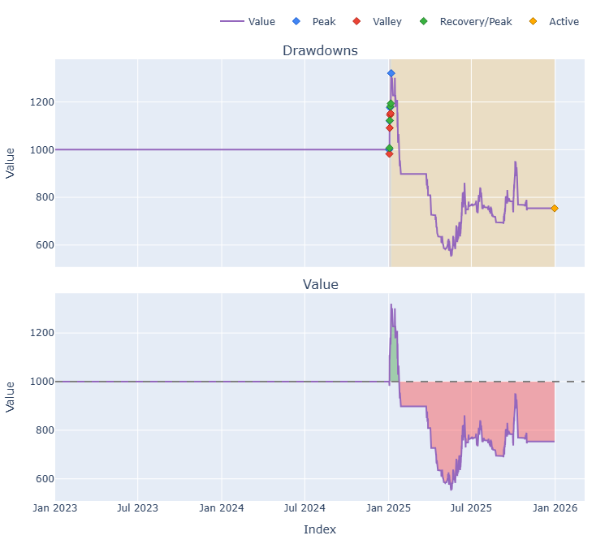
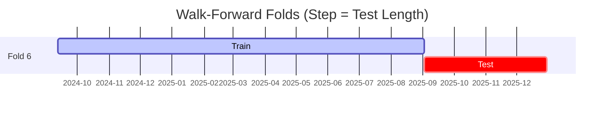

# Trading Strategy Pipeline Report

**Generated**: 2026-03-27 10:11:32

## Executive Summary

**WFO Training/Test period:** n/a  
**Coins:** 5

| | WFO Full Range | YTD |
|-|----------------|--------|
| Strategy CAGR | n/a | n/a |
| BTC buy & hold CAGR | n/a | n/a |
| S&P 500 CAGR | n/a | n/a |
| Strategy Sharpe | n/a | n/a |
| Max Drawdown | n/a | n/a |
| Total Trades | 0 | n/a |
| Win Rate | n/a | n/a |

### Full Range Portfolio

## Result Validation (Training/Test Data)
**Period: n/a** — WFO-selected parameters replayed on the full training/test range.

### Combined Portfolio Performance

| Metric | Strategy | BTC (buy & hold) | S&P 500 (SPY) | Excess vs BTC |
|--------|----------|------------------|---------------|---------------|
| Total Return | n/a | n/a | n/a | - |
| CAGR | n/a | n/a | n/a | n/a |
| Sharpe Ratio | n/a | n/a | n/a | - |
| Max Drawdown | n/a | n/a | n/a | - |
| Total Trades | 0 | 1 | 1 | - |
| Win Rate | n/a | - | - | - |

## YTD Performance

*Not executed.*

## Per-Coin Strategy Selection (WFO)

Best performing strategy per coin based on robustness scores (highest first).

| Symbol | Strategy | Selection | Robustness Score |
|--------|----------|-----------|------------------|
| PUMP-USD | supertrend_flip+fixed_sl_tp | wfo_robustness | 1.7791 |
| BNB-USD | psar_adx+atr_trailing | wfo_robustness | 0.7270 |
| SPX-USD | psar_adx+fixed_sl_tp | wfo_robustness | 0.6601 |
| CRV-USD | donchian_breakout+atr_trailing | wfo_robustness | 0.4583 |
| RENDER-USD | psar_adx+atr_trailing | wfo_robustness | 0.1734 |

### WFO Fold Timeline

### WFO Out-of-Sample Sharpe — Per Fold

Per-fold OOS Sharpe for each coin's winning strategy (folds ordered as above). Negative = strategy did not generalise.

| Symbol | Strategy+Exit | IS Rob | OOS Rob | Consistency | Fold 1 | Fold 2 | Fold 3 | Fold 4 | Fold 5 | Fold 6 |
|--------|---------------|--------|---------|-------------|--------|--------|--------|--------|--------|--------|
| PUMP-USD | supertrend_flip+fixed_sl_tp | 2.5370 | 1.3710 | 100% | nan | nan | nan | nan | nan | 1.371 |
| BNB-USD | psar_adx+atr_trailing | 1.9842 | 0.7211 | 50% | nan | nan | nan | nan | -0.206 | 1.740 |
| SPX-USD | psar_adx+fixed_sl_tp | 2.2542 | 0.0360 | 75% | n/a | n/a | 0.824 | -3.568 | 0.751 | 1.546 |
| CRV-USD | donchian_breakout+atr_trailing | 2.5959 | -0.1159 | 40% | nan | -0.668 | 1.440 | -2.080 | 0.767 | -0.189 |
| RENDER-USD | psar_adx+atr_trailing | 2.0114 | -0.6562 | 50% | nan | nan | 0.243 | -0.631 | 0.216 | -2.228 |

## Full-Period Performance (Per-Coin)

Performance metrics from running WFO-selected parameters on full-range data.

---

*For pipeline methodology, fold structure, and benchmark definitions see [docs/UNIFIED_PIPELINE.md](../docs/UNIFIED_PIPELINE.md).*

---

*Report generated by ggTrader Pipeline*