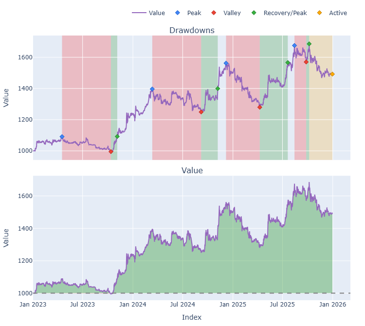
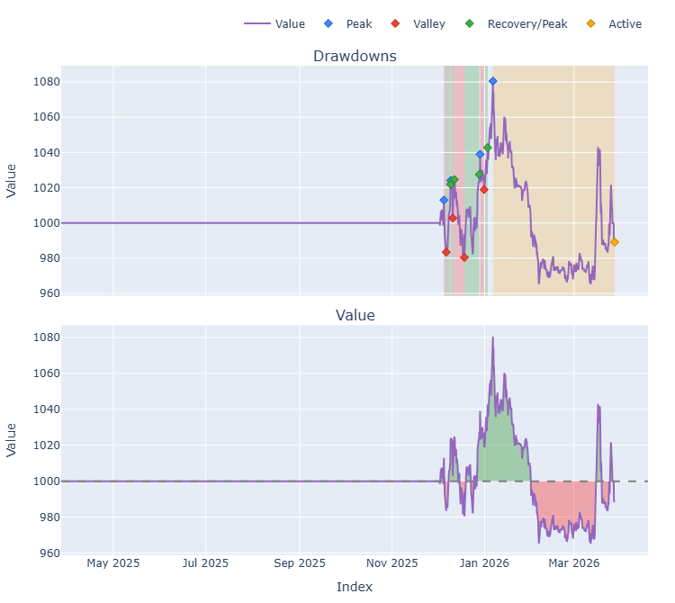
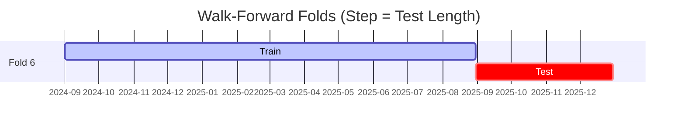

# Trading Strategy Pipeline Report

**Generated**: 2026-03-27 14:34:26

## Executive Summary

**WFO Training/Test period:** 2023-01-01 -> 2025-12-30  
**YTD performance window:** 2025-03-27 -> 2026-03-27  
**Coins:** 32

| | WFO Full Range | YTD |
|-|----------------|--------|
| Strategy CAGR | 14.06% | -1.08% |
| BTC buy & hold CAGR | 74.01% ❌ | -28.58% ✅ |
| S&P 500 CAGR | 23.37% ❌ | 13.10% ❌ |
| Strategy Sharpe | 0.99 | -0.12 |
| Max Drawdown | -16.27% | -10.67% |
| Total Trades | 114 | 27 |
| Win Rate | 43.86% | 29.63% |

### Full Range Portfolio

### YTD Portfolio

## Result Validation (Training/Test Data)
**Period: 2023-01-01 -> 2025-12-30** — WFO-selected parameters replayed on the full training/test range.

### Combined Portfolio Performance

| Metric | Strategy | BTC (buy & hold) | S&P 500 (SPY) | Excess vs BTC |
|--------|----------|------------------|---------------|---------------|
| Total Return | 48.35% | 426.04% | 87.67% | - |
| CAGR | 14.06% | 74.01% | 23.37% | -59.95% |
| Sharpe Ratio | 0.9878 | 1.4255 | 1.4446 | - |
| Max Drawdown | -16.27% | -34.46% | -18.76% | - |
| Total Trades | 114 | 1 | 1 | - |
| Win Rate | 43.86% | - | - | - |

## YTD Performance
**Period: 2025-03-27 -> 2026-03-27** — WFO-selected parameters replayed on the YTD window, no re-optimization.

| Metric | Strategy | BTC (buy & hold) | S&P 500 (SPY) | Excess vs BTC |
|--------|----------|------------------|---------------|---------------|
| Total Return | -1.08% | -28.57% | 13.10% | - |
| CAGR | -1.08% | -28.58% | 13.10% | 27.49% |
| Sharpe Ratio | -0.1166 | -1.8188 | 0.8201 | - |
| Max Drawdown | -10.67% | -35.36% | -10.90% | - |
| Total Trades | 27 | 1 | 1 | - |
| Win Rate | 29.63% | - | - | - |

## Per-Coin Strategy Selection (WFO)

Best performing strategy per coin based on robustness scores (highest first).

| Symbol | Strategy | Selection | Robustness Score |
|--------|----------|-----------|------------------|
| USELESS-USD | ema_cross+atr_trailing | wfo_robustness | 2.3418 |
| VIRTUAL-USD | psar_adx+fixed_sl_tp | wfo_robustness | 2.0001 |
| PUMP-USD | supertrend_flip+fixed_sl_tp | wfo_robustness | 1.7791 |
| PENGU-USD | psar_adx+fixed_sl_tp | wfo_robustness | 1.7549 |
| ZEC-USD | ema_cross+atr_trailing | wfo_robustness | 0.9233 |
| XRP-USD | psar_adx+atr_trailing | wfo_robustness | 0.8420 |
| ETH-USD | rsi_reversal+atr_trailing | wfo_robustness | 0.7849 |
| TRUMP-USD | ema_cross+trailing_stop | wfo_robustness | 0.7276 |
| BNB-USD | psar_adx+atr_trailing | wfo_robustness | 0.7270 |
| HBAR-USD | ema_cross+fixed_sl_tp | wfo_robustness | 0.7254 |
| WIF-USD | psar_adx+fixed_sl_tp | wfo_robustness | 0.7128 |
| TAO-USD | psar_adx+atr_trailing | wfo_robustness | 0.6812 |
| SPX-USD | psar_adx+fixed_sl_tp | wfo_robustness | 0.6601 |
| TRX-USD | rsi_reversal+fixed_sl_tp | wfo_robustness | 0.6446 |
| LINK-USD | supertrend_flip+atr_trailing | wfo_robustness | 0.5949 |
| ADA-USD | psar_adx+trailing_stop | wfo_robustness | 0.5888 |
| FARTCOIN-USD | supertrend_flip+trailing_stop | wfo_robustness | 0.5459 |
| SOL-USD | ema_cross+atr_trailing | wfo_robustness | 0.5235 |
| DOGE-USD | psar_adx+fixed_sl_tp | wfo_robustness | 0.5156 |
| SUI-USD | psar_adx+trailing_stop | wfo_robustness | 0.4884 |
| CRV-USD | donchian_breakout+atr_trailing | wfo_robustness | 0.4583 |
| NEAR-USD | rsi_reversal+fixed_sl_tp | wfo_robustness | 0.4450 |
| XMR-USD | psar_adx+trailing_stop | wfo_robustness | 0.4196 |
| AVAX-USD | donchian_breakout+atr_trailing | wfo_robustness | 0.4039 |
| PEPE-USD | ema_cross+fixed_sl_tp | wfo_robustness | 0.3831 |
| XLM-USD | rsi_reversal+fixed_sl_tp | wfo_robustness | 0.3799 |
| ONDO-USD | rsi_reversal+atr_trailing | wfo_robustness | 0.2973 |
| DOT-USD | psar_adx+trailing_stop | wfo_robustness | 0.2791 |
| BTC-USD | rsi_reversal+atr_trailing | wfo_robustness | 0.2346 |
| AAVE-USD | rsi_reversal+fixed_sl_tp | wfo_robustness | 0.2310 |
| KAS-USD | supertrend_flip+atr_trailing | wfo_robustness | 0.1844 |
| RENDER-USD | psar_adx+atr_trailing | wfo_robustness | 0.1734 |

### WFO Fold Timeline

### WFO Out-of-Sample Sharpe — Per Fold

Per-fold OOS Sharpe for each coin's winning strategy (folds ordered as above). Negative = strategy did not generalise.

| Symbol | Strategy+Exit | IS Rob | OOS Rob | Consistency | Fold 1 | Fold 2 | Fold 3 | Fold 4 | Fold 5 | Fold 6 |
|--------|---------------|--------|---------|-------------|--------|--------|--------|--------|--------|--------|
| USELESS-USD | ema_cross+atr_trailing | n/a | 2.3418 | 100% | n/a | n/a | n/a | n/a | n/a | 2.342 |
| PENGU-USD | psar_adx+fixed_sl_tp | 1.8815 | 1.6867 | 100% | n/a | n/a | n/a | 1.280 | 2.112 | n/a |
| VIRTUAL-USD | psar_adx+fixed_sl_tp | 2.6093 | 1.6721 | 100% | n/a | n/a | n/a | 2.177 | n/a | 1.359 |
| PUMP-USD | supertrend_flip+fixed_sl_tp | 2.5370 | 1.3710 | 100% | n/a | n/a | n/a | n/a | n/a | 1.371 |
| ADA-USD | psar_adx+trailing_stop | 1.0715 | 0.8724 | 50% | -0.313 | n/a | 4.302 | n/a | 1.180 | -0.436 |
| XRP-USD | psar_adx+atr_trailing | 1.9906 | 0.7786 | 60% | -1.862 | 0.151 | 4.348 | -0.212 | 0.904 | n/a |
| BNB-USD | psar_adx+atr_trailing | 1.9842 | 0.7211 | 50% | n/a | n/a | n/a | n/a | -0.206 | 1.740 |
| TAO-USD | psar_adx+atr_trailing | 1.4338 | 0.6252 | 67% | n/a | n/a | 1.326 | -0.164 | 0.918 | n/a |
| WIF-USD | psar_adx+fixed_sl_tp | 1.3473 | 0.5646 | 80% | 3.146 | 0.113 | 1.934 | 0.118 | -0.185 | n/a |
| ZEC-USD | ema_cross+atr_trailing | 2.5019 | 0.5469 | 67% | n/a | n/a | n/a | 1.090 | -2.515 | 3.140 |
| ETH-USD | rsi_reversal+atr_trailing | 1.8321 | 0.3935 | 83% | 0.688 | 1.297 | 0.863 | -3.405 | 2.367 | 1.004 |
| LINK-USD | supertrend_flip+atr_trailing | 1.9018 | 0.1964 | 67% | -0.622 | 0.396 | 0.952 | -0.818 | 0.681 | 0.277 |
| HBAR-USD | ema_cross+fixed_sl_tp | 2.9646 | 0.1892 | 50% | n/a | n/a | n/a | n/a | 1.019 | -0.487 |
| SOL-USD | ema_cross+atr_trailing | 1.7893 | 0.1871 | 60% | n/a | -1.182 | 0.651 | -1.260 | 0.894 | 1.031 |
| DOGE-USD | psar_adx+fixed_sl_tp | 1.6307 | 0.1795 | 67% | 1.459 | -1.800 | 1.800 | -2.095 | 0.569 | 1.153 |
| AVAX-USD | donchian_breakout+atr_trailing | 2.0062 | 0.0495 | 40% | -0.886 | -1.165 | 1.051 | n/a | -0.859 | 1.049 |
| TRUMP-USD | ema_cross+trailing_stop | 2.6914 | 0.0432 | 67% | n/a | n/a | n/a | 0.208 | -0.256 | 0.171 |
| SPX-USD | psar_adx+fixed_sl_tp | 2.2542 | 0.0360 | 75% | n/a | n/a | 0.824 | -3.568 | 0.751 | 1.546 |
| BTC-USD | rsi_reversal+atr_trailing | 1.5422 | -0.1086 | 33% | 2.868 | -3.269 | 1.564 | -0.253 | -0.006 | -0.571 |
| CRV-USD | donchian_breakout+atr_trailing | 2.5959 | -0.1159 | 40% | n/a | -0.668 | 1.440 | -2.080 | 0.767 | -0.189 |
| SUI-USD | psar_adx+trailing_stop | 2.2234 | -0.1238 | 60% | 2.706 | -2.821 | 1.267 | 0.147 | -0.864 | n/a |
| TRX-USD | rsi_reversal+fixed_sl_tp | 2.6966 | -0.1297 | 67% | 1.200 | 0.003 | 1.069 | 0.239 | -1.034 | -0.801 |
| FARTCOIN-USD | supertrend_flip+trailing_stop | 2.8349 | -0.1827 | 50% | n/a | n/a | n/a | n/a | -1.388 | 0.793 |
| PEPE-USD | ema_cross+fixed_sl_tp | 2.5733 | -0.2069 | 33% | 2.552 | -1.091 | 2.008 | -1.252 | -0.307 | -1.101 |
| XLM-USD | rsi_reversal+fixed_sl_tp | 2.6892 | -0.2792 | 33% | -2.426 | -1.710 | 3.254 | -1.572 | 1.995 | -2.420 |
| ONDO-USD | rsi_reversal+atr_trailing | 2.2729 | -0.3921 | 40% | n/a | -0.285 | 2.564 | -4.019 | -0.364 | 0.126 |
| NEAR-USD | rsi_reversal+fixed_sl_tp | 2.4449 | -0.4037 | 67% | 0.947 | 0.909 | 0.445 | -1.847 | -1.742 | 0.143 |
| XMR-USD | psar_adx+trailing_stop | 2.9634 | -0.5629 | 50% | -0.751 | 0.320 | -3.307 | 1.390 | 0.402 | -1.967 |
| DOT-USD | psar_adx+trailing_stop | 2.6792 | -0.5838 | 33% | -0.846 | n/a | 0.808 | n/a | -1.576 | n/a |
| RENDER-USD | psar_adx+atr_trailing | 2.0114 | -0.6562 | 50% | n/a | n/a | 0.243 | -0.631 | 0.216 | -2.228 |
| AAVE-USD | rsi_reversal+fixed_sl_tp | 2.7989 | -0.8610 | 40% | -3.434 | -1.310 | 2.149 | n/a | 0.040 | -3.096 |
| KAS-USD | supertrend_flip+atr_trailing | 2.6738 | -0.8724 | 33% | n/a | n/a | n/a | -0.811 | 0.785 | -2.791 |

## Full-Period Performance (Per-Coin)

Performance metrics from running WFO-selected parameters on full-range data.

| Symbol | Strategy | Selection | Return % | Sharpe | Max DD % | Trades | Win Rate % |
|--------|----------|-----------|----------|--------|----------|--------|-----------|
| BTC-USD | rsi_reversal | wfo_robustness | 10.81% | 1.2865 | -4.16% | 23 | 34.78% |
| SOL-USD | ema_cross | wfo_robustness | 19.57% | 1.1576 | -5.32% | 27 | 48.15% |
| TAO-USD | psar_adx | wfo_robustness | 17.25% | 1.0020 | -4.72% | 15 | 73.33% |
| AVAX-USD | donchian_breakout | wfo_robustness | 6.12% | 0.7052 | -2.52% | 5 | 60.00% |
| LINK-USD | supertrend_flip | wfo_robustness | 6.95% | 0.5387 | -4.99% | 22 | 45.45% |
| XLM-USD | rsi_reversal | wfo_robustness | 2.79% | 0.5065 | -2.94% | 10 | 30.00% |
| ADA-USD | psar_adx | wfo_robustness | 3.14% | 0.4669 | -2.76% | 19 | 36.84% |
| ETH-USD | rsi_reversal | wfo_robustness | 13.61% | 0.4081 | -17.26% | 1 | 100.00% |
| NEAR-USD | rsi_reversal | wfo_robustness | 0.00% | 0.0000 | 0.00% | 0 | 0.00% |
| SUI-USD | psar_adx | wfo_robustness | 0.00% | 0.0000 | 0.00% | 0 | 0.00% |
| ZEC-USD | ema_cross | wfo_robustness | 0.00% | 0.0000 | 0.00% | 0 | 0.00% |
| DOT-USD | psar_adx | wfo_robustness | -0.67% | -0.0984 | -4.25% | 11 | 27.27% |
| XMR-USD | psar_adx | wfo_robustness | -0.39% | -0.1692 | -1.78% | 5 | 60.00% |
| DOGE-USD | psar_adx | wfo_robustness | -3.41% | -0.1881 | -10.05% | 41 | 29.27% |
| HBAR-USD | ema_cross | wfo_robustness | -1.53% | -0.2281 | -4.18% | 7 | 42.86% |
| TRX-USD | rsi_reversal | wfo_robustness | -3.60% | -0.6714 | -6.11% | 30 | 30.00% |
| FARTCOIN-USD | supertrend_flip | wfo_robustness | -12.87% | -0.7035 | -16.57% | 45 | 24.44% |
| XRP-USD | psar_adx | wfo_robustness | -1.58% | -0.7862 | -1.58% | 3 | 33.33% |
| PEPE-USD | ema_cross | wfo_robustness | -2.07% | -1.0396 | -2.07% | 1 | 0.00% |

---

*For pipeline methodology, fold structure, and benchmark definitions see [docs/UNIFIED_PIPELINE.md](../docs/UNIFIED_PIPELINE.md).*

---

*Report generated by ggTrader Pipeline*