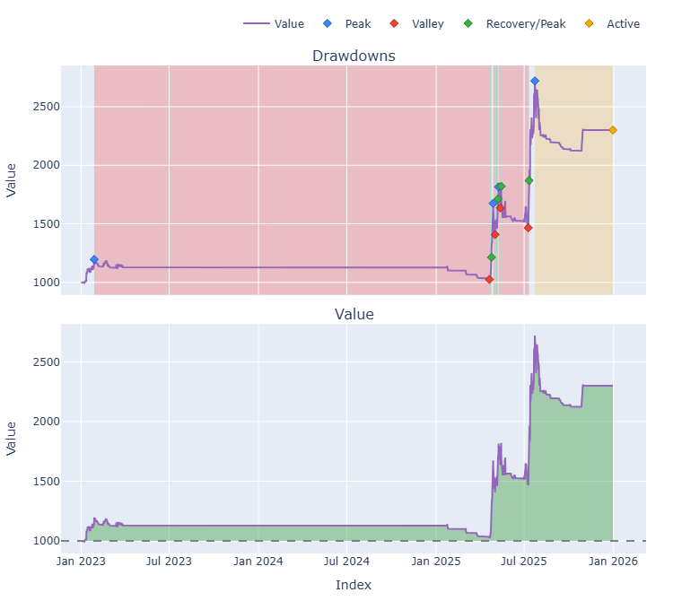
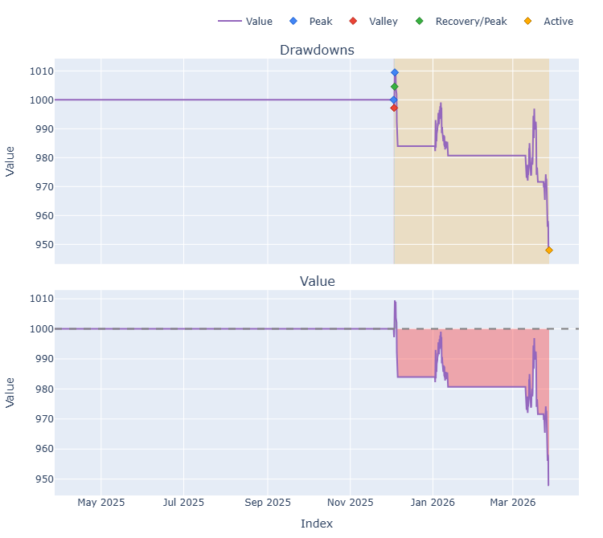
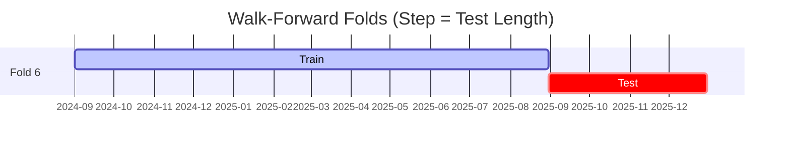

# Trading Strategy Pipeline Report

**Generated**: 2026-03-27 15:32:17

## Executive Summary

**WFO Training/Test period:** 2023-01-01 -> 2025-12-30  
**YTD performance window:** 2025-03-27 -> 2026-03-27  
**Coins:** 11

| | WFO Full Range | YTD |
|-|----------------|--------|
| Strategy CAGR | 4.15% | -5.20% |
| BTC buy & hold CAGR | n/a | n/a |
| S&P 500 CAGR | 23.37% ❌ | 13.10% ❌ |
| Strategy Sharpe | 0.64 | -2.30 |
| Max Drawdown | -6.72% | -6.09% |
| Total Trades | 5 | 4 |
| Win Rate | 60.00% | 0.00% |

### Full Range Portfolio

### YTD Portfolio

## Result Validation (Training/Test Data)
**Period: 2023-01-01 -> 2025-12-30** — WFO-selected parameters replayed on the full training/test range.

### Combined Portfolio Performance

| Metric | Strategy | BTC (buy & hold) | S&P 500 (SPY) | Excess vs BTC |
|--------|----------|------------------|---------------|---------------|
| Total Return | 12.98% | n/a | 87.67% | - |
| CAGR | 4.15% | n/a | 23.37% | n/a |
| Sharpe Ratio | 0.6402 | n/a | 1.4446 | - |
| Max Drawdown | -6.72% | n/a | -18.76% | - |
| Total Trades | 5 | 0 | 1 | - |
| Win Rate | 60.00% | - | - | - |

## YTD Performance
**Period: 2025-03-27 -> 2026-03-27** — WFO-selected parameters replayed on the YTD window, no re-optimization.

| Metric | Strategy | BTC (buy & hold) | S&P 500 (SPY) | Excess vs BTC |
|--------|----------|------------------|---------------|---------------|
| Total Return | -5.20% | n/a | 13.10% | - |
| CAGR | -5.20% | n/a | 13.10% | n/a |
| Sharpe Ratio | -2.3044 | n/a | 0.8201 | - |
| Max Drawdown | -6.09% | n/a | -10.90% | - |
| Total Trades | 4 | 0 | 1 | - |
| Win Rate | 0.00% | - | - | - |

## Per-Coin Strategy Selection (WFO)

Best performing strategy per coin based on robustness scores (highest first).

| Symbol | Strategy | Selection | Robustness Score |
|--------|----------|-----------|------------------|
| USELESS-USD | ema_cross+atr_trailing | wfo_robustness | 2.3418 |
| VIRTUAL-USD | psar_adx+fixed_sl_tp | wfo_robustness | 2.0001 |
| PENGU-USD | psar_adx+fixed_sl_tp | wfo_robustness | 1.7549 |
| TRUMP-USD | ema_cross+trailing_stop | wfo_robustness | 0.7276 |
| WIF-USD | psar_adx+fixed_sl_tp | wfo_robustness | 0.7128 |
| TRX-USD | rsi_reversal+fixed_sl_tp | wfo_robustness | 0.6446 |
| AVAX-USD | donchian_breakout+atr_trailing | wfo_robustness | 0.4039 |
| PEPE-USD | ema_cross+fixed_sl_tp | wfo_robustness | 0.3831 |
| ONDO-USD | rsi_reversal+atr_trailing | wfo_robustness | 0.2973 |
| AAVE-USD | rsi_reversal+fixed_sl_tp | wfo_robustness | 0.2310 |
| KAS-USD | supertrend_flip+atr_trailing | wfo_robustness | 0.1844 |

### WFO Fold Timeline

### WFO Out-of-Sample Sharpe — Per Fold

Per-fold OOS Sharpe for each coin's winning strategy (folds ordered as above). Negative = strategy did not generalise.

| Symbol | Strategy+Exit | IS Rob | OOS Rob | Consistency | Fold 1 | Fold 2 | Fold 3 | Fold 4 | Fold 5 | Fold 6 |
|--------|---------------|--------|---------|-------------|--------|--------|--------|--------|--------|--------|
| USELESS-USD | ema_cross+atr_trailing | n/a | 2.3418 | 100% | n/a | n/a | n/a | n/a | n/a | 2.342 |
| PENGU-USD | psar_adx+fixed_sl_tp | 1.8815 | 1.6867 | 100% | n/a | n/a | n/a | 1.280 | 2.112 | n/a |
| VIRTUAL-USD | psar_adx+fixed_sl_tp | 2.6093 | 1.6721 | 100% | n/a | n/a | n/a | 2.177 | n/a | 1.359 |
| WIF-USD | psar_adx+fixed_sl_tp | 1.3473 | 0.5646 | 80% | 3.146 | 0.113 | 1.934 | 0.118 | -0.185 | n/a |
| AVAX-USD | donchian_breakout+atr_trailing | 2.0062 | 0.0495 | 40% | -0.886 | -1.165 | 1.051 | n/a | -0.859 | 1.049 |
| TRUMP-USD | ema_cross+trailing_stop | 2.6914 | 0.0432 | 67% | n/a | n/a | n/a | 0.208 | -0.256 | 0.171 |
| TRX-USD | rsi_reversal+fixed_sl_tp | 2.6966 | -0.1297 | 67% | 1.200 | 0.003 | 1.069 | 0.239 | -1.034 | -0.801 |
| PEPE-USD | ema_cross+fixed_sl_tp | 2.5733 | -0.2069 | 33% | 2.552 | -1.091 | 2.008 | -1.252 | -0.307 | -1.101 |
| ONDO-USD | rsi_reversal+atr_trailing | 2.2729 | -0.3921 | 40% | n/a | -0.285 | 2.564 | -4.019 | -0.364 | 0.126 |
| AAVE-USD | rsi_reversal+fixed_sl_tp | 2.7989 | -0.8610 | 40% | -3.434 | -1.310 | 2.149 | n/a | 0.040 | -3.096 |
| KAS-USD | supertrend_flip+atr_trailing | 2.6738 | -0.8724 | 33% | n/a | n/a | n/a | -0.811 | 0.785 | -2.791 |

## Full-Period Performance (Per-Coin)

Performance metrics from running WFO-selected parameters on full-range data.

| Symbol | Strategy | Selection | Return % | Sharpe | Max DD % | Trades | Win Rate % |
|--------|----------|-----------|----------|--------|----------|--------|-----------|
| AVAX-USD | donchian_breakout | wfo_robustness | 6.12% | 0.7052 | -2.52% | 5 | 60.00% |
| TRX-USD | rsi_reversal | wfo_robustness | -3.60% | -0.6714 | -6.11% | 30 | 30.00% |
| PEPE-USD | ema_cross | wfo_robustness | -2.07% | -1.0396 | -2.07% | 1 | 0.00% |

---

*For pipeline methodology, fold structure, and benchmark definitions see [docs/UNIFIED_PIPELINE.md](../docs/UNIFIED_PIPELINE.md).*

---

*Report generated by ggTrader Pipeline*