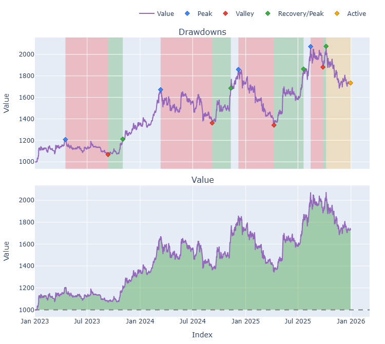
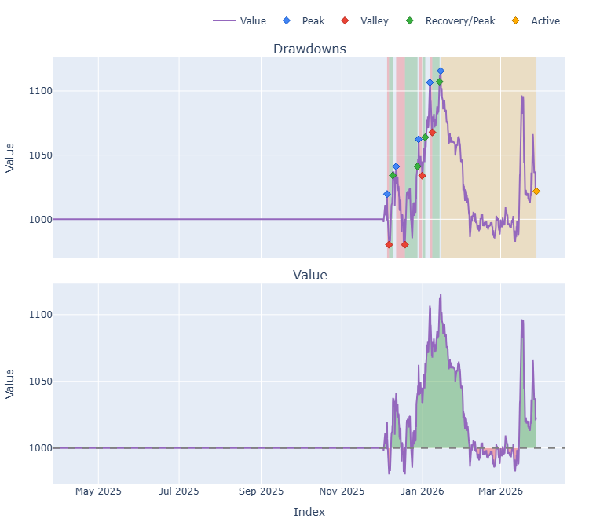
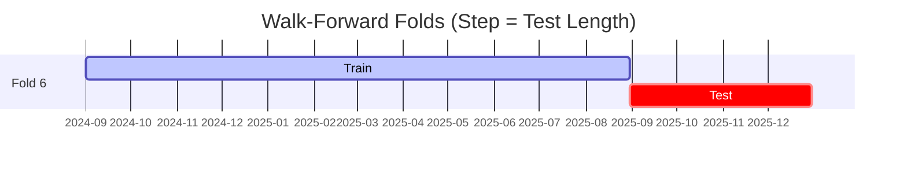

# Trading Strategy Pipeline Report

**Generated**: 2026-03-27 20:20:24

## Executive Summary

**WFO Training/Test period:** 2023-01-01 -> 2025-12-30  
**YTD performance window:** 2025-03-28 -> 2026-03-28  
**Coins:** 34

| | WFO Full Range | YTD |
|-|----------------|--------|
| Strategy CAGR | 17.07% | 2.19% |
| BTC buy & hold CAGR | 74.01% ❌ | -28.55% ✅ |
| S&P 500 CAGR | 1.02% ✅ | n/a |
| Strategy Sharpe | 0.96 | 0.40 |
| Max Drawdown | -20.57% | -11.95% |
| Total Trades | 89 | 32 |
| Win Rate | 48.31% | 28.12% |

### Full Range Portfolio

### YTD Portfolio

## Result Validation (Training/Test Data)
**Period: 2023-01-01 -> 2025-12-30** — WFO-selected parameters replayed on the full training/test range.

### Combined Portfolio Performance

| Metric | Strategy | BTC (buy & hold) | S&P 500 (SPY) | Excess vs BTC |
|--------|----------|------------------|---------------|---------------|
| Total Return | 60.37% | 426.04% | 3.09% | - |
| CAGR | 17.07% | 74.01% | 1.02% | -56.94% |
| Sharpe Ratio | 0.9583 | 1.4255 | 0.4864 | - |
| Max Drawdown | -20.57% | -34.46% | -1.70% | - |
| Total Trades | 89 | 1 | 1 | - |
| Win Rate | 48.31% | - | - | - |

## YTD Performance
**Period: 2025-03-28 -> 2026-03-28** — WFO-selected parameters replayed on the YTD window, no re-optimization.

| Metric | Strategy | BTC (buy & hold) | S&P 500 (SPY) | Excess vs BTC |
|--------|----------|------------------|---------------|---------------|
| Total Return | 2.19% | -28.53% | n/a | - |
| CAGR | 2.19% | -28.55% | n/a | 30.74% |
| Sharpe Ratio | 0.4011 | -1.8147 | n/a | - |
| Max Drawdown | -11.95% | -35.36% | n/a | - |
| Total Trades | 32 | 1 | 1 | - |
| Win Rate | 28.12% | - | - | - |

## Per-Coin Strategy Selection (WFO)

Best performing strategy per coin based on robustness scores (highest first).

| Symbol | Strategy | Selection | Robustness Score |
|--------|----------|-----------|------------------|
| USELESS-USD | ema_cross+atr_trailing | wfo_robustness | 2.3418 |
| PENGU-USD | psar_adx+fixed_sl_tp | wfo_robustness | 1.6839 |
| PUMP-USD | donchian_breakout+atr_trailing | wfo_robustness | 1.3710 |
| ZEC-USD | ema_cross+atr_trailing | wfo_robustness | 0.9396 |
| TAO-USD | psar_adx+atr_trailing | wfo_robustness | 0.8003 |
| ETH-USD | rsi_reversal+atr_trailing | wfo_robustness | 0.7849 |
| TRUMP-USD | ema_cross+trailing_stop | wfo_robustness | 0.7624 |
| BNB-USD | psar_adx+atr_trailing | wfo_robustness | 0.7170 |
| HBAR-USD | macd_cross+fixed_sl_tp | wfo_robustness | 0.6234 |
| LINK-USD | supertrend_flip+atr_trailing | wfo_robustness | 0.5949 |
| XRP-USD | psar_adx+atr_trailing | wfo_robustness | 0.5760 |
| TRX-USD | rsi_reversal+trailing_stop | wfo_robustness | 0.5469 |
| VIRTUAL-USD | psar_adx+atr_trailing | wfo_robustness | 0.5368 |
| SPX-USD | psar_adx+fixed_sl_tp | wfo_robustness | 0.5333 |
| SOL-USD | ema_cross+atr_trailing | wfo_robustness | 0.5235 |
| FARTCOIN-USD | supertrend_flip+trailing_stop | wfo_robustness | 0.4545 |
| WIF-USD | supertrend_flip+fixed_sl_tp | wfo_robustness | 0.4247 |
| XMR-USD | rsi_reversal+atr_trailing | wfo_robustness | 0.4166 |
| DOGE-USD | rsi_reversal+trailing_stop | wfo_robustness | 0.4019 |
| ADA-USD | rsi_reversal+atr_trailing | wfo_robustness | 0.3933 |
| NEAR-USD | ema_cross+fixed_sl_tp | wfo_robustness | 0.3611 |
| XLM-USD | psar_adx+trailing_stop | wfo_robustness | 0.3593 |
| PEPE-USD | rsi_reversal+atr_trailing | wfo_robustness | 0.3549 |
| AVAX-USD | donchian_breakout+atr_trailing | wfo_robustness | 0.3196 |
| SUI-USD | ema_cross+fixed_sl_tp | wfo_robustness | 0.3128 |
| ONDO-USD | rsi_reversal+atr_trailing | wfo_robustness | 0.2973 |
| BTC-USD | macd_cross+atr_trailing | wfo_robustness | 0.2379 |
| AAVE-USD | ema_cross+trailing_stop | wfo_robustness | 0.1900 |
| CRV-USD | donchian_breakout+atr_trailing | wfo_robustness | 0.1854 |
| KAS-USD | supertrend_flip+atr_trailing | wfo_robustness | 0.1844 |
| UNI-USD | psar_adx+fixed_sl_tp | wfo_robustness | 0.1763 |
| XCN-USD | donchian_breakout+atr_trailing | wfo_robustness | 0.1616 |
| ICP-USD | psar_adx+fixed_sl_tp | wfo_robustness | 0.1511 |
| FET-USD | psar_adx+trailing_stop | wfo_robustness | 0.1241 |

### WFO Fold Timeline

### WFO Out-of-Sample Sharpe — Per Fold

Per-fold OOS Sharpe for each coin's winning strategy (folds ordered as above). Negative = strategy did not generalise.

| Symbol | Strategy+Exit | IS Rob | OOS Rob | Consistency | Fold 1 | Fold 2 | Fold 3 | Fold 4 | Fold 5 | Fold 6 |
|--------|---------------|--------|---------|-------------|--------|--------|--------|--------|--------|--------|
| USELESS-USD | ema_cross+atr_trailing | n/a | 2.3418 | 100% | n/a | n/a | n/a | n/a | n/a | 2.342 |
| PENGU-USD | psar_adx+fixed_sl_tp | 1.3703 | 1.8528 | 100% | n/a | n/a | n/a | 1.490 | 2.040 | n/a |
| PUMP-USD | donchian_breakout+atr_trailing | n/a | 1.3710 | 100% | n/a | n/a | n/a | n/a | n/a | 1.371 |
| TAO-USD | psar_adx+atr_trailing | 1.8878 | 0.6252 | 67% | n/a | n/a | 1.326 | -0.164 | 0.918 | n/a |
| ZEC-USD | ema_cross+atr_trailing | 2.5053 | 0.5783 | 67% | n/a | n/a | n/a | 0.212 | -1.058 | 2.544 |
| BNB-USD | psar_adx+atr_trailing | 2.4254 | 0.4590 | 50% | n/a | n/a | n/a | n/a | -0.830 | 1.740 |
| ETH-USD | rsi_reversal+atr_trailing | 1.8321 | 0.3935 | 83% | 0.688 | 1.297 | 0.863 | -3.405 | 2.367 | 1.004 |
| XCN-USD | donchian_breakout+atr_trailing | n/a | 0.3232 | 33% | n/a | n/a | n/a | 3.424 | -1.510 | -0.085 |
| XLM-USD | psar_adx+trailing_stop | 1.0835 | 0.3010 | 50% | -0.219 | -2.689 | 3.013 | n/a | 0.230 | n/a |
| SPX-USD | psar_adx+fixed_sl_tp | 1.4893 | 0.2079 | 75% | n/a | n/a | 1.640 | -1.898 | 0.452 | 0.801 |
| LINK-USD | supertrend_flip+atr_trailing | 1.9018 | 0.1964 | 67% | -0.622 | 0.396 | 0.952 | -0.818 | 0.681 | 0.277 |
| HBAR-USD | macd_cross+fixed_sl_tp | 2.4983 | 0.1892 | 50% | n/a | n/a | n/a | n/a | 1.019 | -0.487 |
| SOL-USD | ema_cross+atr_trailing | 1.7893 | 0.1871 | 60% | n/a | -1.182 | 0.651 | -1.260 | 0.894 | 1.031 |
| VIRTUAL-USD | psar_adx+atr_trailing | 2.1283 | 0.1754 | 50% | n/a | n/a | n/a | n/a | -0.494 | 0.789 |
| XMR-USD | rsi_reversal+atr_trailing | 1.7240 | 0.0972 | 50% | -1.551 | 0.110 | -0.474 | 0.244 | -0.678 | 1.488 |
| AVAX-USD | donchian_breakout+atr_trailing | 1.5681 | 0.0495 | 40% | -0.886 | -1.165 | 1.051 | n/a | -0.859 | 1.049 |
| TRUMP-USD | ema_cross+trailing_stop | 2.8240 | 0.0432 | 67% | n/a | n/a | n/a | 0.208 | -0.256 | 0.171 |
| XRP-USD | psar_adx+atr_trailing | 1.8801 | 0.0302 | 80% | 0.072 | 0.151 | 4.252 | -3.428 | 0.151 | n/a |
| ADA-USD | rsi_reversal+atr_trailing | 2.0156 | 0.0149 | 40% | -1.193 | -1.581 | 2.722 | n/a | 0.418 | -0.868 |
| ICP-USD | psar_adx+fixed_sl_tp | 0.8896 | -0.1071 | 50% | 1.177 | -3.507 | -0.448 | -2.127 | 1.492 | 1.067 |
| DOGE-USD | rsi_reversal+trailing_stop | 2.0506 | -0.1148 | 50% | 0.954 | -1.800 | 1.800 | -2.326 | 1.764 | -0.898 |
| TRX-USD | rsi_reversal+trailing_stop | 2.3243 | -0.1297 | 67% | 1.200 | 0.003 | 1.069 | 0.239 | -1.034 | -0.801 |
| FARTCOIN-USD | supertrend_flip+trailing_stop | 2.4172 | -0.1827 | 50% | n/a | n/a | n/a | n/a | -1.388 | 0.793 |
| UNI-USD | psar_adx+fixed_sl_tp | 1.3899 | -0.2058 | 33% | -1.921 | 0.527 | -0.344 | -0.852 | 1.323 | -0.916 |
| BTC-USD | macd_cross+atr_trailing | 1.7905 | -0.2322 | 33% | 2.868 | -3.269 | 1.564 | -0.253 | -1.138 | -0.176 |
| WIF-USD | supertrend_flip+fixed_sl_tp | 2.1734 | -0.2369 | 60% | n/a | 0.563 | -0.294 | 0.118 | 0.348 | -1.390 |
| CRV-USD | donchian_breakout+atr_trailing | 1.4516 | -0.2631 | 40% | n/a | -1.790 | 1.440 | -2.080 | 0.586 | -0.189 |
| PEPE-USD | rsi_reversal+atr_trailing | 2.0095 | -0.3020 | 60% | 2.552 | -1.091 | n/a | -3.886 | 0.495 | 0.911 |
| ONDO-USD | rsi_reversal+atr_trailing | 2.2729 | -0.3921 | 40% | n/a | -0.285 | 2.564 | -4.019 | -0.364 | 0.126 |
| NEAR-USD | ema_cross+fixed_sl_tp | 2.1254 | -0.4037 | 67% | 0.947 | 0.909 | 0.445 | -1.847 | -1.742 | 0.143 |
| SUI-USD | ema_cross+fixed_sl_tp | 2.3463 | -0.4933 | 50% | 2.535 | -2.557 | 2.003 | 0.605 | -1.294 | -2.272 |
| FET-USD | psar_adx+trailing_stop | 1.6977 | -0.5322 | 33% | 2.028 | -0.974 | -0.803 | -2.769 | 1.444 | -1.366 |
| AAVE-USD | ema_cross+trailing_stop | 2.5863 | -0.8610 | 40% | -3.434 | -1.310 | 2.149 | n/a | 0.040 | -3.096 |
| KAS-USD | supertrend_flip+atr_trailing | 2.6738 | -0.8724 | 33% | n/a | n/a | n/a | -0.811 | 0.785 | -2.791 |

## Full-Period Performance (Per-Coin)

Performance metrics from running WFO-selected parameters on full-range data.

| Symbol | Strategy | Selection | Return % | Sharpe | Max DD % | Trades | Win Rate % |
|--------|----------|-----------|----------|--------|----------|--------|-----------|
| BTC-USD | macd_cross | wfo_robustness | 10.75% | 1.2506 | -4.00% | 22 | 36.36% |
| SOL-USD | ema_cross | wfo_robustness | 19.57% | 1.1576 | -5.32% | 27 | 48.15% |
| TAO-USD | psar_adx | wfo_robustness | 17.25% | 1.0020 | -4.72% | 15 | 73.33% |
| AVAX-USD | donchian_breakout | wfo_robustness | 6.12% | 0.7052 | -2.52% | 5 | 60.00% |
| LINK-USD | supertrend_flip | wfo_robustness | 6.95% | 0.5387 | -4.99% | 22 | 45.45% |
| ADA-USD | rsi_reversal | wfo_robustness | 4.35% | 0.5206 | -3.39% | 9 | 33.33% |
| ETH-USD | rsi_reversal | wfo_robustness | 13.61% | 0.4081 | -17.26% | 1 | 100.00% |
| FET-USD | psar_adx | wfo_robustness | 0.00% | 0.0000 | 0.00% | 0 | 0.00% |
| NEAR-USD | ema_cross | wfo_robustness | 0.00% | 0.0000 | 0.00% | 0 | 0.00% |
| SUI-USD | ema_cross | wfo_robustness | 0.00% | 0.0000 | 0.00% | 0 | 0.00% |
| ZEC-USD | ema_cross | wfo_robustness | 0.00% | 0.0000 | 0.00% | 0 | 0.00% |
| XLM-USD | psar_adx | wfo_robustness | -0.21% | -0.1050 | -0.69% | 3 | 33.33% |
| XMR-USD | rsi_reversal | wfo_robustness | -2.37% | -0.3355 | -4.22% | 14 | 28.57% |
| HBAR-USD | macd_cross | wfo_robustness | -2.59% | -0.4425 | -5.08% | 15 | 20.00% |
| TRX-USD | rsi_reversal | wfo_robustness | -1.97% | -0.4567 | -4.27% | 35 | 31.43% |
| DOGE-USD | rsi_reversal | wfo_robustness | -11.59% | -0.6845 | -15.27% | 101 | 24.75% |
| PEPE-USD | rsi_reversal | wfo_robustness | -1.75% | -0.7106 | -2.05% | 1 | 0.00% |
| XRP-USD | psar_adx | wfo_robustness | -1.58% | -0.7862 | -1.58% | 3 | 33.33% |
| FARTCOIN-USD | supertrend_flip | wfo_robustness | -18.80% | -1.1184 | -21.48% | 51 | 15.69% |

---

*For pipeline methodology, fold structure, and benchmark definitions see [docs/UNIFIED_PIPELINE.md](../docs/UNIFIED_PIPELINE.md).*

---

*Report generated by ggTrader Pipeline*