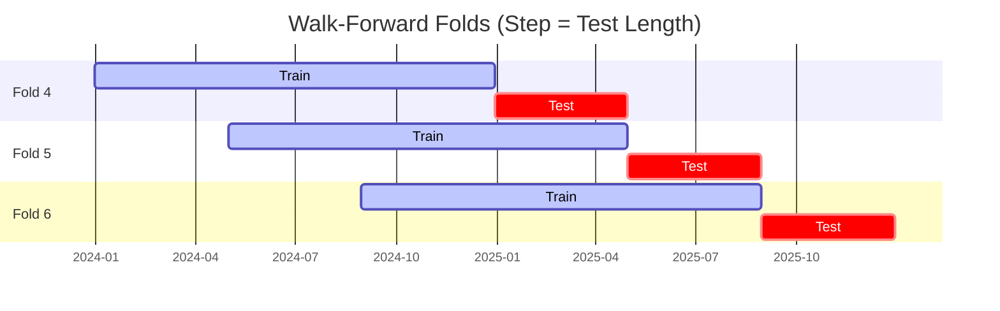

# Trading Strategy Pipeline Report

**Generated**: 2026-03-27 20:08:02

## Executive Summary

**WFO Training/Test period:** n/a  
**Coins:** 9

| | WFO Full Range | YTD |
|-|----------------|--------|
| Strategy CAGR | n/a | n/a |
| BTC buy & hold CAGR | n/a | n/a |
| S&P 500 CAGR | n/a | n/a |
| Strategy Sharpe | n/a | n/a |
| Max Drawdown | n/a | n/a |
| Total Trades | 0 | n/a |
| Win Rate | n/a | n/a |

### Full Range Portfolio

## Result Validation (Training/Test Data)
**Period: n/a** — WFO-selected parameters replayed on the full training/test range.

### Combined Portfolio Performance

| Metric | Strategy | BTC (buy & hold) | S&P 500 (SPY) | Excess vs BTC |
|--------|----------|------------------|---------------|---------------|
| Total Return | n/a | n/a | n/a | - |
| CAGR | n/a | n/a | n/a | n/a |
| Sharpe Ratio | n/a | n/a | n/a | - |
| Max Drawdown | n/a | n/a | n/a | - |
| Total Trades | 0 | 1 | 1 | - |
| Win Rate | n/a | - | - | - |

## YTD Performance

*Not executed.*

## Per-Coin Strategy Selection (WFO)

Best performing strategy per coin based on robustness scores (highest first).

| Symbol | Strategy | Selection | Robustness Score |
|--------|----------|-----------|------------------|
| ZEC-USD | ema_cross+atr_trailing | wfo_robustness | 0.9396 |
| TAO-USD | psar_adx+atr_trailing | wfo_robustness | 0.8003 |
| ETH-USD | rsi_reversal+atr_trailing | wfo_robustness | 0.7849 |
| XRP-USD | psar_adx+atr_trailing | wfo_robustness | 0.5760 |
| SOL-USD | ema_cross+atr_trailing | wfo_robustness | 0.5235 |
| DOGE-USD | rsi_reversal+trailing_stop | wfo_robustness | 0.4019 |
| ADA-USD | rsi_reversal+atr_trailing | wfo_robustness | 0.3933 |
| SUI-USD | ema_cross+fixed_sl_tp | wfo_robustness | 0.3128 |
| BTC-USD | macd_cross+atr_trailing | wfo_robustness | 0.2379 |

### WFO Fold Timeline

### WFO Out-of-Sample Sharpe — Per Fold

Per-fold OOS Sharpe for each coin's winning strategy (folds ordered as above). Negative = strategy did not generalise.

| Symbol | Strategy+Exit | IS Rob | OOS Rob | Consistency | Fold 1 | Fold 2 | Fold 3 | Fold 4 | Fold 5 | Fold 6 |
|--------|---------------|--------|---------|-------------|--------|--------|--------|--------|--------|--------|
| TAO-USD | psar_adx+atr_trailing | 1.8878 | 0.6252 | 67% | nan | nan | 1.326 | -0.164 | 0.918 | n/a |
| ZEC-USD | ema_cross+atr_trailing | 2.5053 | 0.5783 | 67% | nan | nan | nan | 0.212 | -1.058 | 2.544 |
| ETH-USD | rsi_reversal+atr_trailing | 1.8321 | 0.3935 | 83% | 0.688 | 1.297 | 0.863 | -3.405 | 2.367 | 1.004 |
| SOL-USD | ema_cross+atr_trailing | 1.7893 | 0.1871 | 60% | n/a | -1.182 | 0.651 | -1.260 | 0.894 | 1.031 |
| XRP-USD | psar_adx+atr_trailing | 1.8801 | 0.0302 | 80% | 0.072 | 0.151 | 4.252 | -3.428 | 0.151 | n/a |
| ADA-USD | rsi_reversal+atr_trailing | 2.0156 | 0.0149 | 40% | -1.193 | -1.581 | 2.722 | n/a | 0.418 | -0.868 |
| DOGE-USD | rsi_reversal+trailing_stop | 2.0506 | -0.1148 | 50% | 0.954 | -1.800 | 1.800 | -2.326 | 1.764 | -0.898 |
| BTC-USD | macd_cross+atr_trailing | 1.7905 | -0.2322 | 33% | 2.868 | -3.269 | 1.564 | -0.253 | -1.138 | -0.176 |
| SUI-USD | ema_cross+fixed_sl_tp | 2.3463 | -0.4933 | 50% | 2.535 | -2.557 | 2.003 | 0.605 | -1.294 | -2.272 |

## Full-Period Performance (Per-Coin)

Performance metrics from running WFO-selected parameters on full-range data.

---

*For pipeline methodology, fold structure, and benchmark definitions see [docs/UNIFIED_PIPELINE.md](../docs/UNIFIED_PIPELINE.md).*

---

*Report generated by ggTrader Pipeline*