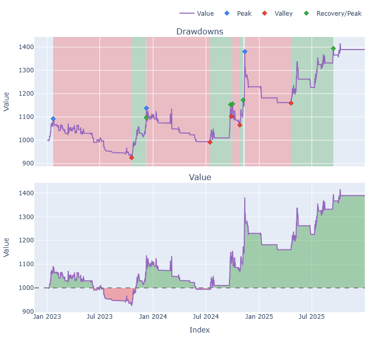
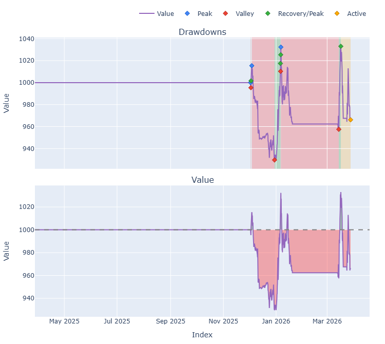
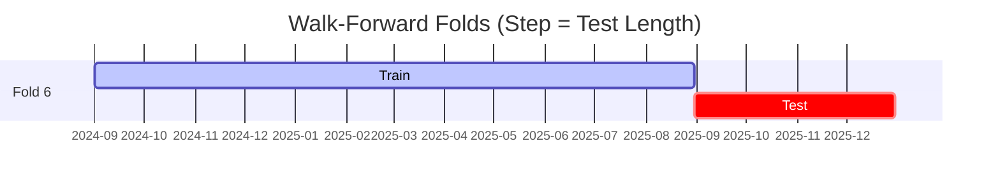

# Trading Strategy Pipeline Report

**Generated**: 2026-03-27 21:34:51

## Executive Summary

**WFO Training/Test period:** 2023-01-01 -> 2025-12-30  
**YTD performance window:** 2025-03-28 -> 2026-03-28  
**Coins:** 28

| | WFO Full Range | YTD |
|-|----------------|--------|
| Strategy CAGR | 7.57% | -3.38% |
| BTC buy & hold CAGR | 73.77% ❌ | -0.56% ❌ |
| S&P 500 CAGR | 22.47% ❌ | 15.43% ❌ |
| Strategy Sharpe | 0.63 | -0.49 |
| Max Drawdown | -15.26% | -8.45% |
| Total Trades | 145 | 49 |
| Win Rate | 31.72% | 28.57% |

### Full Range Portfolio

### YTD Portfolio

## Result Validation (Training/Test Data)
**Period: 2023-01-01 -> 2025-12-30** — WFO-selected parameters replayed on the full training/test range.

### Combined Portfolio Performance

| Metric | Strategy | BTC (buy & hold) | S&P 500 (SPY) | Excess vs BTC |
|--------|----------|------------------|---------------|---------------|
| Total Return | 24.46% | 423.86% | 83.58% | - |
| CAGR | 7.57% | 73.77% | 22.47% | -66.20% |
| Sharpe Ratio | 0.6267 | 1.4228 | 1.2852 | - |
| Max Drawdown | -15.26% | -34.46% | -14.53% | - |
| Total Trades | 145 | 1 | 1 | - |
| Win Rate | 31.72% | - | - | - |

## YTD Performance
**Period: 2025-03-28 -> 2026-03-28** — WFO-selected parameters replayed on the YTD window, no re-optimization.

| Metric | Strategy | BTC (buy & hold) | S&P 500 (SPY) | Excess vs BTC |
|--------|----------|------------------|---------------|---------------|
| Total Return | -3.38% | -0.56% | 15.42% | - |
| CAGR | -3.38% | -0.56% | 15.43% | -2.82% |
| Sharpe Ratio | -0.4886 | 0.0980 | 0.9163 | - |
| Max Drawdown | -8.45% | -9.96% | -10.49% | - |
| Total Trades | 49 | 1 | 1 | - |
| Win Rate | 28.57% | - | - | - |

## Per-Coin Strategy Selection (WFO)

Best performing strategy per coin based on robustness scores (highest first).

| Symbol | Strategy | Selection | Robustness Score |
|--------|----------|-----------|------------------|
| USELESS-USD | rsi_reversal+atr_trailing | wfo_robustness | 2.3418 |
| PENGU-USD | psar_adx+fixed_sl_tp | wfo_robustness | 1.6839 |
| PUMP-USD | rsi_reversal+atr_trailing | wfo_robustness | 1.3710 |
| VIRTUAL-USD | ema_cross+fixed_sl_tp | wfo_robustness | 1.0226 |
| TRUMP-USD | supertrend_flip+atr_trailing | wfo_robustness | 0.9144 |
| TAO-USD | psar_adx+atr_trailing | wfo_robustness | 0.8003 |
| WIF-USD | macd_cross+trailing_stop | wfo_robustness | 0.7561 |
| BNB-USD | macd_cross+atr_trailing | wfo_robustness | 0.7549 |
| LINK-USD | supertrend_flip+atr_trailing | wfo_robustness | 0.6847 |
| ETH-USD | rsi_reversal+atr_trailing | wfo_robustness | 0.6792 |
| XRP-USD | psar_adx+atr_trailing | wfo_robustness | 0.5760 |
| DOGE-USD | donchian_breakout+atr_trailing | wfo_robustness | 0.5725 |
| ADA-USD | rsi_reversal+atr_trailing | wfo_robustness | 0.5583 |
| SUI-USD | donchian_breakout+atr_trailing | wfo_robustness | 0.5572 |
| SPX-USD | psar_adx+fixed_sl_tp | wfo_robustness | 0.5333 |
| PEPE-USD | ema_cross+fixed_sl_tp | wfo_robustness | 0.5304 |
| TRX-USD | ema_cross+trailing_stop | wfo_robustness | 0.5132 |
| AVAX-USD | donchian_breakout+atr_trailing | wfo_robustness | 0.4978 |
| SOL-USD | supertrend_flip+atr_trailing | wfo_robustness | 0.4642 |
| NEAR-USD | ema_cross+fixed_sl_tp | wfo_robustness | 0.4182 |
| HBAR-USD | donchian_breakout+atr_trailing | wfo_robustness | 0.4079 |
| RENDER-USD | macd_cross+atr_trailing | wfo_robustness | 0.4050 |
| XMR-USD | rsi_reversal+atr_trailing | wfo_robustness | 0.3821 |
| ONDO-USD | macd_cross+atr_trailing | wfo_robustness | 0.3317 |
| FARTCOIN-USD | rsi_reversal+atr_trailing | wfo_robustness | 0.3018 |
| CRV-USD | macd_cross+atr_trailing | wfo_robustness | 0.2717 |
| LTC-USD | ema_cross+atr_trailing | wfo_robustness | 0.1732 |
| ICP-USD | psar_adx+fixed_sl_tp | wfo_robustness | 0.1511 |

### WFO Fold Timeline

### WFO Out-of-Sample Sharpe — Per Fold

Per-fold OOS Sharpe for each coin's winning strategy (folds ordered as above). Negative = strategy did not generalise.

| Symbol | Strategy+Exit | IS Rob | OOS Rob | Consistency | Fold 1 | Fold 2 | Fold 3 | Fold 4 | Fold 5 | Fold 6 |
|--------|---------------|--------|---------|-------------|--------|--------|--------|--------|--------|--------|
| USELESS-USD | rsi_reversal+atr_trailing | n/a | 2.3418 | 100% | n/a | n/a | n/a | n/a | n/a | 2.342 |
| PENGU-USD | psar_adx+fixed_sl_tp | 1.3703 | 1.8528 | 100% | n/a | n/a | n/a | 1.490 | 2.040 | n/a |
| PUMP-USD | rsi_reversal+atr_trailing | n/a | 1.3710 | 100% | n/a | n/a | n/a | n/a | n/a | 1.371 |
| TRUMP-USD | supertrend_flip+atr_trailing | 2.7840 | 0.7517 | 50% | n/a | n/a | n/a | n/a | -0.193 | 1.799 |
| VIRTUAL-USD | ema_cross+fixed_sl_tp | 2.7149 | 0.6357 | 67% | n/a | n/a | n/a | 2.935 | -1.078 | 0.829 |
| TAO-USD | psar_adx+atr_trailing | 1.8878 | 0.6252 | 67% | n/a | n/a | 1.326 | -0.164 | 0.918 | n/a |
| ETH-USD | rsi_reversal+atr_trailing | 1.6329 | 0.5140 | 67% | 0.313 | 1.297 | -0.722 | -3.405 | 4.188 | 1.004 |
| BNB-USD | macd_cross+atr_trailing | 2.5476 | 0.4864 | 50% | n/a | n/a | n/a | n/a | -1.437 | 2.357 |
| HBAR-USD | donchian_breakout+atr_trailing | n/a | 0.4079 | 100% | n/a | n/a | n/a | n/a | n/a | 0.408 |
| WIF-USD | macd_cross+trailing_stop | 1.8513 | 0.3717 | 80% | 3.442 | -1.870 | 1.184 | 0.043 | 0.552 | n/a |
| DOGE-USD | donchian_breakout+atr_trailing | 1.4970 | 0.3683 | 67% | 0.494 | -2.726 | 2.062 | -2.378 | 1.593 | 1.814 |
| ADA-USD | rsi_reversal+atr_trailing | 2.3223 | 0.3113 | 40% | -1.631 | -1.581 | 2.722 | n/a | 1.234 | -0.368 |
| SPX-USD | psar_adx+fixed_sl_tp | 1.4893 | 0.2079 | 75% | n/a | n/a | 1.640 | -1.898 | 0.452 | 0.801 |
| LINK-USD | supertrend_flip+atr_trailing | 2.2602 | 0.1875 | 67% | -0.832 | 0.326 | 0.283 | -0.818 | 1.152 | 0.325 |
| XMR-USD | rsi_reversal+atr_trailing | 1.5663 | 0.0972 | 50% | -1.551 | 0.110 | -0.474 | 0.244 | -0.678 | 1.488 |
| SUI-USD | donchian_breakout+atr_trailing | 2.1031 | 0.0922 | 60% | 3.420 | -1.771 | n/a | -0.175 | 0.208 | 0.160 |
| FARTCOIN-USD | rsi_reversal+atr_trailing | 1.2145 | 0.0890 | 50% | n/a | n/a | n/a | n/a | -0.700 | 0.793 |
| XRP-USD | psar_adx+atr_trailing | 1.8801 | 0.0302 | 80% | 0.072 | 0.151 | 4.252 | -3.428 | 0.151 | n/a |
| CRV-USD | macd_cross+atr_trailing | 1.3599 | 0.0277 | 40% | n/a | -0.663 | 1.602 | -1.170 | 1.688 | -1.124 |
| AVAX-USD | donchian_breakout+atr_trailing | 2.2004 | -0.0908 | 60% | -1.811 | -1.889 | 1.125 | n/a | 0.288 | 0.055 |
| ICP-USD | psar_adx+fixed_sl_tp | 0.8896 | -0.1071 | 50% | 1.177 | -3.507 | -0.448 | -2.127 | 1.492 | 1.067 |
| PEPE-USD | ema_cross+fixed_sl_tp | 2.6503 | -0.1215 | 50% | 1.843 | 0.206 | 2.487 | -0.913 | -0.095 | -1.750 |
| SOL-USD | supertrend_flip+atr_trailing | 2.6607 | -0.1341 | 40% | n/a | -0.306 | 0.485 | -1.233 | -1.219 | 1.245 |
| RENDER-USD | macd_cross+atr_trailing | 2.1214 | -0.1453 | 50% | n/a | n/a | 1.900 | -0.529 | 0.184 | -1.400 |
| TRX-USD | ema_cross+trailing_stop | 3.0000 | -0.3522 | 50% | 2.050 | 0.003 | 0.587 | -0.549 | -1.449 | -0.801 |
| ONDO-USD | macd_cross+atr_trailing | 2.5104 | -0.4239 | 40% | n/a | -0.720 | 1.454 | -3.036 | 0.690 | -0.751 |
| NEAR-USD | ema_cross+fixed_sl_tp | 2.7306 | -0.4409 | 50% | -0.839 | 0.779 | 1.194 | -2.291 | -1.445 | 0.143 |
| LTC-USD | ema_cross+atr_trailing | 2.5328 | -0.9375 | 50% | 0.167 | -5.230 | 0.022 | -1.611 | 0.487 | -1.580 |

## Full-Period Performance (Per-Coin)

Performance metrics from running WFO-selected parameters on full-range data.

| Symbol | Strategy | Selection | Return % | Sharpe | Max DD % | Trades | Win Rate % |
|--------|----------|-----------|----------|--------|----------|--------|-----------|
| SOL-USD | supertrend_flip | wfo_robustness | 24.94% | 1.2741 | -5.05% | 15 | 60.00% |
| TAO-USD | psar_adx | wfo_robustness | 17.25% | 1.0020 | -4.72% | 15 | 73.33% |
| ADA-USD | rsi_reversal | wfo_robustness | 3.79% | 0.5413 | -2.88% | 12 | 41.67% |
| ETH-USD | rsi_reversal | wfo_robustness | 3.18% | 0.4174 | -4.70% | 20 | 40.00% |
| LINK-USD | supertrend_flip | wfo_robustness | 4.26% | 0.3644 | -5.54% | 20 | 30.00% |
| AVAX-USD | donchian_breakout | wfo_robustness | 1.77% | 0.1912 | -5.66% | 7 | 42.86% |
| DOGE-USD | donchian_breakout | wfo_robustness | 1.10% | 0.1025 | -8.15% | 35 | 22.86% |
| NEAR-USD | ema_cross | wfo_robustness | 0.00% | 0.0000 | 0.00% | 0 | 0.00% |
| PEPE-USD | ema_cross | wfo_robustness | 0.00% | 0.0000 | 0.00% | 0 | 0.00% |
| SUI-USD | donchian_breakout | wfo_robustness | 0.00% | 0.0000 | 0.00% | 0 | 0.00% |
| XMR-USD | rsi_reversal | wfo_robustness | -2.37% | -0.3355 | -4.22% | 14 | 28.57% |
| TRX-USD | ema_cross | wfo_robustness | -1.37% | -0.3683 | -3.07% | 21 | 33.33% |
| FARTCOIN-USD | rsi_reversal | wfo_robustness | -12.45% | -0.6652 | -18.69% | 49 | 22.45% |
| LTC-USD | ema_cross | wfo_robustness | -3.59% | -0.7386 | -4.78% | 23 | 30.43% |
| XRP-USD | psar_adx | wfo_robustness | -1.58% | -0.7862 | -1.58% | 3 | 33.33% |
| HBAR-USD | donchian_breakout | wfo_robustness | -6.43% | -1.0303 | -8.74% | 26 | 19.23% |

---

*For pipeline methodology, fold structure, and benchmark definitions see [docs/UNIFIED_PIPELINE.md](../docs/UNIFIED_PIPELINE.md).*

---

*Report generated by ggTrader Pipeline*