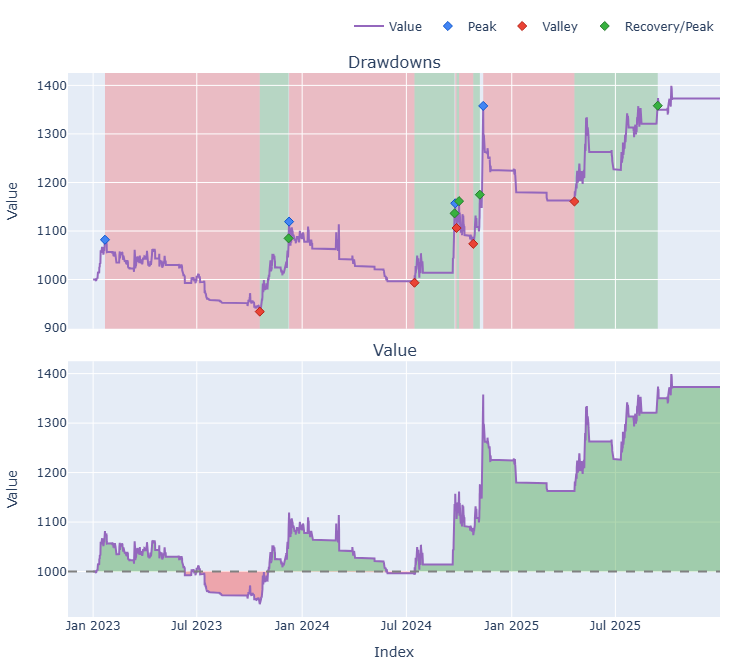
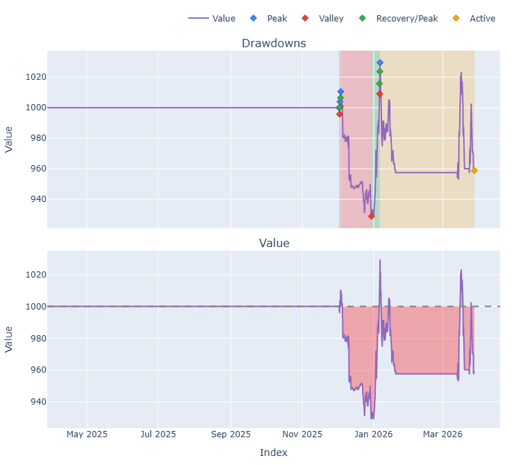
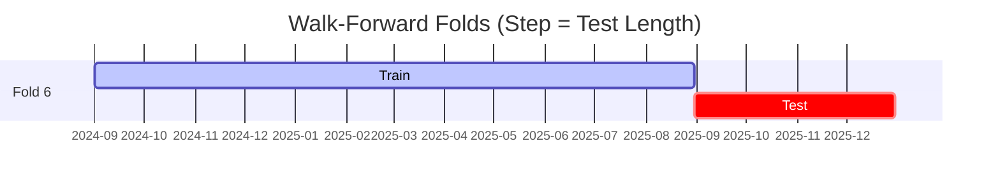

# Trading Strategy Pipeline Report

**Generated**: 2026-03-27 21:59:55

## Executive Summary

**WFO Training/Test period:** 2023-01-01 -> 2025-12-30  
**YTD performance window:** 2025-03-28 -> 2026-03-28  
**Coins:** 29

| | WFO Full Range | YTD |
|-|----------------|--------|
| Strategy CAGR | 7.24% | -4.12% |
| BTC buy & hold CAGR | 73.77% ❌ | -0.56% ❌ |
| S&P 500 CAGR | 22.47% ❌ | 15.43% ❌ |
| Strategy Sharpe | 0.66 | -0.65 |
| Max Drawdown | -14.29% | -8.08% |
| Total Trades | 134 | 49 |
| Win Rate | 32.84% | 28.57% |

### Full Range Portfolio

### YTD Portfolio

## Result Validation (Training/Test Data)
**Period: 2023-01-01 -> 2025-12-30** — WFO-selected parameters replayed on the full training/test range.

### Combined Portfolio Performance

| Metric | Strategy | BTC (buy & hold) | S&P 500 (SPY) | Excess vs BTC |
|--------|----------|------------------|---------------|---------------|
| Total Return | 23.31% | 423.86% | 83.58% | - |
| CAGR | 7.24% | 73.77% | 22.47% | -66.53% |
| Sharpe Ratio | 0.6557 | 1.4228 | 1.2852 | - |
| Max Drawdown | -14.29% | -34.46% | -14.53% | - |
| Total Trades | 134 | 1 | 1 | - |
| Win Rate | 32.84% | - | - | - |

## YTD Performance
**Period: 2025-03-28 -> 2026-03-28** — WFO-selected parameters replayed on the YTD window, no re-optimization.

| Metric | Strategy | BTC (buy & hold) | S&P 500 (SPY) | Excess vs BTC |
|--------|----------|------------------|---------------|---------------|
| Total Return | -4.12% | -0.56% | 15.42% | - |
| CAGR | -4.12% | -0.56% | 15.43% | -3.56% |
| Sharpe Ratio | -0.6490 | 0.0980 | 0.9163 | - |
| Max Drawdown | -8.08% | -9.96% | -10.49% | - |
| Total Trades | 49 | 1 | 1 | - |
| Win Rate | 28.57% | - | - | - |

## Per-Coin Strategy Selection (WFO)

Best performing strategy per coin based on robustness scores (highest first).

| Symbol | Strategy | Selection | Robustness Score |
|--------|----------|-----------|------------------|
| USELESS-USD | rsi_reversal+atr_trailing | wfo_robustness | 2.3418 |
| PENGU-USD | psar_adx+fixed_sl_tp | wfo_robustness | 1.6839 |
| PUMP-USD | rsi_reversal+atr_trailing | wfo_robustness | 1.3710 |
| VIRTUAL-USD | ema_cross+fixed_sl_tp | wfo_robustness | 1.0477 |
| WIF-USD | macd_cross+trailing_stop | wfo_robustness | 0.8115 |
| BNB-USD | macd_cross+atr_trailing | wfo_robustness | 0.8028 |
| TAO-USD | psar_adx+atr_trailing | wfo_robustness | 0.8003 |
| ETH-USD | rsi_reversal+atr_trailing | wfo_robustness | 0.6792 |
| TRUMP-USD | supertrend_flip+atr_trailing | wfo_robustness | 0.6153 |
| SUI-USD | donchian_breakout+trailing_stop | wfo_robustness | 0.5915 |
| DOGE-USD | donchian_breakout+atr_trailing | wfo_robustness | 0.5843 |
| XRP-USD | psar_adx+atr_trailing | wfo_robustness | 0.5760 |
| ADA-USD | rsi_reversal+atr_trailing | wfo_robustness | 0.5583 |
| ONDO-USD | macd_cross+atr_trailing | wfo_robustness | 0.5505 |
| PEPE-USD | ema_cross+fixed_sl_tp | wfo_robustness | 0.5422 |
| NEAR-USD | ema_cross+fixed_sl_tp | wfo_robustness | 0.5378 |
| SPX-USD | psar_adx+fixed_sl_tp | wfo_robustness | 0.5333 |
| TRX-USD | ema_cross+trailing_stop | wfo_robustness | 0.5132 |
| SOL-USD | supertrend_flip+atr_trailing | wfo_robustness | 0.5090 |
| LINK-USD | psar_adx+atr_trailing | wfo_robustness | 0.4530 |
| HBAR-USD | supertrend_flip+atr_trailing | wfo_robustness | 0.4021 |
| KAS-USD | donchian_breakout+atr_trailing | wfo_robustness | 0.3853 |
| XMR-USD | rsi_reversal+atr_trailing | wfo_robustness | 0.3821 |
| AVAX-USD | macd_cross+atr_trailing | wfo_robustness | 0.3622 |
| RENDER-USD | macd_cross+atr_trailing | wfo_robustness | 0.3500 |
| FARTCOIN-USD | rsi_reversal+atr_trailing | wfo_robustness | 0.3018 |
| LTC-USD | ema_cross+atr_trailing | wfo_robustness | 0.2748 |
| CRV-USD | macd_cross+atr_trailing | wfo_robustness | 0.2032 |
| ICP-USD | psar_adx+fixed_sl_tp | wfo_robustness | 0.1511 |

### WFO Fold Timeline

### WFO Out-of-Sample Sharpe — Per Fold

Per-fold OOS Sharpe for each coin's winning strategy (folds ordered as above). Negative = strategy did not generalise.

| Symbol | Strategy+Exit | IS Rob | OOS Rob | Consistency | Fold 1 | Fold 2 | Fold 3 | Fold 4 | Fold 5 | Fold 6 |
|--------|---------------|--------|---------|-------------|--------|--------|--------|--------|--------|--------|
| USELESS-USD | rsi_reversal+atr_trailing | n/a | 2.3418 | 100% | n/a | n/a | n/a | n/a | n/a | 2.342 |
| PENGU-USD | psar_adx+fixed_sl_tp | 1.3703 | 1.8528 | 100% | n/a | n/a | n/a | 1.490 | 2.040 | n/a |
| PUMP-USD | rsi_reversal+atr_trailing | n/a | 1.3710 | 100% | n/a | n/a | n/a | n/a | n/a | 1.371 |
| VIRTUAL-USD | ema_cross+fixed_sl_tp | 2.7601 | 0.6629 | 67% | n/a | n/a | n/a | 3.244 | -1.200 | 0.829 |
| TAO-USD | psar_adx+atr_trailing | 1.8878 | 0.6252 | 67% | n/a | n/a | 1.326 | -0.164 | 0.918 | n/a |
| BNB-USD | macd_cross+atr_trailing | 2.6110 | 0.5702 | 50% | n/a | n/a | n/a | n/a | -1.215 | 2.357 |
| ETH-USD | rsi_reversal+atr_trailing | 1.6329 | 0.5140 | 67% | 0.313 | 1.297 | -0.722 | -3.405 | 4.188 | 1.004 |
| HBAR-USD | supertrend_flip+atr_trailing | 0.3915 | 0.4079 | 100% | n/a | n/a | n/a | n/a | n/a | 0.408 |
| WIF-USD | macd_cross+trailing_stop | 2.0385 | 0.3711 | 80% | 3.432 | -1.870 | 1.184 | 0.043 | 0.552 | n/a |
| DOGE-USD | donchian_breakout+atr_trailing | 1.5418 | 0.3683 | 67% | 0.494 | -2.726 | 2.062 | -2.378 | 1.593 | 1.814 |
| SUI-USD | donchian_breakout+trailing_stop | 1.6303 | 0.3355 | 67% | 2.706 | -1.541 | 1.315 | -0.088 | 0.415 | 0.380 |
| ADA-USD | rsi_reversal+atr_trailing | 2.3223 | 0.3113 | 40% | -1.631 | -1.581 | 2.722 | n/a | 1.234 | -0.368 |
| SPX-USD | psar_adx+fixed_sl_tp | 1.4893 | 0.2079 | 75% | n/a | n/a | 1.640 | -1.898 | 0.452 | 0.801 |
| LINK-USD | psar_adx+atr_trailing | 1.7687 | 0.1627 | 50% | -0.268 | -3.814 | 1.203 | n/a | 1.481 | n/a |
| XMR-USD | rsi_reversal+atr_trailing | 1.5663 | 0.0972 | 50% | -1.551 | 0.110 | -0.474 | 0.244 | -0.678 | 1.488 |
| FARTCOIN-USD | rsi_reversal+atr_trailing | 1.2145 | 0.0890 | 50% | n/a | n/a | n/a | n/a | -0.700 | 0.793 |
| XRP-USD | psar_adx+atr_trailing | 1.8801 | 0.0302 | 80% | 0.072 | 0.151 | 4.252 | -3.428 | 0.151 | n/a |
| TRUMP-USD | supertrend_flip+atr_trailing | 2.7852 | 0.0148 | 50% | n/a | n/a | n/a | n/a | -2.072 | 1.799 |
| SOL-USD | supertrend_flip+atr_trailing | 2.4240 | -0.0524 | 50% | -1.930 | 0.022 | 1.938 | -1.463 | -1.219 | 1.245 |
| ICP-USD | psar_adx+fixed_sl_tp | 0.8896 | -0.1071 | 50% | 1.177 | -3.507 | -0.448 | -2.127 | 1.492 | 1.067 |
| ONDO-USD | macd_cross+atr_trailing | 2.5190 | -0.1464 | 60% | n/a | 0.819 | 2.428 | -3.036 | 0.690 | -0.751 |
| PEPE-USD | ema_cross+fixed_sl_tp | 2.8250 | -0.1865 | 50% | 1.744 | 0.713 | 2.124 | -0.913 | -0.419 | -1.750 |
| AVAX-USD | macd_cross+atr_trailing | 2.3032 | -0.2270 | 40% | -2.696 | -1.640 | 1.646 | n/a | 0.556 | -0.880 |
| CRV-USD | macd_cross+atr_trailing | 1.5480 | -0.2651 | 40% | n/a | -3.445 | 1.357 | -1.170 | 1.688 | -1.124 |
| RENDER-USD | macd_cross+atr_trailing | 2.1040 | -0.2713 | 50% | n/a | n/a | 1.126 | -0.529 | 0.184 | -1.400 |
| TRX-USD | ema_cross+trailing_stop | 3.0000 | -0.3522 | 50% | 2.050 | 0.003 | 0.587 | -0.549 | -1.449 | -0.801 |
| NEAR-USD | ema_cross+fixed_sl_tp | 2.7599 | -0.3829 | 67% | 0.893 | 0.738 | 0.856 | -2.291 | -1.445 | 0.143 |
| KAS-USD | donchian_breakout+atr_trailing | 2.5428 | -0.4206 | 50% | n/a | n/a | n/a | -1.255 | 0.191 | n/a |
| LTC-USD | ema_cross+atr_trailing | 2.5716 | -0.7082 | 50% | 0.167 | -5.293 | 0.022 | -1.611 | 0.487 | -0.516 |

## Full-Period Performance (Per-Coin)

Performance metrics from running WFO-selected parameters on full-range data.

| Symbol | Strategy | Selection | Return % | Sharpe | Max DD % | Trades | Win Rate % |
|--------|----------|-----------|----------|--------|----------|--------|-----------|
| SOL-USD | supertrend_flip | wfo_robustness | 24.94% | 1.2741 | -5.05% | 15 | 60.00% |
| TAO-USD | psar_adx | wfo_robustness | 17.25% | 1.0020 | -4.72% | 15 | 73.33% |
| LINK-USD | psar_adx | wfo_robustness | 4.65% | 0.5587 | -3.84% | 9 | 44.44% |
| AVAX-USD | macd_cross | wfo_robustness | 2.68% | 0.5432 | -2.14% | 2 | 50.00% |
| ADA-USD | rsi_reversal | wfo_robustness | 3.79% | 0.5413 | -2.88% | 12 | 41.67% |
| ETH-USD | rsi_reversal | wfo_robustness | 3.18% | 0.4174 | -4.70% | 20 | 40.00% |
| DOGE-USD | donchian_breakout | wfo_robustness | 1.10% | 0.1025 | -8.15% | 35 | 22.86% |
| NEAR-USD | ema_cross | wfo_robustness | 0.00% | 0.0000 | 0.00% | 0 | 0.00% |
| PEPE-USD | ema_cross | wfo_robustness | 0.00% | 0.0000 | 0.00% | 0 | 0.00% |
| SUI-USD | donchian_breakout | wfo_robustness | 0.00% | 0.0000 | 0.00% | 0 | 0.00% |
| XMR-USD | rsi_reversal | wfo_robustness | -2.37% | -0.3355 | -4.22% | 14 | 28.57% |
| TRX-USD | ema_cross | wfo_robustness | -1.37% | -0.3683 | -3.07% | 21 | 33.33% |
| FARTCOIN-USD | rsi_reversal | wfo_robustness | -12.45% | -0.6652 | -18.69% | 49 | 22.45% |
| LTC-USD | ema_cross | wfo_robustness | -3.59% | -0.7386 | -4.78% | 23 | 30.43% |
| XRP-USD | psar_adx | wfo_robustness | -1.58% | -0.7862 | -1.58% | 3 | 33.33% |
| HBAR-USD | supertrend_flip | wfo_robustness | -6.43% | -1.0303 | -8.74% | 26 | 19.23% |

---

*For pipeline methodology, fold structure, and benchmark definitions see [docs/UNIFIED_PIPELINE.md](../docs/UNIFIED_PIPELINE.md).*

---

*Report generated by ggTrader Pipeline*