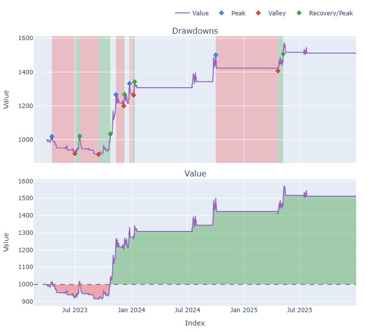
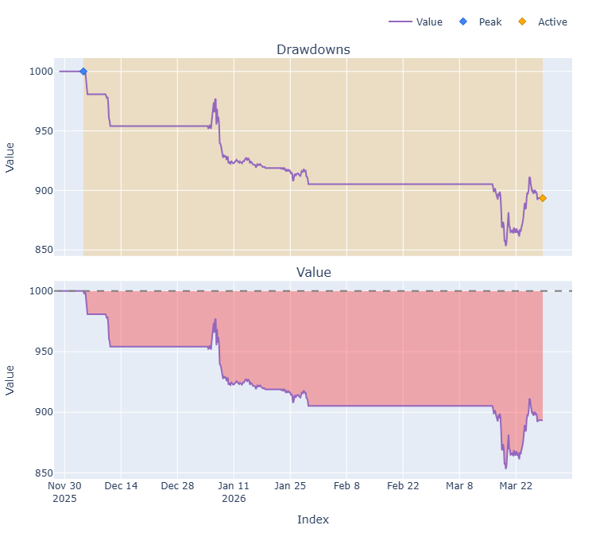
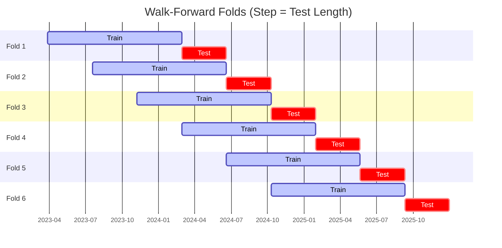

# Trading Strategy Pipeline Report

**Generated**: 2026-03-28 10:06:44

## Executive Summary

**WFO Training/Test period:** 2023-01-01 -> 2025-12-30  
**YTD performance window:** 2025-11-28 -> 2026-03-28  
**Coins:** 7

| | WFO Full Range | YTD |
|-|----------------|--------|
| Strategy CAGR | 13.29% | -29.02% |
| BTC buy & hold CAGR | 73.77% ❌ | -15.43% ❌ |
| S&P 500 CAGR | 22.47% ❌ | -17.86% ❌ |
| Strategy Sharpe | 1.24 | -2.87 |
| Max Drawdown | -14.18% | -14.67% |
| Total Trades | 82 | 29 |
| Win Rate | 43.90% | 13.79% |

### Full Range Portfolio

### YTD Portfolio

## Result Validation (Training/Test Data)
**Period: 2023-01-01 -> 2025-12-30** — WFO-selected parameters replayed on the full training/test range.

### Combined Portfolio Performance

| Metric | Strategy | BTC (buy & hold) | S&P 500 (SPY) | Excess vs BTC |
|--------|----------|------------------|---------------|---------------|
| Total Return | 45.34% | 423.86% | 83.58% | - |
| CAGR | 13.29% | 73.77% | 22.47% | -60.48% |
| Sharpe Ratio | 1.2382 | 1.4228 | 1.2852 | - |
| Max Drawdown | -14.18% | -34.46% | -14.53% | - |
| Total Trades | 82 | 1 | 1 | - |
| Win Rate | 43.90% | - | - | - |

## YTD Performance
**Period: 2025-11-28 -> 2026-03-28** — WFO-selected parameters replayed on the YTD window, no re-optimization.

| Metric | Strategy | BTC (buy & hold) | S&P 500 (SPY) | Excess vs BTC |
|--------|----------|------------------|---------------|---------------|
| Total Return | -10.65% | -5.36% | -6.26% | - |
| CAGR | -29.02% | -15.43% | -17.86% | -13.59% |
| Sharpe Ratio | -2.8737 | -0.6025 | -2.8335 | - |
| Max Drawdown | -14.67% | -9.96% | -6.26% | - |
| Total Trades | 29 | 1 | 1 | - |
| Win Rate | 13.79% | - | - | - |

## Per-Coin Strategy Selection (WFO)

Best performing strategy per coin based on robustness scores (highest first).

| Symbol | Strategy | Selection | Robustness Score |
|--------|----------|-----------|------------------|
| ETH-USD | psar_adx+atr_trailing | wfo_robustness | 0.7729 |
| ADA-USD | rsi_reversal+atr_trailing | wfo_robustness | 0.6667 |
| XRP-USD | psar_adx+trailing_stop | wfo_robustness | 0.5147 |
| TAO-USD | psar_adx+atr_trailing | wfo_robustness | 0.4766 |
| SOL-USD | rsi_reversal+atr_trailing | wfo_robustness | 0.4382 |
| DOGE-USD | psar_adx+atr_trailing | wfo_robustness | 0.4021 |
| SUI-USD | supertrend_flip+trailing_stop | wfo_robustness | 0.2676 |

### WFO Fold Timeline

### WFO Out-of-Sample Sharpe — Per Fold

Per-fold OOS Sharpe for each coin's winning strategy (folds ordered as above). Negative = strategy did not generalise.

| Symbol | Strategy+Exit | IS Rob | OOS Rob | Consistency | Fold 1 | Fold 2 | Fold 3 | Fold 4 | Fold 5 | Fold 6 |
|--------|---------------|--------|---------|-------------|--------|--------|--------|--------|--------|--------|
| XRP-USD | psar_adx+trailing_stop | 1.2062 | 0.7901 | 40% | -0.980 | -1.738 | 4.153 | -0.477 | 1.915 | n/a |
| ETH-USD | psar_adx+atr_trailing | 1.9035 | 0.5604 | 67% | -1.570 | 0.258 | 1.649 | -1.762 | 2.838 | 0.731 |
| ADA-USD | rsi_reversal+atr_trailing | 2.0400 | 0.5426 | 50% | -3.113 | 0.277 | 3.734 | -0.883 | 2.103 | -0.069 |
| TAO-USD | psar_adx+atr_trailing | 1.7298 | 0.2416 | 50% | n/a | n/a | 1.178 | -0.809 | -0.389 | 1.084 |
| DOGE-USD | psar_adx+atr_trailing | 2.0332 | 0.0299 | 40% | -2.677 | -1.990 | 2.852 | -0.588 | 0.410 | n/a |
| SOL-USD | rsi_reversal+atr_trailing | 2.8222 | -0.4409 | 50% | 0.055 | -0.339 | 1.681 | -3.000 | 0.188 | -0.823 |
| SUI-USD | supertrend_flip+trailing_stop | 2.7159 | -0.7138 | 40% | -2.259 | n/a | 1.417 | 0.161 | -0.601 | -2.679 |

## Full-Period Performance (Per-Coin)

Performance metrics from running WFO-selected parameters on full-range data.

| Symbol | Strategy | Selection | Return % | Sharpe | Max DD % | Trades | Win Rate % |
|--------|----------|-----------|----------|--------|----------|--------|-----------|
| SOL-USD | rsi_reversal | wfo_robustness | 22.72% | 1.3124 | -3.91% | 25 | 56.00% |
| ETH-USD | psar_adx | wfo_robustness | 7.06% | 1.0177 | -2.12% | 11 | 54.55% |
| DOGE-USD | psar_adx | wfo_robustness | 14.89% | 0.8397 | -7.45% | 44 | 40.91% |
| ADA-USD | rsi_reversal | wfo_robustness | 5.08% | 0.7116 | -2.59% | 10 | 40.00% |
| XRP-USD | psar_adx | wfo_robustness | 4.68% | 0.4319 | -3.27% | 12 | 58.33% |
| TAO-USD | psar_adx | wfo_robustness | 4.51% | 0.4132 | -4.72% | 7 | 71.43% |
| SUI-USD | supertrend_flip | wfo_robustness | 0.00% | 0.0000 | 0.00% | 0 | 0.00% |

---

*For pipeline methodology, fold structure, and benchmark definitions see [docs/UNIFIED_PIPELINE.md](../docs/UNIFIED_PIPELINE.md).*

---

*Report generated by ggTrader Pipeline*