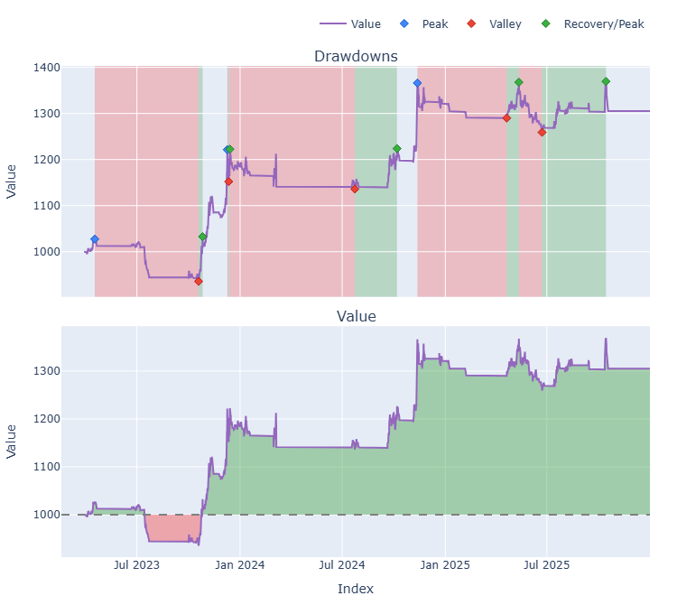
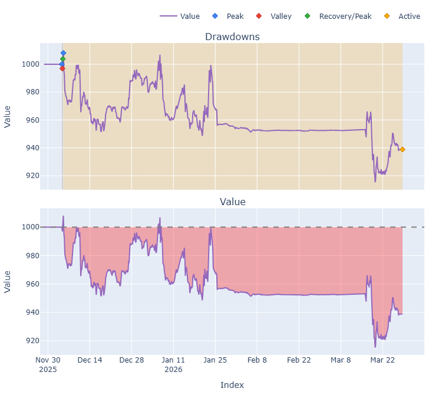
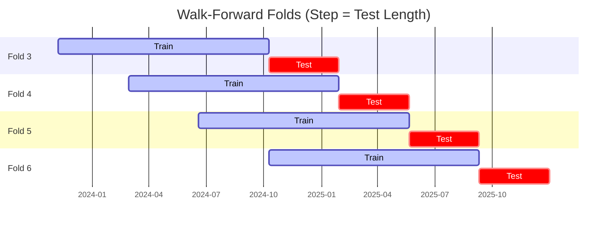

# Trading Strategy Pipeline Report

**Generated**: 2026-03-28 10:45:28

## Executive Summary

**WFO Training/Test period:** 2023-01-01 -> 2025-12-30  
**YTD performance window:** 2025-11-28 -> 2026-03-28  
**Coins:** 26

| | WFO Full Range | YTD |
|-|----------------|--------|
| Strategy CAGR | 11.01% | -17.48% |
| BTC buy & hold CAGR | 73.77% ❌ | -15.43% ❌ |
| S&P 500 CAGR | 22.47% ❌ | -17.86% ✅ |
| Strategy Sharpe | 0.95 | -1.24 |
| Max Drawdown | -10.66% | -9.21% |
| Total Trades | 159 | 67 |
| Win Rate | 44.65% | 19.40% |

### Full Range Portfolio

### YTD Portfolio

## Result Validation (Training/Test Data)
**Period: 2023-01-01 -> 2025-12-30** — WFO-selected parameters replayed on the full training/test range.

### Combined Portfolio Performance

| Metric | Strategy | BTC (buy & hold) | S&P 500 (SPY) | Excess vs BTC |
|--------|----------|------------------|---------------|---------------|
| Total Return | 36.76% | 423.86% | 83.58% | - |
| CAGR | 11.01% | 73.77% | 22.47% | -62.76% |
| Sharpe Ratio | 0.9491 | 1.4228 | 1.2852 | - |
| Max Drawdown | -10.66% | -34.46% | -14.53% | - |
| Total Trades | 159 | 1 | 1 | - |
| Win Rate | 44.65% | - | - | - |

## YTD Performance
**Period: 2025-11-28 -> 2026-03-28** — WFO-selected parameters replayed on the YTD window, no re-optimization.

| Metric | Strategy | BTC (buy & hold) | S&P 500 (SPY) | Excess vs BTC |
|--------|----------|------------------|---------------|---------------|
| Total Return | -6.12% | -5.36% | -6.26% | - |
| CAGR | -17.48% | -15.43% | -17.86% | -2.05% |
| Sharpe Ratio | -1.2361 | -0.6025 | -2.8335 | - |
| Max Drawdown | -9.21% | -9.96% | -6.26% | - |
| Total Trades | 67 | 1 | 1 | - |
| Win Rate | 19.40% | - | - | - |

## Per-Coin Strategy Selection (WFO)

Best performing strategy per coin based on robustness scores (highest first).

| Symbol | Strategy | Selection | Robustness Score |
|--------|----------|-----------|------------------|
| ZRO-USD | psar_adx+atr_trailing | wfo_robustness | 0.8891 |
| SPX-USD | supertrend_flip+fixed_sl_tp | wfo_robustness | 0.8058 |
| ADA-USD | rsi_reversal+atr_trailing | wfo_robustness | 0.7028 |
| TAO-USD | psar_adx+atr_trailing | wfo_robustness | 0.6579 |
| PEPE-USD | donchian_breakout+fixed_sl_tp | wfo_robustness | 0.6099 |
| ETH-USD | ema_cross+atr_trailing | wfo_robustness | 0.5938 |
| SOL-USD | rsi_reversal+atr_trailing | wfo_robustness | 0.5708 |
| ZEC-USD | ema_cross+atr_trailing | wfo_robustness | 0.5694 |
| XLM-USD | donchian_breakout+fixed_sl_tp | wfo_robustness | 0.5265 |
| AVAX-USD | supertrend_flip+atr_trailing | wfo_robustness | 0.4489 |
| UNI-USD | macd_cross+atr_trailing | wfo_robustness | 0.4412 |
| DOGE-USD | psar_adx+trailing_stop | wfo_robustness | 0.4318 |
| AKT-USD | ema_cross+atr_trailing | wfo_robustness | 0.4311 |
| XRP-USD | psar_adx+fixed_sl_tp | wfo_robustness | 0.4166 |
| CRV-USD | psar_adx+atr_trailing | wfo_robustness | 0.3538 |
| DOT-USD | rsi_reversal+atr_trailing | wfo_robustness | 0.3423 |
| XMR-USD | ema_cross+atr_trailing | wfo_robustness | 0.3312 |
| ONDO-USD | psar_adx+atr_trailing | wfo_robustness | 0.2939 |
| LTC-USD | psar_adx+atr_trailing | wfo_robustness | 0.2776 |
| WIF-USD | psar_adx+fixed_sl_tp | wfo_robustness | 0.2353 |
| LINK-USD | rsi_reversal+atr_trailing | wfo_robustness | 0.2305 |
| AAVE-USD | rsi_reversal+atr_trailing | wfo_robustness | 0.2117 |
| NEAR-USD | supertrend_flip+atr_trailing | wfo_robustness | 0.1904 |
| SUI-USD | supertrend_flip+trailing_stop | wfo_robustness | 0.1531 |
| FET-USD | supertrend_flip+atr_trailing | wfo_robustness | 0.1509 |
| TRX-USD | donchian_breakout+atr_trailing | wfo_robustness | 0.1108 |

### WFO Fold Timeline

### WFO Out-of-Sample Sharpe — Per Fold

Per-fold OOS Sharpe for each coin's winning strategy (folds ordered as above). Negative = strategy did not generalise.

| Symbol | Strategy+Exit | IS Rob | OOS Rob | Consistency | Fold 1 | Fold 2 | Fold 3 | Fold 4 | Fold 5 | Fold 6 |
|--------|---------------|--------|---------|-------------|--------|--------|--------|--------|--------|--------|
| ADA-USD | rsi_reversal+atr_trailing | 2.0753 | 0.8483 | 40% | -3.820 | -1.219 | 3.734 | -0.354 | 2.845 | n/a |
| SPX-USD | supertrend_flip+fixed_sl_tp | 1.9602 | 0.5974 | 67% | n/a | n/a | n/a | 0.851 | -0.075 | 1.039 |
| ZRO-USD | psar_adx+atr_trailing | 2.3297 | 0.5693 | 67% | n/a | n/a | 0.742 | n/a | 1.383 | -0.146 |
| ETH-USD | ema_cross+atr_trailing | 1.8079 | 0.4883 | 50% | -0.819 | -2.534 | 1.392 | 2.722 | 2.638 | -1.463 |
| XRP-USD | psar_adx+fixed_sl_tp | 0.6944 | 0.4807 | 67% | 0.291 | -2.515 | 4.153 | -1.527 | 1.991 | 0.248 |
| DOGE-USD | psar_adx+trailing_stop | 0.6102 | 0.4530 | 80% | 0.066 | n/a | 3.060 | -1.897 | 1.157 | 0.472 |
| ZEC-USD | ema_cross+atr_trailing | 1.9071 | 0.3746 | 50% | n/a | n/a | -0.818 | 0.649 | -1.712 | 2.880 |
| TAO-USD | psar_adx+atr_trailing | 1.9510 | 0.2991 | 67% | n/a | n/a | 1.178 | -0.911 | 0.818 | n/a |
| XMR-USD | ema_cross+atr_trailing | 1.2585 | 0.1377 | 50% | -1.889 | -2.705 | 0.889 | 3.266 | -2.235 | 1.268 |
| XLM-USD | donchian_breakout+fixed_sl_tp | 2.3026 | 0.0560 | 50% | -2.663 | -3.844 | 3.448 | 1.412 | 2.384 | -2.521 |
| AVAX-USD | supertrend_flip+atr_trailing | 1.7607 | 0.0385 | 60% | n/a | -1.459 | 1.404 | 1.019 | -2.048 | 1.006 |
| PEPE-USD | donchian_breakout+fixed_sl_tp | 2.7977 | -0.0052 | 50% | 2.097 | -1.891 | 1.732 | 2.381 | -0.999 | -1.545 |
| CRV-USD | psar_adx+atr_trailing | 1.6566 | -0.0212 | 50% | n/a | -2.876 | n/a | 0.201 | 1.994 | -0.750 |
| DOT-USD | rsi_reversal+atr_trailing | 1.7352 | -0.0918 | 50% | -4.594 | 1.319 | 1.236 | 0.940 | -0.897 | -0.412 |
| WIF-USD | psar_adx+fixed_sl_tp | 1.0259 | -0.1387 | 83% | 0.355 | 0.187 | -2.552 | 0.407 | 0.049 | 0.333 |
| UNI-USD | macd_cross+atr_trailing | 2.1374 | -0.1812 | 60% | n/a | -2.160 | 1.193 | 1.293 | 0.924 | -2.249 |
| SOL-USD | rsi_reversal+atr_trailing | 2.8177 | -0.3463 | 67% | 0.163 | -1.011 | 1.657 | 0.162 | 0.360 | -2.504 |
| AAVE-USD | rsi_reversal+atr_trailing | 1.8012 | -0.3777 | 40% | -2.453 | n/a | 0.593 | 2.806 | -0.511 | -2.812 |
| ONDO-USD | psar_adx+atr_trailing | 2.0580 | -0.3847 | 50% | n/a | 0.656 | -1.130 | -1.905 | 0.683 | n/a |
| NEAR-USD | supertrend_flip+atr_trailing | 1.6055 | -0.3959 | 50% | n/a | n/a | 1.744 | 1.639 | -1.902 | -2.011 |
| AKT-USD | ema_cross+atr_trailing | 2.7405 | -0.4145 | 50% | n/a | n/a | 1.125 | 0.921 | -0.751 | -2.187 |
| LINK-USD | rsi_reversal+atr_trailing | 1.8628 | -0.4356 | 50% | -1.497 | -3.233 | 1.858 | 0.681 | 0.874 | -2.583 |
| LTC-USD | psar_adx+atr_trailing | 2.2897 | -0.6228 | 60% | 0.271 | n/a | -3.326 | 0.096 | 0.530 | -1.232 |
| TRX-USD | donchian_breakout+atr_trailing | 1.7166 | -0.6515 | 50% | -3.290 | -2.329 | 1.108 | 0.904 | 0.752 | -3.147 |
| FET-USD | supertrend_flip+atr_trailing | 2.2711 | -0.8513 | 50% | n/a | n/a | 0.229 | 1.039 | -2.589 | -1.838 |
| SUI-USD | supertrend_flip+trailing_stop | 2.6077 | -0.9760 | 40% | -3.628 | n/a | 1.275 | 0.045 | -0.004 | -3.886 |

## Full-Period Performance (Per-Coin)

Performance metrics from running WFO-selected parameters on full-range data.

| Symbol | Strategy | Selection | Return % | Sharpe | Max DD % | Trades | Win Rate % |
|--------|----------|-----------|----------|--------|----------|--------|-----------|
| SOL-USD | rsi_reversal | wfo_robustness | 22.72% | 1.3124 | -3.91% | 25 | 56.00% |
| TAO-USD | psar_adx | wfo_robustness | 17.25% | 1.0020 | -4.72% | 15 | 73.33% |
| ADA-USD | rsi_reversal | wfo_robustness | 5.08% | 0.7116 | -2.59% | 10 | 40.00% |
| XMR-USD | ema_cross | wfo_robustness | 18.38% | 0.6089 | -10.34% | 1 | 100.00% |
| ZRO-USD | psar_adx | wfo_robustness | 6.96% | 0.5585 | -5.02% | 14 | 50.00% |
| ETH-USD | ema_cross | wfo_robustness | 3.18% | 0.4174 | -4.70% | 20 | 40.00% |
| AVAX-USD | supertrend_flip | wfo_robustness | 0.56% | 0.1085 | -30.79% | 1 | 100.00% |
| XRP-USD | psar_adx | wfo_robustness | 0.37% | 0.1049 | -2.79% | 14 | 50.00% |
| TRX-USD | donchian_breakout | wfo_robustness | 0.59% | 0.1000 | -3.15% | 21 | 42.86% |
| LTC-USD | psar_adx | wfo_robustness | 0.33% | 0.0778 | -2.57% | 9 | 44.44% |
| LINK-USD | rsi_reversal | wfo_robustness | 0.17% | 0.0334 | -4.97% | 32 | 34.38% |
| DOT-USD | rsi_reversal | wfo_robustness | 0.11% | 0.0272 | -6.36% | 22 | 31.82% |
| FET-USD | supertrend_flip | wfo_robustness | 0.00% | 0.0000 | 0.00% | 0 | 0.00% |
| NEAR-USD | supertrend_flip | wfo_robustness | 0.00% | 0.0000 | 0.00% | 0 | 0.00% |
| SUI-USD | supertrend_flip | wfo_robustness | 0.00% | 0.0000 | 0.00% | 0 | 0.00% |
| ZEC-USD | ema_cross | wfo_robustness | 0.00% | 0.0000 | 0.00% | 0 | 0.00% |
| DOGE-USD | psar_adx | wfo_robustness | -1.79% | -0.1015 | -7.62% | 38 | 34.21% |
| XLM-USD | donchian_breakout | wfo_robustness | -0.73% | -0.1636 | -4.31% | 15 | 33.33% |
| PEPE-USD | donchian_breakout | wfo_robustness | -2.65% | -1.1962 | -2.65% | 3 | 0.00% |

---

*For pipeline methodology, fold structure, and benchmark definitions see [docs/UNIFIED_PIPELINE.md](../docs/UNIFIED_PIPELINE.md).*

---

*Report generated by ggTrader Pipeline*