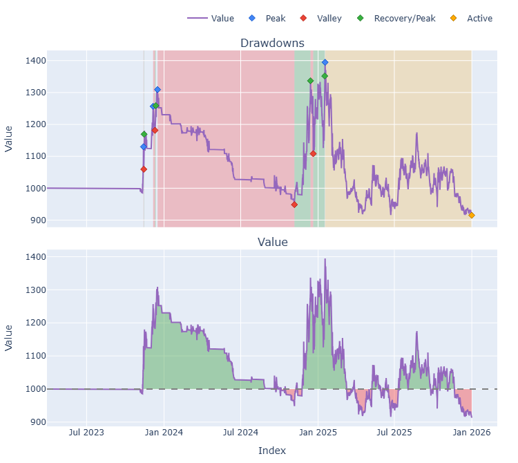
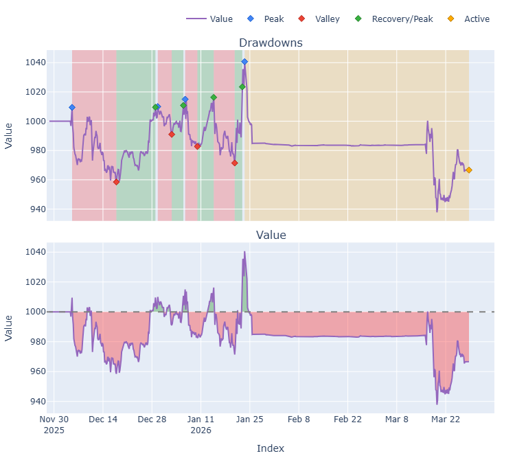
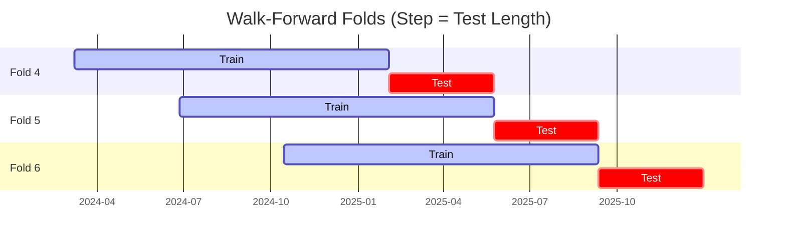

# Trading Strategy Pipeline Report

**Generated**: 2026-03-28 12:39:00

## Executive Summary

**WFO Training/Test period:** 2023-03-28 -> 2025-12-31  
**YTD performance window:** 2025-11-28 -> 2026-03-28  
**Coins:** 46

| | WFO Full Range | YTD |
|-|----------------|--------|
| Strategy CAGR | 13.92% | -9.81% |
| BTC buy & hold CAGR | 51.74% ❌ | -62.77% ✅ |
| S&P 500 CAGR | 22.61% ❌ | -17.86% ✅ |
| Strategy Sharpe | 1.14 | -0.54 |
| Max Drawdown | -6.93% | -9.89% |
| Total Trades | 125 | 36 |
| Win Rate | 46.40% | 22.22% |

### Full Range Portfolio

### YTD Portfolio

## Result Validation (Training/Test Data)
**Period: 2023-03-28 -> 2025-12-31** — WFO-selected parameters replayed on the full training/test range.

### Combined Portfolio Performance

| Metric | Strategy | BTC (buy & hold) | S&P 500 (SPY) | Excess vs BTC |
|--------|----------|------------------|---------------|---------------|
| Total Return | 43.35% | 216.43% | 75.60% | - |
| CAGR | 13.92% | 51.74% | 22.61% | -37.82% |
| Sharpe Ratio | 1.1441 | 1.1433 | 1.2569 | - |
| Max Drawdown | -6.93% | -34.46% | -14.53% | - |
| Total Trades | 125 | 1 | 1 | - |
| Win Rate | 46.40% | - | - | - |

## YTD Performance
**Period: 2025-11-28 -> 2026-03-28** — WFO-selected parameters replayed on the YTD window, no re-optimization.

| Metric | Strategy | BTC (buy & hold) | S&P 500 (SPY) | Excess vs BTC |
|--------|----------|------------------|---------------|---------------|
| Total Return | -3.34% | -27.72% | -6.26% | - |
| CAGR | -9.81% | -62.77% | -17.86% | 52.96% |
| Sharpe Ratio | -0.5416 | -1.8080 | -2.8335 | - |
| Max Drawdown | -9.89% | -35.36% | -6.26% | - |
| Total Trades | 36 | 1 | 1 | - |
| Win Rate | 22.22% | - | - | - |

## Per-Coin Strategy Selection (WFO)

Best performing strategy per coin based on robustness scores (highest first).

| Symbol | Strategy | Selection | Robustness Score |
|--------|----------|-----------|------------------|
| SUPER-USD | supertrend_flip+fixed_sl_tp | wfo_robustness | 1.3785 |
| KAS-USD | rsi_reversal+atr_trailing | wfo_robustness | 1.2260 |
| SPX-USD | supertrend_flip+fixed_sl_tp | wfo_robustness | 0.9987 |
| ZRO-USD | psar_adx+atr_trailing | wfo_robustness | 0.8891 |
| LDO-USD | psar_adx+atr_trailing | wfo_robustness | 0.8645 |
| TURBO-USD | supertrend_flip+atr_trailing | wfo_robustness | 0.8626 |
| BONK-USD | rsi_reversal+atr_trailing | wfo_robustness | 0.8243 |
| TAO-USD | psar_adx+atr_trailing | wfo_robustness | 0.6579 |
| ADA-USD | supertrend_flip+fixed_sl_tp | wfo_robustness | 0.6552 |
| PEPE-USD | supertrend_flip+fixed_sl_tp | wfo_robustness | 0.6306 |
| XLM-USD | rsi_reversal+trailing_stop | wfo_robustness | 0.6112 |
| ETH-USD | ema_cross+atr_trailing | wfo_robustness | 0.5938 |
| ZEC-USD | ema_cross+atr_trailing | wfo_robustness | 0.5694 |
| SOL-USD | rsi_reversal+atr_trailing | wfo_robustness | 0.5396 |
| SYRUP-USD | psar_adx+fixed_sl_tp | wfo_robustness | 0.5246 |
| MORPHO-USD | donchian_breakout+atr_trailing | wfo_robustness | 0.5210 |
| ENA-USD | psar_adx+atr_trailing | wfo_robustness | 0.5103 |
| LINK-USD | rsi_reversal+atr_trailing | wfo_robustness | 0.5019 |
| DOGE-USD | psar_adx+trailing_stop | wfo_robustness | 0.4960 |
| FLOW-USD | ema_cross+atr_trailing | wfo_robustness | 0.4943 |
| WIF-USD | psar_adx+trailing_stop | wfo_robustness | 0.4791 |
| ALGO-USD | supertrend_flip+fixed_sl_tp | wfo_robustness | 0.4725 |
| APT-USD | ema_cross+atr_trailing | wfo_robustness | 0.4633 |
| SEI-USD | supertrend_flip+atr_trailing | wfo_robustness | 0.4508 |
| AVAX-USD | supertrend_flip+atr_trailing | wfo_robustness | 0.4489 |
| UNI-USD | macd_cross+atr_trailing | wfo_robustness | 0.4412 |
| AKT-USD | ema_cross+atr_trailing | wfo_robustness | 0.4311 |
| NEAR-USD | rsi_reversal+atr_trailing | wfo_robustness | 0.4242 |
| DOT-USD | rsi_reversal+atr_trailing | wfo_robustness | 0.3758 |
| ONDO-USD | rsi_reversal+atr_trailing | wfo_robustness | 0.3693 |
| CRV-USD | psar_adx+atr_trailing | wfo_robustness | 0.3538 |
| XRP-USD | ema_cross+atr_trailing | wfo_robustness | 0.3349 |
| GIGA-USD | psar_adx+atr_trailing | wfo_robustness | 0.3335 |
| XMR-USD | ema_cross+atr_trailing | wfo_robustness | 0.3312 |
| AXS-USD | supertrend_flip+atr_trailing | wfo_robustness | 0.3246 |
| ARB-USD | supertrend_flip+fixed_sl_tp | wfo_robustness | 0.2818 |
| LTC-USD | psar_adx+atr_trailing | wfo_robustness | 0.2776 |
| BTC-USD | psar_adx+fixed_sl_tp | wfo_robustness | 0.2484 |
| ATOM-USD | supertrend_flip+fixed_sl_tp | wfo_robustness | 0.2417 |
| TIA-USD | psar_adx+trailing_stop | wfo_robustness | 0.2297 |
| FLR-USD | psar_adx+fixed_sl_tp | wfo_robustness | 0.2008 |
| TON-USD | psar_adx+trailing_stop | wfo_robustness | 0.2007 |
| SUI-USD | ema_cross+trailing_stop | wfo_robustness | 0.1928 |
| FET-USD | supertrend_flip+atr_trailing | wfo_robustness | 0.1509 |
| FIL-USD | ema_cross+atr_trailing | wfo_robustness | 0.1259 |
| TRX-USD | donchian_breakout+atr_trailing | wfo_robustness | 0.1164 |

### WFO Fold Timeline

### WFO Out-of-Sample Sharpe — Per Fold

Per-fold OOS Sharpe for each coin's winning strategy (folds ordered as above). Negative = strategy did not generalise.

| Symbol | Strategy+Exit | IS Rob | OOS Rob | Consistency | Fold 1 | Fold 2 | Fold 3 | Fold 4 | Fold 5 | Fold 6 |
|--------|---------------|--------|---------|-------------|--------|--------|--------|--------|--------|--------|
| KAS-USD | rsi_reversal+atr_trailing | 1.9212 | 0.8517 | 100% | n/a | n/a | n/a | 1.844 | 0.229 | n/a |
| SUPER-USD | supertrend_flip+fixed_sl_tp | 2.5911 | 0.7256 | 100% | n/a | n/a | n/a | 1.026 | 0.433 | n/a |
| ENA-USD | psar_adx+atr_trailing | 0.5057 | 0.6939 | 75% | n/a | n/a | -1.560 | 0.611 | 3.171 | 0.364 |
| SPX-USD | supertrend_flip+fixed_sl_tp | 2.6952 | 0.5974 | 67% | n/a | n/a | n/a | 0.851 | -0.075 | 1.039 |
| ZRO-USD | psar_adx+atr_trailing | 2.3297 | 0.5693 | 67% | n/a | n/a | 0.742 | n/a | 1.383 | -0.146 |
| ETH-USD | ema_cross+atr_trailing | 1.8079 | 0.4883 | 50% | -0.819 | -2.534 | 1.392 | 2.722 | 2.638 | -1.463 |
| ZEC-USD | ema_cross+atr_trailing | 1.9071 | 0.3746 | 50% | n/a | n/a | -0.818 | 0.649 | -1.712 | 2.880 |
| LDO-USD | psar_adx+atr_trailing | 2.3909 | 0.3494 | 75% | n/a | n/a | 0.143 | -1.660 | 1.899 | 0.765 |
| ADA-USD | supertrend_flip+fixed_sl_tp | 2.7607 | 0.3463 | 40% | -3.414 | -2.389 | 3.734 | -0.760 | 1.584 | n/a |
| TAO-USD | psar_adx+atr_trailing | 1.9510 | 0.2991 | 67% | n/a | n/a | 1.178 | -0.911 | 0.818 | n/a |
| WIF-USD | psar_adx+trailing_stop | 1.1682 | 0.2380 | 80% | 0.523 | 0.187 | -0.644 | 0.546 | n/a | 0.469 |
| SYRUP-USD | psar_adx+fixed_sl_tp | 2.6308 | 0.1976 | 33% | n/a | n/a | -1.851 | n/a | -1.349 | 2.757 |
| BONK-USD | rsi_reversal+atr_trailing | 2.7799 | 0.1940 | 67% | n/a | n/a | n/a | 0.928 | 1.763 | -1.574 |
| PEPE-USD | supertrend_flip+fixed_sl_tp | 2.2259 | 0.1874 | 60% | 2.097 | n/a | 1.732 | 2.381 | -0.999 | -1.545 |
| TURBO-USD | supertrend_flip+atr_trailing | 2.7129 | 0.1725 | 75% | n/a | n/a | 0.472 | 2.061 | 0.362 | -1.419 |
| XMR-USD | ema_cross+atr_trailing | 1.2585 | 0.1377 | 50% | -1.889 | -2.705 | 0.889 | 3.266 | -2.235 | 1.268 |
| XLM-USD | rsi_reversal+trailing_stop | 2.6898 | 0.0560 | 50% | -2.663 | -3.844 | 3.448 | 1.412 | 2.384 | -2.521 |
| AVAX-USD | supertrend_flip+atr_trailing | 1.7607 | 0.0385 | 60% | n/a | -1.459 | 1.404 | 1.019 | -2.048 | 1.006 |
| CRV-USD | psar_adx+atr_trailing | 1.6566 | -0.0212 | 50% | n/a | -2.876 | n/a | 0.201 | 1.994 | -0.750 |
| DOGE-USD | psar_adx+trailing_stop | 2.0660 | -0.0224 | 60% | 0.066 | n/a | 3.060 | -0.752 | 1.133 | -2.224 |
| XRP-USD | ema_cross+atr_trailing | 2.0033 | -0.0482 | 33% | -2.849 | -0.830 | 4.267 | -0.824 | 0.995 | -1.816 |
| TIA-USD | psar_adx+trailing_stop | 1.3027 | -0.0588 | 40% | -0.864 | -1.901 | -0.343 | 1.144 | n/a | 0.207 |
| DOT-USD | rsi_reversal+atr_trailing | 1.8885 | -0.0918 | 50% | -4.594 | 1.319 | 1.236 | 0.940 | -0.897 | -0.412 |
| ALGO-USD | supertrend_flip+fixed_sl_tp | 2.4447 | -0.1533 | 50% | -3.546 | -4.508 | 2.998 | 1.053 | -0.877 | 0.207 |
| MORPHO-USD | donchian_breakout+atr_trailing | 2.2975 | -0.1683 | 67% | n/a | n/a | n/a | 1.352 | 0.849 | -2.208 |
| UNI-USD | macd_cross+atr_trailing | 2.1374 | -0.1812 | 60% | n/a | -2.160 | 1.193 | 1.293 | 0.924 | -2.249 |
| APT-USD | ema_cross+atr_trailing | 2.5158 | -0.2143 | 50% | n/a | n/a | 0.896 | -0.114 | -1.522 | 0.112 |
| SEI-USD | supertrend_flip+atr_trailing | 2.2600 | -0.2261 | 60% | -1.452 | 0.917 | n/a | 1.470 | 0.380 | -2.218 |
| LINK-USD | rsi_reversal+atr_trailing | 2.7172 | -0.2276 | 50% | -1.497 | -3.233 | 1.858 | 0.082 | 1.224 | -1.497 |
| FLOW-USD | ema_cross+atr_trailing | 2.3022 | -0.3038 | 75% | n/a | n/a | 0.821 | 0.937 | 0.357 | -2.567 |
| BTC-USD | psar_adx+fixed_sl_tp | 1.9345 | -0.3469 | 40% | n/a | -1.563 | 0.904 | 0.508 | -0.582 | -1.098 |
| NEAR-USD | rsi_reversal+atr_trailing | 2.6114 | -0.3619 | 50% | n/a | n/a | 1.744 | 1.639 | -1.604 | -2.135 |
| SOL-USD | rsi_reversal+atr_trailing | 2.7486 | -0.3730 | 67% | 0.163 | -1.011 | 1.657 | 0.162 | 0.360 | -2.626 |
| AXS-USD | supertrend_flip+atr_trailing | 1.9392 | -0.3784 | 67% | n/a | n/a | 1.231 | 1.324 | n/a | -2.658 |
| ARB-USD | supertrend_flip+fixed_sl_tp | 1.8590 | -0.3817 | 60% | n/a | -3.321 | 0.988 | 0.892 | 1.177 | -2.486 |
| AKT-USD | ema_cross+atr_trailing | 2.7405 | -0.4145 | 50% | n/a | n/a | 1.125 | 0.921 | -0.751 | -2.187 |
| GIGA-USD | psar_adx+atr_trailing | 2.7669 | -0.4637 | 33% | n/a | n/a | n/a | 0.784 | -1.728 | -0.455 |
| FIL-USD | ema_cross+atr_trailing | 1.5236 | -0.5104 | 50% | n/a | n/a | 0.809 | 0.243 | -0.834 | -1.757 |
| FLR-USD | psar_adx+fixed_sl_tp | 2.1536 | -0.5418 | 33% | -2.884 | -2.078 | 0.116 | -1.240 | 1.055 | -0.881 |
| ONDO-USD | rsi_reversal+atr_trailing | 2.5152 | -0.5428 | 60% | n/a | 1.773 | 1.036 | -2.726 | 0.638 | -2.237 |
| LTC-USD | psar_adx+atr_trailing | 2.2897 | -0.6228 | 60% | 0.271 | n/a | -3.326 | 0.096 | 0.530 | -1.232 |
| TRX-USD | donchian_breakout+atr_trailing | 1.7422 | -0.6515 | 50% | -3.290 | -2.329 | 1.108 | 0.904 | 0.752 | -3.147 |
| ATOM-USD | supertrend_flip+fixed_sl_tp | 2.5035 | -0.6719 | 40% | n/a | -0.781 | 1.738 | 1.295 | -3.238 | -1.677 |
| TON-USD | psar_adx+trailing_stop | 2.6244 | -0.7957 | 33% | n/a | n/a | -4.025 | 0.088 | n/a | -0.071 |
| FET-USD | supertrend_flip+atr_trailing | 2.2711 | -0.8513 | 50% | n/a | n/a | 0.229 | 1.039 | -2.589 | -1.838 |
| SUI-USD | ema_cross+trailing_stop | 2.8251 | -0.9281 | 33% | -3.628 | -0.524 | 1.275 | 0.045 | -0.004 | -3.886 |

## Full-Period Performance (Per-Coin)

Performance metrics from running WFO-selected parameters on full-range data.

| Symbol | Strategy | Selection | Return % | Sharpe | Max DD % | Trades | Win Rate % |
|--------|----------|-----------|----------|--------|----------|--------|-----------|
| SOL-USD | rsi_reversal | wfo_robustness | 14.68% | 1.1242 | -3.81% | 21 | 52.38% |
| TAO-USD | psar_adx | wfo_robustness | 17.12% | 1.0367 | -4.72% | 15 | 73.33% |
| ADA-USD | supertrend_flip | wfo_robustness | 6.11% | 0.8136 | -2.25% | 8 | 37.50% |
| ZRO-USD | psar_adx | wfo_robustness | 6.96% | 0.5818 | -5.02% | 14 | 50.00% |
| DOGE-USD | psar_adx | wfo_robustness | 6.65% | 0.5392 | -6.30% | 17 | 64.71% |
| LINK-USD | rsi_reversal | wfo_robustness | 5.52% | 0.5094 | -4.61% | 19 | 42.11% |
| BTC-USD | psar_adx | wfo_robustness | 1.15% | 0.2840 | -1.76% | 14 | 35.71% |
| LTC-USD | psar_adx | wfo_robustness | 0.73% | 0.2516 | -1.30% | 6 | 33.33% |
| TRX-USD | donchian_breakout | wfo_robustness | 0.58% | 0.1335 | -2.05% | 18 | 38.89% |
| AVAX-USD | supertrend_flip | wfo_robustness | 0.00% | 0.0000 | 0.00% | 0 | 0.00% |
| FET-USD | supertrend_flip | wfo_robustness | 0.00% | 0.0000 | 0.00% | 0 | 0.00% |
| NEAR-USD | rsi_reversal | wfo_robustness | 0.00% | 0.0000 | 0.00% | 0 | 0.00% |
| SUI-USD | ema_cross | wfo_robustness | 0.00% | 0.0000 | 0.00% | 0 | 0.00% |
| ZEC-USD | ema_cross | wfo_robustness | 0.00% | 0.0000 | 0.00% | 0 | 0.00% |
| ETH-USD | ema_cross | wfo_robustness | -0.09% | -0.0058 | -4.54% | 16 | 37.50% |
| XRP-USD | ema_cross | wfo_robustness | -0.45% | -0.0538 | -3.71% | 15 | 26.67% |
| XLM-USD | rsi_reversal | wfo_robustness | -0.54% | -0.1802 | -1.65% | 8 | 25.00% |
| DOT-USD | rsi_reversal | wfo_robustness | -2.12% | -0.3110 | -5.52% | 18 | 22.22% |
| PEPE-USD | supertrend_flip | wfo_robustness | -1.91% | -0.7442 | -2.30% | 2 | 0.00% |
| XMR-USD | ema_cross | wfo_robustness | -3.12% | -1.0272 | -3.26% | 13 | 7.69% |

---

*For pipeline methodology, fold structure, and benchmark definitions see [docs/UNIFIED_PIPELINE.md](../docs/UNIFIED_PIPELINE.md).*

---

*Report generated by ggTrader Pipeline*